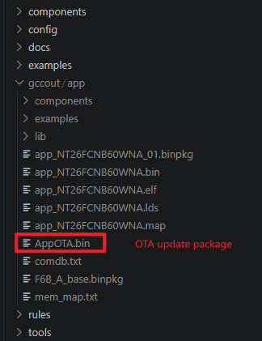
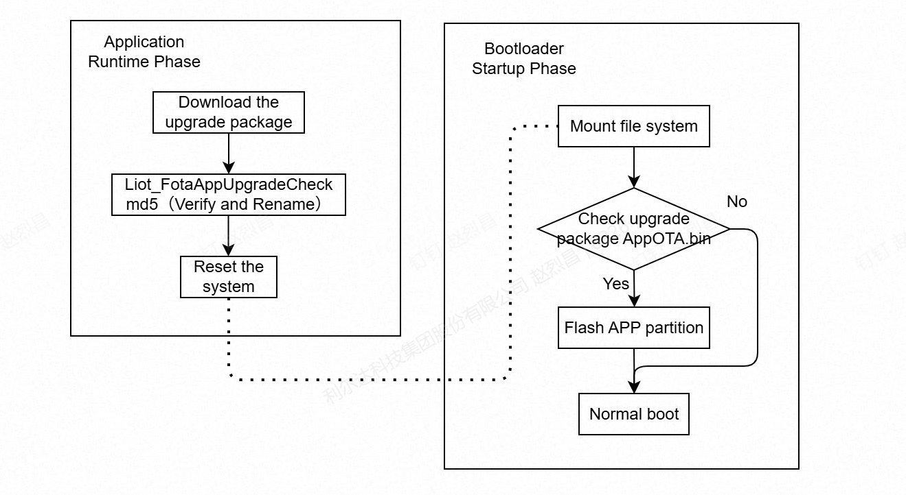
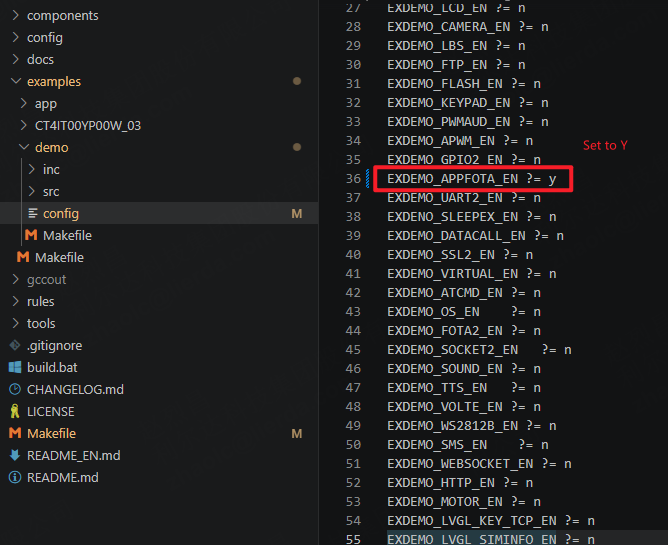
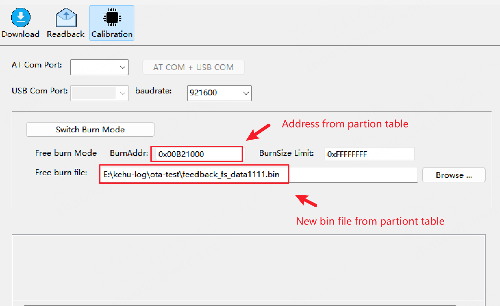
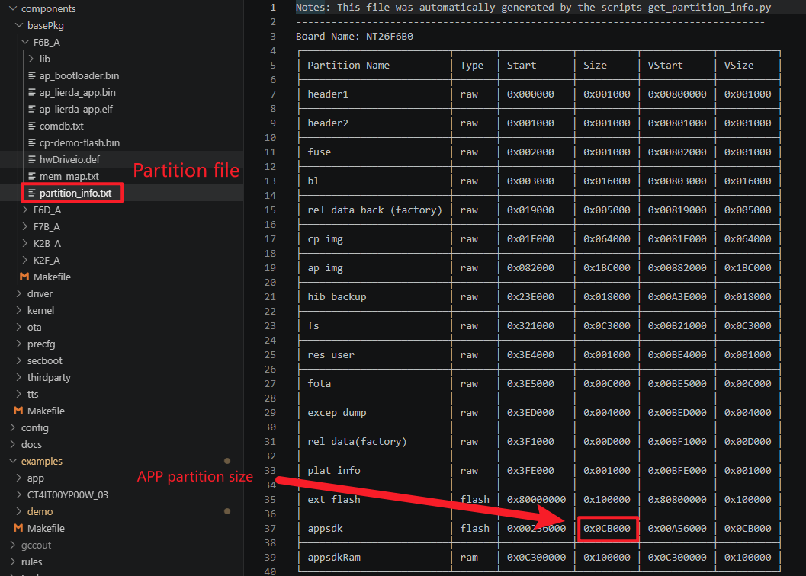

# APP Full Upgrade Development Guide_Rev1.0

{link_to_translation}`zh_CN:[中文]`

## Document Revision History

| **Document Version** | **Revision Date** | **Revised By** | **Reviewed By** | **Changes** |
| ---- | ---- | ---- | ---- | ---- |
| Rev1.0 | 26-02-28 | zlc | ymx | Initial release |

## 1 Introduction

This chapter mainly introduces the method for performing full upgrade of the user APP partition when using the base package separation solution SDK. It guides customers to quickly generate APP image upgrade packages and complete the upgrade of the APP partition image.

Currently, the APP full upgrade package is automatically generated through compilation scripts. The package contains a data header with a fixed format, mainly including the FLASH start address of the APP partition, complete APP data, and APP MD5 checksum value.

By default, the SDK does not output the APP full upgrade package. You need to modify the Makefile by setting `BUILD_COMP_OTA_EN=y` to enable this macro. After enabling, the compilation will automatically output the APP upgrade package AppOTA.bin. The modification method is shown in the figure below.

<div align="center">


</div>

As shown in the figure below: AppOTA.bin is the OTA upgrade package for the APP image.

<div align="center">



</div>

APP Full Upgrade Principle Description

The upgrade execution process occurs in the bootloader stage. This ensures that if an abnormal power loss occurs during the upgrade, the system will continue the APP upgrade after restart, preventing the system from becoming bricked due to power loss during upgrade.

<div align="center">



</div>

Complete Upgrade Process

**Note:**

- APP Stage: Mainly involves downloading the upgrade package to the filesystem, calling the `Liot_FotaAppUpgradeCheck()` interface to verify the integrity of the upgrade package, and then resetting the module.
- Bootloader Stage: Mount the filesystem. If the AppOTA.bin upgrade file exists in the filesystem, start reading the image content from the upgrade file, erase and update the APP partition. After the update is completed, continue to boot the system.
- The upgrade package needs to be placed in the filesystem. The base package will reserve sufficient space, so users do not need to worry about this.

## 2 API Function Overview

| **Function** | **Description** |
| ---- | ---- |
| `Liot_FotaAppUpgradeCheck` | Full upgrade APP partition upgrade package detection interface |

## 3 Detailed API Functions

### 3.1 liot\_fota\_errcode\_e

FOTA error codes consist of related component IDs and standard error codes. The component ID occupies the upper 16 bits, and the standard error code occupies the lower 16 bits.

1. Declaration

```c
typedef enum{
    LIOT_FOTA_UPGRADE_SUCCESS             = 0,                              /*!< Indicates that the FOTA upgrade was successful.*/
    LIOT_FOTA_UPGRADE_FAIL                = 504 | LIOT_FOTA_ERRCODE_BASE,   /*!< General FOTA upgrade failure.*/
    LIOT_FOTA_UPGRADE_CHECK_FAIL          = 505 | LIOT_FOTA_ERRCODE_BASE,   /*!< FOTA upgrade check failed.*/
    LIOT_FOTA_UPGRADE_MD5_FAIL            = 506 | LIOT_FOTA_ERRCODE_BASE,   /*!< MD5 checksum verification of the FOTA package failed.*/
    LIOT_FOTA_UPGRADE_MATCH_FAIL          = 507 | LIOT_FOTA_ERRCODE_BASE,   /*!< FOTA package does not match the device requirements.*/
    LIOT_FOTA_UPGRADE_NO_FILE_FAIL        = 508 | LIOT_FOTA_ERRCODE_BASE,   /*!< FOTA file not found or missing.*/
    LIOT_FOTA_UPGRADE_OPENFILE_FAIL       = 509 | LIOT_FOTA_ERRCODE_BASE,   /*!< Failed to open the FOTA upgrade file.*/
    LIOT_FOTA_UPGRADE_FILESIZE_FAIL       = 510 | LIOT_FOTA_ERRCODE_BASE,   /*!< Invalid or unsupported FOTA file size.*/
    LIOT_FOTA_UPGRADE_LFS_MOUNT_FAIL      = 511 | LIOT_FOTA_ERRCODE_BASE,   /*!< Failed to mount LittleFS (LFS) for FOTA.*/
    LIOT_FOTA_UPGRADE_PARAM_FAIL          = 512 | LIOT_FOTA_ERRCODE_BASE,   /*!< Invalid input parameters for FOTA upgrade.*/
    LIOT_FOTA_UPGRADE_PROJECT_MATCH_FAIL  = 552 | LIOT_FOTA_ERRCODE_BASE,   /*!< Project name in FOTA package does not match the device.*/
    LIOT_FOTA_UPGRADE_BASELINE_MATCH_FAIL = 553 | LIOT_FOTA_ERRCODE_BASE,   /*!< Baseline version in FOTA package does not match the device.*/
    LIOT_FOTA_UPGRADE_POINT_NULL_ERR      = 570 | LIOT_FOTA_ERRCODE_BASE,   /*!< Null pointer error during FOTA upgrade.*/
    LIOT_FOTA_UPGRADE_FLAG_SET_ERR        = 571 | LIOT_FOTA_ERRCODE_BASE,   /*!< Failed to set the upgrade flag during FOTA.*/
} liot_fota_errcode_e;
```

2. Parameters

| **Parameter** | **Description** |
| ---- | ---- |
| LIOT\_FOTA\_UPGRADE\_SUCCESS | Execution successful |
| LIOT\_FOTA\_UPGRADE\_FAIL | Execution failed |
| LIOT\_FOTA\_UPGRADE\_CHECK\_FAIL | FOTA upgrade package check failed |
| LIOT\_FOTA\_UPGRADE\_MD5\_FAIL | FOTA upgrade package MD5 checksum failed |
| LIOT\_FOTA\_UPGRADE\_MATCH\_FAIL | FOTA upgrade file matching failed |
| LIOT\_FOTA\_UPGRADE\_NO\_FILE\_FAIL | No upgrade package file |
| LIOT\_FOTA\_UPGRADE\_OPENFILE\_FAIL | Failed to open file |
| LIOT\_FOTA\_UPGRADE\_FILESIZE\_FAIL | Upgrade package file length exceeds limit |
| LIOT\_FOTA\_UPGRADE\_LFS\_MOUNT\_FAIL | Filesystem loading failed |
| LIOT\_FOTA\_UPGRADE\_PARAM\_FAIL | Parameter error |
| LIOT\_FOTA\_UPGRADE\_PROJECT\_MATCH\_FAIL | Project mismatch |
| LIOT\_FOTA\_UPGRADE\_BASELINE\_MATCH\_FAIL | Baseline mismatch |
| LIOT\_FOTA\_UPGRADE\_POINT\_NULL\_ERR | Null pointer |
| LIOT\_FOTA\_UPGRADE\_FLAG\_SET\_ERR | Flag setting error |

### 3.2 Liot\_FotaAppUpgradeCheck

This function is used to check whether the APP full upgrade package is valid, and automatically rename AppOTA.bin after the check is completed. The reason for automatic renaming is that the upgrade process occurs in the bootloader stage, which will automatically mount the filesystem and then index the AppOTA.bin file for upgrade.

Currently, only storing upgrade packages in the filesystem is supported; upgrading via external flash is not currently supported. When generating the upgrade package, we have already recorded the fixed packet header and the MD5 value of the APP image internally. The main function of this interface is to check the fixed packet header and verify the MD5 value. The complete upgrade process is executed in the bootloader. If an abnormal power loss occurs during the upgrade, the upgrade will continue after power-on.

**Remarks:**

- This interface can be called without disconnecting the network
- Since the file only requires 2K of space, calling this interface will not cause watchdog timeout issues
- This is just an error code after memory allocation failure; users can handle exceptions based on the return value

1. Declaration

```c
liot_fota_errcode_e Liot_FotaAppUpgradeCheck(const char *file_name, BOOL is_reboot);
```

2. Parameters

- `file_name`: [In] APP upgrade package name.
- `is_reboot`: [In] Whether to immediately restart for upgrade. true: immediately reset the module for APP image upgrade, false: do not reset immediately, wait until the next reset for APP partition upgrade.

3. Return Value

- `liot_fota_errcode_e`: Execution result code, may return the following error codes:
  - `LIOT_FOTA_UPGRADE_PARAM_FAIL`: Parameter error
  - `LIOT_FOTA_UPGRADE_NO_FILE_FAIL`: File does not exist
  - `LIOT_FOTA_UPGRADE_OPENFILE_FAIL`: Failed to open or read file
  - `LIOT_FOTA_UPGRADE_CHECK_FAIL`: Upgrade package header check failed
  - `LIOT_FOTA_UPGRADE_FAIL`: Memory allocation failure at low-level
  - `LIOT_FOTA_UPGRADE_MD5_FAIL`: Upgrade package MD5 checksum failed
  - `LIOT_FOTA_UPGRADE_SUCCESS`: Upgrade package verification successful

## 4 Code Examples

Example code reference: `LSDK/example/src/demo_app_fota.c`.

The demo continuously checks for upgrade packages with a fixed filename (upgrade.bin).

For local testing, you can export the module's filesystem and add the AppOTA.bin file generated by compilation to the filesystem with the name upgrade.bin. Then re-flash the filesystem to the device and reset the device. The system will automatically check the file and verify the upgrade package MD5 value. The upgrade process log can be viewed through the debug port.

**Remarks:**

- The specific location of demo source code has been explained in the development guide and will not be repeated here
- For lfsutil.exe, please see the tool link below
- The continuous checking of upgrade.bin in the demo does not perform high-frequency operations on the Flash filesystem, it only checks the file

1. Enable this demo for testing

<div align="center">



</div>

2. View the filesystem address when exporting:

<div align="center">


</div>

3. After exporting the filesystem, write AppOTA.bin to the filesystem.

Tool link: [Please check DingTalk document for attachment "Filesystem Read/Write Tool"](https://alidocs.dingtalk.com/i/nodes/G53mjyd80p7vr7OLuv4lg7Qo86zbX04v?doc_type=wiki_doc&iframeQuery=anchorId%3DX02mm91i4o8sjqtr6w3ui)

<div align="center">


</div>

4. Flash the new filesystem bin to the system.

<div align="center">



</div>

5. Reset the device to check the package.

<div align="center">


</div>

6. Debug port log indicates successful upgrade.

<div align="center">


</div>

## 5 FAQ

1. During testing, the filesystem address is determined by the base package. Please select according to the actual base package being used.
2. APP images have a size upper limit. If there is too much code and the APP space is insufficient, you need to contact FAE to provide feedback for internal repartitioning of the base package. The figure below shows the current APP partition size limit for the corresponding base package.

<div align="center">



</div>

3. The APP image size upper limit is guaranteed when creating the package, and warnings will be issued in advance if exceeded.
4. Rollback mechanism is not currently supported.
