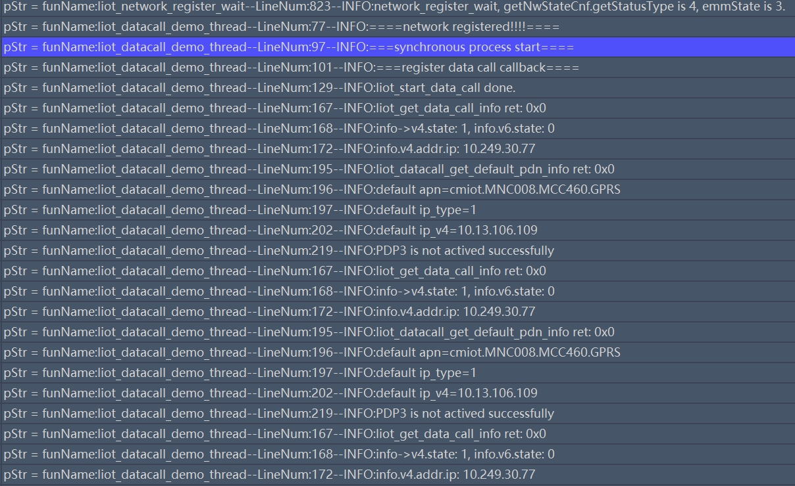

# Data Call Development Guide\_Rev2.0

{link_to_translation}`zh_CN:[中文]`

## Document Revision History

| **Version** | **Date** | **Author** | **Revision Content** |
| --- | --- | --- | --- |
| Rev1.0 | 23-09-15 | YPP | Created document |
| Rev1.1 | 24-03-25 | sxx | Changed document name |
| Rev1.2 | 24-10-25 | LJZ | Modified document format |
| Rev1.3 | 25-04-09 | ZW | Added Section 4.16, added interface liot\_network\_register\_cereg\_get. |
| Rev1.4 | 26-01-09 | ZLC | Added Section 4.16, added new interfaces. |
| Rev2.0 | 26-03-03 | YMX | Modified document format |

## 1 Introduction

This document provides a detailed description of the LTE-EC71X OpenCPU Data Call API functions. The API is located in the file `\PLAT\middleware\lierda_open\lierda_api\liot_nw\inc\liot_datacall.h`.


- **Network Registration:** liot_network_register_wait (network registration) is an automatic action after power-on. However, for private network SIM cards, you need to configure the APN first, then control the device on/off to achieve network registration.

- **Data Call Activation:** liot_start_data_call (dial-up) is a manual action to obtain a service IP. To enable data communication between the module and the base station, a data call must be initiated.

- **Default EPS Bearer:** After successful attachment, the Cat.1 module usually automatically activates CID 1.

## 2 API Function Overview

### 2.1 Core Control

| **Function** | **Description** |
| --- | --- |
| [liot\_start\_data\_call()](#34-liot_start_data_call) | Start data call |
| [liot\_stop\_data\_call()](#37-liot_stop_data_call) | Stop data call |
| [liot\_set\_data\_call\_asyn\_mode()](#38-liot_set_data_call_asyn_mode) | Set execution mode for start/stop data call functions |
| [liot\_datacall\_set\_nat()](#310-liot_datacall_set_nat) | Enable NAT function |

### 2.2 Status Query

| **Function** | **Description** |
| --- | --- |
| [liot\_get\_data\_call\_info()](#33-liot_get_data_call_info) | Get data call information |
| [liot\_datacall\_get\_sim\_profile\_is\_active()](#36-liot_datacall_get_sim_profile_is_active) | Get current PDP context activation status |
| [liot\_datacall\_get\_default\_pdn\_info()](#35-liot_datacall_get_default_pdn_info) | Get default bearer information |
| [liot\_network\_register\_wait()](#39-liot_network_register_wait) | Wait for network registration result |
| [liot\_network\_register\_cereg\_get()](#316-liot_network_register_cereg_get) | Get network registration status |
| [liot\_datacall\_get\_nat()](#311-liot_datacall_get_nat) | Query NAT mode for (U)SIM card |
| [Liot\_DataCallCfgDefaultEpsBearer()](#318-liot_datacallcfgdefaultepsbearer) | Set or query default bearer (CID 1) APN and IP type |

### 2.3 Event Handling

| **Function** | **Description** |
| --- | --- |
| [liot\_datacall\_register\_cb()](#31-liot_datacall_register_cb) | Register data call callback function |
| [liot\_datacall\_unregister\_cb()](#32-liot_datacall_unregister_cb) | Unregister data call callback function |
| [Liot\_PsEventCb()](#317-liot_pseventcb) | Register system event notification callback |

### 2.4 IP Address Utilities

| **Function** | **Description** |
| --- | --- |
| [liot\_ip4addr\_ntoa()](#312-liot_ip4addr_ntoa) | Convert IPv4 address to string |
| [liot\_ip6addr\_ntoa()](#313-liot_ip6addr_ntoa) | Convert IPv6 address to string |
| [liot\_ip4addr\_aton()](#314-liot_ip4addr_aton) | Convert string to IPv4 address |
| [liot\_ip6addr\_aton()](#315-liot_ip6addr_aton) | Convert string to IPv6 address |

## 3 API Function Details

### 3.1 liot\_datacall\_register\_cb

This function registers a callback for data call events. Whether in asynchronous or synchronous mode, a callback must be registered to report network-initiated deactivation or detach events. Upon receiving such events, a re-dial process can be initiated.

*   **Declaration**

    ```c
    liot_datacall_errcode_e liot_datacall_register_cb(uint8_t nSim, int profile_idx, liot_datacall_callback datacall_cb, void *ctx)
    ```

*   **Parameters**

    nSim:

    \[In\] The (U)SIM card in use. If the module supports only 1 (U)SIM interface, this parameter can be set to 0. Value range: 0-1 or 0xFF.

    profile\_idx:

    \[In\] PDP context ID. Range: 1~7 or 0xFF.

    datacall\_cb:

    \[In\] The callback function to register. See Section [3.1.1](#311-liot_datacall_callback).

    ctx:

    \[In\] Pointer to callback function parameter.

*   **Return Value**

See Section [3.1.2](#312-liot_datacall_errcode_e).
#### 3.1.1 liot\_datacall\_callback

This callback function reports data call events.

*   **Declaration**

    ```c
    typedef void (*liot_datacall_callback)(uint8_t nSim, unsigned int ind_type, int profile_idx, bool result, void *ctx);
    ```

*   **Parameters**

nSim:

\[In\] The (U)SIM card in use. If the module supports only 1 (U)SIM interface, this parameter can be set to 0. Value range: 0-1 or 0xFF.

ind\_type:

\[In\] Data call event type.

| **Event** | **Description** |
| --- | --- |
| LIOT\_DATACALL\_ACT\_RSP\_IND | PDP activation result response event in asynchronous mode |
| LIOT\_DATACALL\_DEACT\_RSP\_IND | PDP deactivation result response event in asynchronous mode |
| LIOT\_DATACALL\_PDP\_DEACTIVE\_IND | PDP network-initiated deactivation or detach event |

profile\_idx:

\[In\] PDP context ID. Range: 1~7 or 0xFF.

result:

\[In\] PDP context activation/deactivation result. 0: failure, 1: success.

ctx:

\[In\] Pointer to callback function parameter.

#### 3.1.2 liot\_datacall\_errcode\_e

Data call API execution result error codes.

*   **Declaration**

    ```c
    typedef enum{
      LIOT_DATACALL_SUCCESS     = 0,
      LIOT_DATACALL_EXECUTE_ERR = 1 | LIOT_DATACALL_ERRCODE_BASE,
      LIOT_DATACALL_MEM_ADDR_NULL_ERR,
      LIOT_DATACALL_INVALID_PARAM_ERR,
      LIOT_DATACALL_NW_REGISTER_TIMEOUT_ERR,
      LIOT_DATACALL_CFW_ACT_STATE_GET_ERR = 5 | LIOT_DATACALL_ERRCODE_BASE,    LIOT_DATACALL_REPEAT_ACTIVE_ERR,
      LIOT_DATACALL_REPEAT_DEACTIVE_ERR,
      LIOT_DATACALL_CFW_PDP_CTX_SET_ERR,
      LIOT_DATACALL_CFW_PDP_CTX_GET_ERR,
      LIOT_DATACALL_CS_CALL_ERR = 10 | LIOT_DATACALL_ERRCODE_BASE,
      LIOT_DATACALL_CFW_CFUN_GET_ERR,
      LIOT_DATACALL_CFUN_DISABLE_ERR,
      LIOT_DATACALL_NW_STATUS_GET_ERR,
      LIOT_DATACALL_NOT_REGISTERED_ERR,
      LIOT_DATACALL_NO_MEM_ERR = 15 | LIOT_DATACALL_ERRCODE_BASE,
      LIOT_DATACALL_CFW_ATTACH_STATUS_GET_ERR,
      LIOT_DATACALL_SEMAPHORE_CREATE_ERR,
      LIOT_DATACALL_SEMAPHORE_TIMEOUT_ERR,
      LIOT_DATACALL_CFW_ATTACH_REQUEST_ERR,
      LIOT_DATACALL_CFW_ACTIVE_REQUEST_ERR = 20 | LIOT_DATACALL_ERRCODE_BASE,
      LIOT_DATACALL_ACTIVE_FAIL_ERR,
      LIOT_DATACALL_CFW_DEACTIVE_REQUEST_ERR,
      LIOT_DATACALL_NO_DFTPDN_CFG_CONTEXT,
      LIOT_DATACALL_NO_DFTPDN_INFO_CONTEXT,
    } liot_datacall_errcode_e;
    ```

*   **Parameters**

| **Parameter** | **Description** |
| --- | --- |
| LIOT\_DATACALL\_SUCCESS | Execution successful |
| LIOT\_DATACALL\_EXECUTE\_ERR | Execution failed |
| LIOT\_DATACALL\_MEM\_ADDR\_NULL\_ERR | Parameter address is NULL |
| LIOT\_DATACALL\_INVALID\_PARAM\_ERR | Invalid parameter |
| LIOT\_DATACALL\_NW\_REGISTER\_TIMEOUT\_ERR | Network registration timeout |
| LIOT\_DATACALL\_CFW\_ACT\_STATE\_GET\_ERR | Failed to get PDP context activation status |
| LIOT\_DATACALL\_REPEAT\_ACTIVE\_ERR | Repeated PDP context activation |
| LIOT\_DATACALL\_REPEAT\_DEACTIVE\_ERR | Repeated PDP context deactivation |
| LIOT\_DATACALL\_CFW\_PDP\_CTX\_SET\_ERR | Failed to set PDP context |
| LIOT\_DATACALL\_CFW\_PDP\_CTX\_GET\_ERR | Failed to get PDP context |
| LIOT\_DATACALL\_CS\_CALL\_ERR | Data operation failed due to ongoing voice call |
| LIOT\_DATACALL\_CFW\_CFUN\_GET\_ERR | Failed to get function mode |
| LIOT\_DATACALL\_CFUN\_DISABLE\_ERR | Data operation failed due to non-full function mode |
| LIOT\_DATACALL\_NW\_STATUS\_GET\_ERR | Failed to get network registration status |
| LIOT\_DATACALL\_NOT\_REGISTERED\_ERR | Network not registered |
| LIOT\_DATACALL\_NO\_MEM\_ERR | Memory allocation failed |
| LIOT\_DATACALL\_CFW\_ATTACH\_STATUS\_GET\_ERR | Failed to get network attach status |
| LIOT\_DATACALL\_SEMAPHORE\_CREATE\_ERR | Failed to create semaphore |
| LIOT\_DATACALL\_SEMAPHORE\_TIMEOUT\_ERR | Semaphore wait timeout |
| LIOT\_DATACALL\_CFW\_ATTACH\_REQUEST\_ERR | Network attach rejected |
| LIOT\_DATACALL\_CFW\_ACTIVE\_REQUEST\_ERR | PDP context activation rejected |
| LIOT\_DATACALL\_ACTIVE\_FAIL\_ERR | PDP context activation failed |
| LIOT\_DATACALL\_CFW\_DEACTIVE\_REQUEST\_ERR | PDP context deactivation rejected |
| LIOT\_DATACALL\_NO\_DFTPDN\_CFG\_CONTEXT | Default bearer context not configured |
| LIOT\_DATACALL\_NO\_DFTPDN\_INFO\_CONTEXT | No default bearer context information |
### 3.2 liot\_datacall\_unregister\_cb

This function is used to cancel the callback function registered via liot\_datacall\_register\_cb(). After cancellation, the callback function will no longer receive data call related events.

*   **Function**

    ```c
    liot_datacall_errcode_e liot_datacall_unregister_cb(uint8_t nSim, int profile_idx, liot_datacall_callback datacalliot_cb, void *ctx);
    ```

*   **Parameters**

    nSim:

    \[In\] The (U)SIM card in use. If the module supports only 1 (U)SIM interface, this parameter can be set to 0. Value range: 0-1 or 0xFF.

    profile\_idx:

    \[In\] PDP context ID. Range: 1~7 or 0xFF.

    datacall\_cb:

    \[In\] The callback function to unregister. See Section [3.1.1](#311-liot_datacall_callback).

    ctx:

    \[In\] Pointer to callback function parameter.

*   **Return Value**

    See Section [3.1.2](#312-liot_datacall_errcode_e).

## 3.3 liot\_get\_data\_call\_info

This function is used to get data call information.

*   **Function**

```c
liot_datacall_errcode_e liot_get_data_call_info(UINT8 nSim, INT32 profile_idx, liot_data_call_info_t *call_info);
```

*   **Parameters**

nSim:

\[In\] The (U)SIM card in use. If the module supports only 1 (U)SIM interface, this parameter can be set to 0. Value range: 0-1.

profile\_idx:

\[In\] PDP context ID. Range: 1~7.

call\_info:

\[Out\] Data call information. See Section [3.3.1](#331-liot_data_call_info_t).

*   **Return Value**

See Section [3.1.2](#312-liot_datacall_errcode_e).
**3.3.1 liot\_data\_call\_info\_t**

Data call information.

*   **Declaration**

```c
typedef struct{
  INT32 cid;
  INT32 ip_version;
  liot_v4_info v4;
  liot_v6_info v6;
  char apn_name[LIOT_APN_LEN_MAX];
} liot_data_call_info_t;
```

*   **Parameters**

| **Parameter** | **Type** | **Description** |
| --- | --- | --- |
| cid | INT32 | PDP context ID. Range: 1~7. |
| ip\_version | INT32 | IP type.<br>1    IPv4<br>2    IPv6<br>3    IPv4v6 |
| v4 | struct liot\_v4\_info | IPv4 information. See Section [3.3.2](#332-liot_v4_info). |
| v6 | struct liot\_v6\_info | IPv6 information. See Section [3.3.5](#335-liot_v6_info). |
| apn\_name | char | APN name, maximum string length is 64. |

**3.3.2 liot\_v4\_info**

IPv4 information.

*   **Declaration**

```c
typedef struct
{
  INT32 state;                 // dial status
  liot_v4_address_status addr; // IPv4 address information
} liot_v4_info;
```

*   **Parameters**

| **Parameter** | **Type** | **Description** |
| --- | --- | --- |
| state | INT32 | Dial status.<br>0    Not dialed<br>1    Dial successful |
| addr | struct liot\_v4\_address\_status | IPv4 address status. See Section [3.3.3](#333-liot_v4_address_status). |

**3.3.3 liot\_v4\_address\_status**

IPv4 address status.

*   **Declaration**

```c
typedef struct
{
  liot_ip4_addr_t ip;
  liot_ip4_addr_t pri_dns;
  liot_ip4_addr_t sec_dns;
} liot_v4_address_status;
```

*   **Parameters**

| **Parameter** | **Type** | **Description** |
| --- | --- | --- |
| ip | struct liot\_ip4\_addr\_t | Obtained IPv4 address. See Section [3.3.4](#334-liot_ip4_addr_t). |
| pri\_dns | struct liot\_ip4\_addr\_t | Primary DNS server IPv4 address. See Section [3.3.4](#334-liot_ip4_addr_t). |
| sec\_dns | struct liot\_ip4\_addr\_t | Secondary DNS server IPv4 address. See Section [3.3.4](#334-liot_ip4_addr_t). |
**3.3.4 liot\_ip4\_addr\_t**

IPv4 address.

*   **Declaration**

```c
typedef struct
{
  UINT32 addr;
} liot_ip4_addr_t;
```

*   **Parameters**

| **Parameter** | **Type** | **Description** |
| --- | --- | --- |
| addr | UINT32 | IPv4 address. |

**3.3.5 liot\_v6\_info**

IPv6 information.

*   **Declaration**

```c
typedef struct
{
  INT32 state;                 // dial status
  liot_v6_address_status addr; // IPv6 address information
} liot_v6_info;
```

*   **Parameters**

| **Parameter** | Type | **Description** |
| --- | --- | --- |
| state | INT32 | Dial status.<br>0    Not dialed<br>1    Dial successful |
| addr | struct liot\_v6\_address\_status | IPv6 address status. See Section [3.3.6](#336-liot_v6_address_status). |

**3.3.6 liot\_v6\_address\_status**

IPv6 address status.

*   **Declaration**

```c
typedef struct
{
  liot_ip6_addr_t ip;
  liot_ip6_addr_t pri_dns;
  liot_ip6_addr_t sec_dns;
} liot_v6_address_status;
```

*   **Parameters**

| **Parameter** | **Type** | **Description** |
| --- | --- | --- |
| ip | struct liot\_ip6\_addr\_t | Obtained IPv6 address. See Section [3.3.7](#337-liot_ip6_addr_t). |
| pri\_dns | struct liot\_ip6\_addr\_t | Primary DNS server IPv6 address. See Section [3.3.7](#337-liot_ip6_addr_t). |
| sec\_dns | struct liot\_ip6\_addr\_t | Secondary DNS server IPv6 address. See Section [3.3.7](#337-liot_ip6_addr_t). |

**3.3.7 liot\_ip6\_addr\_t**

IPv6 address.

*   **Declaration**

```c
typedef struct
{
  UINT32 addr[4];
} liot_ip6_addr_t;
```

*   **Parameters**

| **Parameter** | **Type** | **Description** |
| --- | --- | --- |
| addr | UINT32 | IPv6 address, size is 4 bytes. |
### 3.4 liot\_start\_data\_call

This function is used to start a data call. The default mode is synchronous. To use asynchronous mode, configure it via liot\_set\_data\_call\_asyn\_mode(). The difference between synchronous and asynchronous modes is as follows:

1.  Synchronous mode: After function execution, it returns the data call result code. If LIOT\_DATACALL\_SUCCESS is returned, the data call is successful, an IP address has been obtained, and socket communication can proceed.

2.  Asynchronous mode: After function execution, it returns the function execution result code. If LIOT\_DATACALL\_SUCCESS is returned, it does NOT mean the data call is successful — it only means the function executed successfully. The registered callback function will notify the upper layer whether the dial was successful via the LIOT\_DATACALL\_ACT\_RSP\_IND event.

*   **Declaration**

```c
liot_datacall_errcode_e liot_start_data_call(UINT8 nSim, INT32 cid, INT32 ip_version, CHAR *apn_name, CHAR *username, CHAR *password, INT32 auth_type);
```

*   **Parameters**

nSim:

\[In\] The (U)SIM card in use. If the module supports only 1 (U)SIM interface, this parameter can be set to 0. Value range: 0-1.

cid:

\[In\] PDP context ID. Range: 1~7.

ip\_version:

\[In\] IP version: 1 IPv4, 2 IPv6, 3 IPv4v6.

apn\_name:

\[In\] APN name.

username:

\[In\] Username.

password:

\[In\] Password.

auth\_type:

\[In\] Authentication type. See Section [3.4.1](#341-liot_data_auth_type_e).

*   **Return Value**

See Section [3.1.2](#312-liot_datacall_errcode_e).

### 3.4.1 liot\_data\_auth\_type\_e

Authentication type.

*   **Declaration**

```c
typedef enum
{
  LIOT_DATA_AUTH_TYPE_AUTO = 0xFF,
  LIOT_DATA_AUTH_TYPE_NONE = 0,
  LIOT_DATA_AUTH_TYPE_PAP,
  LIOT_DATA_AUTH_TYPE_CHAP,
} liot_data_auth_type_e;
```

*   **Parameters**

| **Parameter** | **Description** |
| --- | --- |
| LIOT\_DATA\_AUTH\_TYPE\_AUTO | Automatically select PAP or CHAP authentication protocol |
| LIOT\_DATA\_AUTH\_TYPE\_NONE | No authentication protocol |
| LIOT\_DATA\_AUTH\_TYPE\_PAP | PAP authentication protocol |
| LIOT\_DATA\_AUTH\_TYPE\_CHAP | CHAP authentication protocol |
## 3.5 liot\_datacall\_get\_default\_pdn\_info

This function is used to get default bearer information.

*   **Declaration**

```c
liot_datacall_errcode_e liot_datacall_get_default_pdn_info(uint8_t nSim, liot_data_call_default_pdn_info_s *ctx);
```

*   **Parameters**

nSim:

\[In\] The (U)SIM card in use. If the module supports only 1 (U)SIM interface, this parameter can be set to 0. Value range: 0-1.

ctx:

\[Out\] Bearer information. See Section [3.5.1](#351-liot_data_call_default_pdn_info_s).

*   **Return Value**

See Section [3.1.2](#312-liot_datacall_errcode_e).

**3.5.1 liot\_data\_call\_default\_pdn\_info\_s**

Default bearer information structure.

*   **Declaration**

```c
typedef struct{
  uint8_t ip_version;
  liot_ip4_addr_t ipv4;
  liot_ip6_addr_t ipv6;
  char apn_name[LIOT_APN_LEN_MAX];
} liot_data_call_default_pdn_info_s;
```

*   **Parameters**

| **Parameter** | **Type** | **Description** |
| --- | --- | --- |
| ip\_version | uint8\_t | IP type.<br>1    IPv4<br>2    IPv6<br>3    IPv4v6 |
| ipv4 | struct liot\_ip4\_addr\_t | IPv4 information. See Section [3.3.4](#334-liot_ip4_addr_t). |
| ipv6 | struct liot\_ip6\_addr\_t | IPv6 information. See Section [3.3.7](#337-liot_ip6_addr_t). |
| apn\_name | char | APN name, maximum string length is 64. |

## 3.6 liot\_datacall\_get\_sim\_profile\_is\_active

This function is used to get the current PDP context activation status.

*   **Declaration**

```c
bool liot_datacall_get_sim_profile_is_active(uint8_t nSim, int profile_idx);
```

*   **Parameters**

nSim:

\[In\] The (U)SIM card in use. If the module supports only 1 (U)SIM interface, this parameter can be set to 0. Value range: 0-1.

profile\_idx:

\[In\] PDP context ID. Range: 1~7.

*   **Return Value**

true: activated, false: not activated.
## 3.7 liot\_stop\_data\_call

This function is used to stop a data call. The default mode is synchronous. To use asynchronous mode, configure it via liot\_set\_data\_call\_asyn\_mode(). When the data call is stopped, all Socket connections depending on this CID will be forcibly closed.

*   **Declaration**

```c
liot_datacall_errcode_e liot_stop_data_call(UINT8 nSim, INT32 profile_idx);
```

*   **Parameters**

nSim:

\[In\] The (U)SIM card in use. If the module supports only 1 (U)SIM interface, this parameter can be set to 0. Value range: 0-1.

profile\_idx:

\[In\] PDP context ID. Range: 1~7.

*   **Return Value**

See Section [3.1.2](#312-liot_datacall_errcode_e).

## 3.8 liot\_set\_data\_call\_asyn\_mode

This function is used to set the execution mode for start and stop data call functions (i.e., liot\_start\_data\_call() and liot\_stop\_data\_call()). The execution mode can be either synchronous or asynchronous. It must be called before liot\_start\_data\_call to configure the execution mode.

*   **Declaration**

```c
liot_datacall_errcode_e liot_set_data_call_asyn_mode(uint8_t nSim, int profile_idx, bool enable);
```

*   **Parameters**

nSim:

\[In\] The (U)SIM card in use. If the module supports only 1 (U)SIM interface, this parameter can be set to 0. Value range: 0-1.

profile\_idx:

\[In\] PDP context ID. Range: 1~7.

enable:

\[In\] Function execution mode: 0 synchronous mode, 1 asynchronous mode.

*   **Return Value**

See Section [3.1.2](#312-liot_datacall_errcode_e).

## 3.9 liot\_network\_register\_wait

This function is used to wait for the network registration result. Network registration is automatically completed after power-on. Only after successful registration can a data call be initiated. If the network is not currently registered, it will block the thread calling this function until network registration succeeds or times out.

This is a synchronous function that waits for successful network registration within the timeout period. If the network is not registered when the timeout expires, it returns registration failure. It is recommended to call this interface in a separate thread.

*   **Declaration**

```c
liot_datacall_errcode_e liot_network_register_wait(uint8_t nSim, unsigned int timeout_s);
```

*   **Parameters**

nSim:

\[In\] The (U)SIM card in use. If the module supports only 1 (U)SIM interface, this parameter can be set to 0. Value range: 0-1.

timeout\_s:

\[In\] Timeout for waiting for network registration. Unit: seconds.

*   **Return Value**

See Section [3.1.2](#312-liot_datacall_errcode_e).
## 3.10 liot\_datacall\_set\_nat

This function is used to enable the NAT function. The configuration takes effect after module restart. NAT is typically enabled only when the module is used as an RNDIS/ECM network adapter.

*   **Declaration**

```c
liot_datacall_errcode_e liot_datacall_set_nat(uint8_t nSim, UINT32 natmode);
```

*   **Parameters**

nSim:

\[In\] The (U)SIM card in use. If the module supports only 1 (U)SIM interface, this parameter can be set to 0. Value range: 0-1.

natmode:

\[In\] NAT mode: 0 enable, 1 disable.

*   **Return Value**

See Section [3.1.2](#312-liot_datacall_errcode_e).

## 3.11 liot\_datacall\_get\_nat

This function is used to query the NAT mode for the (U)SIM card.

*   **Function**

```c
liot_datacall_errcode_e liot_datacall_get_nat(uint8_t nSim, UINT32 *natmode);
```

*   **Parameters**

nSim:

\[In\] The (U)SIM card in use. If the module supports only 1 (U)SIM interface, this parameter can be set to 0. Value range: 0-1.

natmode:

\[Out\] NAT mode: 0 enabled, 1 disabled.

*   **Return Value**

See Section [3.1.2](#312-liot_datacall_errcode_e).

## 3.12 liot\_ip4addr\_ntoa

This function converts an IPv4 address to a string, converting a binary IP address to a human-readable string.

*   **Function**

```c
CHAR *liot_ip4addr_ntoa(liot_ip4_addr_t *addr);
```

*   **Parameters**

addr:

\[In\] Pointer to IPv4 address. See Section [3.3.4](#334-liot_ip4_addr_t).

*   **Return Value**

String.

## 3.13 liot\_ip6addr\_ntoa

This function converts an IPv6 address to a string, converting a binary IP address to a human-readable string.

*   **Function**

```c
CHAR *liot_ip6addr_ntoa(liot_ip6_addr_t *addr);
```

*   **Parameters**

addr:

\[In\] Pointer to IPv6 address. See Section [3.3.7](#337-liot_ip6_addr_t).

*   **Return Value**

String.
## 3.14 liot\_ip4addr\_aton

This function converts an IPv4 string to an address, converting a human-readable IPv4 address string to the binary format required for network programming.

*   **Function**

```c
BOOL liot_ip4addr_aton(CHAR *cp, liot_ip4_addr_t *addr);
```

*   **Parameters**

cp:

\[In\] IPv4 string.

addr:

\[Out\] Pointer to IPv4 address. See Section [3.3.4](#334-liot_ip4_addr_t).

*   **Return Value**

true: success, false: failure.

## 3.15 liot\_ip6addr\_aton

This function converts an IPv6 string to an address, converting a human-readable IPv6 address string to the binary format required for network programming.

*   **Function**

```c
BOOL liot_ip6addr_aton(CHAR *cp, liot_ip6_addr_t *addr);
```

*   **Parameters**

cp: \[In\] IPv6 string.

addr: \[Out\] Pointer to converted IPv6 address.

*   **Return Value**

true: success, false: failure.

## 3.16 liot\_network\_register\_cereg\_get

This function is used to get the network registration status. It is equivalent to the return value of the underlying CEREG (Cellular Register) status query interface.

*   **Function**

```c
liot_datacall_errcode_e liot_network_register_cereg_get(uint8_t nSim);
```

*   **Parameters**

nSim:

\[In\] The (U)SIM card in use. If the module supports only 1 (U)SIM interface, this parameter can be set to 0. Value range: 0-1 or 0xFF.

*   **Return Value**

See Section [3.1.2](#312-liot_datacall_errcode_e).
## 3.17 Liot\_PsEventCb

This function registers a callback to receive system network registration, data call, and OOS events.

Liot\_PsEventCb is used to monitor overall network status (registration, OOS), while liot\_datacall\_register\_cb focuses on asynchronous response events after the dial interface is invoked.

*   **Function**

```c
liot_datacall_errcode_e Liot_PsEventCb(Liot_PsEventCallback_t callback);
```

*   **Parameters**

callback:

\[In\] User-registered event notification callback. Notifications are sent when network registration, data call, or OOS events occur.

*   **Return Value**

See Section [3.1.2](#312-liot_datacall_errcode_e).

### 3.17.1 Liot\_PsEventCallback\_t

This callback function reports network registration, data call, and OOS events.

*   **Declaration**

| ```c
typedef void (*Liot_PsEventCallback_t)(Liot_PsEvent_e eventId, void *param, UINT32 paramLen);
``` |
| --- |

*   **Parameters**

eventId:

\[In\] Notification event ID.

| **Event** | **Description** |
| --- | --- |
| LIOT\_PS\_EVENT\_BEARER\_ACTED | Network registration successful |
| LIOT\_PS\_EVENT\_BEARER\_DEACTED | Network registration failed |
| LIOT\_PS\_EVENT\_NETIF\_OOS | Out of Service |
| LIOT\_PS\_EVENT\_NETIF\_ACTIVATED | Network interface attach successful |
| LIOT\_PS\_EVENT\_NETIF\_DEACTIVATED | Network interface attach failed |
| LIOT\_PS\_EVENT\_MAX | Maximum enum value (for boundary check) |

param:

\[In\] Parameter corresponding to the callback event. Currently unused.

paramLen:

\[In\] Length of the parameter corresponding to the callback event. Currently unused.
## 3.18 Liot\_DataCallCfgDefaultEpsBearer

This function sets or queries the APN and IP type of the default bearer (CID 1).

*   **Function**

```c
liot_datacall_errcode_e Liot_DataCallCfgDefaultEpsBearer(Liot_DataCallCFG_t *cfg);
```

*   **Parameters**

cfg:

\[In\] Configuration structure.

*   **Return Value**

See Section [3.1.2](#312-liot_datacall_errcode_e).

**3.18.1 Liot\_DataCallCFG\_t**

Default bearer configuration structure.

*   **Declaration**

```c
typedef struct
{
    Liot_DataCallMethod_e method;       ///< Operation method: set or query configuration
    Liot_DataCallIpType_e ip_version;   ///< IP type
    char apn[LIOT_APN_LEN_MAX];         ///< APN string
    uint16_t apn_len;                   ///< Actual length of APN string
} Liot_DataCallCFG_t;
```

*   **Parameters**

| **Type** | **Parameter** | **Description** |
| --- | --- | --- |
| Liot\_DataCallMethod\_e | method | Operation method: set or query configuration |
| Liot\_DataCallIpType\_e | ip\_version | IP type to set or query (V4/V6/IPV4V6) |
| char | apn | APN, maximum 100 bytes |
| uint16\_t | apn\_len | Actual length of APN string |

**3.18.2 Liot\_DataCallMethod\_e**

Operation method enum: set or query configuration.

*   **Declaration**

```c
typedef enum
{
    LIOT_DATACALL_APN_SET,  ///< Set APN configuration
    LIOT_DATACALL_APN_GET,  ///< Query APN configuration
    LIOT_DATACALL_APN_MAX   ///< Maximum value (for boundary check)
} Liot_DataCallMethod_e;
```

*   **Parameters**

| **Enum Value** | **Description** |
| --- | --- |
| LIOT\_DATACALL\_APN\_SET | Set APN configuration |
| LIOT\_DATACALL\_APN\_GET | Query APN configuration |
| LIOT\_DATACALL\_APN\_MAX | Maximum value (for boundary check) |
**3.18.3 Liot\_DataCallIpType\_e**

IP type enum definition.

*   **Declaration**

```c
typedef enum
{
    LIOT_PS_PDN_TYPE_IP_V4 = 1,  ///< IPv4 type
    LIOT_PS_PDN_TYPE_IP_V6,      ///< IPv6 type
    LIOT_PS_PDN_TYPE_IP_V4V6,    ///< IPv4/IPv6 dual-stack type
    LIOT_PS_PDN_TYPE_NUM         ///< IP type count (used as counter)
} Liot_DataCallIpType_e;
```

*   **Parameters**

| **Enum Value** | **Description** |
| --- | --- |
| LIOT\_PS\_PDN\_TYPE\_IP\_V4 | IPv4 type |
| LIOT\_PS\_PDN\_TYPE\_IP\_V6 | IPv6 type |
| LIOT\_PS\_PDN\_TYPE\_IP\_V4V6 | IPv4/IPv6 dual-stack type |
| LIOT\_PS\_PDN\_TYPE\_NUM | IP type count (used as counter) |

## 4 Code Examples

Example code can be found in the file \PLAT\project\ec7xx\_0h00\ap\apps\lierda\_app\lierda\_examples\liot\_datacall\_demo.c. The following results indicate that all information was obtained successfully:

*   Synchronous mode

    

*   Asynchronous mode

    

## 5 Glossary

*   **PDN Context**: Packet Data Network Context is the logical entity for establishing a data channel between the module and the carrier network.

*   **CID**: profile\_idx (CID) is the ID of that channel, typically ranging from 1-7. CID is the identifier required for all subsequent network operations (DNS, Socket), used to identify which channel establishes the data service.

*   **APN**: Access Point Name is the access point of the carrier network. It is a key parameter for activating a PDN Context. Ensure the APN name is correct.
