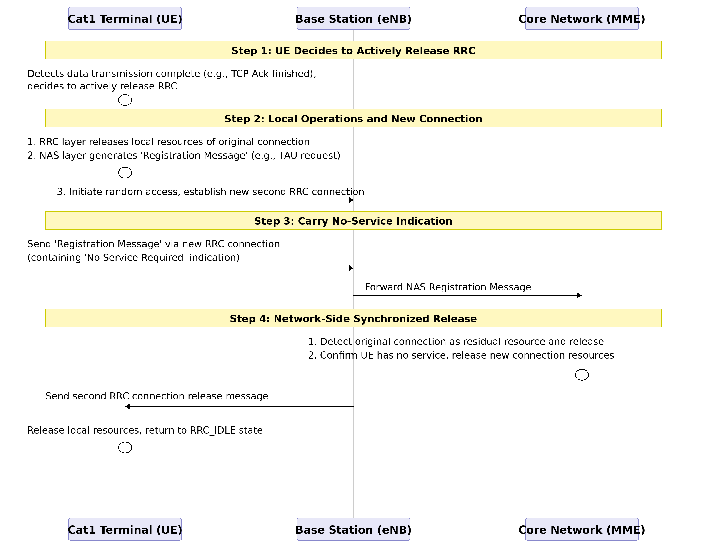

# Device Management Development Guide_Rev2.0

{link_to_translation}`zh_CN:[中文]`

## Document Revision History

| **Version** | **Date** | **Author** | **Reviewer** | **Revision Content** |
| --- | --- | --- | --- | --- |
| Rev1.0 | 23-09-19 | LJZ | zlc | Create document |
| Rev1.1 | 24-03-25 | sxx |  | Change document name |
| Rev1.2 | 24-10-25 | LJZ |  | Modify document format |
| Rev1.3 | 25-05-14 | LJZ |  | Optimize document format |
| Rev1.4 | 25-12-27 | ZLC |  | Add API interface description |
| Rev1.5 | 26-02-25 | ZLC |  | Add API interface description |
| Rev2.0 | 26-03-03 | YMX |  | Modify document format |

## 1 Introduction

This document introduces the LTE-EC71X device management interface APIs. The API interfaces are declared in the file PLAT/middleware/lierda_open/lierda_api/liot_platform/inc/liot_dev.h.

### 1.1 Principle Description

#### 1.1.1 RRC Fast Release Principle

1.  LTE Standard RRC Connection Release Mechanism
    

In traditional LTE networks, RRC connection release is entirely controlled by the network side (base station). The base station maintains an **Inactivity Timer** for each UE (User Equipment).

*   **Working Principle**: When data transmission stops between the UE and the base station, this timer starts. If no new data is transmitted before the timer expires (e.g., 10 or 20 seconds), the base station will proactively send an `RRCConnectionRelease` message to the UE, commanding it to release the connection and return to the RRC_IDLE state to save power.
    
*   **Problem**: This mechanism depends on network-side configuration. In some networks, if the base station does not configure this timer or sets it too long, the UE will stay in the connected state for an extended period, causing unnecessary power consumption.
    

1.  Core Principle of RRC Fast Release: Terminal-Initiated Trigger
    
    To overcome the above issues and achieve "fast release," an optimized solution with **terminal-initiated trigger** has been proposed and applied. The core idea is: **Let the terminal proactively initiate the process based on its service model after confirming that data transmission is complete, prompting the network to release the RRC connection.**
    
    Its working principle can be explained through the following steps:
    
    
    
2.  Application Significance of RRC Fast Release
    
    **Significantly Reduce Power Consumption**: Cat1 is mainly oriented towards the Internet of Things (IoT) market, such as smart wearables and industrial sensors, which are extremely sensitive to power consumption. By reducing the RRC connection hold time from the network-controlled 10-second level to milliseconds or seconds after terminal service completion, it can significantly extend the battery life of devices.
    
3.  Operational Drawbacks
    

*   **Due to underlying implementation reasons, enabling this feature may result in the inability to receive downlink data for a short period.**
    
*   **Please use with caution for applications with high real-time and reliability requirements.**
    

#### 1.1.2 Frequency Band and Frequency Point Locking (Lock Freq)

1.  Lock Freq: Locking Frequency Resources **Principle Description:** When you issue a frequency lock command to the module, you are actually limiting the physical layer search range of the module. In the LTE protocol, the terminal performs a full-band scan after booting or losing network connection to find the cell with the strongest signal.
    

*   **Default Behavior**: The module scans all supported frequency bands and camps on the cell with the best signal.
    
*   **After Frequency Lock**: The module skips the normal frequency scanning logic and only tunes to the specified EARFCN to receive signals. If a cell exists on this frequency point and the signal meets the requirements, it camps; if not, it reports network detachment without attempting other frequency points.
    

Test Use Cases:

*   **Shielded Room/Production Testing**: In production environments, there is only one fixed base station signal in the shielded box. Frequency locking ensures that the module only connects to this designated test base station, avoiding accidental connections to stray signals outside the shielded box.
    
*   **Interference Troubleshooting**: If you suspect interference on a certain frequency range, you can lock to that frequency point and observe the module's reception indicators (such as RSSI - Received Signal Strength Indicator).
    
*   **Band Switching Verification**: When testing the module's functionality to switch from Band 8 to Band 3, you can force the module to work on specific frequency points through frequency locking.
    

1.  Lock Cell: Locking Physical Cell Identity **Principle Description:** Locking cells is more granular than locking frequencies. It adds an "identity filter" to the cell selection/reselection algorithm after the module completes frequency synchronization.
    

*   **Workflow**: The module may still scan multiple frequency points (if allowed by the command), but after decoding system messages from various cells and learning their PCIs (Physical Cell Identities), the module compares these PCIs. Only when the PCI matches the locked value will the module attempt to camp; for cells with non-matching PCIs, even if the signal strength is 20dB higher, the module will directly ignore them.
    

Test Use Cases:

*   **Handover Preparation**: When testing handover from Cell A to Cell B, you can first lock to Cell A for signaling interaction. After the handover trigger conditions are met, observe whether the module can successfully switch to Cell B (at this point, you need to unlock or change the lock target).
    
*   **Avoid Faulty Cells**: If field testing reveals that a cell with a specific PCI has strong signal but cannot transmit data, you can temporarily lock to cells with other PCIs to maintain business continuity.
    

## 2 API Function Overview

### 2.1 Device Information Query

| **Function** | **Description** |
| --- | --- |
| [liot\_dev\_get\_imei()](https://alidocs.dingtalk.com/i/nodes/9bN7RYPWdMo06oejuvjrvkRxVZd1wyK0?utm_scene=team_space&iframeQuery=anchorId%3Duu_m05cnx9qiryk7fg1lij) | Get device IMEI number |
| liot\_dev\_get\_firmware\_version[()](https://lierda.feishu.cn/wiki/Wv8UwMKdei1A7ek9mXcczClonGd#part-Wuk6drEs6oiOWtx5CBScB7i8nce) | Get device firmware version |
| [liot\_dev\_get\_model()](https://alidocs.dingtalk.com/i/nodes/9bN7RYPWdMo06oejuvjrvkRxVZd1wyK0?utm_scene=team_space&iframeQuery=anchorId%3Duu_m05cnx9r117ekcdbqjv) | Get device model |
| [liot\_dev\_get\_sn()](https://alidocs.dingtalk.com/i/nodes/9bN7RYPWdMo06oejuvjrvkRxVZd1wyK0?utm_scene=team_space&iframeQuery=anchorId%3Duu_m05cnx9q1y1ku8gbkd8) | Get device serial number |
| [liot\_dev\_get\_product\_id()](https://alidocs.dingtalk.com/i/nodes/9bN7RYPWdMo06oejuvjrvkRxVZd1wyK0?utm_scene=team_space&iframeQuery=anchorId%3Duu_m05cnx9qa6cp3ombqpp) | Get device manufacturer ID |
| [liot\_dev\_get\_firmware\_subversion()](https://alidocs.dingtalk.com/i/nodes/9bN7RYPWdMo06oejuvjrvkRxVZd1wyK0?utm_scene=team_space&iframeQuery=anchorId%3Duu_m05cnx9qhcz81tdbsh3) | Get device sub-firmware version |
| [Liot\_DevGetHardWareInfo()](https://alidocs.dingtalk.com/i/nodes/7QG4Yx2JpLGB6GnKS1RZ4kwgJ9dEq3XD?utm_scene=team_space&iframeQuery=anchorId%3Duu_mm1nqyw9bmlscimb62w) | Get hardware model |

### 2.2 System Function Control

| **Function** | **Description** |
| --- | --- |
| [liot\_dev\_set\_modem\_fun()](https://alidocs.dingtalk.com/i/nodes/9bN7RYPWdMo06oejuvjrvkRxVZd1wyK0?utm_scene=team_space&iframeQuery=anchorId%3Duu_m05cnx9rjqx2ehfmut1) | Set device modem function |
| [liot\_dev\_get\_modem\_fun()](https://alidocs.dingtalk.com/i/nodes/9bN7RYPWdMo06oejuvjrvkRxVZd1wyK0?utm_scene=team_space&iframeQuery=anchorId%3Duu_m05cnx9rdn09d9a8ce0) | Get device modem function |
| [Liot\_DevSetBandMode()](https://alidocs.dingtalk.com/i/nodes/7QG4Yx2JpLGB6GnKS1RZ4kwgJ9dEq3XD?utm_scene=team_space&iframeQuery=anchorId%3Duu_mjo0huyx78nkgaiiwx) | Set available frequency bands |
| [Liot\_DevGetBandMode()](https://alidocs.dingtalk.com/i/nodes/7QG4Yx2JpLGB6GnKS1RZ4kwgJ9dEq3XD?utm_scene=team_space&iframeQuery=anchorId%3Duu_mjo0pumalhz8cfhi38l) | Query available and supported frequency band lists |
| [Liot\_DevFreqConfig()](https://alidocs.dingtalk.com/i/nodes/7QG4Yx2JpLGB6GnKS1RZ4kwgJ9dEq3XD?utm_scene=team_space&iframeQuery=anchorId%3Duu_mjo1ajzkgr41ezs8sdk) | Lock frequency points, cells, and clear priority frequency points |
| [Liot\_RRCRelease()](https://alidocs.dingtalk.com/i/nodes/7QG4Yx2JpLGB6GnKS1RZ4kwgJ9dEq3XD?utm_scene=team_space&iframeQuery=anchorId%3Duu_mk6al4keg2fz0xsco4a) | Enable fast release |
| [Liot\_DevSetDnsServersAddr()](https://alidocs.dingtalk.com/i/nodes/7QG4Yx2JpLGB6GnKS1RZ4kwgJ9dEq3XD?utm_scene=team_space&iframeQuery=anchorId%3Duu_mk6jbla2rm7v7752nf8) | Set primary and backup DNS server addresses |
| [Liot\_DevGetDnsServersAddr()](https://alidocs.dingtalk.com/i/nodes/7QG4Yx2JpLGB6GnKS1RZ4kwgJ9dEq3XD?utm_scene=team_space&iframeQuery=anchorId%3Duu_mk6jmqkz994c19r3e5b) | Query primary and backup DNS server addresses |

### 2.3 System Security/Diagnostics

| **Function** | **Description** |
| --- | --- |
| [liot\_dev\_set\_modem\_fun()](https://alidocs.dingtalk.com/i/nodes/9bN7RYPWdMo06oejuvjrvkRxVZd1wyK0?utm_scene=team_space&iframeQuery=anchorId%3Duu_m05cnx9rjqx2ehfmut1) | Set device modem function |
| [liot\_dev\_get\_modem\_fun()](https://alidocs.dingtalk.com/i/nodes/9bN7RYPWdMo06oejuvjrvkRxVZd1wyK0?utm_scene=team_space&iframeQuery=anchorId%3Duu_m05cnx9rdn09d9a8ce0) | Get device modem function |
| [liot\_dev\_memory\_size\_query()](https://alidocs.dingtalk.com/i/nodes/9bN7RYPWdMo06oejuvjrvkRxVZd1wyK0?utm_scene=team_space&iframeQuery=anchorId%3Duu_m05cnx9rmy39pzfd6ms) | Query heap space status information |
| [liot\_dev\_cfg\_wdt()](https://alidocs.dingtalk.com/i/nodes/9bN7RYPWdMo06oejuvjrvkRxVZd1wyK0?utm_scene=team_space&iframeQuery=anchorId%3Duu_m05cnx9rafmbiveg3at) | Configure watchdog timer switch |
| [liot\_dev\_feed\_wdt()](https://alidocs.dingtalk.com/i/nodes/9bN7RYPWdMo06oejuvjrvkRxVZd1wyK0?utm_scene=team_space&iframeQuery=anchorId%3Duu_m05cnx9scjjznhvh0za) | Feed system watchdog (reset timer to zero) |

## 3 Type Descriptions

### 3.1 liot\_errcode\_dev\_e

DEV API execution result error codes.

1.  Declaration
    

```c
typedef enum
{
    LIOT_DEV_SUCCESS = LIOT_SUCCESS,                                       ///< Operation successful
    LIOT_DEV_EXECUTE_ERR = 1 | LIOT_DEV_ERRCODE_BASE,                      ///< Execution error
    LIOT_DEV_MEM_ADDR_NULL_ERR,                                            ///< Memory address null error
    LIOT_DEV_INVALID_PARAM_ERR,                                            ///< Invalid parameter error
    LIOT_DEV_BUSY_ERR,                                                     ///< Device busy error
    LIOT_DEV_SEMAPHORE_CREATE_ERR,                                         ///< Semaphore creation error
    LIOT_DEV_SEMAPHORE_TIMEOUT_ERR,                                        ///< Semaphore timeout error
    LIOT_DEV_HANDLE_INVALID_ERR,                                           ///< Invalid handle error
    LIOT_DEV_CFW_CFUN_GET_ERR = 15 | LIOT_DEV_ERRCODE_BASE,                ///< CFW CFUN get error
    LIOT_DEV_CFW_CFUN_SET_CURR_COMM_FLAG_ERR = 18 | LIOT_DEV_ERRCODE_BASE, ///< CFW CFUN set current comm flag error
    LIOT_DEV_CFW_CFUN_SET_COMM_ERR,                                        ///< CFW CFUN set comm error
    LIOT_DEV_CFW_CFUN_SET_COMM_RSP_ERR,                                    ///< CFW CFUN set comm response error
    LIOT_DEV_CFW_CFUN_RESET_BUSY = 25 | LIOT_DEV_ERRCODE_BASE,             ///< CFW CFUN reset busy
    LIOT_DEV_CFW_CFUN_RESET_CFW_CTRL_ERR,                                  ///< CFW CFUN reset CFW control error
    LIOT_DEV_CFW_CFUN_RESET_CFW_CTRL_RSP_ERR,                              ///< CFW CFUN reset CFW control response error
    LIOT_DEV_IMEI_GET_ERR = 33 | LIOT_DEV_ERRCODE_BASE,                    ///< IMEI get error
    LIOT_DEV_SN_GET_ERR = 36 | LIOT_DEV_ERRCODE_BASE,                      ///< Serial number get error
    LIOT_DEV_UID_READ_ERR = 39 | LIOT_DEV_ERRCODE_BASE,                    ///< UID read error
    LIOT_DEV_TEMP_GET_ERR = 50 | LIOT_DEV_ERRCODE_BASE,                    ///< Temperature get error
    LIOT_DEV_WDT_CFG_ERR = 53 | LIOT_DEV_ERRCODE_BASE,                     ///< Watchdog timer configuration error
    LIOT_DEV_HEAP_QUERY_ERR = 56 | LIOT_DEV_ERRCODE_BASE,                  ///< Heap query error
    LIOT_DEV_AUTHCODE_READ_ERR = 90 | LIOT_DEV_ERRCODE_BASE,               ///< Auth code read error
    LIOT_DEV_AUTHCODE_ADDR_NULL_ERR,                                       ///< Auth code address null error
    LIOT_DEV_READ_WIFI_MAC_ERR = 100 | LIOT_DEV_ERRCODE_BASE,              ///< Read WiFi MAC address NV error
} liot_errcode_dev_e;
```

2.  Parameters
    

*   LIOT\_DEV\_SUCCESS: Function executed successfully.
    

*   LIOT\_DEV\_EXECUTE\_ERR: Function execution failed.
    

*   LIOT\_DEV\_MEM\_ADDR\_NULL\_ERR: NULL pointer error.
    

*   LIOT\_DEV\_INVALID\_PARAM\_ERR: Parameter error.
    

*   LIOT\_DEV\_BUSY\_ERR: Device busy, operation failed.
    

*   LIOT\_DEV\_SEMAPHORE\_CREATE\_ERR: Semaphore creation failed.
    

*   LIOT\_DEV\_SEMAPHORE\_TIMEOUT\_ERR: Semaphore timeout.
    

*   LIOT\_DEV\_HANDLE\_INVALID\_ERR: Invalid handle.
    

*   LIOT\_DEV\_CFW\_CFUN\_GET\_ERR: Current function mode get failed.
    

*   LIOT\_DEV\_CFW\_CFUN\_SET\_CURR\_COMM\_FLAG\_ERR: Function mode setting not currently supported.
    

*   LIOT\_DEV\_CFW\_CFUN\_SET\_COMM\_ERR: Function mode setting failed.
    

*   LIOT\_DEV\_CFW\_CFUN\_SET\_COMM\_RSP\_ERR: Function mode setting response abnormal.
    

*   LIOT\_DEV\_CFW\_CFUN\_RESET\_BUSY: Shutdown busy, previous shutdown process in progress.
    

*   LIOT\_DEV\_CFW\_CFUN\_RESET\_CFW\_CTRL\_ERR: Failed to close protocol stack.
    

*   LIOT\_DEV\_CFW\_CFUN\_RESET\_CFW\_CTRL\_RSP\_ERR: Close protocol stack response abnormal.
    

*   LIOT\_DEV\_IMEI\_GET\_ERR: IMEI get failed.
    

*   LIOT\_DEV\_SN\_GET\_ERR: Device serial number get failed.
    

*   LIOT\_DEV\_UID\_READ\_ERR: Unique identifier get failed.
    

*   LIOT\_DEV\_TEMP\_GET\_ERR: Chip temperature get failed.
    

*   LIOT\_DEV\_WDT\_CFG\_ERR: Watchdog timer switch configuration failed.
    

*   LIOT\_DEV\_HEAP\_QUERY\_ERR: Heap status query failed.
    

*   LIOT\_DEV\_AUTHCODE\_READ\_ERR: Camera decoder library authorization code read failed.
    

*   LIOT\_DEV\_AUTHCODE\_ADDR\_NULL\_ERR: Authorization code address is NULL.
    

*   LIOT\_DEV\_READ\_WIFI\_MAC\_ERR: Wi-Fi MAC address read failed.
    

**Note**

| Error codes starting with LIOT\_DEV\_CFW indicate failure of underlying communication protocol stack operations |
| --- |

### 3.2 liot\_dev\_cfun\_e

Function mode enumeration type definition is as follows

1.  Declaration
    

```c
typedef enum{    
  LIOT_DEV_CFUN_MIN  = 0,    
  LIOT_DEV_CFUN_FULL = 1,    
  LIOT_DEV_CFUN_AIR  = 4,
}liot_dev_cfun_e;
```

2.  Parameters
    

*   LIOT\_DEV\_CFUN\_MIN: Minimum function mode, RF radio frequency function is off, SIM card function is unavailable.
    

*   LIOT\_DEV\_CFUN\_FULL: Full function mode.
    

*   LIOT\_DEV\_CFUN\_AIR: Disable ME transmit and receive RF signal function, airplane mode, SIM card readable but no network.
    

### 3.3 liot\_memory\_heap\_state\_s

Space status information structure definition is as follows

1.  Declaration
    

```c
typedef struct{    
UINT32 total_size;     ///< memory heap total size   
UINT32 avail_size;     ///< available size. The actual allocatable size may be less than this
}liot_memory_heap_state_s;
```

2.  Parameters
    

| **Type** | **Parameter** | **Description** |
| --- | --- | --- |
| UINT32 | total\_size | Total heap space size |
| UINT32 | avail\_size | Maximum memory block size that can be requested by the system |

### 3.4 Liot\_DevGetBandMode\_e

Methods to query band list

1.  Declaration
    

```c
typedef enum
{
    LIOT_DEV_GET_CAN_USED_BAND_LIST = 0,    ///< Query to get the list of currently used bands
    LIOT_DEV_GET_SUPPORT_BAND_LIST = 1,     ///< Query to get the list of supported bands
    LIOT_DEV_GET_BAND_MAX_NUM               ///< Placeholder for maximum number of band query types
} Liot_DevGetBandMode_e;
```

2.  Parameters
    

*   LIOT\_DEV\_GET\_CAN\_USED\_BAND\_LIST: Query available frequency band list.
    

*   LIOT\_DEV\_GET\_SUPPORT\_BAND\_LIST: Query supported frequency band list.
    

*   LIOT\_DEV\_GET\_BAND\_MAX\_NUM: Placeholder for maximum number of band query types.
    

### 3.5 Liot\_DevFreqOpt\_e

Frequency point operation modes

1.  Declaration
    

```c
typedef enum
{
    LIOT_DEV_SET_UNLOCK = 0,                 ///< Unlock cell
    LIOT_DEV_SET_PRIORITY_FREQ = 1,          ///< Set priority frequency
    LIOT_DEV_SET_LOCK_FREQ_OR_CELLID = 2,    ///< Lock frequency or cell
    LIOT_DEV_SET_CLEAN_PRIORITY_FREQ = 3,    ///< Clear priority frequency
    LIOT_DEV_GET_FREQ = 4,                   ///< Get frequency information
    LIOT_DEV_SET_MAX_FREQ_MODE               ///< Maximum frequency mode (placeholder)
} Liot_DevFreqOpt_e;
```

2.  Parameters
    

*   LIOT\_DEV\_SET\_UNLOCK: Unlock cell.
    

*   LIOT\_DEV\_SET\_PRIORITY\_FREQ: Set priority frequency point.
    

*   LIOT\_DEV\_SET\_LOCK\_FREQ\_OR\_CELLID: Lock frequency point or cell.
    
*   LIOT\_DEV\_SET\_CLEAN\_PRIORITY\_FREQ: Clear priority frequency point.
    
*   LIOT\_DEV\_GET\_FREQ: Get locked frequency information.
    
*   LIOT\_DEV\_SET\_MAX\_FREQ\_MODE: Maximum frequency mode (placeholder).
    

### 3.6 Liot\_DevFreqConfig\_t

Frequency point configuration structure

1.  Declaration
    

```c
#define  SUPPORT_MAX_FREQ_NUM   8       ///< Maximum number of supported frequencies

typedef struct 
{
    Liot_DevFreqOpt_e mode;       ///< Operation mode, refer to
    UINT16 phyCellId;             ///< Physical Cell ID, range: 0 - 503

    UINT8 arfcnNum;               ///< Number of frequencies:
                                  ///< - Must not be 0 when the mode is 
                                  ///< - Maximum value is

    UINT32 lockedArfcn;           ///< Locked EARFCN (E-UTRA Absolute Radio Frequency Channel Number)
    UINT32 arfcnList[SUPPORT_MAX_FREQ_NUM]; ///< Frequency list, supports up to 
} Liot_DevFreqConfig_t; 
```

2.  Parameters
    

| **Type** | **Parameter** | **Description** |
| --- | --- | --- |
| Liot\_DevFreqOpt\_e | mode | Operation mode |
| UINT16 | phyCellId | Physical Cell ID, range: 0 – 503 |
| UINT8 | arfcnNum | Cannot be 0 when mode is LIOT\_DEV\_SET\_LOCK\_FREQ\_OR\_CELLID or LIOT\_DEV\_SET\_PRIORITY\_FREQ |
| UINT32 | lockedArfcn | Locked EARFCN (E-UTRA Absolute Radio Frequency Channel Number) |
| UINT32 | arfcnList | Frequency point list, supports up to SUPPORT\_MAX\_FREQ\_NUM entries |

### 3.7 Liot\_DevRRCRelease\_t

RRC fast release configuration structure

1.  Declaration
    

```c
typedef struct
{
    bool mode;            //< Enable or disable RRC fast release:
                          //< - true: enable
                          //< - false: disable
    uint16_t idle_time;   //< Idle time to wait before executing fast release (unit: seconds)
    uint16_t retry_time;  //< Retry time (currently not used)
} Liot_DevRRCRelease_t;
```

2.  Parameters
    

| **Type** | **Parameter** | **Description** |
| --- | --- | --- |
| bool | mode | Enable or disable RRC fast release |
| uint16\_t | idle\_time | Idle time to wait before executing fast release, range: 1~50 (unit: seconds) |
| uint16\_t | retry\_time | Retry time (currently not used) |

### 3.8 Liot\_DevDnsServer\_t

DNS server address structure

1.  Declaration
    

```c
#define LIOT_WARE_DEFAULT_DNS_NUM            2
#define LIOT_WARE_ADDR_LEN                   64

/**
 * @brief DNS Server Address Structure
 * 
 * Used to store the device's DNS server addresses, including both IPv4 and IPv6 addresses.
 * example: ipv4Dns[0] = "192.168.1.1"
 *          ipv6Dns[0] = "2001:0db8:85a3:0000:0000:8a2e:0370:7334"
 *
 *          strcpy((char*)dns.ipv4Dns[0], "8.8.8.8");
 */
typedef struct 
{
    UINT8 ipv4Dns[LIOT_WARE_DEFAULT_DNS_NUM][LIOT_WARE_ADDR_LEN + 1]; ///< IPv4 DNS address list
    UINT8 ipv6Dns[LIOT_WARE_DEFAULT_DNS_NUM][LIOT_WARE_ADDR_LEN + 1]; ///< IPv6 DNS address list
} Liot_DevDnsServer_t;
```

2.  Parameters
    

| **Type** | **Parameter** | **Description** |
| --- | --- | --- |
| UINT8 | ipv4Dns | IPv4 DNS address list |
| UINT8 | ipv6Dns | IPv6 DNS address list |

## 4 API Function Details

### 4.1 liot\_dev\_get\_imei

This function is used to get the IMEI number.

1.  Declaration
    

```c
liot_errcode_dev_e liot_dev_get_imei(char *p_imei,size_t imei_len,uint8_t nSim);
```

2.  Parameters
    

*   p\_imei: [Out] Pointer to the data address for reading IMEI.
    

*   imei\_len: [In] Size of the data buffer for reading IMEI, buffer must be at least 16 bytes.
    

*   nSim: [In] SIM card index, range: 0-1. EC71X series modules usually only support single SIM, it is recommended to set nSim to 0.
    

3.  Return Value
    

*   liot\_errcode\_dev\_e: Execution result code, please refer to Chapter 3.1.
    

### 4.2 liot\_dev\_get\_firmware\_version

This function is used to get the device firmware version.

1.  Declaration
    

```c
liot_errcode_dev_e liot_dev_get_firmware_version(char *p_version,size_t version_len);
```

2.  Parameters
    

*   p\_version: [Out] Pointer to the data address for reading customer version.
    

*   version\_len: [In] Size of the data buffer for reading customer version, recommended to be at least 64 bytes.
    

3.  Return Value
    

*   liot\_errcode\_dev\_e: Execution result code, please refer to Chapter 3.1.
    

### 4.3 liot\_dev\_get\_sn

This function is used to get the device SN.

1.  Declaration
    

```c
liot_errcode_dev_e liot_dev_get_sn(char *p_sn,size_t sn_len,uint8_t nSim);
```

2.  Parameters
    

*   p\_sn: [Out] Pointer to the address for reading SN data.
    

*   sn\_len: [In] Size of the data buffer for reading SN, buffer must be at least 32 bytes.
    

*   nSim: [In] SIM card index, range: 0-1.
    

3.  Return Value
    

*   liot\_errcode\_dev\_e: Execution result code, please refer to Chapter 3.1.
    

### 4.4 liot\_dev\_get\_product\_id

This function is used to get the device manufacturer ID.

1.  Declaration
    

```c
liot_errcode_dev_e liot_dev_get_product_id(char* p_product_id, size_t product_id_len);
```

2.  Parameters
    

*   p\_product\_id: [Out] Pointer to the data address for reading ID.
    

*   product\_id\_len: [In] Size of the data buffer for reading ID, buffer must be at least 16 bytes.
    

3.  Return Value
    

*   liot\_errcode\_dev\_e: Execution result code, please refer to Chapter 3.1.
    

### 4.5 liot\_dev\_get\_firmware\_subversion

This function is used to get the device sub-firmware version.

1.  Declaration
    

```c
liot_errcode_dev_e liot_dev_get_firmware_subversion(char *p_subversion,size_t subversion_len);
```

2.  Parameters
    

*   p\_subversion: [Out] Pointer to the data address for reading sub-version.
    

*   subversion\_len: [In] Size of the data buffer for reading sub-version.
    

3.  Return Value
    

*   liot\_errcode\_dev\_e: Execution result code, please refer to Chapter 3.1.
    

### 4.6 liot\_dev\_get\_model

This function is used to get the device model.

1.  Declaration
    

```c
liot_errcode_dev_e liot_dev_get_model(char* p_model, size_t model_len);
```

2.  Parameters
    

*   p\_model: [Out] Pointer to the data address for reading device model, buffer must be at least 16 bytes.
    

*   model\_len: [In] Size of the data buffer for reading device model.
    

3.  Return Value
    

*   liot\_errcode\_dev\_e: Execution result code, please refer to Chapter 3.1.
    

### 4.7 liot\_dev\_set\_modem\_fun

This function is used to set the device modem function.

1.  Declaration
    

```c
liot_errcode_dev_e liot_dev_set_modem_fun(uint8_t at_dst_fun, uint8_t rst, uint8_t nSim);
```

2.  Parameters
    

*   at\_dst\_fun: [In] Modem function to be set, value: [liot\_dev\_cfun\_e](https://alidocs.dingtalk.com/i/nodes/9bN7RYPWdMo06oejuvjrvkRxVZd1wyK0?utm_scene=team_space&iframeQuery=anchorId%3Duu_m05cnx9pcgdbfiofenh).
    

*   rst: [In] Whether to restart modem before setting modem function, value: 0-1, rst=0 does not reset the system, rst=1 will reset the system when calling the interface.
    

*   nSim: [In] SIM card index, range: 0-1.
    

3.  Return Value
    

*   liot\_errcode\_dev\_e: Execution result code, please refer to Chapter 3.1.
    

### 4.8 liot\_dev\_get\_modem\_fun

This function is used to get the current device modem function.

1.  Declaration
    

```c
liot_errcode_dev_e liot_dev_get_modem_fun(uint8_t *p_function, uint8_t nSim);
```

2.  Parameters
    

*   p\_function: [Out] Current device modem function, value: [liot\_dev\_cfun\_e](https://alidocs.dingtalk.com/i/nodes/9bN7RYPWdMo06oejuvjrvkRxVZd1wyK0?utm_scene=team_space&iframeQuery=anchorId%3Duu_m05cnx9pcgdbfiofenh).
    

*   nSim: [In] SIM card index, range: 0-1.
    

3.  Return Value
    

*   liot\_errcode\_dev\_e: Execution result code, please refer to Chapter 3.1.
    

### 4.9 liot\_dev\_memory\_size\_query

This function is used to query heap space status information.

Since FreeRTOS will generate memory fragmentation and eventually lead to inability to apply for large blocks of memory, avoid frequently applying for large blocks of memory with different sizes during runtime.

1.  Declaration
    

```c
liot_errcode_dev_e liot_dev_memory_size_query(liot_memory_heap_state_s *liot_heap_state);
```

2.  Parameters
    

*   liot\_heap\_state: [Out] Heap space status information, see [liot\_memory\_heap\_state\_s](https://lierda.feishu.cn/wiki/Wv8UwMKdei1A7ek9mXcczClonGd#part-Oi8LdqTzcoHdM3xvj8LckgSnnJh).
    

3.  Return Value
    

*   liot\_errcode\_dev\_e: Execution result code, please refer to Chapter 3.1.
    

### 4.10 liot\_dev\_cfg\_wdt

This function is used to configure the watchdog timer switch.

**The system will automatically feed the watchdog by default. Unless performing low-level debugging, it is not recommended to disable WDT. Production code must not disable WDT.**

1.  Declaration
    

```c
liot_errcode_dev_e liot_dev_cfg_wdt(uint8_t opt);
```

2.  Parameters
    

*   opt: [In] Watchdog switch, value: 0-1.
    

3.  Return Value
    

*   liot\_errcode\_dev\_e: Execution result code, please refer to Chapter 3.1.
    

### 4.11 liot\_dev\_feed\_wdt

This function is used to feed the system watchdog (reset timer to zero).

The system will feed the watchdog by default. After disabling the system watchdog, you can call this interface to feed the watchdog. The feeding operation should be executed in an **independent and high-priority** task, and its cycle must be **less than** the watchdog timeout time.

1.  Declaration
    

```c
liot_errcode_dev_e liot_dev_feed_wdt(void);
```

2.  Return Value
    

*   liot\_errcode\_dev\_e: Execution result code, please refer to Chapter 3.1.
    

### 4.12 Liot\_DevSetBandMode

This function is used to set the list of frequency points available to the system. It is only recommended for use during debugging.

**Production firmware needs to pay attention, operate with caution! If the configured available frequency bands do not include the current environment base station frequency band, the module will not be able to register to the network. Settings must take effect after restarting RF (CFUN 0/1).**

1.  Declaration
    

```c
liot_errcode_dev_e Liot_DevSetBandMode(uint8_t bandNum, uint8_t *orderBand);
```

2.  Parameters
    

*   bandNum: [In] Number of frequency points orderBand to be set.
    
*   orderBand: [In] List of frequency points to be set. If the frequency point to be set is not in the list of supported frequency points, it may cause setting failure. RF needs to be restarted after setting to take effect.
    

1.  Return Value
    

*   liot\_errcode\_dev\_e: Execution result code, please refer to Chapter 3.1.
    

### 4.13 Liot\_DevGetBandMode

This function is used to query the list of frequency bands supported by the system and the list of available frequency points.

1.  Declaration
    

```c
liot_errcode_dev_e Liot_DevGetBandMode(Liot_DevGetBandMode_e mode, uint8_t *bandNum, uint8_t *orderBand);
```

2.  Parameters
    

*   mode: [In] Query method, distinguish between supported frequency points and available frequency points, please refer to Chapter 3.4. When mode is lock cell, phyCellId parameter is required; when it is lock frequency point, lockedArfcn parameter is required.
    
*   bandNum: [Out] Array size to save query result orderBand, minimum must be 32 bytes.
    
*   orderBand: [Out] Array to save query result orderBand.
    

1.  Return Value
    

*   liot\_errcode\_dev\_e: Execution result code, please refer to Chapter 3.1.
    

### 4.14 Liot\_DevFreqConfig

This function is used to lock frequency points and cells, clear locked frequency points and cells, and clear priority frequency points.

1.  Declaration
    

```c
liot_errcode_dev_e Liot_DevFreqConfig(Liot_DevFreqConfig_t *info);
```

2.  Parameters
    

*   info: [In] Configuration method, distinguish between supported frequency points and available frequency points, please refer to Chapter 3.6.
    

1.  Return Value
    

*   liot\_errcode\_dev\_e: Execution result code, please refer to Chapter 3.1.
    

### 4.15 Liot\_RRCRelease

This function is used to configure the RRC (Radio Resource Control) fast release feature, allowing the device to quickly enter a low-power state after sending heartbeat packets or data services.

*   **Due to underlying implementation reasons, enabling this feature may result in the inability to receive downlink data for a short period.**
    
*   **Please use with caution for applications with high real-time and reliability requirements.**
    

1.  Declaration
    

```c
liot_errcode_dev_e Liot_RRCRelease(Liot_DevRRCRelease_t *cfg);
```

2.  Parameters
    

*   cfg: [In] Configuration method, enable or disable fast release, please refer to Chapter 3.7.
    

1.  Return Value
    

*   liot\_errcode\_dev\_e: Execution result code, please refer to Chapter 3.1.
    

### 4.16 Liot\_DevSetDnsServersAddr

Set primary and backup DNS server addresses.

1.  Declaration
    

```c
liot_errcode_dev_e Liot_DevSetDnsServersAddr(Liot_DevDnsServer_t *dns_servers);
```

2.  Parameters
    

*   dns\_servers: [In] Configuration structure, please refer to Chapter 3.8.
    

1.  Return Value
    

*   liot\_errcode\_dev\_e: Execution result code, please refer to Chapter 3.1.
    

### 4.17 Liot\_DevGetDnsServersAddr

Query primary and backup DNS server addresses.

1.  Declaration
    

```c
liot_errcode_dev_e Liot_DevGetDnsServersAddr(Liot_DevDnsServer_t *dns_servers);
```

2.  Parameters
    

*   dns\_servers: [out] Configuration structure, please refer to Chapter 3.8.
    

1.  Return Value
    

*   liot\_errcode\_dev\_e: Execution result code, please refer to Chapter 3.1.
    

### 4.18 Liot\_DevGetHardWareInfo

Query device hardware version information.

1.  Declaration
    

```c
liot_errcode_dev_e Liot_DevGetHardWareInfo(const char*hdversion, uint16_t len);
```

2.  Parameters
    

*   hdversion: [out] Get hardware version buffer address.
    
*   len: [in] Get hardware version buffer size, at least 32 bytes.
    

1.  Return Value
    

*   liot\_errcode\_dev\_e: Execution result code, please refer to Chapter 3.1.
    

## 5 Code Examples

1.  Example code reference PLAT\project\ec7xx\_0h00\ap\apps\lierda\_app\lierda\_examples\liot\_dev\_demo.c file. The following running results indicate that all information is obtained normally:
    
    
    
2.  CFUN setting and query example
    

```c
    uint8_t cfun = 0;
    liot_dev_get_modem_fun(&cfun, 0);
    liot_trace("cfun: %d", cfun);
    liot_dev_set_modem_fun(LIOT_DEV_CFUN_FULL, 0, 0);
```

## 6 Other Issues

1.  WDT system watchdog timeout time is 20s.
    
2.  Will the network connection disconnect after switching CFUN mode? Currently, when setting liot\_dev\_set\_modem\_fun with at\_dst\_fun=0 or 4, the network connection will disconnect. If you need to reconnect to the network, you need to set at\_dst\_fun=1.
    
3.  IMEI stands for International Mobile Equipment Identity, uniformly assigned and managed by the Global System for Mobile Communications Association (GSMA). Each device has uniqueness and cannot be tampered with.
    
4.  SN stands for Serial Number, which is a "unique employee number" given to each product by the manufacturer for internal management. It does not have international standards like IMEI and is used for internal product management.