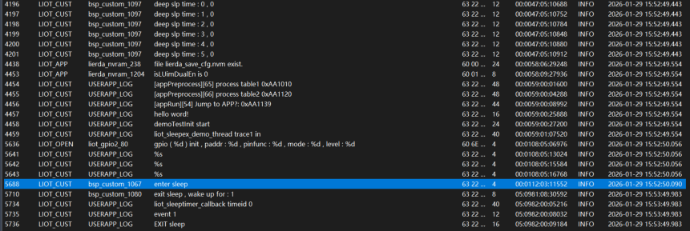
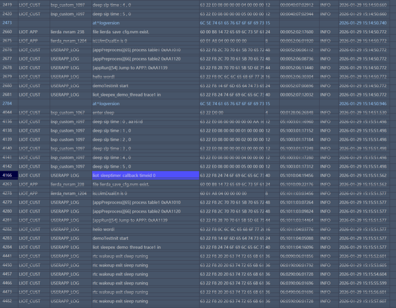

# Low Power Mode Usage Guide_Rev1.0

{link_to_translation}`zh_CN:[中文]`

## Document Revision History

| **Document Version** | **Revision Date** | **Revised By** | **Reviewed By** | **Changes** |
| ---- | ---- | ---- | ---- | ---- |
| Rev1.0 | 26-01-21 | zlc |  | Initial release |

## 1 Introduction

This chapter mainly introduces the newly added low power API interfaces and related usage instructions, providing reference for customers when implementing low power functionality using OPENSDK.

Peripheral power-down status in sleep mode

<table>
<tr>
<th>Power Mode</th><th></th><th>LIOT_SLEEP_MODE_NORMAL</th><th>LIOT_SLEEP_MODE_LOW</th><th>LIOT_SLEEP_MODE_DEEP_LOW</th>
</tr>
<tr>
<td>Description</td><td></td><td>Normal working mode,<br>milliampere-level power consumption,<br>suitable for scenarios without strict power requirements</td><td>Microampere-level power consumption,<br>fast wake-up,<br>suitable for frequent sleep/wake scenarios</td><td>Lower power consumption mode,<br>suitable for long-term sleep,<br>while maintaining necessary network connections</td>
</tr>
<tr>
<td>CPU Frequency</td><td></td><td>Normal</td><td>Reduced</td><td>Sleep</td>
</tr>
<tr>
<td>RAM Status</td><td></td><td>Retained</td><td>Retained</td><td>Power-off</td>
</tr>
<tr>
<td rowspan="5">Peripherals</td><td>General GPIO</td><td>Available</td><td>Not available</td><td>Not available</td>
</tr>
<tr>
<td>AON GPIO</td><td>Available</td><td>Available</td><td>Available</td>
</tr>
<tr>
<td>APWM</td><td>Available</td><td>Available</td><td>Available</td>
</tr>
<tr>
<td>Peripheral Status (I2C/SPI/I2S/PWM/ADC/UART/CAN)</td><td>Available</td><td>Not available</td><td>Not available</td>
</tr>
<tr>
<td>VDD_EXT</td><td>Output maintained</td><td>Output supported on some models</td><td>Output supported on some models</td>
</tr>
<tr>
<td rowspan="5">Wake-up Methods</td><td>wakeup/pwrkey</td><td>Available</td><td>Available</td><td>Available</td>
</tr>
<tr>
<td>Software Timer</td><td>Supported</td><td>Supported</td><td>Not supported</td>
</tr>
<tr>
<td>Low Power Timer</td><td>Supported</td><td>Supported</td><td>Supported</td>
</tr>
<tr>
<td>Low Power UART</td><td>Supported</td><td>Supported</td><td>Supported</td>
</tr>
<tr>
<td>Data, SMS</td><td>Supported</td><td>Supported</td><td>Supported</td>
</tr>
<tr>
<td rowspan="2">Data Communication</td><td>Application Protocol</td><td>FTP(S)/MQTT(S)<br>HTTP(S)/WebSocket<br>LWM2M/COAP<br>TCP/TCP(S)/UDP(S)</td><td>FTP(S)/MQTT(S)<br>HTTP(S)/WebSocket<br>LWM2M/COAP<br>TCP/TCP(S)/UDP(S)</td><td>LWM2M/COAP<br>TCP/UDP</td>
</tr>
<tr>
<td>Downlink Paging</td><td>Supported</td><td>Supported</td><td>Supported</td>
</tr>
</table>

The approximate current ranges for different power modes are:

| **Power Mode** | **Non-paging Current** |
| ---- | ---- |
| `LIOT_SLEEP_MODE_NORMAL` | ~4mA |
| `LIOT_SLEEP_MODE_LOW` | ~60uA |
| `LIOT_SLEEP_MODE_DEEP_LOW` | ~9.5uA |

## 2 API Function Overview

| **Function** | **Description** |
| ---- | ---- |
| `Liot_SleepSetMode()` | Set power mode |
| `Liot_SleepTimerStart()` | Start low power timer |
| `Liot_SleepTimerStop()` | Stop low power timer |
| `Liot_SleepTimerCheck()` | Check if low power timer is running |
| `Liot_SleepTimerGetID()` | Get low power timer ID that woke up the system |

## 3 Type Definitions

### 3.1 liot_sleep_mode_type_e

Power mode type enumeration.

1. Declaration

```c
typedef enum {
    LIOT_SLEEP_MODE_NORMAL,      // normal mode
    LIOT_SLEEP_MODE_LOW,         // sleep mode
    LIOT_SLEEP_MODE_DEEP_LOW,    // deep sleep mode
}liot_sleep_mode_type_e;
```

2. Parameters

- `LIOT_SLEEP_MODE_NORMAL`: Normal working mode
- `LIOT_SLEEP_MODE_LOW`: Low power mode
- `LIOT_SLEEP_MODE_DEEP_LOW`: Ultra-low power mode

**Note:**

In `LIOT_SLEEP_MODE_LOW` and `LIOT_SLEEP_MODE_DEEP_LOW` modes, peripherals will be powered off. To enter these modes, you need to: 1. Disable software timers, 2. Suspend all non-blocking tasks, 3. Disable peripheral drivers.

In `LIOT_SLEEP_MODE_LOW` mode, RAM is not powered off. Applications need to suspend all tasks. If timers are created, they will wake up the system after timeout. If tasks are in non-blocking state, they will also wake up the system when timeout occurs. It is recommended to change the wait time to forever.

In `LIOT_SLEEP_MODE_DEEP_LOW` mode, RAM is powered off. After the system wakes up, the code runs as if restarting. You need to check the wake-up reason at the beginning of the application. If low power timers are used, you can query the specific hardware timer ID that woke up the system using the `Liot_SleepTimerGetID()` interface. In this mode, 1 TCP and 1 UDP connection can be maintained. The TCP link state will be backed up and restored by the system, so no additional processing is required at the application layer. The heartbeat interval with the server should not be too short, otherwise it will cause frequent system wake-ups. It should also not exceed the IP aging time, generally within 10 minutes. If the aging time expires, the module needs to re-attach to the network, which will cause a power surge.

### 3.2 LiotSleepModeCfg_t

Power mode configuration structure.

1. Declaration

```c
typedef struct {
    liot_sleep_mode_type_e mode;    //sleep mode
} LiotSleepModeCfg_t;
```

2. Parameters

| **Type** | **Parameter** | **Description** |
| ---- | ---- | ---- |
| liot_sleep_mode_type_e | mode | Power mode |

### 3.3 Liot_SleepTimerID_e

Low power timer enumeration options.

1. Declaration

```c
typedef enum {
    LIOT_DEEPSLP_TIMER_ID0 = 0,		// num 0/1: 2 AONTimer, without flash storage, 2.5 hour in 100Hz
	LIOT_DEEPSLP_TIMER_ID1,
	LIOT_DEEPSLP_TIMER_ID2,
	LIOT_DEEPSLP_TIMER_ID3,
	LIOT_DEEPSLP_TIMER_ID4,
	LIOT_DEEPSLP_TIMER_ID5,
    LIOT_DEEPSLP_TIMER_MAX_NUM,
}Liot_SleepTimerID_e;
```

2. Parameters

- `LIOT_DEEPSLP_TIMER_ID0`: Low power timer ID 0
- `LIOT_DEEPSLP_TIMER_ID1`: Low power timer ID 1
- `LIOT_DEEPSLP_TIMER_ID2`: Low power timer ID 2
- `LIOT_DEEPSLP_TIMER_ID3`: Low power timer ID 3
- `LIOT_DEEPSLP_TIMER_ID4`: Low power timer ID 4
- `LIOT_DEEPSLP_TIMER_ID5`: Low power timer ID 5

3. Description

- `LIOT_DEEPSLP_TIMER_ID0` and `LIOT_DEEPSLP_TIMER_ID1` are AON timers. These timers become invalid after system reset. **Maximum timeout is 2.5 hours, and these 2 timers do NOT write to FLASH**.
- `LIOT_DEEPSLP_TIMER_ID2` ~ `LIOT_DEEPSLP_TIMER_ID5` are deep sleep timers. **Maximum timeout is 740 hours, and these timers write to FLASH. Pay attention when using them. These timers perform FLASH erase/write operations, and Flash has an erase/write lifecycle. If developers frequently start/stop these timers in loops, the module may be damaged within months. High-frequency (such as second-level) cyclic calls are strictly prohibited. They should only be used for long-period wake-up tasks.**

### 3.4 liot_sleep_errcode_e

Low power interface error code enumeration options.

1. Declaration

```c
typedef enum{
  LIOT_SLEEP_SUCCESS             = LIOT_SUCCESS,
  LIOT_SLEEP_INVALID_PARAM       = (LIOT_COMPONENT_PM_SLEEP << 16) | 1000,
  LIOT_SLEEP_LOCK_CREATE_FAIL    = (LIOT_COMPONENT_PM_SLEEP << 16) | 1001,
  LIOT_SLEEP_LOCK_DELETE_FAIL    = (LIOT_COMPONENT_PM_SLEEP << 16) | 1002,
  LIOT_SLEEP_LOCK_LOCK_FAIL      = (LIOT_COMPONENT_PM_SLEEP << 16) | 1003,
  LIOT_SLEEP_LOCK_UNLOCK_FAIL    = (LIOT_COMPONENT_PM_SLEEP << 16) | 1004,
  LIOT_SLEEP_LOCK_AUTOSLEEP_FAIL = (LIOT_COMPONENT_PM_SLEEP << 16) | 1005,
  LIOT_SLEEP_PARAM_SAVE_FAIL     = (LIOT_COMPONENT_PM_SLEEP << 16) | 1006,
} liot_sleep_errcode_e;
```

2. Parameters

- `LIOT_SLEEP_SUCCESS`: Execution successful
- `LIOT_SLEEP_INVALID_PARAM`: Invalid parameter
- `LIOT_SLEEP_LOCK_CREATE_FAIL`: Sleep handle creation failed
- `LIOT_SLEEP_LOCK_DELETE_FAIL`: Sleep handle deletion failed
- `LIOT_SLEEP_LOCK_LOCK_FAIL`: Sleep handle vote failed
- `LIOT_SLEEP_LOCK_UNLOCK_FAIL`: Sleep handle unvote failed
- `LIOT_SLEEP_LOCK_AUTOSLEEP_FAIL`: Setting automatic entry into sleep mode failed
- `LIOT_SLEEP_PARAM_SAVE_FAIL`: Saving parameters to NV failed

## 4 Detailed API Functions

### 4.1 DeepSlpTimerCb_Func

Low power function timeout callback function. Note: Time-consuming operations cannot be performed in this function.

1. Declaration

```c
typedef void (*DeepSlpTimerCb_Func)(Liot_SleepTimerID_e timeid);
```

2. Parameters

- `timeid`: [In] Low power timer ID, please refer to Section 3.3.

3. Return Value

- void

### 4.2 Liot_SleepSetMode

This function is used to set the device sleep mode. After setting the sleep mode, it will not immediately enter low power mode. The system will internally perform a voting check, and only enters low power mode when all votes "allow". The setting becomes invalid after system reset.

1. Declaration

```c
liot_sleep_errcode_e Liot_SleepSetMode(LiotSleepModeCfg_t *cfg);
```

2. Parameters

- `cfg`: [In] Sleep mode configuration.

3. Return Value

- `liot_sleep_errcode_e`: Execution result code, please refer to Section 3.4.

### 4.3 Liot_SleepTimerStart

This function is used to start the low power timer.

1. Declaration

```c
liot_sleep_errcode_e Liot_SleepTimerStart(Liot_SleepTimerID_e timeid, uint32_t timeout, DeepSlpTimerCb_Func cb);
```

2. Parameters

- `timeid`: [In] Low power timer ID, please refer to Section 3.3. **If customers frequently call timers that write to Flash (ID2-5), it will cause hardware damage.**
- `timeout`: [In] Low power timer timeout value. Different timer IDs have different maximum times that can be set. Please choose according to your business requirements, please refer to Section 3.3.
- `cb`: [In] Low power timer timeout callback function, please refer to Section 4.1.

3. Return Value

- `liot_sleep_errcode_e`: Execution result code, please refer to Section 3.4.

### 4.4 Liot_SleepTimerStop

This function is used to stop the low power timer.

The low power timer will automatically delete after timeout. To restart it, you need to call Start again.

1. Declaration

```c
liot_sleep_errcode_e Liot_SleepTimerStop(Liot_SleepTimerID_e timeid);
```

2. Parameters

- `timeid`: [In] Low power timer ID, please refer to Section 3.3.

3. Return Value

- `liot_sleep_errcode_e`: Execution result code, please refer to Section 3.4.

### 4.5 Liot_SleepTimerCheck

This function is used to check if the low power timer is running.

1. Declaration

```c
bool Liot_SleepTimerCheck(Liot_SleepTimerID_e timeid);
```

2. Parameters

- `timeid`: [In] Low power timer ID, please refer to Section 3.3.

3. Return Value

- `bool`: true - Low power timer is running, false - Low power timer is not running.

### 4.6 Liot_SleepTimerGetID

This function is used to get the timer ID that woke up the system.

Mainly used in `LIOT_SLEEP_MODE_DEEP_LOW` sleep mode to query the low power timer ID that woke up the system after wake-up. It has no effect in normal mode.

1. Declaration

```c
Liot_SleepTimerID_e Liot_SleepTimerGetID(void);
```

2. Parameters

- void

3. Return Value

- `Liot_SleepTimerID_e`: Timer ID that woke up the system.

## 5 Code Examples

Example code reference: `LSDK/example/src/demo_sleepex.c`.

**Running Results:**

Test log for entering `LIOT_SLEEP_MODE_LOW`

According to the demo, first enter `LIOT_SLEEP_MODE_LOW` low power mode, then start a 1-minute low power timer. After wake-up, the system checks if it was woken up by the low power timer, then exits the sleep low power mode.

<div align="center">

</div>

Test log for entering `LIOT_SLEEP_MODE_DEEP_LOW`

According to the demo, first enter `LIOT_SLEEP_MODE_DEEP_LOW` low power mode, then start a 1-minute low power timer. After wake-up, the system checks if it was woken up by the low power timer, then exits the sleep low power mode.

<div align="center">

</div>

## 6 FAQ

- For `LIOT_SLEEP_MODE_DEEP_LOW` mode, when the system enters this mode, RAM will be powered off, and global variables will be cleared to zero after system wake-up. If you need to save critical data, it is recommended to use the file system for storage, and restore the variables after system wake-up.
