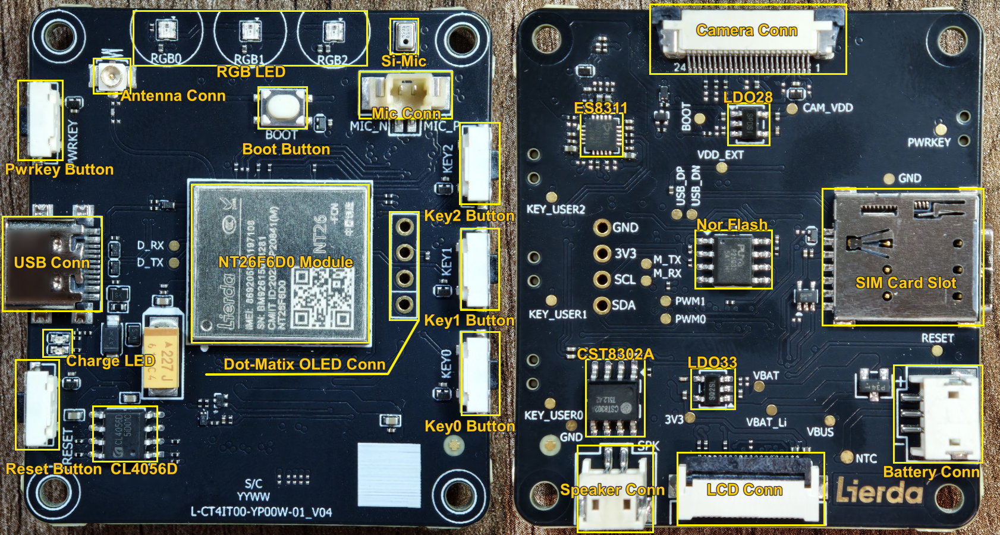
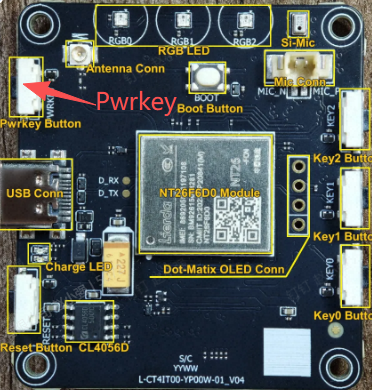
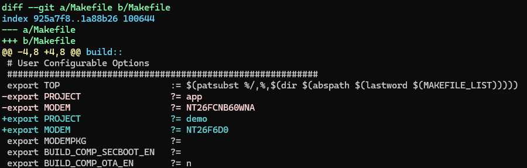
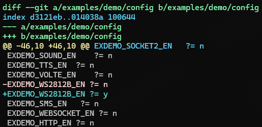
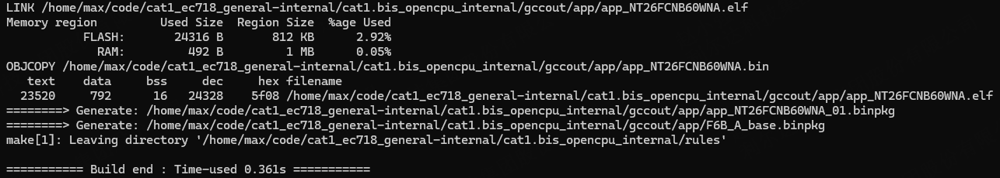
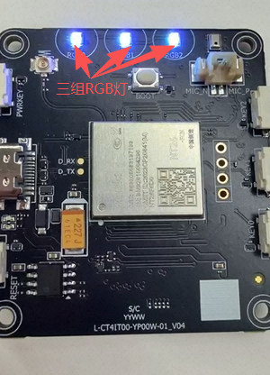

{link_to_translation}`zh_CN:[Chinese]`

# Lierda LTE-EC71X OpenCPU Quick Start Guide (Based on 01\_V04 Hardware)

## Document Revision History

| **Version** | **Date** | **Author** | **Reviewer** | **Revision** |
| --- | --- | --- | --- | --- |
| Rev1.0 | 2026-05-20 | zxq | zlc | Initial release |

## 1 Introduction

This document introduces the basic information of the 01\_V04 hardware, including how to get started, install drivers, download firmware, and run a demo on the software side, helping customers quickly become familiar with the hardware and software environment.

## 2 Getting to Know the Development Board

## 2.1 Hardware Features Overview

Before getting started, it is important to understand some basic product parameters. The table below provides feature information for the NT26-EC718PM AI development board.

### 2.1.1 Hardware Photo and Resources

### 2.1.2 Hardware Resources

| Main Components (TOP) | Description |
| --- | --- |
| Pwrkey Button | Pwrkey, used to power the module on/off |
| USB Connector\*(1)\* | Type-C connector for power supply, charging, communication, and firmware download |
| Pwrkey Button | 1.25mm/6PIN connector, provides 2x PWM / power / H-bridge differential output, use as needed |
| Charge Indicator LED | Red and green LEDs: red steady during charging, green steady when fully charged |
| Reset Button | Reset, used to reset the module |
| CL4056D | Charge management IC, suitable for 4.2V battery; NTC recommended at R~25~\=100KΩ |
| Antenna Connector | IPEX-1 generation connector |
| RGB LED | RGB indicator, shows module working status |
| Onboard Silicon Microphone | Either this or the microphone connector can be used |
| Microphone Connector\*(2)\* | 1.25mm/2PIN connector for connecting an electret microphone |
| Boot Button | Used to force entry into download mode |
| NT26F6D0 Module | Cat.1 module, supports OPEN application development |
| Dot Matrix Screen Connector | For connecting SSD1306 dot matrix display (12864/12832) |
| Key0/1/2 Buttons | 3 user-defined buttons |
| **Main Components (BOT)** | **Description** |
| Camera Connector\*(3)\* | 0.5mm/24PIN FPC connector for connecting a camera module |
| ES8311 | High-performance audio codec chip |
| LDO28 | 2.8V/300mA low-dropout linear regulator |
| Nor Flash | Nor flash chip, 32Mbit, suitable for 3.3V systems |
| SIM Card Slot | Nano-SIM card connector for inserting a SIM card |
| CST8302A | Class AB/D power amplifier |
| LDO33 | 3.3V/300mA low-dropout linear regulator |
| Speaker Connector | 1.5mm/2PIN connector for connecting a 4Ω/3W speaker |
| LCD Connector\*(4)\* | 0.5mm/20PIN FPC connector for connecting a screen adapter board |
| Battery Connector\*(5)\* | 1.5mm/3PIN connector |

**Notes:**

1.  **USB Connector**: Use a cable that supports USB 2.0 and includes D+/D- data lines (not a charge-only cable);

2.  **Microphone Connector**: The interface is polarized — pay attention to the positive/negative wire order when connecting; reversing it will prevent recording;

3.  **Camera Connector**: The FPC connector is top-contact type (contacts face up); insert the FPC ribbon with the gold fingers facing down;

4.  **LCD Connector**: The connector is dual-sided (top and bottom contact); verify pin order when inserting the ribbon to prevent reverse insertion;

5.  **Battery Connector**: Always verify that the battery terminal wire order (e.g., positive, negative, NTC) matches the board connector definition; incorrect wiring may damage the device;

## 3 PC Driver Installation

The USB driver is the bridge between the PC and the development board. During development, firmware flashing, AT command sending, and log capture all require USB, so installing the USB driver is a prerequisite for development work.

Refer to the document *Lierda LTE-EC71x OpenCPU USB Driver Installation Guide* for driver installation. After the driver is correctly installed and the board is powered on, the following three COM ports will appear.

The two commonly used COM ports are:

**Lierda AT Port** — the port for sending AT commands; used for both firmware download and AT command communication;

**Lierda Log Port** — the port for capturing logs; used when capturing logs with the EPAT tool.

## 4 Flashing Tool and Log Tool

## 4.1 Flashing Tool

[*Lierda Cellular Firmware Flashing Tool User Guide\_Rev1.0*](../../tools/flash/flash-tool.md)

## 4.2 Log Tool

[*Windows Log Capture Guide\_V1.0*](../../tools/Packet%20capture/packet-capture.md)

## 5 How to Power On

1. In general, inserting the USB cable will power on the board automatically. If the board does not power on and no COM ports appear, use the PWRKEY button.

2. PWRKEY operation: short press (500ms) to power on, long press (650ms) to power off.

The PWRKEY is located on the top side (Side A) of the board, as shown below:

## 6 Getting the SDK and Lighting Up the RGB LED

## 6.1 How to Get the SDK

The SDK is available at:

[https://github.com/orgs/lierda-iot/repositories](https://github.com/orgs/lierda-iot/repositories)

For a detailed introduction to the SDK, refer to the following document:

[*Beginner's Development Guide\_Rev1.0*](../../general/quick_start.md)

## 6.2 Software Modifications and Steps to Light Up the RGB LED

### 6.2.1 Modify the Makefile

### 6.2.2 Modify examples/demo/config

This file controls which demo is compiled. For example, to compile the RGB LED demo, select it here. You can also choose any other demo you need using macro control.

### 6.2.3 Build

Navigate to the SDK root directory and run `make all` to build. If the build completes successfully, the following output will appear.

### 6.2.4 Flash and Verify

After flashing, power on the board and select the firmware file `gccout/app/app_NT26FCNB60WNA_01.binpkg` to flash.

Under normal conditions, the RGB LED will continuously cycle through colors, indicating that the build and flash were successful.

