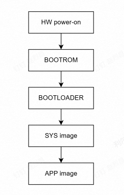
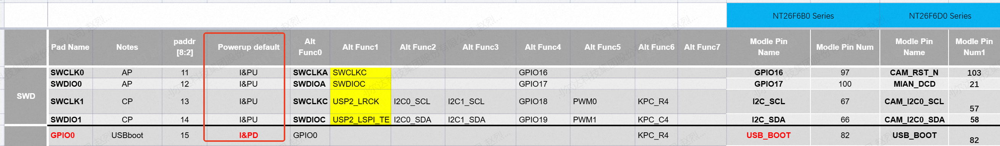
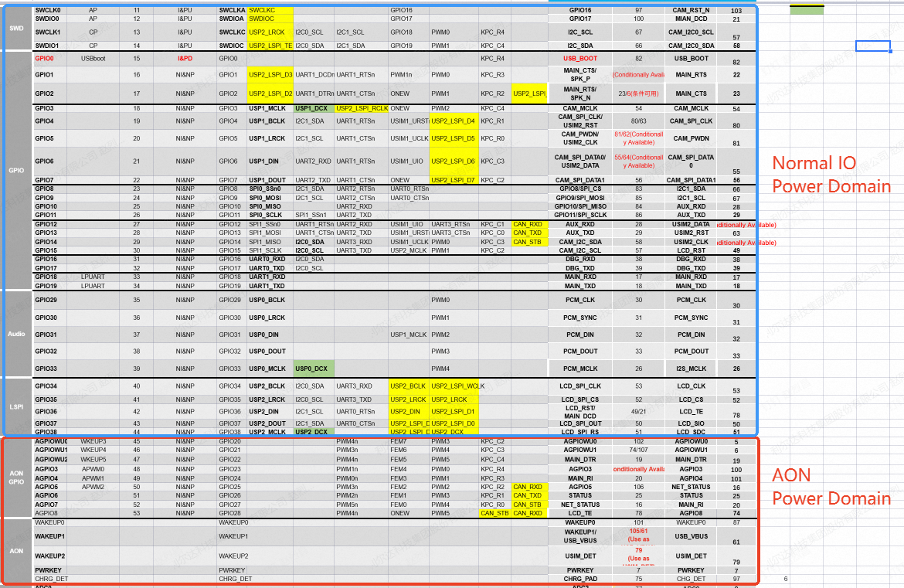

# Boot Process Description_Rev1.0

{link_to_translation}`zh_CN:[中文]`

## Document Revision History

| **Version** | **Date** | **Author** | **Reviewer** | **Revision Content** |
| ---- | ---- | ---- | ---- | ---- |
| Rev1.0 | 2026-04-16 | zlc | ymx | Initial release |

## 1 Introduction

This document provides a detailed description of the overall process from system power-on to loading and running APP user code for CAT1 modules. It helps developers understand the system startup mechanism, boot modes, IO power domains, and IO initialization status, facilitating subsequent detailed feature development for customers.

## 2 Boot Process

### 2.1 Boot Process Description

#### 2.1.1 Overall Boot Process

Boot Stage Description:

1. **HW Power-On**: Device is powered on through the VBAT pin. Refer to the hardware design manual for specific voltage range.
2. **BOOTROM**: Runs firmware code fixed at chip manufacturing.
   
   Main functions:
   
   - Download detection, currently supports UART/USB download.
   - Executes necessary hardware initialization. Checks and guides BOOTLOADER.
3. **BOOTLOADER**: Runs firmware code. Image is integrated in the base package (can be updated based on special requirements).
   
   Main functions:
   
   - Initializes necessary peripherals, checks and guides SYS image, optionally supports Secure Boot functionality.
   - Additional features such as differential upgrade and full upgrade.
4. **SYS image**: Runs firmware code. Image is integrated in the base package (can be updated based on special requirements).
   
   - Memory protection and clock configuration
   - Platform configuration loading
   - Exception handling configuration
   - Platform log system initialization
   - Power management and wakeup
   - USB stack initialization (if enabled)
   - Watchdog timer setup (if enabled)
   - Flash and memory configuration
   - Deep sleep and low power functionality
5. **APP image**: Loads and runs user APP program
   
   - The image is entirely developed and compiled by the customer.
   
   **Note:** Secure Boot is not currently supported and will be updated in future versions.

#### 2.1.2 Boot Time Consumption for Each Stage

| **Stage** | **Time Consumption** |
| ---- | ---- |
| BOOTROM | ~120ms |
| BOOTLOADER | ~250ms |
| SYS image | ~130ms |
| APP image | User code loading time, depends on business complexity |
| Total System Side Boot Time | ~500ms (excluding APP startup time) |

**Note:**

- The above times are for non-Secure Boot mode. Boot times may vary depending on base package image configuration. The values above are reference values only.
- NT26K2B1/NT26KCNF20NNA does not support full upgrade. BOOTLOADER boot time is ~140ms.

### 2.2 Boot Mode Description

1. **Normal Boot Mode**
   
   System starts up normally with power-on.
2. **Download Mode (UART/USB)**
   
   - USB Download: During the boot phase, if the USB_BOOT pin is pulled high, the system enters USB download mode. This mode lasts for 15 seconds. If no firmware update occurs within 15 seconds, the system proceeds to normal boot mode.
   - UART Download: By default, UART1 is the system programming port. If a programming tool connection is detected, the system automatically enters download mode after reset.
3. **Reset Boot Mode**
   
   - Software Reset: You can call the `liot_power_reset()` interface to perform a soft reset. Before resetting, make sure to call the interface to disable RF.
   - Hardware RST Reset: Pull the RST pin low (refer to the corresponding hardware design manual for pull-low timing), and the system will perform a hardware reset and restart in normal mode.
   - Watchdog Reset: The system enables the watchdog by default with a timeout of 20 seconds. If the system cannot feed the watchdog in time, it will cause a system reset. Generally, you need to check whether the code has infinite loops.
   - Exception Reset: Program crash causes system reset. This type of reset requires analysis and positioning through exception logs (dump), usually indicating code issues.

## 3 IO Status and Power Domain Description

### 3.1 IO Default Status

In the IO multiplexing table, the **Powerup default** column indicates the default status of each IO after system power-on.

**Note:**

- NI&NP: Non-input mode with no pull-up/pull-down; I&PU: Input mode with pull-up; I&PD: Input mode with pull-down
- It is recommended to configure IO status at the APP application entry point.
- For IO status in low power mode, refer to: ["Lierda LTE-EC71X OpenCPU Low Power Mode Usage Guide_Rev1.0"](https://alidocs.dingtalk.com/i/nodes/np9zOoBVBYP06PmLS0l9YnlqW1DK0g6l?utm_scene=team_space).
- For IO configuration, refer to the GPIO development guide: ["GPIO Development Guide"](GPIO开发指导.md).

### 3.2 Power Domains

The system has two power domains: Normal IO and AON power domain.

## 4 Common Issues and Troubleshooting

### 4.1 Possible Causes and Troubleshooting Methods for Boot Failure

- Verify that device power supply is normal.
- Confirm whether the PWR_KEY button is used to trigger power-on.
- Verify that the base package version matching the corresponding hardware model has been flashed.

### 4.2 APP Loading Failure Troubleshooting

- Verify that the APP image file exists and compiles without errors.
- Confirm compatibility between base package version and APP version.
- Check error messages in system logs, which can be obtained through debug port logs.

### 4.3 IO Configuration Issues

- IO not working properly: Verify whether IO is correctly configured at the APP entry point. Refer to the GPIO development guide.

## 5 Terminology

| **Term** | **Definition** | **Description** |
| ---- | ---- | ---- |
| BOOTROM | Startup code in Read-Only Memory | Unchangeable, fixed startup code embedded in the chip. First to execute after power-on, loads and verifies BOOTLOADER |
| BOOTLOADER | Boot loader program | Responsible for initializing hardware, then loading SYS image from Flash |
| SYS image | System Image | Complete RTOS operating system kernel and root filesystem, used to provide core capabilities such as task management, memory management, device drivers, and file systems |
| APP image | Application Image | Business application program image |
| Secure Boot | Secure Boot | Mechanism that verifies each level of boot image through a digital signature chain |
