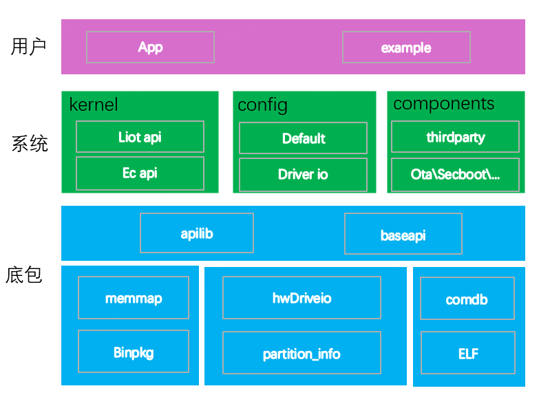
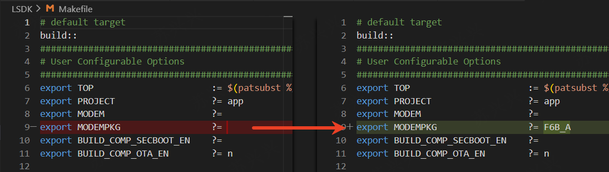
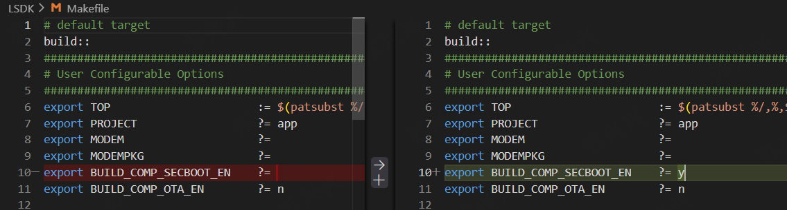
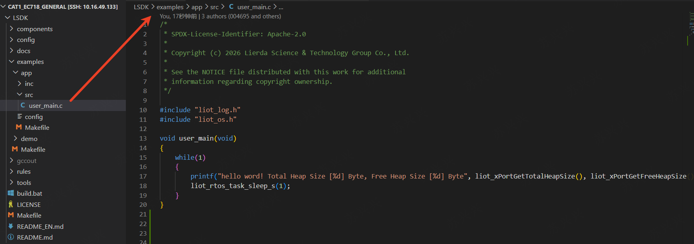
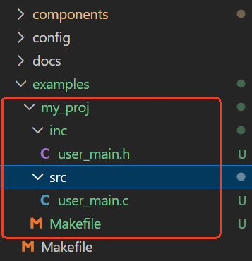
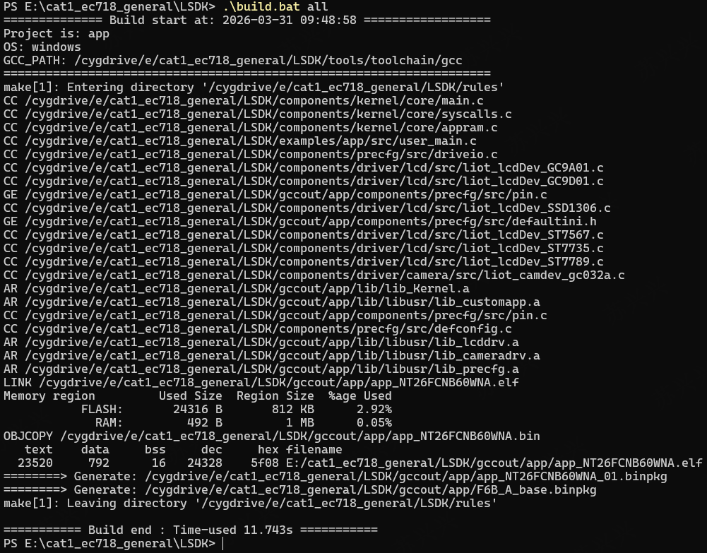
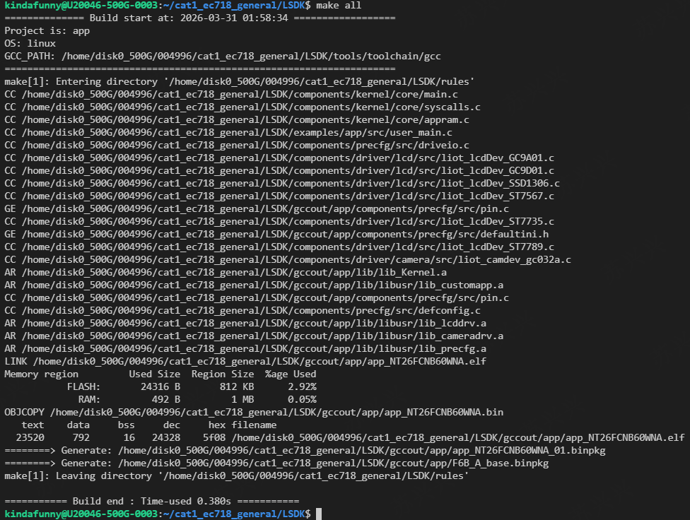
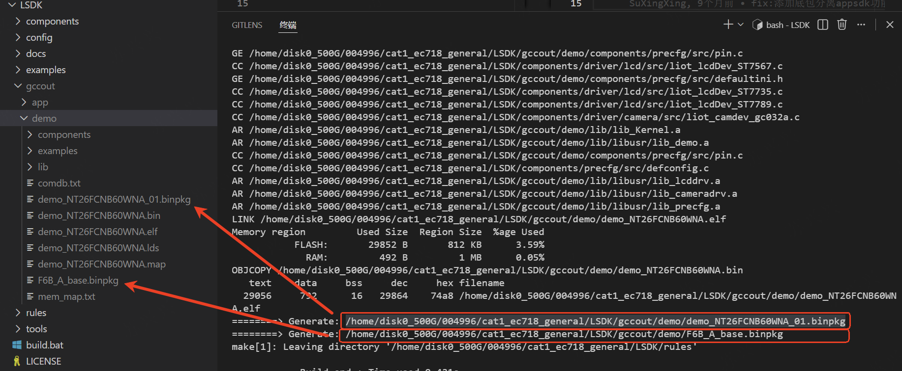
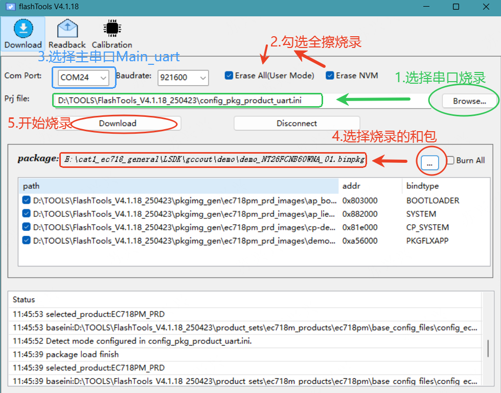
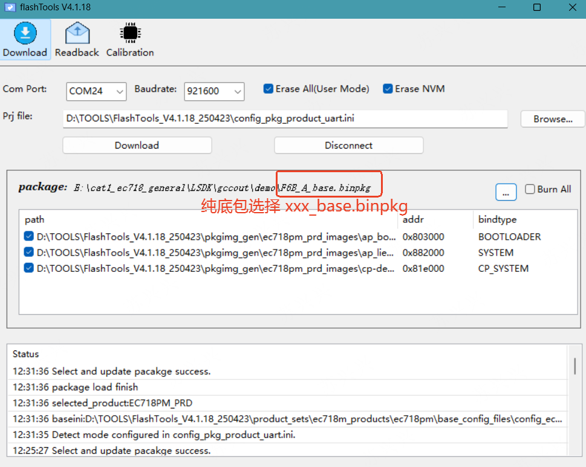

# Quick Start Guide_Rev1.0

{link_to_translation}`zh_CN:[中文]`

## Document Revision History

| Version | Date | Author | Reviewer | Revision Content |
| ---- | ---- | ---- | ---- | ---- |
| Rev1.0 | 2026-01-29 | sxx | zlc | Document created |

## 1 Introduction

This document is intended to guide developers to quickly get familiar with the base-package-separated SDK development workflow, helping users understand the various functional modules of the SDK and start their own development work.

The SDK architecture can be divided into three layers: Base Package Layer, System Layer, and User Layer.

1. Base Package Layer: The base package layer is not visible to users and is maintained by Lierda. Libraries for specific models are packaged into directories and placed under `components/basePkg/`. Developers simply select the base package corresponding to their hardware model during compilation. Refer to Section 4.1 below for the selection method.
2. System Layer: The system layer runs the core code of the base-package-separated architecture. It is the entry point for the system loading process, including kernel, configuration, drivers, open-source third-party libraries, TTS, OTA upgrades, etc.
3. User Layer: The user layer is where developers write their own code, primarily located in the `examples` directory. Lierda provides two preset projects for developers: app and demo. The app project is an empty project without specific functionality implementation — users can develop their own code based on the app project. The demo project provides API interface examples for customer reference. Customers can also create their own projects under the `examples/` directory by referencing the app project. The code entry point is `void user_main(void)`, which is automatically called after the system layer starts.

<div align="center">



</div>

## 2 Directory Structure Overview

```
├── components (Component library, core code is placed here)
│   ├── basePkg (Base package directory)
│   │     └── F6B_A, F7B_A, F6D_A, K2B_A, ...
│   ├── driver (Open low-level drivers)
│   │     └── lcd, camera, ...
│   ├── kernel
│   │      └── app.ld, core, ecapi, include, lierda_api
│   ├── ota (FOTA related code)
│   ├── precfg (Preset configuration code implementation)
│   ├── secboot (Secure boot verification related code)
│   ├── thirdparty (Open-source third-party source code)
│   │     └── CJSON, freertos, websockets, lwip, mbedtls, etc.
│   ├── tts (TTS related code)
├── config
│      └── default.ini (Preset configuration)
│      └── iodriver.ini (Driver IO pin preset configuration)
├── docs (Documentation)
├── examples
│      └── app (Default project)
│      └── demo (Default demo project)
├── LICENSE, build.bat, Makefile, README.md
├── rules (Makefile build rules)
├── tools (Scripts and tools)
```

## 3 Feature Introduction

### 3.1 Base Package (basePkg)

The base package layer is maintained by Lierda. Multiple base package versions are provided for different module models and feature combinations. Customers select the base package according to their needs. Base packages are generally placed under `components/basePkg/`.

To change the base package model, modify the root `Makefile` file and set `MODEMPKG` to your base package model.

<div align="center">



</div>

#### 3.1.1 Version and Model Mapping

Currently supported versions and models:

| Version | Description | Compatible Module Models |
| ---- | ---- | ---- |
| F6B_A | EC718PM, B series | NT26FCNB10WNA, NT26FCNB30WNA, NT26FCNB60WNA, NT26FCNB70WNA |
| F6D_A | EC718PM, D series | NT26F6D0, NT26F7D0 |
| F7B_A | EC718PM, B series, VoLTE | NT26FCNB70WNA |
| K2B_A | EC716E, B series | NT26KCNB20NNA, NT26KCNB2MNNA, NT26K2B1 |

#### 3.1.2 Base Package File Description

- lib: API dynamic library. After compilation, memory usage is in user space. This is the concrete implementation of APIs provided by the base package to upper layers.
- ap_lierda_app.elf: Used for parsing dump data when a crash dump is captured.
- ap_bootloader.bin: Bootloader executable bin file.
- ap_lierda_app.bin: Base package AP-side executable bin file.
- cp-demo-flash.bin: Base package CP-side executable bin file.
- comdb.txt: Log library, used with the EPAT tool for log capture.
- hwDriveio.def: Default IO pin configuration table for drivers in the base package (for reference only, not involved in compilation).
- mem_map.txt: Base package macro definition overview, used for generating combined packages.
- partition_info.txt: Base package FLASH partition layout table.

### 3.2 Preset Configuration (Config)

The preset configuration (config) allows you to directly preset parameter values that are saved across power cycles, without needing to call additional APIs. It also allows presetting IO pins for peripheral drivers.

`default.ini` and `iodriver.ini` are ultimately converted into macro controls via tools, generating tables in `components/precfg/` that are passed to the base package and take effect during system loading.

**Note:** Only takes effect on the first boot after a full-erase flash. After that, values only change through API modifications and are saved across power cycles.

#### 3.2.1 default.ini

`Config/default.ini` provides methods to configure default values as follows:

| Value | Function | Description |
| ---- | ---- | ---- |
| faultAction | Action on crash | 0-infinite loop, 1-print then reboot, 2-dump then reboot, 3-dump+EPAT then reboot, 4-reboot directly |
| logControl | unilog switch | 0-disabled, 1-sw log only, 2-all logs |
| logPortSel | unilog output port | 0-USB, 1-UART, 2-MIX |
| usbCtrl | USB control | 0-enable USB+RNDIS, 1-enable USB without RNDIS enumeration, 2-disable USB |
| usbNet | USB network | 0-RNDIS, 1-ECM, 2-default RNDIS/switch to ECM on Windows, 3-default ECM/switch to RNDIS on Windows |
| usbSlpMask | USB sleep control | 0-disabled, 1-enabled |
| netcid | Network bearer CID | 0-15 |
| AutoDial | USB NIC auto-connect | 0-off, 1-on |
| uart1At | UART1 AT switch | 0-off, 1-on |
| appLogPort | Base package layer log output | 0-USBAT, 1-UART2, 3-system interface |
| uartbootloader | UART default baud rate | Supports 600~3000000 |
| apn | APN | APN string, max 99 bytes |

#### 3.2.2 iodriver.ini

`Config/iodriver.ini` provides methods to configure driver IO pins, supporting pin configuration for peripherals such as UART, I2C, SPI, CSPI, I2S, etc.

### 3.3 Full OTA Upgrade

Full OTA is an important SDK feature. The full OTA component is used to generate FOTA-related files and should be enabled when using the OTA function. This feature is disabled by default.

**Note:** F7B_A and K2B_A series base packages do not support this feature.

Modify the root `Makefile` file and set `BUILD_COMP_OTA_EN` to Y to enable the OTA feature.

<div align="center">


</div>

### 3.4 SECBOOT Secure Boot Verification

In scenarios with high security requirements, it is necessary to ensure that module firmware cannot be flashed arbitrarily — only firmware that has been calibrated and verified with your own keys can be flashed.

The SECBOOT feature in the SDK is only used to encrypt and verify the APP portion of the base-package-separated mode firmware after secondary flashing. Encryption of the base package portion is provided by Lierda through encrypted base packages. Please contact your sales representative to customize a specific base package when needed.

Modify the root `Makefile` file and set `BUILD_COMP_SECBOOT_EN` to Y to enable the SECBOOT feature.

<div align="center">



</div>

## 4 Example Code

User code is added as projects in the `examples` directory. The SDK provides two basic projects: app and demo.

The app project is an empty project where customers can develop based on it. The demo project is an API example project — Lierda provides developers with rich example code scenarios that customers can reference.

Modify the root `Makefile` file and set `PROJECT` to the corresponding project directory name. During compilation, it will automatically link to the corresponding `examples/$(PROJECT)/Makefile`, which manages the code in the PROJECT.

<div align="center">


</div>

The entry function for each PROJECT is fixed: `void user_main(void)`. Users implement the `user_main` function and develop their own code based on this interface.

### 4.1 app

The app project implements a function in `user_main.c` that prints the current memory usage.

<div align="center">


</div>

### 4.2 demo

`example/demo` is the example code provided by Lierda for customers. It is also loaded and started via `user_main` in `demo_main.c`.

#### 4.2.1 Compiling the demo Project

To compile the demo project, modify the root `Makefile` file and set `PROJECT` to demo.

#### 4.2.2 Enabling the Demo to Run

Set the demo you want to test to `y` in the configuration, then compile normally.

<div align="center">


</div>

#### 4.2.3 How to Find the Corresponding Demo in Config

All demos are currently located in the `LSDK/examples/demo/src` directory.

The variables in the config file follow Makefile rules. Taking `EXDEMO_FS_EN` as an example, set it to y in the config file.

In the `LSDK/examples/demo/Makefile` file, the corresponding `demo_fs.c` file is compiled based on the `EXDEMO_FS_EN` variable.

<div align="center">


</div>

## 5 Adding User Code

### 5.1 Adding Your Own Source Code

Customer code is concentrated in the `LSDK/app` directory. Add your own code in `LSDK/app/src` and call your interfaces in `user_main.c`.

<div align="center">



</div>

### 5.2 Adding Your Own Project

The `examples/` directory is the SDK's default location for storing projects. Create your own project under `examples/` by referencing the app project. Recommended: copy the app directory to the same level and rename it to your project name.

Modify the root `Makefile` file and set `PROJECT` to "your project name".

Notes:

1. The entry function of the project directory must be: `void user_main(void)`.
2. The root of the project directory must contain a Makefile for managing internal compilation rules.

<div align="center">



</div>

## 6 Compilation

### 6.1 Confirm Your Model and Project

1. Find your base package name in Section 3.1 based on the specific module model you have, e.g.: NT26FCNB60WNA -> F6B_A
2. Modify PROJECT, MODEM, and MODEMPKG in the root Makefile

```makefile
export PROJECT    ?= demo
export MODEM      ?= NT26FCNB60WNA
export MODEMPKG   ?= F6B_A
```

<div align="center">


</div>

### 6.2 Command Line Compilation

#### 6.2.1 Using Command Line Compilation (Windows)

Navigate to the LSDK root path and use the `build.bat` script to compile:

```shell
cd LSDK
./build.bat                # Incremental build
./build.bat all            # Clean build
./build.bat all PROJECT=demo MODEM=NT26FCNB60WNA MODEMPKG=F6B_A  # Build with parameters
```

<div align="center">



</div>

#### 6.2.2 Linux Compilation

Navigate to the LSDK root path and use Make to compile:

```shell
cd LSDK
make                       # Incremental build
make all                   # Clean build
make all PROJECT=demo MODEM=NT26FCNB60WNA MODEMPKG=F6B_A  # Build with parameters
```

<div align="center">



</div>

#### 6.2.3 More Parameterized Compilation

The SDK's parameter rules are based on Makefile compilation parameter passing, meaning all variables in the Makefile can be passed as parameters. For example:

1. Directly specify `EXDEMO_FS_EN` based on the demo project to compile the FS example code: `make all PROJECT=demo EXDEMO_FS_EN=y`
2. Enable OTA upgrade compilation: `make all PROJECT=demo BUILD_COMP_OTA_EN=y`

**Why don't parameters take effect?** All variables in the Makefile can be passed as parameters when executing the Make command. After passing parameters, execution continues according to Makefile rules. If a variable is given an initial value when passed as a parameter, but is later modified during Makefile execution, it will run with the later modified value, causing the parameter to be ineffective.

### 6.3 Lierda Tools Compilation

Lierda Tools currently only supports Windows. Please use command line compilation on Linux. For detailed usage, refer to "Lierda Cellular Firmware Flashing Tool User Guide_Rev1.0".

<div align="center">


</div>

## 7 Flashing

After compilation, a `gccout/` directory is generated in the root directory. The `gccout/` directory contains all compilation artifacts, stored by PROJECT name. Taking the demo project with hardware model NT26FCNB60WNA as an example:

<div align="center">



</div>

Generated artifacts:

- `demo_NT26FCNB60WNA_01.binpkg`: Combined package of base package + application layer
- `demo_NT26FCNB60WNA.bin`: Package containing only the application layer
- `F6B_A_base.binpkg`: Combined package containing only the base package without the application
- `comdb.txt`: Log library for use with the EPAT tool for log capture

The flashing tool uses FlashTools. For tool usage documentation, refer to "Lierda NT26F&NT26K-CN Firmware Upgrade Application Guide_Rev1.0".

### 7.1 Flashing the Base Package + Application Layer Combined Package

<div align="center">



</div>

### 7.2 Flashing the Base Package Only

<div align="center">



</div>
