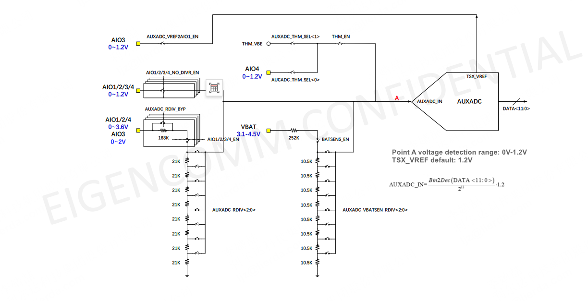
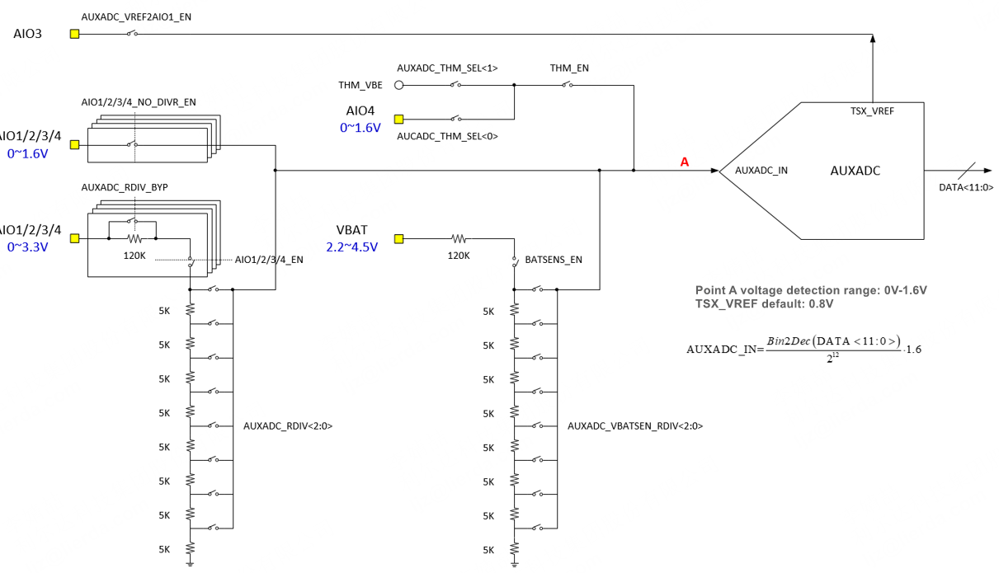
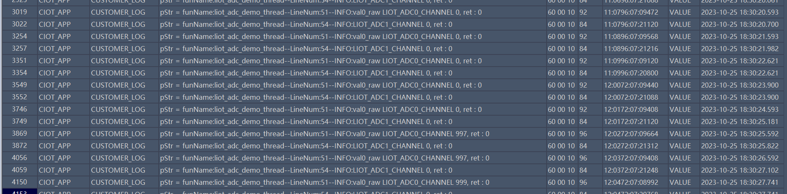

# ADC Development Guide_Rev1.0

{link_to_translation}`zh_CN:[中文]`

## Document Revision History

| **Version** | **Date** | **Author** | **Changes** |
| ---- | ---- | ---- | ---- |
| Rev1.0 | 2023-09-11 | WTY | Initial Release |
| Rev1.1 | 2024-03-25 | SXX | Renamed document |
| Rev1.2 | 2024-08-28 | ZLC | Added reference voltage description |
| Rev1.3 | 2024-10-23 | YMX | Adjusted document format, added voltage and temperature range description |
| Rev1.4 | 2025-02-12 | ZLC | Added EC716 liot_adc_resdiv_e description |
| Rev1.4 | 2025-04-18 | ZLC | Added description for EC718 series internal and external voltage divider usage |
| Rev1.5 | 2025-04-18 | ZH | Added common FAQ section |
| Rev1.6 | 2025-08-22 | ZLC | Modified internal/external voltage reference description |
| Rev1.7 | 2026-04-23 | LJZ | Document optimization. Modified introduction, added voltage range and error. |

## 1 Introduction

This document describes the NT26 series ADC interface APIs, which are declared in the `components/kernel/lierda_api/liot_adc/liot_adc.h` file.

### 1.1 Module ADC Resource Overview

- **NT26-KCN (EC716)**: 4 ADC channels
  - 2 external AIO voltage detection channels
  - 1 internal temperature sensor channel
  - 1 VBAT battery voltage detection channel

The following shows the internal voltage divider resistance values for the 716 series platform:

<div align="center">



</div>

| Module Channel | Description | External Input Voltage Range | Error |
| ---- | ---- | ---- | ---- |
| ADC0~1 | Signal enters AUXADC input directly without voltage division, suitable for external voltage divider | 0V ~ 1.2V | Within ±2mV at room temperature |
| ADC0~1 | Through internal voltage divider, final AUXADC input voltage remains within 0-1.2V | 0V ~ 3.6V | Within ±20mV at room temperature |
| VBAT Channel | VBAT voltage reaches AUXADC input through voltage divider circuit | 3.1V ~ 4.5V | Within ±20mV at room temperature |
| Temperature Sensor | Internal chip temperature detection | -40°C ~ 85°C | Approximately 0.1% |

- **NT26-FCN (EC718)**: 6 ADC channels
  - 4 external AIO voltage detection channels
  - 1 internal temperature sensor channel
  - 1 VBAT battery voltage detection channel

The following shows the internal voltage divider resistance values for the 718 series platform:

<div align="center">



</div>

| Module Channel | Description | External Input Voltage Range | Error |
| ---- | ---- | ---- | ---- |
| ADC0~3 | Signal enters AUXADC input directly without voltage division, suitable for external voltage divider | **0V ~ 1.6V** | Within ±2mV at room temperature |
| ADC0~3 | Through internal voltage divider, final AUXADC input voltage remains within 0-1.6V | **0V ~ 3.3V** | Within ±20mV at room temperature |
| VBAT Channel | VBAT voltage reaches AUXADC input through voltage divider circuit, recommended divider ratio 4/16 | **2.2V ~ 4.8V** | Within ±20mV at room temperature |
| Temperature Sensor | Internal chip temperature detection | **-40°C ~ 85°C** | Approximately 0.1% |

**Overvoltage Warning**: Exceeding the voltage range will cause sampling distortion and accuracy failure. **In severe cases, it will burn the ADC and analog circuits, which cannot be repaired**.

## 2 API Function Overview

| **Function** | **Description** |
| ---- | ---- |
| `liot_adc_get_volt()` | Read the analog voltage value from an ADC channel |
| `liot_adc_get_volt_raw()` | Read the raw analog voltage data from an ADC channel |

## 3 Type Definitions

### 3.1 liot_adc_errcode_e

ADC API execution result error codes.

Declaration:

```c
typedef enum
{
    LIOT_ADC_SUCCESS             = 0,
    LIOT_ADC_INVALID_PARAM_ERR   = 10 | (LIOT_COMPONENT_BSP_ADC << 16),
    LIOT_ADC_GET_VALUE_ERROR     = 50 | (LIOT_COMPONENT_BSP_ADC << 16),
    LIOT_ADC_MEM_ADDR_NULL_ERROR = 60 | (LIOT_COMPONENT_BSP_ADC << 16),
    LIOT_ADC_TASK_ERROR,
} liot_adc_errcode_e;
```

Parameters:

- `LIOT_ADC_SUCCESS`: Read successful.
- `LIOT_ADC_INVALID_PARAM_ERR`: Invalid parameter.
- `LIOT_ADC_GET_VALUE_ERROR`: Read failed.
- `LIOT_ADC_MEM_ADDR_NULL_ERROR`: Pointer address is NULL.
- `LIOT_ADC_TASK_ERROR`: ADC task error.

### 3.2 liot_adc_chan_id_e

ADC conversion channel selection.

Declaration:

```c
typedef enum
{
    LIOT_ADC0_CHANNEL,
    LIOT_ADC1_CHANNEL,
    LIOT_ADC2_CHANNEL,
    LIOT_ADC3_CHANNEL,
    LIOT_ADC_THERMAL_CHANNEL,
    LIOT_ADC_VBAT_CHANNEL,
    LIOT_ADC_CHANNEL_MAX,
} liot_adc_chan_id_e;
```

Parameters:

- `LIOT_ADC0_CHANNEL`: ADC0 channel
- `LIOT_ADC1_CHANNEL`: ADC1 channel
- `LIOT_ADC2_CHANNEL`: ADC2 channel
- `LIOT_ADC3_CHANNEL`: ADC3 channel
- `LIOT_ADC_THERMAL_CHANNEL`: Internal temperature sensor channel
- `LIOT_ADC_VBAT_CHANNEL`: Power supply voltage channel
- `LIOT_ADC_CHANNEL_MAX`: ADC channel count (this parameter is not usable)

### 3.3 liot_adc_resdiv_e

ADC voltage divider selection.

**Notes:**

- The temperature sensor has no voltage divider.
- VBAT detection uses internal voltage divider 6/32, modification is not currently supported.
- ADC 0~3 voltage divider ratios differ between 718 series and 716 series, see enumeration values below.
- `LIOT_ADC_AIO_RESDIV_BYPASS` is the external voltage divider mode; all others are internal voltage divider modes.
- For EC718 non-PM series, when using internal voltage divider, `LIOT_ADC_AIO_RESDIV_RATIO_1OVER32` ~ `LIOT_ADC_AIO_RESDIV_RATIO_8OVER32` can be used, while `LIOT_ADC_AIO_RESDIV_RATIO_12OVER32` ~ `LIOT_ADC_AIO_RESDIV_RATIO_28OVER32` cannot be used as they will cause internal chip overvoltage.

Declaration:

```c
// EC718
typedef enum
{
    LIOT_ADC_AIO_RESDIV_RATIO_1        = 0U,  /**< ADC AIO RESDIV select as VIN */
    LIOT_ADC_AIO_RESDIV_RATIO_28OVER32 = 1U,  /**< ADC AIO RESDIV select as 28/32 VIN */
    LIOT_ADC_AIO_RESDIV_RATIO_24OVER32 = 2U,  /**< ADC AIO RESDIV select as 24/32 VIN */
    LIOT_ADC_AIO_RESDIV_RATIO_20OVER32 = 3U,  /**< ADC AIO RESDIV select as 20/32 VIN */
    LIOT_ADC_AIO_RESDIV_RATIO_16OVER32 = 4U,  /**< ADC AIO RESDIV select as 16/32 VIN */
    LIOT_ADC_AIO_RESDIV_RATIO_12OVER32 = 5U,  /**< ADC AIO RESDIV select as 12/32 VIN */
    LIOT_ADC_AIO_RESDIV_RATIO_8OVER32  = 6U,  /**< ADC AIO RESDIV select as 8/32 VIN */
    LIOT_ADC_AIO_RESDIV_RATIO_7OVER32  = 7U,  /**< ADC AIO RESDIV select as 7/32 VIN */
    LIOT_ADC_AIO_RESDIV_RATIO_6OVER32  = 8U,  /**< ADC AIO RESDIV select as 6/32 VIN */
    LIOT_ADC_AIO_RESDIV_RATIO_5OVER32  = 9U,  /**< ADC AIO RESDIV select as 5/32 VIN */
    LIOT_ADC_AIO_RESDIV_RATIO_4OVER32  = 10U, /**< ADC AIO RESDIV select as 4/32 VIN */
    LIOT_ADC_AIO_RESDIV_RATIO_3OVER32  = 11U, /**< ADC AIO RESDIV select as 3/32 VIN */
    LIOT_ADC_AIO_RESDIV_RATIO_2OVER32  = 12U, /**< ADC AIO RESDIV select as 2/32 VIN */
    LIOT_ADC_AIO_RESDIV_RATIO_1OVER32  = 13U, /**< ADC AIO RESDIV select as 1/32 VIN */
    LIOT_ADC_AIO_RESDIV_BYPASS         = 14U, /**< BYPASS the whole ADC AIO RESDIV network(direct input) */
} liot_adc_resdiv_e;

// EC716
typedef enum
{
    LIOT_ADC_AIO_RESDIV_RATIO_1          = 0U,  /**< ADC AIO RESDIV select as VIN */
    LIOT_ADC_AIO_RESDIV_RATIO_14OVER16   = 1U,  /**< ADC AIO RESDIV select as 14/16 VIN */
    LIOT_ADC_AIO_RESDIV_RATIO_12OVER16   = 2U,  /**< ADC AIO RESDIV select as 12/16 VIN */
    LIOT_ADC_AIO_RESDIV_RATIO_10OVER16   = 3U,  /**< ADC AIO RESDIV select as 10/16 VIN */
    LIOT_ADC_AIO_RESDIV_RATIO_8OVER16    = 4U,  /**< ADC AIO RESDIV select as 8/16 VIN */
    LIOT_ADC_AIO_RESDIV_RATIO_7OVER16    = 5U,  /**< ADC AIO RESDIV select as 7/16 VIN */
    LIOT_ADC_AIO_RESDIV_RATIO_6OVER16    = 6U,  /**< ADC AIO RESDIV select as 6/16 VIN */
    LIOT_ADC_AIO_RESDIV_RATIO_5OVER16    = 7U,  /**< ADC AIO RESDIV select as 5/16 VIN */
    LIOT_ADC_AIO_RESDIV_RATIO_4OVER16    = 8U,  /**< ADC AIO RESDIV select as 4/16 VIN */
    LIOT_ADC_AIO_RESDIV_RATIO_3OVER16    = 9U,  /**< ADC AIO RESDIV select as 3/16 VIN */
    LIOT_ADC_AIO_RESDIV_RATIO_2OVER16    = 10U, /**< ADC AIO RESDIV select as 2/16 VIN */
    LIOT_ADC_AIO_RESDIV_RATIO_1OVER16    = 11U, /**< ADC AIO RESDIV select as 1/16 VIN */
    LIOT_ADC_AIO_RESDIV_BYPASS           = 12U, /**< BYPASS the whole ADC AIO RESDIV network(direct input) */
} liot_adc_resdiv_e;
```

Parameters:

- `LIOT_ADC_AIO_RESDIV_RATIO_1`: AIO voltage divider selects input voltage
- `LIOT_ADC_AIO_RESDIV_RATIO_28OVER32`: AIO voltage divider selects 28/32 input voltage
- `LIOT_ADC_AIO_RESDIV_RATIO_24OVER32`: AIO voltage divider selects 24/32 input voltage
- `LIOT_ADC_AIO_RESDIV_RATIO_20OVER32`: AIO voltage divider selects 20/32 input voltage
- `LIOT_ADC_AIO_RESDIV_RATIO_16OVER32`: AIO voltage divider selects 16/32 input voltage
- `LIOT_ADC_AIO_RESDIV_RATIO_12OVER32`: AIO voltage divider selects 12/32 input voltage
- `LIOT_ADC_AIO_RESDIV_RATIO_8OVER32`: AIO voltage divider selects 8/32 input voltage
- `LIOT_ADC_AIO_RESDIV_RATIO_7OVER32`: AIO voltage divider selects 7/32 input voltage
- `LIOT_ADC_AIO_RESDIV_RATIO_6OVER32`: AIO voltage divider selects 6/32 input voltage
- `LIOT_ADC_AIO_RESDIV_RATIO_5OVER32`: AIO voltage divider selects 5/32 input voltage
- `LIOT_ADC_AIO_RESDIV_RATIO_4OVER32`: AIO voltage divider selects 4/32 input voltage
- `LIOT_ADC_AIO_RESDIV_RATIO_3OVER32`: AIO voltage divider selects 3/32 input voltage
- `LIOT_ADC_AIO_RESDIV_RATIO_2OVER32`: AIO voltage divider selects 2/32 input voltage
- `LIOT_ADC_AIO_RESDIV_RATIO_1OVER32`: AIO voltage divider selects 1/32 input voltage
- `LIOT_ADC_AIO_RESDIV_BYPASS`: AIO voltage divider bypasses internal divider network

## 4 API Function Details

### 4.1 liot_adc_get_volt

This function reads the analog voltage value from an ADC channel without internal voltage division.

Declaration:

```c
liot_adc_errcode_e liot_adc_get_volt(liot_adc_chan_id_e liot_adc_channel_id, int *adc_value);
```

Parameters:

- `liot_adc_channel_id`: [in] Specifies the ADC channel. See Section 3.2 for the mapping between ADC channels and physical ADC channels;
- `adc_value`: [out] Measured voltage value. Unit: mV.

Temperature detection returns the actual value. For example, a reading of 33 means the actual temperature is 33°C. Temperature detection range: -40°C ~ 85°C.

Voltage detection return value divided by 1000 gives the actual voltage. For example, a reading of 3811 means the actual voltage is 3.811V. Detection range: covers the module's operating voltage range.

Return value:

`liot_adc_errcode_e`: Execution result code, see Section 3.1.

**Note:** Temperature detection requires SDK version >= V4.01

### 4.2 liot_adc_get_volt_raw

This function reads the raw analog voltage data from an ADC channel after internal voltage division.

Declaration:

```c
liot_adc_errcode_e liot_adc_get_volt_raw(liot_adc_chan_id_e liot_adc_channel_id, liot_adc_resdiv_e liot_adc_div, int *adc_value);
```

Parameters:

- `liot_adc_channel_id`: [in] Specifies the ADC channel. See Section 3.2 for the mapping between ADC channels and physical ADC channels;
- `liot_adc_div`: [in] ADC internal voltage divider selection. See Section 3.3;
- `adc_value`: [out] Measured voltage value after internal voltage division. Unit: mV.

Return value:

`liot_adc_errcode_e`: Execution result code, see Section 3.1.

## 5 Code Example

Example code can be found in the `examples/demo/src/demo_adc.c` file.

Running result:

<div align="center">



</div>

## 6 FAQ

### 6.1 What is the ADC accuracy?

See the Module ADC Resource Overview section for details.

### 6.2 Can ADC pins sample when floating?

ADC pin floating:

1. If internal voltage divider is not selected, the ADC internal state is high impedance, and the input voltage is undefined. Without external ADC signal input, it may detect 100mV+ voltage.
2. If internal voltage divider is selected, the ADC divider path is a low impedance path, and the sampled voltage when the ADC pin is floating will be close to 0mV.
