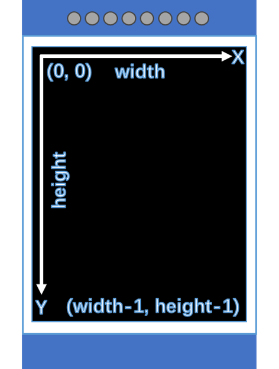
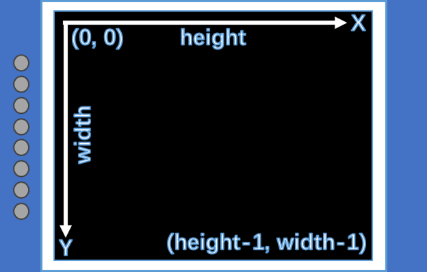

# LCD Development Guide_Rev1.0

{link_to_translation}`zh_CN:[中文]`

# LCD Development Guide

## 1 Revision History

| **Version** | **Date** | **Author** | **Reviewer** | **Changes** |
| --- | --- | --- | --- | --- |
| 1.0 | 2023-12-7 | Chenhz | zlc | Initial document |
| 1.1 | 2024-03-25 | sxx |  | Renamed document |
| 1.2 | 2024-03-28 | Chenhz |  | Added SPI interface parameter description, added refresh API description, updated API descriptions, updated pre-built LCD list |
| 1.3 | 2024-11-15 | zw |  | Updated document format, removed demo |
| 1.4 | 2026-04-29 | zxq |  | Updated based on latest code from separated base package |

## 2 Introduction

This document describes the LCD interface APIs for the LTE-EC71X. The API declarations are located in `LSDK/components/kernel/lierda_api/liot_lcd/liot_lcd.h`.

The LTE-EC71X series modules support LCD display output.

### 2.1 LCD Interface Overview

The LTE-EC71X series modules support driving an LCD through multiple interfaces (currently LSPI and SPI are available). The LSPI interface is specifically optimized for LCD driving, supporting up to 51 MHz, and supports 3-line-SPI and 2-data-lane modes to meet various LCD development requirements.

The LSPI interface is multiplexed with USP1 and USP2. For details, refer to:

Please check the DingTalk document attachment: *Lierda NT26-FCN OpenCPU Pin Multiplexing Table.xlsx*.

When USP1 is configured as Camera and USP2 as LSPI, accelerated camera preview on the LCD screen is supported.

### 2.2 LCD Display Coordinate Definition

The LCD supports rotated display. To facilitate development, the OpenCPU LCD API defines the LCD orientation coordinates as follows:

In the LCD default state, the horizontal pixel count is defined as **width** and the vertical pixel count as **height**. These values must be set in the LCD driver (see details below).

In the current display orientation, the horizontal direction is defined as the X-axis and the vertical direction as the Y-axis. The origin is at the top-left corner of the screen (may vary by screen).

Portrait mode:

<div align="center">



</div>

Landscape mode:

<div align="center">



</div>

## 3 API Function Overview

| **Function** | **Description** |
| --- | --- |
| liot\_lcd\_init() | LCD initialization |
| liot\_lcd\_clear\_screen() | Full-screen refresh |
| liot\_lcd\_draw\_point() | Draw a point |
| liot\_lcd\_draw\_line() | Draw a line |
| liot\_lcd\_draw\_rectangle() | Draw a rectangle |
| liot\_lcd\_draw\_circle() | Draw a circle |
| liot\_lcd\_write() | Display an image |
| liot\_lcd\_set\_brightness() | Set backlight brightness |
| liot\_lcd\_display\_on() | Turn on display |
| liot\_lcd\_display\_off() | Turn off display |
| liot\_lcd\_sleep\_in() | Enter sleep mode |
| liot\_lcd\_sleep\_out() | Exit sleep mode |

## 4 Type Definitions

### 4.1 liot\_lcd\_errcode\_e

Error codes returned by LCD API calls.

* Declaration

```c
typedef enum {
    LIOT_LCD_OK = 0,
    LIOT_LCD_ERROR,
    LIOT_LCD_NO_MEM,
    LIOT_LCD_INVALID_PARAM,
    LIOT_LCD_INVALID_HANDLE,
    LIOT_LCD_INVALID_INTERFACE,
    LIOT_LCD_LOCATION_OVERFLOW,
}liot_lcd_errcode_e;
```

* Values
* LIOT\_LCD\_OK: Success
* LIOT\_LCD\_ERROR: Unknown error
* LIOT\_LCD\_NO\_MEM: Insufficient memory
* LIOT\_LCD\_INVALID\_PARAM: Invalid parameter
* LIOT\_LCD\_INVALID\_HANDLE: Invalid handle
* LIOT\_LCD\_INVALID\_INTERFACE: Invalid interface
* LIOT\_LCD\_LOCATION\_OVERFLOW: Coordinate out of bounds

## 5 API Function Details

### 5.1 liot\_lcd\_init

Initializes the LCD screen.

1. Declaration

```c
liot_lcd_handle_t liot_lcd_init(liot_lcd_config_t *config);
```

2. Parameters

config: \[in\] LCD configuration parameters

3. Return Value

liot\_lcd\_handle\_t — LCD handle

#### 5.1.1 liot\_lcd\_config\_t

1. LCD configuration structure definition

```c
typedef liot_hal_lcd_config_t liot_lcd_config_t;

typedef struct{
    liot_hal_lcd_interface_t interface;
    liot_hal_lcdDev_t *lcdDev;
}liot_hal_lcd_config_t;
```

2. Parameters

| Type | Parameter | Description |
| --- | --- | --- |
| liot\_hal\_lcd\_interface\_t | interface | LCD interface configuration |
| liot\_hal\_lcdDev\_t | lcdDev | LCD driver; the LCD driver interface is set here |

#### 5.1.2 liot\_lcd\_interface\_t

1. LCD interface configuration structure definition

```c
typedef struct{
    liot_hal_lcd_interface_type_e type;
    union
    {
        liot_hal_lcd_interface_lspi_t lspi;
        liot_hal_lcd_interface_spi_t spi;
        liot_hal_lcd_interface_i2c_t i2c;
        liot_hal_lcd_interface_8080_t l8080;
        liot_hal_lcd_interface_8080_t l6800;
    };
    liot_hal_lcd_blk_t blk;
    int8_t rst_pin;
}liot_hal_lcd_interface_t;
```

2. Parameters

| Type | Parameter | Description |
| --- | --- | --- |
| liot\_hal\_lcd\_interface\_type\_e | interface | LCD interface type |
| liot\_hal\_lcd\_interface\_lspi\_t | lspi | LSPI configuration |
| liot\_hal\_lcd\_interface\_spi\_t | spi | SPI configuration (supported, not yet complete) |
| liot\_hal\_lcd\_interface\_i2c\_t | i2c | I2C configuration (not yet supported) |
| liot\_hal\_lcd\_interface\_8080\_t | l8080 | 8080 configuration (not yet supported) |
| liot\_hal\_lcd\_interface\_6800\_t | l6800 | 6800 configuration (not yet supported) |
| liot\_hal\_lcd\_blk\_t | blk | Backlight BLK configuration |
| int8\_t | rst\_pin | LCD reset pin |

#### 5.1.3 liot\_lcd\_interface\_lspi\_t

1. LSPI interface configuration structure definition

```c
typedef struct{
    liot_lspi_port_e num;
    bool lcd_3_line_spi;
    bool lcd_2_data_lane;
    liot_hal_lspi_busspeed_e speed;
    bool sync;
    liot_lspi_cs_e cs;
    liot_hal_lcd_event_cb cb;
}liot_hal_lcd_interface_lspi_t;
```

2. Parameters

| Type | Parameter | Description |
| --- | --- | --- |
| liot\_lspi\_port\_e | num | LSPI port number |
| bool | lcd\_3\_line\_spi | Enable 3-line SPI mode; affects whether the DCX pin is used |
| bool | lcd\_2\_data\_lane | Enable 2-data-lane mode; requires DCX pin to be enabled |
| liot\_hal\_lspi\_busspeed\_e | speed | LSPI bus speed |
| bool | sync | Enable synchronous mode (true) or asynchronous mode (false) |
| liot\_lspi\_cs\_e | cs | LSPI CS pin; specific pin support for EC718M |
| liot\_hal\_lcd\_event\_cb | cb | LSPI event callback; triggered once per LSPI transfer completion |

#### 5.1.4 liot\_lcd\_interface\_spi\_t

1. SPI interface configuration structure definition

```c
typedef struct{
    liot_spi_port_e num;
    liot_spi_cpol_pol_e cpol;
    liot_spi_cpha_pol_e cpha;
    int8_t lcd_dc;
    int8_t cs;
    liot_spi_clk_e speed;
    bool dma_en;
    liot_hal_lcd_event_cb cb;
}liot_hal_lcd_interface_spi_t;
```

2. Parameters

| Type | Parameter | Description |
| --- | --- | --- |
| liot\_spi\_port\_e | num | SPI port number |
| liot\_spi\_cpol\_pol\_e | cpol | SPI clock polarity |
| liot\_spi\_cpha\_pol\_e | cpha | SPI clock phase |
| int8\_t | lcd\_dc | LCD command/data pin |
| cs | cs | SPI chip select pin |
| liot\_spi\_clk\_e | speed | SPI bus speed |
| bool | dma\_en | Enable SPI DMA (not yet complete) |
| liot\_hal\_lcd\_event\_cb | cb | SPI event callback; triggered once per SPI+DMA transfer completion |

#### 5.1.5 liot\_lcd\_blk\_t

1. LCD backlight BLK configuration structure definition

```c
typedef struct{
    liot_hal_lcd_blk_type_e type;
    int8_t pin;
    liot_pwm_sel_e pwm_num;
}liot_hal_lcd_blk_t;
```

2. Parameters

| Type | Parameter | Description |
| --- | --- | --- |
| liot\_hal\_lcd\_blk\_type\_e | type | Backlight BLK type |
| int8\_t | pin | Backlight BLK pin |
| liot\_pwm\_sel\_e | pwm\_num | PWM channel to use when backlight type is set to PWM |

#### 5.1.6 liot\_lcdDev\_t

1. LCD driver configuration structure. For detailed usage, refer to the LCD Driver Addition Guide.

```c
typedef struct{
    liot_hal_lcdDev_func_t func;
    liot_hal_lcdDev_info_t info;
}liot_hal_lcdDev_t;
```

2. Parameters

| Type | Parameter | Description |
| --- | --- | --- |
| liot\_hal\_lcdDev\_func\_t | func | LCD driver functions |
| liot\_hal\_lcdDev\_info\_t | info | LCD driver configuration info |

### 5.2 liot\_lcd\_clear\_screen

Performs a full-screen refresh.

This API ultimately calls the **full** interface in **liot\_hal\_lcdDev\_func\_t**.

1. Declaration

```c
liot_lcd_errcode_e liot_lcd_clear_screen(liot_lcd_handle_t handle,
                      uint16_t color);
```

2. Parameters

handle: \[in\] LCD handle

color: \[in\] Fill color

3. Return Value

liot\_lcd\_errcode\_e: Error code, see section 4.1

### 5.3 liot\_lcd\_draw\_point

Draws a single point on the LCD.

1. Declaration

```c
liot_lcd_errcode_e liot_lcd_draw_point(liot_lcd_handle_t handle,
                      uint32_t x,
                      uint32_t y,
                      uint16_t color);
```

2. Parameters

handle: \[in\] LCD handle

x: \[in\] X-axis coordinate

y: \[in\] Y-axis coordinate

color: \[in\] Color

3. Return Value

liot\_lcd\_errcode\_e: Error code, see section 4.1

### 5.4 liot\_lcd\_draw\_line

Draws a line on the LCD.

1. Declaration

```c
liot_lcd_errcode_e liot_lcd_draw_line(liot_lcd_handle_t handle,
                      uint16_t sx,
                      uint16_t sy,
                      uint16_t ex,
                      uint16_t ey,
                      uint16_t color);
```

2. Parameters

handle: \[in\] LCD handle

sx: \[in\] Start X coordinate

sy: \[in\] Start Y coordinate

ex: \[in\] End X coordinate

ey: \[in\] End Y coordinate

color: \[in\] Color

3. Return Value

liot\_lcd\_errcode\_e: Error code, see section 4.1

### 5.5 liot\_lcd\_draw\_rectangle

Draws a rectangle on the LCD.

1. Declaration

```c
liot_lcd_errcode_e liot_lcd_draw_rectangle(liot_lcd_handle_t handle,
                      uint16_t sx,
                      uint16_t sy,
                      uint16_t ex,
                      uint16_t ey,
                      uint16_t color);
```

2. Parameters

handle: \[in\] LCD handle

sx: \[in\] Start X coordinate

sy: \[in\] Start Y coordinate

ex: \[in\] End X coordinate

ey: \[in\] End Y coordinate

color: \[in\] Color

3. Return Value

liot\_lcd\_errcode\_e: Error code, see section 4.1

### 5.6 liot\_lcd\_draw\_circle

Draws a circle on the LCD.

1. Declaration

```c
liot_lcd_errcode_e liot_lcd_draw_circle(liot_lcd_handle_t handle,
                      uint16_t sx,
                      uint16_t sy,
                      uint16_t r,
                      uint16_t color);
```

2. Parameters

handle: \[in\] LCD handle

sx: \[in\] Circle center X coordinate

sy: \[in\] Circle center Y coordinate

r: \[in\] Radius

color: \[in\] Color

3. Return Value

liot\_lcd\_errcode\_e: Error code, see section 4.1

### 5.7 liot\_lcd\_write

Displays an image on the LCD.

This API ultimately calls the **fill** interface in **liot\_hal\_lcdDev\_func\_t**.

1. Declaration

```c
liot_lcd_errcode_e liot_lcd_write(liot_lcd_handle_t handle,
                      uint16_t sx,
                      uint16_t sy,
                      uint16_t ex,
                      uint16_t ey,
                      uint8_t *buf);
```

2. Parameters

handle: \[in\] LCD handle

sx: \[in\] Start X coordinate

sy: \[in\] Start Y coordinate

ex: \[in\] End X coordinate

ey: \[in\] End Y coordinate

buf: \[in\] Pointer to image data buffer

3. Return Value

liot\_lcd\_errcode\_e: Error code, see section 4.1

### 5.8 liot\_lcd\_set\_brightness

Sets the LCD backlight brightness.

- When backlight type is **LIOT\_LCD\_BACKLIGHT\_PWM**: brightness level can be set from 0 to 100.
- When backlight type is **LIOT\_LCD\_BACKLIGHT\_GPIO**: brightness can only be 0 (off) or 1 (on); any value greater than 1 is treated as 1.
- When backlight type is **LIOT\_LCD\_NO\_BACKLIGHT**: this setting has no effect.

1. Declaration

```c
liot_lcd_errcode_e liot_lcd_set_brightness(liot_lcd_handle_t handle,
                      uint8_t level);
```

2. Parameters

handle: \[in\] LCD handle

level: \[in\] Brightness level, 0–100

3. Return Value

liot\_lcd\_errcode\_e: Error code, see section 4.1

### 5.9 liot\_lcd\_display\_on

Turns on the LCD display.

This API ultimately calls the **display\_on** interface in **liot\_hal\_lcdDev\_func\_t**.

1. Declaration

```c
liot_lcd_errcode_e liot_lcd_display_on(liot_lcd_handle_t handle);
```

2. Parameters

handle: \[in\] LCD handle

3. Return Value

liot\_lcd\_errcode\_e: Error code, see section 4.1

### 5.10 liot\_lcd\_display\_off

Turns off the LCD display.

This API ultimately calls the **display\_on** interface in **liot\_hal\_lcdDev\_func\_t**.

1. Declaration

```c
liot_lcd_errcode_e liot_lcd_display_off(liot_lcd_handle_t handle);
```

2. Parameters

handle: \[in\] LCD handle

3. Return Value

liot\_lcd\_errcode\_e: Error code, see section 4.1

### 5.11 liot\_lcd\_sleep\_in

Puts the LCD into sleep mode.

This API ultimately calls the **sleep\_in** interface in **liot\_hal\_lcdDev\_func\_t**.

1. Declaration

```c
liot_lcd_errcode_e liot_lcd_sleep_in(liot_lcd_handle_t handle);
```

2. Parameters

handle: \[in\] LCD handle

3. Return Value

liot\_lcd\_errcode\_e: Error code, see section 4.1

### 5.12 liot\_lcd\_sleep\_out

Wakes the LCD from sleep mode.

This API ultimately calls the **sleep\_in** interface in **liot\_hal\_lcdDev\_func\_t**.

1. Declaration

```c
liot_lcd_errcode_e liot_lcd_sleep_out(liot_lcd_handle_t handle);
```

2. Parameters

handle: \[in\] LCD handle

3. Return Value

liot\_lcd\_errcode\_e: Error code, see section 4.1

### 5.13 liot\_lcd\_refresh

Refreshes the LCD display. This is an optional API, applicable to screens that require manual refresh, such as an SSD1306 with a frame buffer.

This API ultimately calls the **refresh** interface in **liot\_hal\_lcdDev\_func\_t**.

1. Declaration

```c
liot_lcd_errcode_e liot_lcd_refresh(liot_lcd_handle_t handle);
```

2. Parameters

handle: \[in\] LCD handle

3. Return Value

liot\_lcd\_errcode\_e: Error code, see section 4.1

## 6 LCD Driver Addition Guide

To better support LCD development, the LTE-EC71X series OpenCPU SDK includes pre-built drivers for several common LCD panels. To support custom LCD screens, the SDK also allows adding custom LCD drivers.

### 6.1 Pre-built LCD Drivers

The pre-built LCD drivers are located at `LSDK/components/driver/lcd/src/`. The currently pre-built drivers are listed below. All values are development/test data — refer to actual hardware for production use:

| LCD Driver IC | Interface Support | Color Format | Resolution |
| --- | --- | --- | --- |
| ST7789 | LSPI/SPI | RGB565 | 320\*240 |
| GC9A01 | LSPI/SPI | RGB565 | 240\*240 |
| ST7735 | LSPI/SPI | RGB565 | 160\*128 |
| SSD1306 | SPI | Monochrome | 128\*64 |
| GC9D01 | LSPI/SPI | RGB565 | 160\*160 |
| ST7567 | LSPI/SPI | Monochrome | 128\*64 |

### 6.2 Adding a Custom LCD Driver

#### 6.2.1 Create the LCD Driver Source File

Create a new LCD driver source file. It can be placed in the pre-built driver path or in the user project folder. Either way, it must be declared in the corresponding folder's Makefile so the source file is compiled correctly.

Using the pre-built driver path `LSDK/components/driver/lcd/src/` as an example: after placing `Custom_lcd.c` in that directory, add the corresponding object file `Custom_lcd.o` to the Makefile at `LSDK/components/driver/lcd/Makefile`:

```makefile
C++LCDDRV_DIR := $(DRIVER_DIR)/lcd
LCDDRV_SRC := $(LCDDRV_DIR)/src

CFLAGS_INC    += -I $(TOP)/$(LCDDRV_DIR)/inc

LCDDRV_COBJS += $(LCDDRV_SRC)/liot_lcdDev_GC9A01.o
LCDDRV_COBJS += $(LCDDRV_SRC)/liot_lcdDev_GC9D01.o
LCDDRV_COBJS += $(LCDDRV_SRC)/liot_lcdDev_SSD1306.o
LCDDRV_COBJS += $(LCDDRV_SRC)/liot_lcdDev_ST7567.o
LCDDRV_COBJS += $(LCDDRV_SRC)/liot_lcdDev_ST7735.o
LCDDRV_COBJS += $(LCDDRV_SRC)/liot_lcdDev_ST7789.o
LCDDRV_COBJS += $(LCDDRV_SRC)/Custom_lcd.o
LCDDRV_COBJS := $(addprefix $(BUILDDIR)/, $(LCDDRV_COBJS))

ifeq ($(TOOLCHAIN),GCC)
libusr-y += lib_lcddrv.a

$(BUILDDIR)/lib/libusr/lib_lcddrv.a: $(LCDDRV_COBJS)
    @mkdir -p $(dir $@)
    $(ECHO) AR $@
    $(Q)$(AR) -cr $@ $^
endif
```

#### 6.2.2 Define the LCD Driver Structure

LCD driver configuration is managed through the `liot_hal_lcdDev_t` structure, which holds all interfaces and parameters.

##### 6.2.2.1 liot\_hal\_lcdDev\_t

1. LCD driver configuration structure

This structure has two parts: LCD driver functions and LCD driver info. The driver functions define the functions used to control the LCD; the driver info records the resolution, display orientation, and other properties.

```c
typedef struct{
    liot_hal_lcdDev_func_t func;
    liot_hal_lcdDev_info_t info;
}liot_hal_lcdDev_t;
```

2. Parameters

| Type | Parameter | Description |
| --- | --- | --- |
| liot\_hal\_lcdDev\_func\_t | func | LCD driver functions |
| liot\_hal\_lcdDev\_info\_t | info | LCD driver configuration info |

##### 6.2.2.2 liot\_hal\_lcdDev\_info\_t

1. LCD driver info structure

The resolution, orientation, and color format displayed at runtime are all controlled by the values in this structure.

```c
typedef struct{
    uint16_t id;
    uint32_t interface;
    uint32_t width;
    uint32_t height;
    liot_hal_lcdDev_dir_e direction;
    liot_hal_lcdDev_color_depth_e color_depth;
}liot_hal_lcdDev_info_t;
```

2. Parameters

| Type | Parameter | Description |
| --- | --- | --- |
| uint16\_t | id | LCD driver ID |
| uint32\_t | interface | Supported interfaces, recorded via bitwise OR |
| uint32\_t | width | Horizontal pixel count in the default (unrotated) state |
| uint32\_t | height | Vertical pixel count in the default (unrotated) state |
| liot\_hal\_lcdDev\_dir\_e | direction | Counter-clockwise rotation direction for the display |
| liot\_hal\_lcdDev\_color\_depth\_e | color\_depth | LCD color depth |

##### 6.2.2.3 liot\_hal\_lcdDev\_func\_t

1. LCD driver function structure

To ensure a custom LCD works correctly, the user must define the required functions in this structure. Because different I2C LCD screens transmit commands and data differently, custom interfaces are provided for user-defined implementations.

```c
typedef struct{
int (*init)(liot_hal_lcd_handle_t handle);

int (*addrSet)(liot_hal_lcd_handle_t handle, uint16_t sx, uint16_t sy,
        uint16_t ex, uint16_t ey);

int (*fill)(liot_hal_lcd_handle_t handle, uint16_t sx, uint16_t sy,
        uint16_t ex, uint16_t ey, void* buf);

int (*full)(liot_hal_lcd_handle_t handle, uint16_t sx, uint16_t sy,
        uint16_t ex, uint16_t ey, uint16_t color);

int (*strWrite)(liot_hal_lcd_handle_t handle, uint16_t sx, uint16_t sy,
        uint16_t ex, uint16_t ey, char* str);

int (*display_on)(liot_hal_lcd_handle_t handle, bool on);

int (*sleep_in)(liot_hal_lcd_handle_t handle, bool in);

int (*refresh)(liot_hal_lcd_handle_t handle);

// The following are user-defined interfaces for I2C LCD screens.
// If non-NULL, they replace the default internal implementations.
int (*custom_i2c_cmd_send)(liot_hal_lcd_handle_t handle, uint8_t *cmd,
        uint32_t len);

int (*custom_i2c_data_send)(liot_hal_lcd_handle_t handle,
        uint8_t *data, uint32_t len);

}liot_hal_lcdDev_func_t;
```

2. Parameters

| Type | Required | Description |
| --- | --- | --- |
| int (\*init) | Required | LCD driver initialization; configures LCD registers |
| int (\*addrSet) | Required | Set display address window |
| int (\*fill) | Required | Display an image in a specified region |
| int (\*full) | Required | Fill a specified region with a single color |
| int (\*strWrite) | Optional | Display text in a specified region; for LCDs with built-in font ROM |
| int (\*display\_on) | Optional | Turn display on/off |
| int (\*sleep\_in) | Optional | Enter/exit sleep mode |
| int (\*refresh) | Optional | Refresh display; for screens with a frame buffer, e.g. SSD1306 |
| int (\*custom\_i2c\_cmd\_send) | Optional | User-defined I2C command send interface |
| int (\*custom\_i2c\_data\_send) | Optional | User-defined I2C data send interface |

##### 6.2.2.4 Filling in the LCD Driver Structure

Using the pre-built ST7789 driver as an example, fill in the driver info and functions according to the actual LCD screen being used:

```c
liot_hal_lcdDev_t liot_st7789_dev = {
    .func = {
        .init = liot_st7789_init,
        .addrSet = liot_st7789_addrset,
        .fill = liot_st7789_fill,
        .full = liot_st7789_full,
        .strWrite = NULL,
        .display_on = liot_st7789_display_on,
        .sleep_in = liot_st7789_sleep_in,
        .refresh = NULL,
    },
    .info = {
          .id = 0x7789,
          .interface = LIOT_LCD_INTERFACE_LSPI |
                        LIOT_LCD_INTERFACE_SPI |
                        LIOT_LCD_INTERFACE_8080,
          .width = 240,
          .height = 320,
          .direction = LIOT_LCD_DIR_90_ANGLE,
          .color_depth = LIOT_LCD_COLOR_RGB565,
    },
};
```

#### 6.2.3 Writing the LCD Driver Functions

Define the functions required by the LCD driver inside `liot_hal_lcdDev_func_t`. These functions are called when the user invokes `liot_lcd_init`, `liot_lcd_write`, and other APIs.

Using the pre-built ST7789 driver as an example, the `init` function is shown below. `liot_hal_lcd_write_cmd` and `liot_hal_lcd_transmit_cmd` are HAL LCD APIs defined in `LSDK/components/driver/lcd/inc/liot_lcdDev.h`.

```c
static int liot_st7789_init(liot_hal_lcd_handle_t handle)
{
    liot_hal_lcd_write_cmd(handle, 0x11, 0x00);

    switch(liot_st7789_dev.info.direction)
    {
        case LIOT_LCD_DIR_0_ANGLE:
          liot_hal_lcd_write_cmd(handle, 0x36, 0x00); break;
        case LIOT_LCD_DIR_90_ANGLE:
          liot_hal_lcd_write_cmd(handle, 0x36, 0x70); break;
        case LIOT_LCD_DIR_180_ANGLE:
          liot_hal_lcd_write_cmd(handle, 0x36, 0xA0); break;
        case LIOT_LCD_DIR_270_ANGLE:
          liot_hal_lcd_write_cmd(handle, 0x36, 0xC0); break;
        default: liot_hal_lcd_write_cmd(handle, 0x36, 0x00); break;
    }

    if(((liot_hal_lcd_config_t*)handle)->interface.type == LIOT_LCD_INTERFACE_LSPI &&
        ((liot_hal_lcd_config_t*)handle)->interface.lspi.lcd_2_data_lane == true)
    {
        liot_hal_lcd_write_cmd(handle, 0xE7, 0x10);
    }

    liot_hal_lcd_write_cmd(handle, 0x21, 0x00);
    liot_hal_lcd_write_cmd(handle, 0x3A, 0x05);

    uint8_t set_rate_cmd[] = {0x0c,0x0c,0x00,0x33,0x33};
    liot_hal_lcd_transmit_cmd(handle, 0xB2, set_rate_cmd, sizeof(set_rate_cmd));

    liot_hal_lcd_write_cmd(handle, 0xB7, 0x35);
    liot_hal_lcd_write_cmd(handle, 0xBB, 0x20);
    liot_hal_lcd_write_cmd(handle, 0xC0, 0x2C);
    liot_hal_lcd_write_cmd(handle, 0xC2, 0x01);
    liot_hal_lcd_write_cmd(handle, 0xC3, 0x0B);
    liot_hal_lcd_write_cmd(handle, 0xC4, 0x20);
    liot_hal_lcd_write_cmd(handle, 0xC6, 0x0F);

    uint8_t reg_PWCTRL1[] = {0xa4,0xa1};
    liot_hal_lcd_transmit_cmd(handle, 0xD0, reg_PWCTRL1, sizeof(reg_PWCTRL1));

    uint8_t reg_PVGAMCTRL[] = {0xd0,0x03,0x09,0x0e,0x11,0x3d,0x47,0x55,
                                0x53,0x1a,0x16,0x14,0x1f,0x22};  // Positive voltage gamma
    liot_hal_lcd_transmit_cmd(handle, 0xE0, reg_PVGAMCTRL, sizeof(reg_PVGAMCTRL));

    uint8_t reg_NVGAMCTRL[] = {0xd0,0x02,0x08,0x0d,0x12,0x2c,0x43,0x55,
                                0x53,0x1e,0x1b,0x19,0x20,0x22};  // Negative voltage gamma
    liot_hal_lcd_transmit_cmd(handle, 0xE1, reg_NVGAMCTRL, sizeof(reg_NVGAMCTRL));

    liot_hal_lcd_write_cmd(handle, 0x29, 0x00);

    return 0;
}
```

#### 6.2.4 Declare and Reference the LCD Driver Structure

After the driver structure is created and filled in, declare it in the user project:

```c
LIOT_ADD_DISPLAY(liot_st7789_dev);
```

When calling `liot_lcd_init`, set the `lcdDev` member of `liot_lcd_config_t` to the declared driver structure:

```c
liot_lcd_config_t cfg = {
    .interface = {
        .type = LIOT_LCD_INTERFACE_LSPI,
        .lspi.num = LIOT_LSPI_PORT2,
        .lspi.lcd_3_line_spi = false,
        .lspi.lcd_2_data_lane = false,
        .lspi.speed = LIOT_LSPI_51MHZ,
        .lspi.cb = lcd_event_callback,
        .blk.type = LIOT_LCD_BACKLIGHT_PWM,
        .blk.pin = 102,
        .blk.pwm_num = LIOT_PWM_3,
        .rst_pin = 49,
    },
    .lcdDev = liot_st7789_dev,
};

liot_lcd_handle_t lcd = liot_lcd_init(&cfg);
```

The custom LCD driver is now complete and ready to use with the LCD APIs.

## 7 Demo

### 7.1 Demo Source Code

```c
/**
 * @File Name: liot_lcd_demo.c
 * @brief   LCD display demo, demonstrates the complete usage flow of the liot_lcd framework
 * @Author : Chenhz
 * @Email : ciot_iot_support@lierda.com
 * @Version : 1.0
 * @Creat Date : 2023-11-29
 *
 * @copyright Copyright (c) 2023 Lierda Science & Technology Group Co., Ltd.
 *
 * Usage flow:
 *   1. Declare the LCD driver with the LIOT_ADD_DISPLAY macro
 *   2. Construct liot_lcd_config_t (interface type / pins / backlight / reset, etc.)
 *   3. Initialize the LCD with liot_lcd_init
 *   4. Call drawing APIs (clear_screen / draw_line / draw_circle / write, etc.)
 *   5. Call liot_lcd_refresh to push the frame buffer to the screen
 */
#include <stdio.h>
#include <string.h>
#include "cmsis_os2.h"
#include "stdlib.h"
#include "lierda_app_main.h"
#include "liot_os.h"
#include "liot_gpio.h"
#include "slpman.h"
#include "fastmath.h"

#include "liot_lcd.h"

/* Lierda Logo image data, format: RGB565, size: 100x60 pixels
 * Generated by an image-to-array tool; each 2 bytes represent 1 pixel (R5-G6-B5)
 * Total size = 100 * 60 * 2 = 12000 bytes
 */
// 100*60
// const uint8_t Lierda_logo[12000] = { ... };  // Add image data here

/* ================= LCD Driver Declaration =================
 * LIOT_ADD_DISPLAY macro: registers an LCD driver instance with the framework,
 * which automatically links the corresponding driver code.
 * Multiple drivers can be declared simultaneously; select which one to use
 * at runtime via the lcdDev pointer.
 * Each driver corresponds to one LCD controller IC, e.g.:
 *   liot_st7789_dev  - ST7789  (common 1.3" / 1.54" color screen)
 *   liot_gc9a01_dev  - GC9A01  (common 1.28" round screen)
 *   liot_st7735_dev  - ST7735  (common 0.96" / 1.8" color screen)
 *   liot_ssd1306_12864_dev - SSD1306 (0.96" monochrome OLED, 128x64)
 *   liot_gc9d01_dev  - GC9D01  (small color screen)
 *   liot_st7567_dev  - ST7567  (monochrome LCD)
 *   liot_gc9307_dev  - GC9307  (common 2.4" color screen)
 */
LIOT_ADD_DISPLAY(liot_st7789_dev);
LIOT_ADD_DISPLAY(liot_gc9a01_dev);
LIOT_ADD_DISPLAY(liot_st7735_dev);
LIOT_ADD_DISPLAY(liot_ssd1306_12864_dev);
LIOT_ADD_DISPLAY(liot_gc9d01_dev);
LIOT_ADD_DISPLAY(liot_st7567_dev);
LIOT_ADD_DISPLAY(liot_gc9307_dev);

/* ================= Interface and Hardware Configuration =================
 * LIOT_LCD_DEMO_TEST_LSPI: use LSPI interface (EC718-specific LCD interface, supports DMA2D acceleration)
 * LIOT_LCD_DEMO_TEST_SPI:  use standard SPI interface (more portable, but slower)
 * Only one can be selected at a time; switch with 1/0.
 * Note: EC716 series does not support LSPI — must use SPI.
 */
#define LIOT_LCD_DEMO_TEST_LSPI     1   // Use LSPI interface; EC716 series does not support LSPI
#define LIOT_LCD_DEMO_TEST_SPI      0   // Use SPI interface

/* LCD count: 1 = single screen, 2 = dual screen (dual screen currently supports LSPI only)
 * For dual screen, prepare a second cfg1 configuration and enable the
 * #if LIOT_LCD_DEMO_NUM >= 2 branches in the code.
 */
#define LIOT_LCD_DEMO_NUM           1   // Number of LCDs to drive; 1 or 2 (dual screen supports LSPI only)

/* LSPI transfer-complete callback (triggered when DMA async transfer finishes)
 * Currently empty; add post-transfer processing here if needed.
 * Note: this function executes in interrupt context — do not perform time-consuming operations.
 */
static void lcd_event_callback(void)
{

}

void liot_lcd_demo_thread(void *argv)
{
    uint16_t i = 0, j = 0, k = 0;
    uint32_t lcdticks = 0;
    uint32_t width = 0, height = 0;

    /* ====== Step 1: Select LCD driver ======
     * Point to one of the driver instances declared with LIOT_ADD_DISPLAY above.
     * Different ICs have different init sequences, resolutions, and orientations —
     * the driver handles these internally.
     * To switch screens, change only this line.
     */
    liot_hal_lcdDev_t *lcdDev = &liot_gc9307_dev;

    /* ====== Step 2: Build LCD configuration ======
     * interface: communication interface configuration
     *   .type  - interface type: LIOT_LCD_INTERFACE_LSPI (high speed) or LIOT_LCD_INTERFACE_SPI (general)
     *   .lspi.num - LSPI port: EC718 supports LSPI_PORT0/PORT1/PORT2; must match hardware pins
     *   .lspi.lcd_3_line_spi - 3-wire SPI mode (no DC pin, uses 9-bit commands); false = 4-wire (with DC pin)
     *   .lspi.lcd_2_data_lane - dual data lane (requires hardware support); false = single lane
     *   .lspi.speed - LSPI clock frequency: LIOT_LSPI_25MHZ etc.; higher = faster refresh, but LCD IC must support it
     *   .lspi.sync - true = synchronous (blocks until complete); false = async (DMA, use with callback)
     *   .lspi.cb - async transfer-complete callback; valid when sync = false
     *   .lspi.cs - chip select: LIOT_LSPI_CS0/CS1; use CS1 for the second screen in dual-screen mode
     * blk: backlight configuration
     *   .type - LIOT_LCD_BACKLIGHT_PWM (PWM dimming) or LIOT_LCD_BACKLIGHT_GPIO (on/off)
     *   .pin  - backlight control pin number
     *   .pwm_num - PWM channel number (valid when type = PWM)
     * rst: reset configuration
     *   .pin   - RST pin number
     *   .delay - delay after reset (ms), to wait for the LCD IC to stabilize
     */
    liot_lcd_config_t cfg = {
        .interface = {
            .type = LIOT_LCD_INTERFACE_LSPI,
            .lspi.num = LIOT_LSPI_PORT2,
            .lspi.lcd_3_line_spi = false,
            .lspi.lcd_2_data_lane = false,
            .lspi.speed = LIOT_LSPI_25MHZ,
            .lspi.sync = true,
            .lspi.cb = lcd_event_callback,
            .lspi.cs = LIOT_LSPI_CS0,
            .blk.type = LIOT_LCD_BACKLIGHT_PWM,
            .blk.pin = 100,
            .blk.pwm_num = LIOT_PWM_0,
            .rst.pin = 49,
            .rst.delay = 100,
        },
        .lcdDev = lcdDev,
    };

    /* ====== Step 3: Power-on delay + power configuration ======
     * osDelay(5000): wait for system to stabilize and all peripherals to initialize
     * liot_aon_power_on(): enable AON (Always-On) domain power; some modules power the LCD from AON
     * liot_gpio_set_voltage: set GPIO voltage to 3.3 V; must match LCD IO level
     * slpManSetPmuSleepMode: disable deep sleep to prevent the MCU from sleeping during LCD refresh
     */
    osDelay(5000);

    liot_aon_power_on();
    liot_gpio_set_voltage(LIOT_VOL_3_30V);
    slpManSetPmuSleepMode(true, SLP_ACTIVE_STATE, false);

    /* ====== Step 4: Initialize LCD ======
     * liot_lcd_init: initializes the interface, reset, backlight, and sends IC init commands based on cfg
     * Returns an lcd handle; all subsequent drawing APIs operate through this handle.
     */
    liot_lcd_handle_t lcd = liot_lcd_init(&cfg);
#if LIOT_LCD_DEMO_NUM >= 2
    liot_lcd_handle_t lcd1 = liot_lcd_init(&cfg1);
#endif

    /* ====== Step 5: Get effective screen resolution ======
     * Adjust width/height based on screen rotation (0°/90°/180°/270°).
     * 0°/180°: use original width/height; 90°/270°: swap width and height.
     * All subsequent drawing coordinates are calculated from this width/height.
     */
    if(lcdDev->info.direction == LIOT_LCD_DIR_0_ANGLE || lcdDev->info.direction == LIOT_LCD_DIR_180_ANGLE)
    {
        width = lcdDev->info.width;
        height = lcdDev->info.height;
    }
    else
    {
        width = lcdDev->info.height;
        height = lcdDev->info.width;
    }

    /* ====== Step 6: Backlight brightness fade test ======
     * liot_lcd_set_brightness: set backlight brightness (0–100); only effective when backlight type is PWM
     * Steps: 100 → 80 → 60 → 40 → 20, 1 second per step, observe brightness fade
     */
    liot_lcd_set_brightness(lcd, 100);
    liot_rtos_task_sleep_ms(1000);
    liot_lcd_set_brightness(lcd, 80);
    liot_rtos_task_sleep_ms(1000);
    liot_lcd_set_brightness(lcd, 60);
    liot_rtos_task_sleep_ms(1000);
    liot_lcd_set_brightness(lcd, 40);
    liot_rtos_task_sleep_ms(1000);
    liot_lcd_set_brightness(lcd, 20);
    liot_rtos_task_sleep_ms(1000);
#if LIOT_LCD_DEMO_NUM >= 2
    liot_lcd_set_brightness(lcd1, 100);
    liot_rtos_task_sleep_ms(1000);
    liot_lcd_set_brightness(lcd1, 80);
    liot_rtos_task_sleep_ms(1000);
    liot_lcd_set_brightness(lcd1, 60);
    liot_rtos_task_sleep_ms(1000);
    liot_lcd_set_brightness(lcd1, 40);
    liot_rtos_task_sleep_ms(1000);
    liot_lcd_set_brightness(lcd1, 20);
    liot_rtos_task_sleep_ms(1000);
#endif

    /* ====== Step 7: Full-screen color fill test ======
     * liot_lcd_clear_screen: fills the frame buffer with the specified color (does not push to screen immediately)
     * liot_lcd_refresh: sends the frame buffer to the LCD GRAM via LSPI/SPI; screen updates after this call
     * Sequence: Red → Green → Blue → White; verifies all three RGB channels
     * Color macros defined in liot_lcd.h: RED=0xF800, GREEN=0x07E0, BLUE=0x001F, WHITE=0xFFFF
     */
    liot_lcd_clear_screen(lcd, RED);
    liot_lcd_refresh(lcd);
    liot_rtos_task_sleep_ms(1000);
    liot_lcd_clear_screen(lcd, GREEN);
    liot_lcd_refresh(lcd);
    liot_rtos_task_sleep_ms(1000);
    liot_lcd_clear_screen(lcd, BLUE);
    liot_lcd_refresh(lcd);
    liot_rtos_task_sleep_ms(1000);
    liot_lcd_clear_screen(lcd, WHITE);
    liot_lcd_refresh(lcd);
    liot_rtos_task_sleep_ms(1000);

#if LIOT_LCD_DEMO_NUM >= 2
    liot_lcd_clear_screen(lcd1, GREEN);
    liot_lcd_refresh(lcd1);
    liot_rtos_task_sleep_ms(1000);
    liot_lcd_clear_screen(lcd1, BLUE);
    liot_lcd_refresh(lcd1);
    liot_rtos_task_sleep_ms(1000);
    liot_lcd_clear_screen(lcd1, RED);
    liot_lcd_refresh(lcd1);
    liot_rtos_task_sleep_ms(1000);
    liot_lcd_clear_screen(lcd1, WHITE);
    liot_lcd_refresh(lcd1);
    liot_rtos_task_sleep_ms(1000);
#endif

    /* ====== Step 8: Line drawing test ======
     * liot_lcd_draw_line: draws a line in the frame buffer (start to end, with specified color)
     * Draws two lines: horizontal center line + vertical center line, dividing the screen into four quadrants
     */
    liot_lcd_draw_line(lcd, 0, height / 2, width, height / 2, BLUE);
    liot_lcd_draw_line(lcd, width / 2, 0, width / 2, height, BLUE);
    liot_lcd_refresh(lcd);

#if LIOT_LCD_DEMO_NUM >= 2
    liot_lcd_draw_line(lcd1, 0, height / 2, width, height / 2, BLUE);
    liot_lcd_draw_line(lcd1, width / 2, 0, width / 2, height, BLUE);
    liot_lcd_refresh(lcd1);
#endif

    /* ====== Step 9: Display image ======
     * liot_lcd_write: writes RGB565 image data into the frame buffer at the specified region
     * Parameters: (handle, start_x, start_y, end_x, end_y, image_data_pointer)
     * Coordinate range: 0 to (width/height - 1); for a 100x60 image, x: 0–99, y: 0–59
     * SSD1306 is a monochrome screen — RGB565 images are not applicable, so it is skipped
     */
    if(lcdDev != &liot_ssd1306_12864_dev)
        liot_lcd_write(lcd, 0, 0, 100-1, 60-1, (uint8_t *)Lierda_logo);
#if LIOT_LCD_DEMO_NUM >= 2
    if(lcdDev != &liot_ssd1306_12864_dev)
        liot_lcd_write(lcd1, 0, 0, 100-1, 60-1, (uint8_t *)Lierda_logo);
#endif

    /* ====== Step 10: Sine wave drawing ======
     * Calculates sine y values point by point and connects them with lines to form an animated sine wave
     * Formula: y = (height/2) * sin(1/(width/4) * π * i) + height/2
     * sin() argument is in radians; 3.14 approximates π; width/4 controls the number of wave cycles
     * 10 ms delay per point creates a left-to-right drawing animation
     * k stores the previous y value for line connection
     */
    for(i = 0; i < width; i++)
    {
        j = ( (float)((height) / 2) * (float)sin((float)( (float)1 / (float)(width / 4) ) * 3.14 * i)) + ((height) / 2);
        if(i != 0)  liot_lcd_draw_point(lcd, i, j, BLUE);
#if LIOT_LCD_DEMO_NUM >= 2
        if(i != 0)  liot_lcd_draw_point(lcd1, i, j, RED);
#endif
        liot_lcd_draw_line(lcd, i, k, i, j, BLUE);
#if LIOT_LCD_DEMO_NUM >= 2
        liot_lcd_draw_line(lcd1, i, k, i, j, RED);
#endif
        k = j;
        liot_lcd_refresh(lcd);
#if LIOT_LCD_DEMO_NUM >= 2
        liot_lcd_refresh(lcd1);
#endif
        osDelay(10);
    }

    /* ====== Step 11: Draw circles and rectangles ======
     * liot_lcd_draw_circle: draws a hollow circle (center_x, center_y, radius, color)
     * liot_lcd_draw_rectangle: draws a hollow rectangle (top_left_x, top_left_y, bottom_right_x, bottom_right_y, color)
     * Centered on the screen, draws two concentric circles (r=30 and r=60) and two rectangles (30x30 and 60x60)
     */
    liot_lcd_draw_circle(lcd, width / 2, height / 2, 30, GREEN);
    liot_lcd_draw_circle(lcd, width / 2, height / 2, 60, GREEN);
    liot_lcd_draw_rectangle(lcd, (width / 2) - 30, (height / 2) - 30, (width / 2) + 30, (height / 2) + 30, BLACK);
    liot_lcd_draw_rectangle(lcd, (width / 2) - 60, (height / 2) - 60, (width / 2) + 60, (height / 2) + 60, BLACK);
    liot_lcd_refresh(lcd);

#if LIOT_LCD_DEMO_NUM >= 2
    liot_lcd_draw_circle(lcd1, width / 2, height / 2, 30, BLUE);
    liot_lcd_draw_circle(lcd1, width / 2, height / 2, 60, BLUE);
    liot_lcd_draw_rectangle(lcd1, (width / 2) - 30, (height / 2) - 30, (width / 2) + 30, (height / 2) + 30, BLACK);
    liot_lcd_draw_rectangle(lcd1, (width / 2) - 60, (height / 2) - 60, (width / 2) + 60, (height / 2) + 60, BLACK);
    liot_lcd_refresh(lcd1);
#endif

    liot_rtos_task_sleep_ms(3000);

    /* ====== Step 12: Frame rate test ======
     * Cycles Red → Green → Blue full-screen fills and measures time per frame and FPS
     * liot_rtos_get_running_time: returns system uptime in ms
     * FPS = 1000 / frame_time_ms
     * Note: screen will flash during this test
     * Factors affecting frame rate: LSPI clock / dual data lane / screen resolution / sync vs async
     */
    while (1)
    {
        for(i = 0; i < 3; i++)
        {
            lcdticks = liot_rtos_get_running_time();
            if(i == 0)
            {
                liot_lcd_clear_screen(lcd, RED);
                liot_lcd_refresh(lcd);
#if LIOT_LCD_DEMO_NUM >= 2
                liot_lcd_clear_screen(lcd1, GREEN);
                liot_lcd_refresh(lcd1);
#endif
            }
            else if(i == 1)
            {
                liot_lcd_clear_screen(lcd, GREEN);
                liot_lcd_refresh(lcd);
#if LIOT_LCD_DEMO_NUM >= 2
                liot_lcd_clear_screen(lcd1, BLUE);
                liot_lcd_refresh(lcd1);
#endif
            }
            else if(i == 2)
            {
                liot_lcd_clear_screen(lcd, BLUE);
                liot_lcd_refresh(lcd);
#if LIOT_LCD_DEMO_NUM >= 2
                liot_lcd_clear_screen(lcd1, RED);
                liot_lcd_refresh(lcd1);
#endif
            }
            lcdticks = liot_rtos_get_running_time() - lcdticks;
            liot_trace("LCD loop %dms, %dFPS", lcdticks, lcdticks == 0 ? 0 : 1000/lcdticks);
        }
    }
}
```

### 7.2 Demo Behavior

After the demo runs normally, the following sequence is displayed:

#### 7.2.1 Brightness Test

* Backlight brightness decreases step by step from 100% to 20%
* 1 second per step: 100% → 80% → 60% → 40% → 20%

#### 7.2.2 Crosshair Display

* Clear screen to white
* Draw a blue crosshair at the center of the screen
* Refresh display

#### 7.2.3 Logo and Geometric Shapes

* Display Lierda Logo (100×60) in the top-left corner
* Draw two concentric green circles at the center (radius 30 and 60)
* Draw two concentric black rectangles
* Refresh display and hold for 3 seconds

#### 7.2.4 Cycling Color Test

* Switch full-screen color every 1 second
* Sequence: Red → Green → Blue → White → repeat

