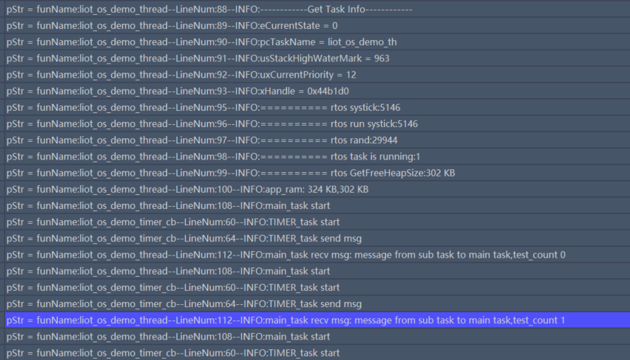

# RTOS Development Guide_Rev1.0

{link_to_translation}`zh_CN:[中文]`

## Document Revision History

| Version | Date | Author | Changes |
| ---- | ---- | ---- | ---- |
| Rev1.0 | 23-09-12 | CLY | Created document |
| Rev1.1 | 24-03-25 | sxx | Renamed document |
| Rev1.2 | 24-10-08 | ymx | Optimized document structure, added `liot_rtos_task_delete()` NULL parameter description, removed full demo code sample from final chapter |
| Rev1.3 | 24-12-12 | ymx | Removed all function links to solve DingTalk/Feishu link issues |
| Rev1.4 | 26-01-27 | ljz | Added interface `liot_rtos_calloc()` |
| Rev1.5 | 26-04-22 | mbb | Reformatted layout, added platform RTOS architecture description, RTOS core concepts, demo examples, and quick start guide |

## 1 Introduction

This document describes the LTE-EC71X RTOS API information. The API declarations are located in `components/kernel/lierda_api/liot_os/liot_os.h`.

### 1.1 RTOS Core Architecture

#### 1.1.1 Overall Architecture Overview

The RTOS software stack uses a layered design. From bottom to top it consists of the hardware adaptation layer, kernel layer, and abstraction/wrapper layer. Each layer has clear responsibilities, balancing the performance demands of low-level hardware with the development efficiency of upper-layer applications.

```plaintext
┌─────────────────────────────────────────────────────────┐
│                    Application Layer                    │
│  ┌─────────────┐  ┌─────────────┐  ┌─────────────────┐  │
│  │ Business Task 1 │  │ Business Task 2 │  │    Business Task N   │  │
│  └─────────────┘  └─────────────┘  └─────────────────┘  │
└─────────────────────────────────────────────────────────┘
                              │
                              ▼
┌─────────────────────────────────────────────────────────┐
│           Lierda Application Abstraction Layer          │
│                  (liot_os / OSAL)                       │
│  (Hides low-level differences and provides type-safe,   │
│   easy-to-use standardized APIs)                        │
└─────────────────────────────────────────────────────────┘
                              │
                              ▼
┌─────────────────────────────────────────────────────────┐
│         Platform Adaptation Layer (BSP modified         │
│                    FreeRTOS)                            │
│   (Based on Kernel V9.0.0a, deeply customized for EC    │
│    Cat.1 hardware)                                      │
└─────────────────────────────────────────────────────────┘
```

#### 1.1.2 Two-Layer Architecture Details

##### 1.1.2.1 Platform Adaptation Layer: Customized FreeRTOS Kernel

* Location: `components/thirdparty/freertos`
* Baseline version: FreeRTOS Kernel V9.0.0a
* Customization goal: deeply adapt to the hardware features and system resource constraints of the Yixin EC CAT1 series chips.

Major changes:

* Memory management subsystem enhancement:

  - Integrated memory debug hooks, supporting heap leak detection and boundary checks.
  - Implemented standard TLSF algorithm for efficient dynamic management of external RAM.
  - Customized optimization for EC718PM PSRAM characteristics, expanding usable memory and adding exception handling.

* Debug and observability support:

  - Integrated a unified debug log interface and provided a CMSIS-RTOS v2 compatibility layer for easier integration with ecosystem toolchains.

* Platform hardware abstraction definitions:

  - Defined platform-specific configuration macros and memory layout.
  - Reserved interfaces for future multi-core support.

##### 1.1.2.2 Application Abstraction Layer: Lierda Wrapper Interface

* Location: `components/kernel/lierda_api/liot_os`
* Design goal: provide terminal developers a standardized, type-safe, easy-to-integrate OS abstraction layer.

Core features:

* Simplified interface contract: reduced required parameters and defined a unified error code return mechanism.
* Strong type constraints: introduced opaque handle types such as `liot_task_t` to prevent direct manipulation of kernel data structures.
* Document standardization: follows Doxygen comment conventions and provides detailed Chinese explanations and examples.
* Platform independence: abstracts lower-level calls to improve cross-platform portability.

##### 1.1.2.3 Two-Layer Architecture vs. Native FreeRTOS

| Dimension | Native FreeRTOS Interface | Yixin Hardware Adaptation Layer (BSP) | Yixin Application Abstraction Layer (Lierda OSAL) |
| ---- | ---- | ---- | ---- |
| Abstraction level | Kernel-level | Board support package | Application framework layer |
| Usage complexity | High | Medium | Low |
| Configuration flexibility | Very high | Medium (limited by hardware features) | Lower (focused on application logic) |
| Usability and safety | Lower (requires deep kernel understanding) | Medium (requires understanding memory mapping) | Higher (strong typing and default parameter protection) |
| Typical use case | Kernel development, extreme tuning | Driver porting, board-level management | Business logic development, rapid prototyping |

### 1.2 RTOS Core Concepts

RTOS is the real-time operating system kernel for embedded systems. This module uses a FreeRTOS-wrapped implementation. Core concepts are as follows:

#### 1.2.1 Task Scheduling Mechanism

A task is the basic execution unit in RTOS. All user business code should run inside tasks. The core scheduling rules are:

* Preemptive priority scheduling: when a higher-priority task becomes ready, it immediately preempts the currently running lower-priority task.
* Time-sliced round-robin for same priority: tasks with the same priority are scheduled in a time-slice loop, with a 1 ms time slice. Interrupt-triggered scheduling: after an ISR completes, if it wakes a higher-priority task, context switch occurs immediately.
* API-triggered scheduling: calling `liot_rtos_task_yield()` (voluntary yield), `liot_rtos_task_sleep_ms()` / `liot_rtos_task_sleep_s()` (sleep), etc. triggers the scheduler to select the highest-priority ready task.
* Task priority limits: tasks involving audio operations should not exceed priority 23; tasks not involving audio should not exceed priority 25. Do not perform complex business logic in ISRs to avoid blocking the system.

#### 1.2.2 Blocking APIs vs Non-blocking APIs

| Type | Characteristics | Typical API | Use Case |
| ---- | ---- | ---- | ---- |
| Blocking | If conditions are not met, the task blocks until the condition is met or timeout occurs | `liot_rtos_semaphore_wait(..., timeout)`, `liot_rtos_mutex_lock(..., timeout)`, `liot_rtos_queue_wait(..., timeout)`, `liot_rtos_flag_wait(..., timeout)`, `liot_rtos_task_sleep_ms()` | Task synchronization, data reception, timed sleep |
| Non-blocking | If conditions are not met, the API returns immediately with an error code | `liot_rtos_semaphore_wait(..., LIOT_NO_WAIT)`, `liot_rtos_mutex_lock(..., LIOT_NO_WAIT)`, `liot_rtos_semaphore_get_cnt()`, `liot_rtos_flag_get()` | Polling status checks, quick resource availability checks |

#### 1.2.3 Inter-task Communication Mechanisms and Selection Principles

1. Semaphore

**Primary function:** synchronization and counting.

**Use cases:**

* Binary semaphore: used for task notification or triggers. For example, an ISR signals that data is ready for a processing task.
* Counting semaphore: used to manage multiple shared resources. For example, limit the number of tasks simultaneously accessing a hardware peripheral.

2. Mutex

**Primary function:** resource protection and mutual exclusion.

**Use cases:**

* Ensure only one task accesses a shared resource at the same time (e.g., global variables, UART printing, I2C bus).

**Features:**

* Compared to semaphores, mutexes support priority inheritance, effectively preventing priority inversion in RTOS.

3. Message queue

**Primary function:** data transfer.

**Use cases:**

* When a task needs to send concrete data (not just a signal) to another task. Queues support asynchronous communication: tasks can enqueue messages and continue without waiting for the receiver.

4. Event group (flag)

**Primary function:** multi-event logic synchronization and notification (many-to-one synchronization). Unlike semaphores, event groups can use bitwise AND/OR logic, allowing one task to wait on multiple event combinations.

**Use cases:**

* AND logic synchronization: task runs only when all conditions are met.
* OR logic synchronization: task runs when any trigger occurs.
* Event broadcast: one event can wake multiple tasks waiting on different bits within the event group.

#### 1.2.4 Synchronization Mechanism Selection Guidelines

Choose the appropriate synchronization mechanism based on business scenarios. The following decision table is for reference:

| Scenario | Recommended mechanism | Reason |
| ---- | ---- | ---- |
| ISR notifies task (single event) | Semaphore (`liot_rtos_semaphore_release` / `wait`) | Safe to release in ISR, task blocks and waits, lowest overhead |
| ISR passes data to task | Message queue (`liot_rtos_queue_release` / `wait`) | Supports passing concrete data and buffering multiple interrupt events |
| Multi-condition sync (any condition) | Event group OR (`liot_rtos_flag_wait(..., LIOT_FLAG_OR_CLEAR)`) | One task can listen to multiple event sources and wake on any trigger |
| Multi-condition sync (all conditions) | Event group AND (`liot_rtos_flag_wait(..., LIOT_FLAG_AND_CLEAR)`) | Task waits until all preconditions are ready |
| Shared resource protection | Mutex (`liot_rtos_mutex_lock/unlock`) | Supports priority inheritance and ensures one task accesses the resource exclusively |
| Multiple tasks share one notification | Event group broadcast (`liot_rtos_flag_release(..., LIOT_FLAG_OR)`) | One setting wakes multiple waiting tasks |
| Counting / rate limiting | Counting semaphore (`liot_rtos_semaphore_create_ex`) | Limits concurrent access to a resource, such as connection pool management |

#### 1.2.5 Heap Memory

Current heap memory allocation status is as follows:

| Base package model | F6B_A | F6D_A | F7B_A | K2B_A | K2F_A |
| ---- | ---- | ---- | ---- | ---- | ---- |
| Supported module model | NT26FCNB60WNA | NT26FCND60NNANT26FEUD60NNANT26F6D0 | NT26FCNB70WNA | NT26K2B1 | NT26KCNF20NNA |
| Chip type | EC718pm | EC718pm | EC718pm | EC716e | EC716e |
| Total RAM | 4 MB | 4 MB | 4 MB | 2 MB | 2 MB |
| Available RAM | 1 MB | 1 MB | 1 MB | 512 KB | 512 KB |
| PSRAM | Supported | Supported | Supported | Not supported | Not supported |

### 1.3 Interrupt Context Development Constraints

The interaction between ISRs and tasks is a critical part of embedded development. The Lierda OS wrapper layer automatically detects interrupt context and adapts API calls to the FromISR versions when needed.

#### 1.3.1 APIs Allowed in ISR

| Category | Available API | Behavior description |
| ---- | ---- | ---- |
| Semaphore | `release()`, `wait(LIOT_NO_WAIT)`, `get_cnt()` | Non-blocking and safe to release and wake tasks |
| Message queue | `release()`, `wait(LIOT_NO_WAIT)`, `get_cnt()` | Send data to queue, non-blocking receive |
| Event group | `release()`, `clear()`, `get()` | Set/clear flags |
| System | `get_system_tick()`, `enter/exit_critical_from_isr()` | Get time, critical section protection |

#### 1.3.2 APIs Forbidden in ISR

The following APIs involve memory allocation, task scheduling, or blocking operations and must not be called from ISRs:

* Create/delete operations: create, delete (involve dynamic memory allocation, unsafe in interrupts).
* Blocking operations: sleep, mutex_lock, flag_wait (ISRs cannot block or sleep).
* Control operations: task_suspend, task_resume, change_priority (involve task list traversal).

#### 1.3.3 Typical ISR-to-Task Interaction Patterns

Best practices:

* Do as little work as possible in the ISR: read registers, release semaphores, send queues, or set event flags.
* Perform complex processing in a task: wake a business task via IPC from the ISR.

### 1.4 Quick Start Guide

#### 1.4.1 Typical Development Flow

1. Create tasks using `liot_rtos_task_create()`.
2. Create synchronization mechanisms: semaphores, mutexes, or event groups as needed.
3. Create message queues if you need task-to-task data transfer.
4. Implement the business loop inside a task, using IPC mechanisms for synchronization and communication.
5. Clean up RTOS objects before task exit.

#### 1.4.2 Example Usage (Minimal Demo)

```c
#include "liot_os.h"

// Task handles
static liot_task_t main_task_handle = NULL;
static liot_sem_t work_sem = NULL;

// Worker task function
void liot_worker_task(void *pvParameters)
{
    for (;;)
    {
        // Wait for semaphore
        if (liot_rtos_semaphore_wait(work_sem, LIOT_WAIT_FOREVER) == LIOT_OSI_SUCCESS)
        {
            // Execute business logic
            liot_trace("Worker task received signal");
            // ... business code ...
        }
    }
}

// Main task function
void liot_main_task(void *pvParameters)
{
    // Create semaphore
    liot_rtos_semaphore_create(&work_sem, 0);

    // Create worker task
    liot_rtos_task_create(&main_task_handle,
                          2048,                    // Stack size (bytes)
                          LIOT_APP_TASK_PRIORITY,  // Priority
                          "Worker",               // Task name
                          liot_worker_task,        // Task entry function
                          NULL);                   // Parameter

    // Main loop
    for (;;)
    {
        // Release semaphore to wake worker task
        liot_rtos_semaphore_release(work_sem);

        // Sleep for 1 second
        liot_rtos_task_sleep_s(1);
    }
}
```

## 2 API Overview

### 2.1 Tasks

| Function | Description |
| ---- | ---- |
| `liot_rtos_task_create()` | Create a task |
| `liot_rtos_task_delete()` | Delete a task |
| `liot_rtos_task_yield()` | Yield CPU usage |
| `liot_rtos_task_get_current_ref()` | Get current task handle |
| `liot_rtos_task_change_priority()` | Change task priority |
| `liot_rtos_task_get_status()` | Get task status information |
| `liot_rtos_task_sleep_ms()` | Set task sleep time (milliseconds) |
| `liot_rtos_task_sleep_s()` | Set task sleep time (seconds) |
| `liot_rtos_task_get_stack_space()` | Get task stack free space |
| `liot_rtos_task_suspend()` | Suspend a task |
| `liot_rtos_task_resume()` | Resume a suspended task |
| `liot_rtos_get_running_time()` | Get RTOS uptime in milliseconds |
| `liot_rtos_get_system_tick()` | Get RTOS system tick count |
| `liot_rtos_is_alive()` | Determine if a task is alive |
| `liot_rtos_task_create_static()` | Create a task statically |

### 2.2 Memory Management

| Function | Description |
| ---- | ---- |
| `liot_rtos_malloc()` | Allocate memory dynamically |
| `liot_rtos_free()` | Free dynamically allocated memory |
| `liot_rtos_realloc()` | Reallocate memory block |
| `liot_rtos_calloc()` | Allocate zero-initialized memory |
| `liot_xPortGetTotalHeapSize()` | Get total FreeRTOS heap size |
| `liot_xPortGetFreeHeapSize()` | Get free FreeRTOS heap size |
| `liot_xPortGetMinimumEverFreeHeapSize()` | Get minimum ever free FreeRTOS heap size |
| `liot_xPortGetMaximumFreeBlockSize()` | Get maximum free block size in FreeRTOS heap |
| `liot_psram_xPortGetTotalHeapSize()` | Get PSRAM total size |
| `liot_psram_xPortGetFreeHeapSize()` | Get PSRAM free size |
| `liot_psram_xPortGetMinimumEverFreeHeapSize()` | Get minimum ever free PSRAM size |
| `liot_psram_xPortGetMaximumFreeBlockSize()` | Get maximum free block size in PSRAM |

### 2.3 Critical Sections

| Function | Description |
| ---- | ---- |
| `liot_rtos_enter_critical()` | Enter critical section |
| `liot_rtos_enter_critical_from_isr()` | Enter critical section from ISR |
| `liot_rtos_exit_critical()` | Exit critical section |
| `liot_rtos_exit_critical_from_isr()` | Exit critical section from ISR |

### 2.4 Semaphores

| Function | Description |
| ---- | ---- |
| `liot_rtos_semaphore_create()` | Create a binary semaphore |
| `liot_rtos_semaphore_create_ex()` | Create a counting semaphore |
| `liot_rtos_semaphore_wait()` | Wait for semaphore |
| `liot_rtos_semaphore_release()` | Release semaphore |
| `liot_rtos_semaphore_get_cnt()` | Get semaphore count |
| `liot_rtos_semaphore_delete()` | Delete semaphore |

### 2.5 Mutexes

| Function | Description |
| ---- | ---- |
| `liot_rtos_mutex_create()` | Create a mutex |
| `liot_rtos_mutex_lock()` | Lock a mutex, timeout configurable |
| `liot_rtos_mutex_try_lock()` | Try to lock a mutex |
| `liot_rtos_mutex_unlock()` | Unlock a mutex |
| `liot_rtos_mutex_delete()` | Delete a mutex |

### 2.6 Message Queues

| Function | Description |
| ---- | ---- |
| `liot_rtos_queue_create()` | Create a message queue |
| `liot_rtos_queue_wait()` | Wait for messages in queue |
| `liot_rtos_queue_release()` | Release message to queue |
| `liot_rtos_queue_get_cnt()` | Get number of messages in queue |
| `liot_rtos_queue_delete()` | Delete a queue |
| `liot_rtos_queue_reset()` | Reset queue elements and change queue length |
| `liot_rtos_queue_get_space()` | Query available queue space |

### 2.7 Timers

| Function | Description |
| ---- | ---- |
| `liot_rtos_timer_create()` | Create a timer |
| `liot_rtos_timer_start()` | Start a timer |
| `liot_rtos_timer_is_running()` | Check whether timer is running |
| `liot_rtos_timer_stop()` | Stop a timer |
| `liot_rtos_timer_delete()` | Delete a timer |
| `liot_rtos_timer_stop_isr()` | Stop a timer from ISR |

### 2.8 Event Groups

| Function | Description |
| ---- | ---- |
| `liot_rtos_flag_create()` | Create an event group |
| `liot_rtos_flag_get()` | Get current event group bit state |
| `liot_rtos_flag_wait()` | Wait for event group bits to meet conditions |
| `liot_rtos_flag_release()` | Set event bits in an event group |
| `liot_rtos_flag_clear()` | Clear event bits in an event group |
| `liot_rtos_flag_delete()` | Delete an event group |

### 2.9 Others

| Function | Description |
| ---- | ---- |
| `liot_rtos_rand()` | Software random number |
| `liot_true_rand()` | Hardware random number |

## 3 Type Definitions

### 3.1 `LiotOSStatus_t`

1. Declaration

```c
typedef int LiotOSStatus_t;
```

2. Description

RTOS API return value data type.

| Return Value | Description |
| ---- | ---- |
| `LIOT_OSI_SUCCESS` | Success |
| `LIOT_OSI_TASK_PARAM_INVALID` | Invalid task parameter |
| `LIOT_OSI_TASK_CREATE_FAIL` | Task creation failed |
| `LIOT_OSI_NO_MEMORY` | Not enough task memory |
| `LIOT_OSI_TASK_DELETE_FAIL` | Task deletion failed |
| `LIOT_OSI_TASK_PRIO_INVALID` | Task priority invalid |
| `LIOT_OSI_TASK_NAME_INVALID` | Task name length invalid |
| `LIOT_OSI_INVALID_TASK_REF` | Invalid task handle |
| `LIOT_OSI_SEMA_CREATE_FAILE` | Semaphore creation failed |
| `LIOT_OSI_SEMA_DELETE_FAIL` | Semaphore deletion failed |
| `LIOT_OSI_SEMA_IS_FULL` | Semaphore is full |
| `LIOT_OSI_SEMA_RELEASE_FAIL` | Semaphore release failed |
| `LIOT_OSI_SEMA_GET_FAIL` | Semaphore get failed |
| `LIOT_OSI_SEMA_FAIL` | Semaphore failure |
| `LIOT_OSI_MUTEX_CREATE_FAIL` | Mutex creation failed |
| `LIOT_OSI_MUTEX_DELETE_FAIL` | Mutex deletion failed |
| `LIOT_OSI_MUTEX_LOCK_FAIL` | Mutex lock failed |
| `LIOT_OSI_MUTEX_UNLOCK_FAIL` | Mutex unlock failed |
| `LIOT_OSI_TIMER_CREATE_FAIL` | Timer creation failed |
| `LIOT_OSI_TIMER_START_FAIL` | Timer start failed |
| `LIOT_OSI_TIMER_STOP_FAIL` | Timer stop failed |
| `LIOT_OSI_TIMER_DELETE_FAIL` | Timer deletion failed |
| `LIOT_OSI_TIMER_BIND_TASK_FAIL` | Timer bind task failed |
| `LIOT_OSI_QUEUE_CREATE_FAIL` | Queue creation failed |
| `LIOT_OSI_QUEUE_DELETE_FAIL` | Queue deletion failed |
| `LIOT_OSI_QUEUE_IS_FULL` | Queue is full |
| `LIOT_OSI_QUEUE_RELEASE_FAIL` | Queue release failed |
| `LIOT_OSI_QUEUE_RECEIVE_FAIL` | Queue receive failed |
| `LIOT_OSI_QUEUE_GET_CNT_FAIL` | Get queue count failed |
| `LIOT_OSI_QUEUE_IS_FAIL` | Queue failure |
| `LIOT_OSI_QUEUE_RESET_FAIL` | Queue reset failed |

### 3.2 `liot_task_t`

1. Declaration

```c
typedef void *liot_task_t;
```

2. Description

Task handle type.

### 3.3 `liot_sem_t`

1. Declaration

```c
typedef void *liot_sem_t;
```

2. Description

Semaphore handle type.

### 3.4 `liot_mutex_t`

1. Declaration

```c
typedef void *liot_mutex_t;
```

2. Description

Mutex handle type.

### 3.5 `liot_queue_t`

1. Declaration

```c
typedef void *liot_queue_t;
```

2. Description

Message queue handle type.

### 3.6 `liot_timer_t`

1. Declaration

```c
typedef void *liot_timer_t;
```

2. Description

Timer handle type.

### 3.7 `liot_wait_e`

1. Declaration

```c
typedef enum
{
    LIOT_WAIT_FOREVER = 0xFFFFFFFFUL,
    LIOT_NO_WAIT      = 0
} liot_wait_e;
```

2. Description

* `LIOT_WAIT_FOREVER`: wait forever
* `LIOT_NO_WAIT`: do not wait

### 3.8 `liot_timertype_e`

Timer mode.

1. Declaration

```c
typedef enum
{
    LIOT_TimerOnce     = 0, ///< One-shot timer.
    LIOT_TimerPeriodic = 1  ///< Repeating timer.
} liot_timertype_e;
```

2. Description

* `LIOT_TimerOnce`: one-shot mode
* `LIOT_TimerPeriodic`: periodic mode

### 3.9 `liot_task_state_e`

Task states.

1. Declaration

```c
typedef enum
{
    LIOT_Running = 0,
    LIOT_Ready,
    LIOT_Blocked,
    LIOT_Suspended,
    LIOT_Deleted,
    LIOT_Invalid
} liot_task_state_e;
```

2. Description

* `LIOT_Running`: running state
* `LIOT_Ready`: ready state
* `LIOT_Blocked`: blocked state
* `LIOT_Suspended`: suspended state
* `LIOT_Deleted`: deleted state
* `LIOT_Invalid`: invalid state

### 3.10 `liot_flag_op_e`

Event group flag operations.

1. Declaration

```c
typedef enum
{
    LIOT_FLAG_AND = 5,
    LIOT_FLAG_AND_CLEAR = 6,
    LIOT_FLAG_OR = 7,
    LIOT_FLAG_OR_CLEAR = 8
} liot_flag_op_e;
```

2. Description

* `LIOT_FLAG_AND`: wait for all bits in the input event to be set; do not clear flags after processing.
* `LIOT_FLAG_AND_CLEAR`: wait for all bits and clear after processing.
* `LIOT_FLAG_OR`: wait for any bit to be set; do not clear after processing.
* `LIOT_FLAG_OR_CLEAR`: wait for any bit and clear after processing.

### 3.11 `liot_StaticTask_t`

1. Declaration

```c
typedef void *liot_StaticTask_t;
```

2. Description

Static task data structure type.

## 4 API Details

### 4.1 Task APIs

#### 4.1.1 `liot_rtos_task_create`

Create a task. This function does not support creating events. Task priority should not be set too high: for audio-related tasks it should not exceed 23; for non-audio tasks it should not exceed 25.

1. Declaration

```c
extern LiotOSStatus_t liot_rtos_task_create(liot_task_t *taskRef,
                                            uint32 stackSize,
                                            uint8 priority,
                                            char *taskName,
                                            void (*taskStart)(void *),
                                            void *argv,
                                            ...);
```

2. Parameters

* `taskRef`: [Out] task handle.
* `stackSize`: [In] task stack size in bytes. Maximum: 128 * 1024 bytes.
* `priority`: [In] task priority range 0~30.

Recommended predefined priorities:

| Priority name | Value | Description |
| ---- | ---- | ---- |
| `APP_PRIORITY_IDLE` | 1 | Idle task priority (reserved) |
| `APP_PRIORITY_LOW` | 4 | Low priority |
| `APP_PRIORITY_BELOW_NORMAL` | 8 | Below normal |
| `APP_PRIORITY_NORMAL` | 12 | Normal priority (default recommended) |
| `APP_PRIORITY_ABOVE_NORMAL` | 16 | Above normal |
| `APP_PRIORITY_HIGH` | 25 | High priority |
| `APP_PRIORITY_REALTIME` | 30 | Real-time priority (highest) |

* `taskName`: [In] task name. Max length 32 bytes.
* `taskStart`: [In] task entry function.
* `argv`: [In] task argument pointer.

3. Return value

See Section 3.1.

**Note:** The priority limits 23 / 25 are recommended values. The SDK only checks that priority does not exceed 30 and does not distinguish audio-related tasks. Developers should follow these recommendations to avoid system stability issues.

#### 4.1.2 `liot_rtos_task_delete`

Delete a task.

1. Declaration

```c
extern LiotOSStatus_t liot_rtos_task_delete(liot_task_t taskRef);
```

2. Parameters

* `taskRef`: [In] task handle. If `NULL`, deletes the current task while other tasks continue running.

3. Return value

See Section 3.1.

**Note:**

* If `taskRef` is `NULL`, the calling task deletes itself. After deletion, the remaining code in that task will not execute and its stack will be reclaimed automatically.
* Stack reclamation: for dynamically created tasks (`liot_rtos_task_create`), the task stack and TCB are automatically freed back to heap memory when deleted.

#### 4.1.3 `liot_rtos_task_yield`

Yield CPU usage.

1. Declaration

```c
extern void liot_rtos_task_yield(void);
```

2. Parameters

None.

3. Return value

None.

#### 4.1.4 `liot_rtos_task_get_current_ref`

Get the current task handle.

1. Declaration

```c
extern LiotOSStatus_t liot_rtos_task_get_current_ref(liot_task_t *taskRef);
```

2. Parameters

* `taskRef`: [Out] task handle.

3. Return value

See Section 3.1.

#### 4.1.5 `liot_rtos_task_change_priority`

Change task priority.

1. Declaration

```c
extern LiotOSStatus_t liot_rtos_task_change_priority(liot_task_t taskRef, uint8 new_priority, uint8 *old_priority);
```

2. Parameters

* `taskRef`: [In] task handle.
* `new_priority`: [In] new task priority.
* `old_priority`: [Out] previous task priority.

3. Return value

See Section 3.1.

#### 4.1.6 `liot_rtos_task_get_status`

Get task status information.

1. Declaration

```c
extern LiotOSStatus_t liot_rtos_task_get_status(liot_task_t task_ref, liot_task_status_s *status);
```

2. Parameters

* `task_ref`: [In] task handle.
* `status`: [Out] task status information. See Section 4.1.6.1.

3. Return value

See Section 3.1.

#### 4.1.7 `liot_task_status_s`

1. Structure definition

```c
typedef struct
{
  liot_task_t xHandle;
  const char *pcTaskName;
  liot_task_state_e eCurrentState;
  unsigned long uxCurrentPriority;
  uint16 usStackHighWaterMark;
} liot_task_status_s;
```

2. Parameters

| Type | Field | Description |
| ---- | ---- | ---- |
| `liot_task_t` | `xHandle` | Task handle |
| `char *` | `pcTaskName` | Task name |
| `liot_task_state_e` | `eCurrentState` | Task state |
| `unsigned long` | `uxCurrentPriority` | Task priority |
| `uint16` | `usStackHighWaterMark` | Minimum remaining stack space for the task, used to assess potential overflow |

#### 4.1.8 `liot_rtos_task_sleep_ms`

Sleep for a specified number of milliseconds.

1. Declaration

```c
extern void liot_rtos_task_sleep_ms(uint32 ms);
```

2. Parameters

* `ms`: [In] sleep duration in milliseconds.

3. Return value

None.

#### 4.1.9 `liot_rtos_task_sleep_s`

Sleep for a specified number of seconds.

1. Declaration

```c
extern void liot_rtos_task_sleep_s(uint32 s);
```

2. Parameters

* `s`: [In] sleep duration in seconds.

3. Return value

None.

#### 4.1.10 `liot_rtos_task_get_stack_space`

Get current task stack free space.

1. Declaration

```c
extern uint32_t liot_rtos_task_get_stack_space(liot_task_t task_ref);
```

2. Parameters

* `task_ref`: [In] task handle.

3. Return value

Current task free stack space.

#### 4.1.11 `liot_rtos_task_suspend`

Suspend a specified task.

1. Declaration

```c
extern LiotOSStatus_t liot_rtos_task_suspend(liot_task_t taskRef);
```

2. Parameters

* `taskRef`: [In] task handle.

3. Return value

See Section 3.1.

#### 4.1.12 `liot_rtos_task_resume`

Resume a suspended task.

1. Declaration

```c
extern LiotOSStatus_t liot_rtos_task_resume(liot_task_t taskRef);
```

2. Parameters

* `taskRef`: [In] task handle.

3. Return value

See Section 3.1.

#### 4.1.13 `liot_rtos_get_running_time`

Get the module uptime in milliseconds.

1. Declaration

```c
extern uint32_t liot_rtos_get_running_time(void);
```

2. Parameters

None.

3. Return value

Uptime in milliseconds.

#### 4.1.14 `liot_rtos_get_system_tick`

Get the module system tick count since power-on.

1. Declaration

```c
extern uint32 liot_rtos_get_system_tick(void);
```

2. Parameters

None.

3. Return value

System tick count since power-on.

#### 4.1.15 `liot_rtos_is_alive`

Determine whether a task is running.

1. Declaration

```c
extern bool liot_rtos_is_alive(liot_task_t taskRef);
```

2. Parameters

* `taskRef`: [In] task handle.

3. Return value

* `true`: task is alive.
* `false`: task is not alive.

#### 4.1.16 `liot_rtos_task_create_static`

Create a task statically. This interface uses pre-allocated memory (e.g. global array/static variable) and does not allocate dynamically.

1. Declaration

```c
extern LiotOSStatus_t liot_rtos_task_create_static(liot_task_t *taskRef,
                                                   uint32 stackSize,
                                                   uint8 priority,
                                                   char *taskName,
                                                   void (*taskStart)(void *),
                                                   void *stackMem,
                                                   void *StaticTask,
                                                   void *argv,
                                                   ...);
```

2. Parameters

* `taskRef`: [Out] task handle.
* `stackSize`: [In] size of memory pointed to by `stackMem`, in bytes.
* `priority`: [In] task priority range 0~30.
* `taskName`: [In] task name, max length 32 bytes.
* `taskStart`: [In] task entry function.
* `stackMem`: [In] pointer to an array of at least `stackSize` bytes used as the task stack. Must have permanent lifetime.
* `StaticTask`: [In] pointer to a `liot_StaticTask_t` variable to hold task data.
* `argv`: [In] task argument.

3. Return value

See Section 3.1.

### 4.2 Memory Management

#### 4.2.1 `liot_rtos_malloc`

Allocate memory dynamically. `liot_rtos_malloc` is thread-safe, using FreeRTOS memory management internally with critical section protection for concurrent calls.

1. Declaration

```c
extern void *liot_rtos_malloc(size_t size);
```

2. Parameters

* `size`: [In] number of bytes to allocate.

3. Return value

Address of allocated memory.

#### 4.2.2 `liot_rtos_free`

Free dynamically allocated memory.

1. Declaration

```c
extern void liot_rtos_free(void *ptr);
```

2. Parameters

* `ptr`: [In] pointer to memory to free.

3. Return value

None.

#### 4.2.3 `liot_rtos_realloc`

Reallocate the size of a previously allocated memory block.

1. Declaration

```c
extern void *liot_rtos_realloc(void *ptr, size_t size);
```

2. Parameters

* `ptr`: [In] pointer to the original block.
* `size`: [In] new size.

3. Return value

Pointer to the reallocated memory.

#### 4.2.4 `liot_rtos_calloc`

Allocate zero-initialized memory.

This function initializes allocated memory to 0, unlike `malloc`. It is suitable for arrays or structures that require zeroed memory.

1. Declaration

```c
extern void *liot_rtos_calloc(size_t n, size_t Size);
```

2. Parameters

* `n`: [In] number of elements.
* `Size`: [In] size of each element.

3. Return value

Pointer to allocated memory, or `NULL` on failure.

#### 4.2.5 `liot_xPortGetTotalHeapSize`

Get total FreeRTOS heap size.

1. Declaration

```c
extern size_t liot_xPortGetTotalHeapSize(void);
```

2. Parameters

None.

3. Return value

Total heap size in bytes.

#### 4.2.6 `liot_xPortGetFreeHeapSize`

Get current free size of the system heap.

1. Declaration

```c
extern size_t liot_xPortGetFreeHeapSize(void);
```

2. Parameters

None.

3. Return value

Free heap size in bytes.

#### 4.2.7 `liot_xPortGetMinimumEverFreeHeapSize`

Get the minimum ever free heap size during runtime.

1. Declaration

```c
extern size_t liot_xPortGetMinimumEverFreeHeapSize(void);
```

2. Parameters

None.

3. Return value

Minimum ever free heap size in bytes.

#### 4.2.8 `liot_xPortGetMaximumFreeBlockSize`

Get the maximum allocatable block size in the heap.

1. Declaration

```c
extern size_t liot_xPortGetMaximumFreeBlockSize(void);
```

2. Parameters

None.

3. Return value

Maximum allocatable block size in bytes.

#### 4.2.9 `liot_psram_xPortGetTotalHeapSize`

Get total PSRAM size.

1. Declaration

```c
size_t liot_psram_xPortGetTotalHeapSize(void);
```

2. Parameters

None.

3. Return value

PSRAM total size.

#### 4.2.10 `liot_psram_xPortGetFreeHeapSize`

Get available PSRAM size.

1. Declaration

```c
size_t liot_psram_xPortGetFreeHeapSize(void);
```

2. Parameters

None.

3. Return value

Available PSRAM size.

#### 4.2.11 `liot_psram_xPortGetMinimumEverFreeHeapSize`

Get minimum ever free PSRAM size during runtime.

1. Declaration

```c
size_t liot_psram_xPortGetMinimumEverFreeHeapSize(void);
```

2. Parameters

None.

3. Return value

Minimum ever free PSRAM size.

#### 4.2.12 `liot_psram_xPortGetMaximumFreeBlockSize`

Get maximum allocatable PSRAM block size.

1. Declaration

```c
size_t liot_psram_xPortGetMaximumFreeBlockSize(void);
```

2. Parameters

None.

3. Return value

Maximum allocatable PSRAM block size.

### 4.3 Critical Sections

#### 4.3.1 `liot_rtos_enter_critical`

Enter critical section protection.

1. Declaration

```c
extern void liot_rtos_enter_critical(void);
```

2. Parameters

None.

3. Return value

None.

#### 4.3.2 `liot_rtos_enter_critical_from_isr`

Enter critical section from ISR.

1. Declaration

```c
extern uint32_t liot_rtos_enter_critical_from_isr(void);
```

2. Parameters

None.

3. Return value

Interrupt return value.

#### 4.3.3 `liot_rtos_exit_critical`

Exit critical section protection.

1. Declaration

```c
extern void liot_rtos_exit_critical(void);
```

2. Parameters

None.

3. Return value

None.

#### 4.3.4 `liot_rtos_exit_critical_from_isr`

Exit critical section from ISR.

1. Declaration

```c
extern void liot_rtos_exit_critical_from_isr(uint32_t isrm);
```

2. Parameters

* `isrm`: [In] return value from `liot_rtos_enter_critical_from_isr()`.

3. Return value

None.

### 4.4 Semaphores

#### 4.4.1 `liot_rtos_semaphore_create`

Create a semaphore.

1. Declaration

```c
extern LiotOSStatus_t liot_rtos_semaphore_create(liot_sem_t *semaRef, uint32 initialCount);
```

2. Parameters

* `semaRef`: [Out] semaphore handle.
* `initialCount`: [In] initial count value.

3. Return value

See Section 3.1.

**Note:** Creating semaphores in ISRs is prohibited.

#### 4.4.2 `liot_rtos_semaphore_create_ex`

Create a semaphore with extra parameters. Semaphore creation involves memory allocation and is unsafe in interrupt context. Create semaphores during task initialization and only release them in interrupts.

1. Declaration

```c
extern LiotOSStatus_t liot_rtos_semaphore_create_ex(liot_sem_t *semaRef, uint32 initialCount, uint32 max_cnt);
```

2. Parameters

* `semaRef`: [Out] semaphore handle.
* `initialCount`: [In] initial count value.
* `max_cnt`: [In] maximum count value.

3. Return value

See Section 3.1.

#### 4.4.3 `liot_rtos_semaphore_wait`

Wait for a semaphore.

1. Declaration

```c
extern LiotOSStatus_t liot_rtos_semaphore_wait(liot_sem_t semaRef, uint32 timeout);
```

2. Parameters

* `semaRef`: [In] semaphore handle.
* `timeout`: [In] wait time in milliseconds. `0xFFFFFFFF` means wait forever.

3. Return value

See Section 3.1.

Usage examples:

| Scenario | Timeout choice | Description |
| ---- | ---- | ---- |
| Task synchronization | `LIOT_WAIT_FOREVER` | Wait for another task notification, such as data processing completion |
| Post-interrupt handling | `LIOT_WAIT_FOREVER` | Wait for ISR to release semaphore, trigger data processing |
| Timeout protection | Custom timeout (ms) | Need response within a time window to avoid indefinite task blocking |
| Non-blocking check | `LIOT_NO_WAIT` | Check semaphore immediately without blocking |

**Timeout selection advice:**

* Critical synchronization: use `LIOT_WAIT_FOREVER` to ensure completion before proceeding.
* Time-sensitive scenarios: set a reasonable timeout and handle retries or errors on timeout.
* Polling checks: use `LIOT_NO_WAIT` with task sleep for periodic checks.

#### 4.4.4 `liot_rtos_semaphore_release`

Release a semaphore.

1. Declaration

```c
extern LiotOSStatus_t liot_rtos_semaphore_release(liot_sem_t semaRef);
```

2. Parameters

* `semaRef`: [In] semaphore handle.

3. Return value

See Section 3.1.

#### 4.4.5 `liot_rtos_semaphore_get_cnt`

Get semaphore count.

1. Declaration

```c
extern LiotOSStatus_t liot_rtos_semaphore_get_cnt(liot_sem_t semaRef, uint32 *cntPtr);
```

2. Parameters

* `semaRef`: [In] semaphore handle.
* `cntPtr`: [Out] semaphore count value.

3. Return value

See Section 3.1.

#### 4.4.6 `liot_rtos_semaphore_delete`

Delete a semaphore.

1. Declaration

```c
extern LiotOSStatus_t liot_rtos_semaphore_delete(liot_sem_t semaRef);
```

2. Parameters

* `semaRef`: [In] semaphore handle.

3. Return value

See Section 3.1.

### 4.5 Mutexes

#### 4.5.1 `liot_rtos_mutex_create`

Create a mutex.

1. Declaration

```c
extern LiotOSStatus_t liot_rtos_mutex_create(liot_mutex_t *mutexRef);
```

2. Parameters

* `mutexRef`: [Out] mutex handle.

3. Return value

See Section 3.1.

#### 4.5.2 `liot_rtos_mutex_lock`

Lock a mutex. The timeout can be customized.

1. Declaration

```c
extern LiotOSStatus_t liot_rtos_mutex_lock(liot_mutex_t mutexRef, uint32 timeout);
```

2. Parameters

* `mutexRef`: [In] mutex handle.
* `timeout`: [In] wait time in milliseconds. `0xFFFFFFFF` means wait forever.

3. Return value

See Section 3.1.

#### 4.5.3 `liot_rtos_mutex_try_lock`

Attempt to acquire a mutex.

1. Declaration

```c
extern LiotOSStatus_t liot_rtos_mutex_try_lock(liot_mutex_t mutexRef);
```

2. Parameters

* `mutexRef`: [In] mutex handle.

3. Return value

See Section 3.1.

#### 4.5.4 `liot_rtos_mutex_unlock`

Unlock a mutex.

1. Declaration

```c
extern LiotOSStatus_t liot_rtos_mutex_unlock(liot_mutex_t mutexRef);
```

2. Parameters

* `mutexRef`: [In] mutex handle.

3. Return value

See Section 3.1.

#### 4.5.5 `liot_rtos_mutex_delete`

Delete a mutex.

1. Declaration

```c
extern LiotOSStatus_t liot_rtos_mutex_delete(liot_mutex_t mutexRef);
```

2. Parameters

* `mutexRef`: [In] mutex handle.

3. Return value

See Section 3.1.

### 4.6 Message Queues

#### 4.6.1 `liot_rtos_queue_create`

Create a message queue.

1. Declaration

```c
extern LiotOSStatus_t liot_rtos_queue_create(liot_queue_t *msgQRef, uint32 maxSize, uint32 maxNumber);
```

2. Parameters

* `msgQRef`: [Out] queue handle.
* `maxSize`: [In] element size in bytes.
* `maxNumber`: [In] queue length, maximum number of elements.

3. Return value

See Section 3.1.

#### 4.6.2 `liot_rtos_queue_wait`

Wait for a message in the queue.

1. Declaration

```c
extern LiotOSStatus_t liot_rtos_queue_wait(liot_queue_t msgQRef,
                                           uint8 *recvMsg,
                                           uint32 size,
                                           uint32 timeout);
```

2. Parameters

* `msgQRef`: [In] queue handle.
* `recvMsg`: [Out] buffer to receive the message.
* `size`: [In] this parameter is ignored and fixed to the queue's `maxSize` for compatibility.
* `timeout`: [In] wait time in milliseconds. `0xFFFFFFFF` means wait forever.

3. Return value

See Section 3.1.

#### 4.6.3 `liot_rtos_queue_release`

Release a message into the queue. Supports releasing from ISR.

1. Declaration

```c
extern LiotOSStatus_t liot_rtos_queue_release(liot_queue_t msgQRef,
                                              uint32 size,
                                              uint8 *msgPtr,
                                              uint32 timeout);
```

2. Parameters

* `msgQRef`: [In] queue handle.
* `size`: [In] ignored for compatibility; fixed to queue `maxSize`.
* `msgPtr`: [In] pointer to the data to send.
* `timeout`: [In] wait time in milliseconds. `0xFFFFFFFF` means wait forever.

3. Return value

See Section 3.1.

**Note:** when `timeout` is 0 and the queue is not full, the message is enqueued immediately. If the queue is full, the function returns an error without blocking.

#### 4.6.4 `liot_rtos_queue_get_cnt`

Get the number of messages in the queue.

1. Declaration

```c
extern LiotOSStatus_t liot_rtos_queue_get_cnt(liot_queue_t msgQRef, uint32 *cntPtr);
```

2. Parameters

* `msgQRef`: [In] queue handle.
* `cntPtr`: [Out] number of messages in the queue.

3. Return value

See Section 3.1.

#### 4.6.5 `liot_rtos_queue_delete`

Delete a message queue.

1. Declaration

```c
extern LiotOSStatus_t liot_rtos_queue_delete(liot_queue_t msgQRef);
```

2. Parameters

* `msgQRef`: [In] queue handle.

3. Return value

See Section 3.1.

#### 4.6.6 `liot_rtos_queue_reset`

Reset a queue.

1. Declaration

```c
extern LiotOSStatus_t liot_rtos_queue_reset(liot_queue_t msgQRef);
```

2. Parameters

* `msgQRef`: [In] queue handle.

3. Return value

See Section 3.1.

#### 4.6.7 `liot_rtos_queue_get_space`

Query available queue space.

1. Declaration

```c
extern uint32_t liot_rtos_queue_get_space(liot_queue_t msgQRef);
```

2. Parameters

* `msgQRef`: [In] queue handle.

3. Return value

See Section 3.1.

### 4.7 Timers

#### 4.7.1 `liot_rtos_timer_create`

Create an RTOS software timer.

1. Declaration

```c
extern LiotOSStatus_t liot_rtos_timer_create(liot_timer_t *timerRef,
                                             liot_timertype_e cyclicalEn,
                                             void (*callBackRoutine)(void*),
                                             void *timerArgc);
```

2. Parameters

* `timerRef`: [Out] timer handle.
* `cyclicalEn`: [In] whether periodic mode is enabled.
* `callBackRoutine`: [In] timer callback function.
* `timerArgc`: [In] timer callback argument.

3. Return value

See Section 3.1.

#### 4.7.2 `liot_rtos_timer_start`

Start a timer with millisecond precision. Supports starting from ISR.

1. Declaration

```c
extern LiotOSStatus_t liot_rtos_timer_start(liot_timer_t timerRef, uint32 setTime);
```

2. Parameters

* `timerRef`: [In] timer handle.
* `setTime`: [In] timeout in milliseconds.

3. Return value

See Section 3.1.

#### 4.7.3 `liot_rtos_timer_is_running`

Check whether a timer is running.

1. Declaration

```c
extern LiotOSStatus_t liot_rtos_timer_is_running(liot_timer_t timerRef);
```

2. Parameters

* `timerRef`: [In] timer handle.

3. Return value

* `0`: timer is not running.
* `1`: timer is running.

#### 4.7.4 `liot_rtos_timer_stop`

Stop a timer.

1. Declaration

```c
extern LiotOSStatus_t liot_rtos_timer_stop(liot_timer_t timerRef);
```

2. Parameters

* `timerRef`: [In] timer handle.

3. Return value

See Section 3.1.

#### 4.7.5 `liot_rtos_timer_delete`

Delete a timer.

1. Declaration

```c
extern LiotOSStatus_t liot_rtos_timer_delete(liot_timer_t timerRef);
```

2. Parameters

* `timerRef`: [In] timer handle.

3. Return value

See Section 3.1.

#### 4.7.6 `liot_rtos_timer_stop_isr`

Stop a timer from ISR.

1. Declaration

```c
extern LiotOSStatus_t liot_rtos_timer_stop_isr(liot_timer_t timerRef);
```

2. Parameters

* `timerRef`: [In] timer handle.

3. Return value

See Section 3.1.

### 4.8 Event Groups

#### 4.8.1 `liot_rtos_flag_create`

Create an event group.

1. Declaration

```c
extern LiotOSStatus_t liot_rtos_flag_create(liot_flag_t *flagRef);
```

2. Parameters

* `flagRef`: [Out] event group handle.

3. Return value

See Section 3.1.

#### 4.8.2 `liot_rtos_flag_get`

Get the current state of an event group.

1. Declaration

```c
extern uint32 liot_rtos_flag_get(liot_flag_t flagRef);
```

2. Parameters

* `flagRef`: [In] event group handle.

3. Return value

Event group flags.

#### 4.8.3 `liot_rtos_flag_wait`

Wait for specific bits in an event group. This allows a task to block until the specified condition is met.

1. Declaration

```c
extern LiotOSStatus_t liot_rtos_flag_wait(liot_flag_t flagRef, UINT32 mask, liot_flag_op_e operation, UINT32 *flag, UINT32 timeout);
```

2. Parameters

* `flagRef`: [In] event group handle.
* `mask`: [In] bit mask specifying which bits to wait for.
* `operation`: [In] event flag operation. See Section 4.10.
* `flag`: [Out] indicates the bits that met the wait condition.
* `timeout`: [In] wait timeout.

3. Return value

See Section 3.1.

#### 4.8.4 `liot_rtos_flag_release`

Set specific bits in an event group.

1. Declaration

```c
extern LiotOSStatus_t liot_rtos_flag_release(liot_flag_t flagRef, UINT32 mask, liot_flag_op_e operation);
```

2. Parameters

* `flagRef`: [In] event group handle.
* `mask`: [In] bit mask specifying which bits to set.
* `operation`: [In] event flag operation. See Section 4.10.

3. Return value

See Section 3.1.

#### 4.8.5 `liot_rtos_flag_clear`

Clear specific bits in an event group.

1. Declaration

```c
extern LiotOSStatus_t liot_rtos_flag_clear(liot_flag_t flagRef, UINT32 mask);
```

2. Parameters

* `flagRef`: [In] event group handle.
* `mask`: [In] bit mask specifying which bits to clear.

3. Return value

See Section 3.1.

#### 4.8.6 `liot_rtos_flag_delete`

Delete an event group.

1. Declaration

```c
extern LiotOSStatus_t liot_rtos_flag_delete(liot_flag_t flagRef);
```

2. Parameters

* `flagRef`: [In] event group handle.

3. Return value

See Section 3.1.

### 4.9 Others

#### 4.9.1 `liot_rtos_rand`

Generate a software random number.

1. Declaration

```c
extern uint32 liot_rtos_rand(void);
```

2. Parameters

None.

3. Return value

Generated random number.

#### 4.9.2 `liot_true_rand`

Generate a hardware random number, a true random number with higher security.

1. Declaration

```c
uint32 liot_true_rand(void);
```

2. Parameters

None.

3. Return value

Generated random number.

## 5 Code Examples

### 5.1 Full Example Code

This example demonstrates comprehensive RTOS API usage, including tasks, semaphores, message queues, timers, and event groups.

Example source location: `examples/demo/src/demo_os.c`

#### 5.1.1 Example Description

This example demonstrates the following:

1. Creating a main task and child tasks
2. Using semaphores for task synchronization
3. Using message queues for task communication
4. Using timers for periodic operations
5. Using event groups for multi-task synchronization
6. Getting system uptime and memory usage information

#### 5.1.2 Full Code

```c
/**
 * @File Name: liot_os_demo.c
 * @brief RTOS API comprehensive usage example
 */

#include <stdio.h>
#include <string.h>

#include "lierda_app_main.h"
#include "liot_os.h"
#include "liot_type.h"

/*
   This example demonstrates OS usage. It creates two tasks, one semaphore, and one message queue.
   The main task is created first, and the subtask sends messages to the main task.
   The main task prints received messages.
   The test runs for 10 cycles and then ends.
 */

#define MSG_MAX_SIZE 64
#define MSG_MAX_NUM  10
#define MSG_TO_QUEUE "message from sub task to main task"

static liot_sem_t rtos_test_sem      = NULL;
static liot_queue_t rtos_test_queue  = NULL;
static liot_timer_t rtos_timer_queue = NULL;
static int test_count                = 0;

// Timer callback function
void liot_os_demo_timer_cb(void *argv)
{
    liot_rtos_semaphore_release(rtos_test_sem); // Notify subtask that main task has started
    liot_trace("TIMER_task start");

    liot_rtos_queue_release(rtos_test_queue, strlen(MSG_TO_QUEUE), (u8 *)MSG_TO_QUEUE, 0);

    liot_trace("TIMER_task send msg");
}

// Event group handle
liot_flag_t xEventGroupHandle;

// Event bits
#define TASK_1_EVENT (1 << 0) // 0x01
#define TASK_2_EVENT (1 << 1) // 0x02
#define TASK_3_EVENT (1 << 2) // 0x04
#define ALL_TASKS_EVENT (TASK_1_EVENT | TASK_2_EVENT | TASK_3_EVENT) // 0x07

// Task 1 function
void vTask1(void *pvParameters) {

    liot_trace("Task1 in");
    UINT32 uxBits;
    for (;;) {
        liot_trace("Task1 1111Received event, starting task...");
        // Wait for event
        LiotOSStatus_t result = liot_rtos_flag_wait(xEventGroupHandle, TASK_1_EVENT, LIOT_FLAG_AND_CLEAR, &uxBits, LIOT_WAIT_FOREVER);
        if (0 == result)
        {
            if (uxBits & TASK_1_EVENT) {
                liot_trace("Task1 Received event, starting task...");
                // Execute task
                // ...
            }
        }
    }
}

// Task 2 function
void vTask2(void *pvParameters) {

    liot_trace("Task2 in");
    UINT32 uxBits;

    for (;;) {
        liot_trace("Task2 22222Received event, starting task...");
        // Wait for event
        LiotOSStatus_t result = liot_rtos_flag_wait(xEventGroupHandle, TASK_2_EVENT, LIOT_FLAG_AND_CLEAR, &uxBits, LIOT_WAIT_FOREVER);
        if (0 == result)
        {
            if (uxBits & TASK_2_EVENT) {
                liot_trace("Task2 Received event, starting task...");
                // Execute task
                // ...
            }
        }
    }
}

// Task 3 function
void vTask3(void *pvParameters) {

    liot_trace("Task3 in");
    UINT32 uxBits;

    for (;;) {
        liot_trace("Task3 333 Received event, starting task...");

        LiotOSStatus_t result = liot_rtos_flag_wait(xEventGroupHandle, TASK_3_EVENT, LIOT_FLAG_AND_CLEAR, &uxBits, LIOT_WAIT_FOREVER);
        if (0 == result)
        {
            if (uxBits & TASK_3_EVENT) {
                liot_trace("Task3 Received event, starting task...");
                // Execute task
                // ...
            }
        }
    }
}

// Timer callback function
void vTimerCallback(void *ctx) {
    // Release event
    liot_rtos_flag_release(xEventGroupHandle, ALL_TASKS_EVENT, LIOT_FLAG_OR);
    liot_trace("Released event, notifying all tasks...");
}

/*! 
 * @brief Test event group synchronization for tasks.
 *
 * @details This function demonstrates how to use an event group to synchronize multiple tasks with flags.
 *          Steps:
 *          1. Create an event group with liot_rtos_flag_create.
 *          2. Create three tasks (vTask1, vTask2, vTask3), each waiting for a specific event flag.
 *          3. Create a periodic timer that releases all event flags every 10 seconds.
 *          Each task waits for its flag, executes when received, and clears the flag.
 *          The timer callback releases all flags using LIOT_FLAG_OR.
 *
 * @note This function is for demonstration and testing only.
 *       Assume the event group and tasks are not reused during execution.
 *
 * @return None
 */
void liot_group_event_test()
{
    // Create event group
    LiotOSStatus_t result = liot_rtos_flag_create(&xEventGroupHandle);
    if (0 != result) {
        liot_trace("main Failed to create event group");
        return;
    }

    liot_trace("main create flag event group");

    // Create task 1
    liot_task_t task1_handle = NULL;
    result = liot_rtos_task_create(&task1_handle, 1024, LIOT_APP_TASK_PRIORITY, "Task1", &vTask1, NULL);
    if (result == 0)
    {
        liot_trace("Task1 task create success %d", result);
    }
    else
    {
        liot_trace("Task1 task create fail %d", result);
    }
    // Create task 2
    liot_task_t task2_handle = NULL;
    result = liot_rtos_task_create(&task2_handle, 1024, LIOT_APP_TASK_PRIORITY, "Task2", &vTask2, NULL);
    if (result == 0)
    {
        liot_trace("Task2 task create success %d", result);
    }
    else
    {
        liot_trace("Task2 task create fail %d", result);
    }
    // Create task 3
    liot_task_t task3_handle = NULL;
    result = liot_rtos_task_create(&task3_handle, 1024, LIOT_APP_TASK_PRIORITY, "Task3", &vTask3, NULL);
    if (result == 0)
    {
        liot_trace("Task3 task create success %d", result);
    }
    else
    {
        liot_trace("Task3 task create fail %d", result);
    }

    liot_trace("main create task success");

    // Create timer
    liot_timer_t timer_handle;
    liot_rtos_timer_create(&timer_handle, LIOT_TimerPeriodic, vTimerCallback, NULL);
    liot_rtos_timer_start(timer_handle, 10000); // 10 seconds
}

// Main test task
void liot_os_demo_thread(void *argv)
{
    test_count = 0;
    liot_rtos_task_sleep_ms(5000);
    char *msg = liot_rtos_malloc(MSG_MAX_SIZE);
    if (msg == NULL)
    {
        return;
    }
    memset(msg, 0, MSG_MAX_SIZE);

    liot_task_status_s xTaskStatus;

    liot_rtos_task_get_status(NULL, &xTaskStatus);

    // Get current task information
    liot_trace("------------Get Task Info------------ ");
    liot_trace("eCurrentState = %d ", xTaskStatus.eCurrentState);
    liot_trace("pcTaskName = %s ", xTaskStatus.pcTaskName);
    liot_trace("usStackHighWaterMark = %d ", xTaskStatus.usStackHighWaterMark);
    liot_trace("uxCurrentPriority = %ld ", xTaskStatus.uxCurrentPriority);
    liot_trace("xHandle = %x ", (void *)xTaskStatus.xHandle);

    liot_trace("========== rtos systick:%ld", liot_rtos_get_system_tick());
    liot_trace("========== rtos run systick:%ld", liot_rtos_get_running_time());
    liot_trace("========== rtos rand:%ld", liot_rtos_rand());
    liot_trace("========== rtos task is running:%d", liot_rtos_is_alive(NULL));

    // Print SRAM information
    liot_trace("========== rtos Get TotalHeapSize:%dKB,FreeHeapSize:%dKB,MinFreeHeapSize:%dKB,MaxFreeBlockSize:%dKB",
        (liot_xPortGetTotalHeapSize()) >> 10, (liot_xPortGetFreeHeapSize()) >> 10,
        (liot_xPortGetMinimumEverFreeHeapSize()) >> 10, (liot_xPortGetMaximumFreeBlockSize()) >> 10);
    #if defined (PSRAM_FEATURE_ENABLE) && (PSRAM_EXIST==1)
    // Print PSRAM information
    liot_trace("========== rtos GetPsram TotalHeapSize:%dKB,FreeHeapSize:%dKB,MinFreeHeapSize:%dKB,MaxFreeBlockSize:%dKB",
        (liot_psram_xPortGetTotalHeapSize()) >> 10, (liot_psram_xPortGetFreeHeapSize()) >> 10,
        (liot_psram_xPortGetMinimumEverFreeHeapSize()) >> 10, (liot_psram_xPortGetMaximumFreeBlockSize()) >> 10);
    #endif

    // Create semaphore
    liot_rtos_semaphore_create(&rtos_test_sem, 0);
    // Create message queue
    liot_rtos_queue_create(&rtos_test_queue, MSG_MAX_SIZE, MSG_MAX_NUM);
    // Create timer
    liot_rtos_timer_create(&rtos_timer_queue, 1, liot_os_demo_timer_cb, NULL);
    liot_rtos_timer_start(rtos_timer_queue, 5000);

    // Main loop
    while (test_count <= 10)
    {
        liot_trace("main_task start");
        liot_rtos_semaphore_wait(rtos_test_sem, 0xFFFFFFFF); // Wait for main task startup

        liot_rtos_queue_wait(rtos_test_queue, (u8 *)msg, MSG_MAX_SIZE, 0xFFFFFFFF); // Wait for message from subtask
        liot_trace("main_task recv msg: %s,test_count %d", msg, test_count);
        test_count += 1;
        memset(msg, 0, MSG_MAX_SIZE);
        liot_rtos_task_sleep_ms(1000);
    }

    // Get task status
    liot_rtos_task_get_status(NULL, &xTaskStatus);

    liot_trace("------------Get Task Info------------ ");
    liot_trace("eCurrentState = %d ", xTaskStatus.eCurrentState);
    liot_trace("pcTaskName = %s ", xTaskStatus.pcTaskName);
    liot_trace("usStackHighWaterMark = %d ", xTaskStatus.usStackHighWaterMark);
    liot_trace("uxCurrentPriority = %ld ", xTaskStatus.uxCurrentPriority);
    liot_trace("xHandle = %x ", (void *)xTaskStatus.xHandle);
    liot_trace("------------Get Task Info------------ ");

    // Release resources
    liot_rtos_free(msg);
    liot_trace("delete main task");
    liot_rtos_semaphore_delete(rtos_test_sem);
    rtos_test_sem = NULL;
    liot_rtos_queue_delete(rtos_test_queue);
    rtos_test_queue = NULL;
    liot_rtos_timer_delete(rtos_timer_queue);
    rtos_timer_queue = NULL;

    // Event group test
    liot_group_event_test();

    // Keep running
    while (1)
    {
        liot_rtos_task_sleep_ms(1000);
    }
}
```

#### 5.1.3 Execution Result

<div align="center"></div>
