# Windows Log Capture Guide_Rev1.0

{link_to_translation}`zh_CN:[中文]`

## Document Revision History

| **Version** | **Date** | **Author** | **Changes** |
| ---- | ---- | ---- | ---- |
| Rev1.0 | 2026-04-25 | ljz | Initial Release |

## 1 Introduction

This document describes how to use the PC tool to capture runtime logs of LTE-EC71X series modules in a Windows environment, to assist users and engineers in analyzing module operation status, network performance, and troubleshooting abnormal issues.

### 2 EPAT Overview

- **EPAT:** EigenComm Platform Analysis Tools. Used for capturing and analyzing EigenComm UE Logs, debugging and analyzing UE.
- **EPAT offline mode:** Used to open and display UE logs. In offline mode, multiple EPAT processes can be launched simultaneously to open multiple UE logs for comparison.
- **EPAT online mode:** Used to capture UE logs and monitor UE online status. In online mode, only one EPAT instance can be launched.

## 3 Environment Setup

### 3.1 Confirm Log Output Port

APP logs can be confirmed or modified in `LSDK/config/default.ini`:

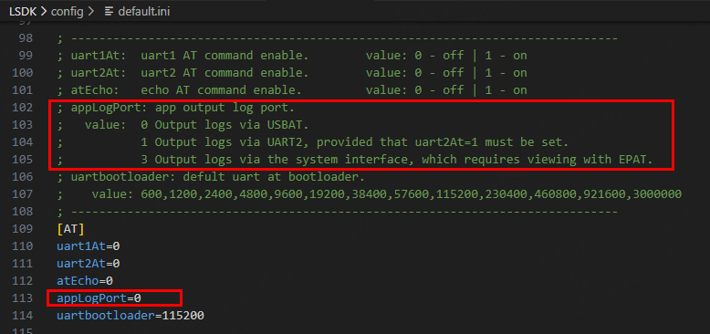

| **Function** | **Command** | **Description** |
| ---- | ---- | ---- |
| Output to USB AT | appLogPort=0 | None |
| Output to UART2 | appLogPort=1 | uart2At must be set to 1 |
| Output to EPAT tool | appLogPort=3 | Use EPAT.exe |

### 3.2 Preparation

Please prepare the following tools and conditions:

1. Target module (device from which logs need to be captured);
2. The module supports two log output methods:
   - **USB AT log output (default)**: Connect the module's USB interface, view using a serial port tool. The device name in Device Manager is: Lierda At Port;
   - **USB Log output (default)**: Connect the module's USB interface, view using the EPAT tool. The device name in Device Manager is: Lierda Log Port;
   - **UART 2 serial output**: By default, connect AUX_TXD, AUX_RXD, GND pins, view using a serial port tool;
3. PC log capture tool: **Serial port tool or EPAT.exe**;
4. If using EPAT, also prepare the database file matching the firmware version (e.g., `comdb.txt`).

**Note:**

- If you do not have EPAT.exe, please contact technical support to obtain it;
- The database file must match the firmware version.

## 4 Serial Port LOG Capture

Open any serial port tool, select baud rate 115200, open the serial port, and you can view the APP logs.

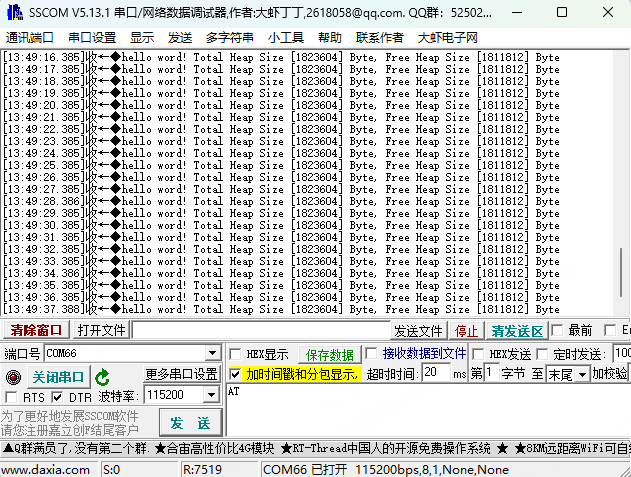

## 5 EPAT LOG Capture

### 5.1 Launch EPAT Tool

Double-click to run `EPAT.exe`. Tool versions may vary; contact FAE for the latest version if needed.

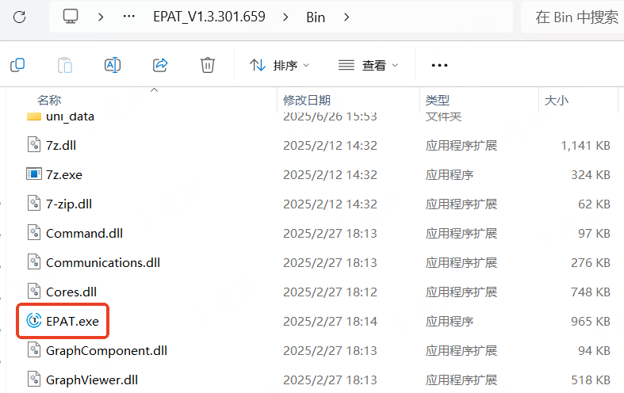

When opening EPAT for the first time, a data source selection window will pop up:

- **Select**: `Serial Device`
- Click `OK` to enter the main interface

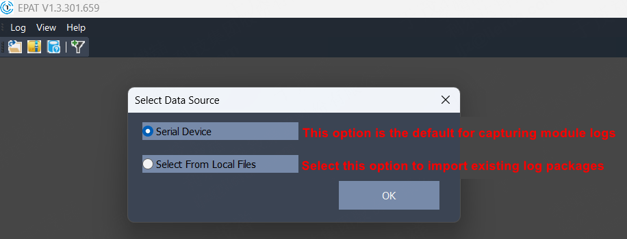

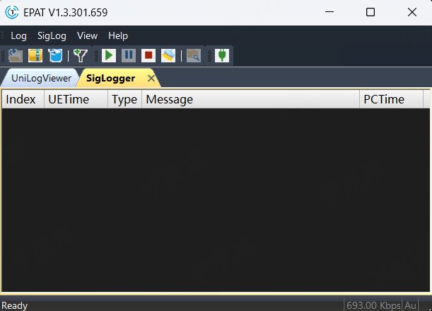

### 5.2 Connect UE

#### 5.2.1 Device Dialog

Click the "Serial Port Settings" icon, then click "Setting" in the "Device Communication" popup.

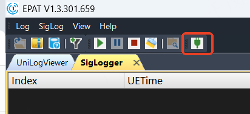

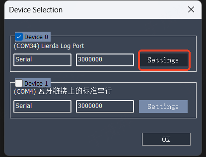

#### 5.2.2 Configure Connection Parameters

Select the correct log port (Lierda Log Port) and configure the baud rate (default `3000000`).

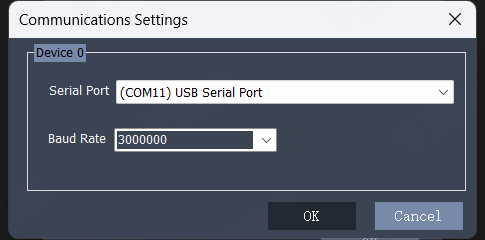

After configuration, click `OK` to return to the main interface.

**Note:**

- If the USB port is not enumerated, please refer to the "USB Driver Installation Guide" for driver installation.
- The DBG serial port baud rate defaults to 3M. It can be set to other baud rates; changes take effect after restart.

USB devices in Device Manager

#### 5.2.3 Check Connection Status

The connection status can be viewed in the EPAT status bar.

| **Status** | **Display** |
| ---- | ---- |
| Connected |  |
| Not connected |  |
| Connection failed |  |

### 5.3 Update DB

#### 5.3.1 Check Status

The Database State button in the toolbar has three states to indicate database matching status.

| **Status** | **Display** |
| ---- | ---- |
| UE DB read failed |  |
| UE DB mismatch |  |
| UE DB matched |  |

Click the "Database Update" icon in the toolbar.

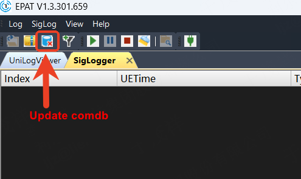

In the popup window, click `Update`, then select the matching comdb.txt file.

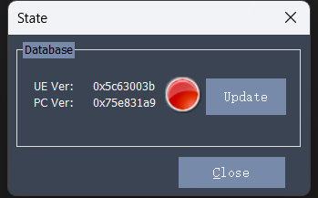

#### 5.3.2 Update Database

In the database update interface, manually update the corresponding database file.

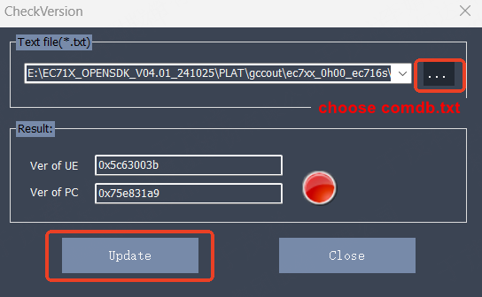

After the database version update is complete, a prompt appears: **Databases updated!**

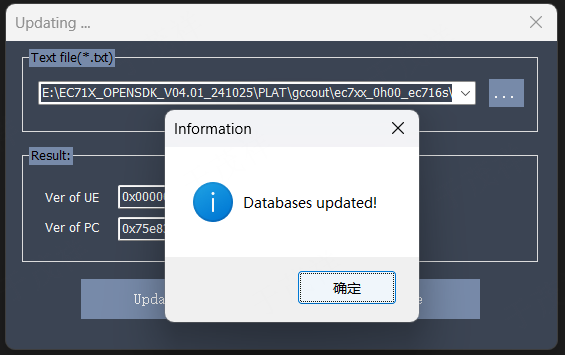

After updating, the Check DB Version Result area displays the result:

- **Green:** Success and matched
- **Red:** Mismatch
- **Gray:** Failed to read UE DB

Click `Close` to return to the main interface.

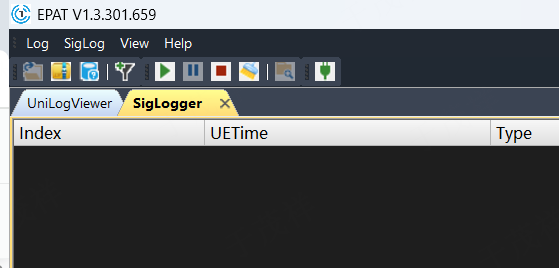

**Note:**

- The question mark in the database icon will automatically disappear when logs are successfully captured.

### 5.4 Start/Pause/Stop/Clear Functions

#### 5.4.1 Pause

The Viewer stops refreshing log display but continues saving logs. Used when you are unsure whether the current log has captured the UE fault and want to temporarily check while log writing continues.

#### 5.4.2 Stop

The Viewer stops refreshing log display and stops saving logs. Used when you confirm the current log is what you want to save and subsequent logs are not needed.

#### 5.4.3 Clear

Clears the Viewer and opens a new log file to continue writing logs.

### 5.5 Log Capture

#### 5.5.1 Start Log Capture

Click the "Run" button in the upper right corner of the main interface to start log capture.

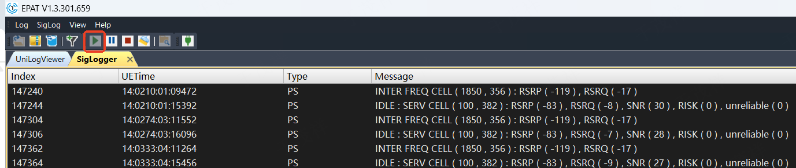

After logs are successfully output, the database icon turns green indicating the database matches the module firmware.

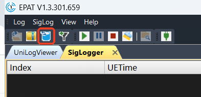

### 5.6 Filter APP Logs

Click the log filter icon.

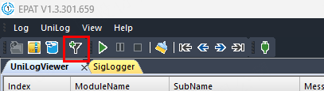

First click the checkbox before "All" to deselect all logs.

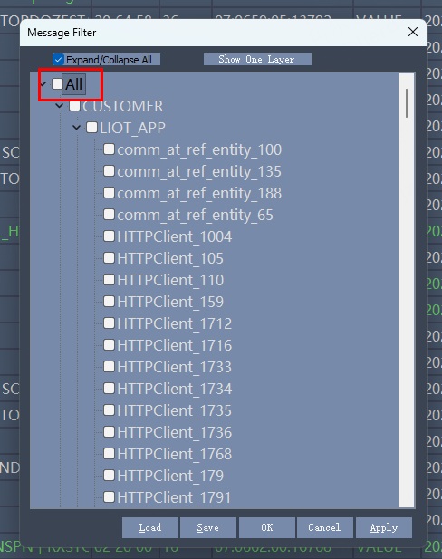

Check `CUSTOMER -> LIOT_CUST -> USRTAPP_LOG`, then click Apply and OK.

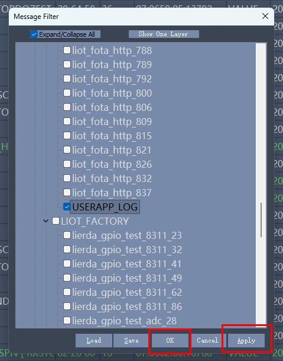

Now the log viewer displays only the APP logs.

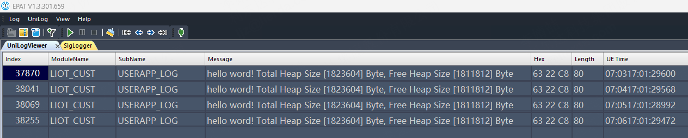

### 5.7 Log Saving

#### 5.7.1 Manually Save Log File

After log capture is complete, click the "Stop" button, then click the "Save" icon to save the captured log as a `.zip` compressed file.

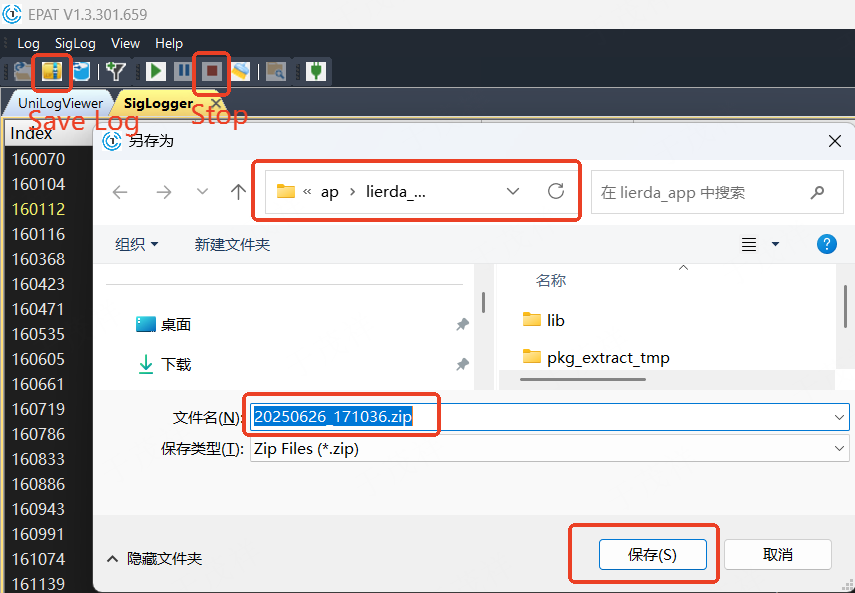

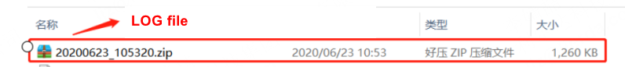

#### 5.7.2 Auto-Save and Split-Save Log Files

For long-term testing and issue reproduction, it is recommended to enable the log "split-save" function:

- Menu path: `Log -> Options`
- Enable timed or size-based split-save options
- If this function is not available, contact support for the latest tool version

After selecting AutoSave Log File, set the file size in "Set max file size". When the log file reaches this size, it is automatically saved to disk. Specify the save location in the Save Folder input box.

If the option "Automatically delete old zip log files" is selected, auto-saved zip log files exceeding the preset maximum count will have old files automatically deleted. The default count is 50.

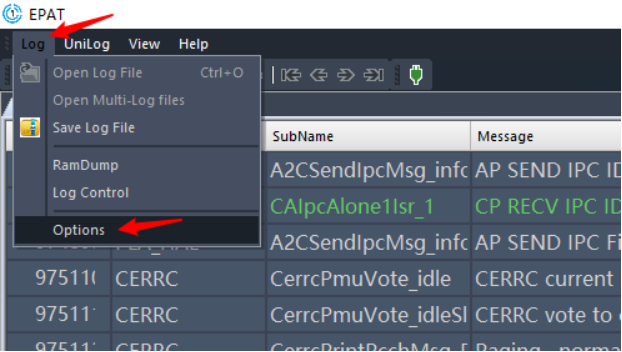

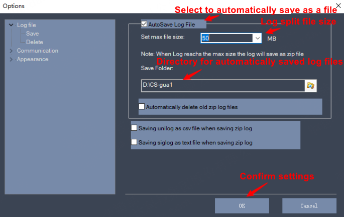

**Note:**

- This parameter must be set for long-term testing. Without it, logs are saved as a single file that grows over time, making transmission and analysis difficult.

#### 5.7.3 Save Text Log

There are two options to control whether unilog or siglog is saved as a csv or text file when saving zip log files.

If "Saving unilog as csv file when saving zip log" is selected, the current unilog data is saved as a csv file with the same directory and name as the zip log file.

If "Saving siglog as text file when saving zip log" is selected, the current siglog data is saved as a text file with the same directory and name as the zip log file.

#### 5.7.4 Delete

Select the Delete option under the Log file category to display the configuration page as shown below:

After selecting "Automatically delete old log files", local log files exceeding the specified count will have old files automatically deleted. The count is determined by "Number of local files".

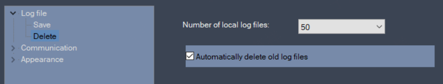

#### 5.7.5 Convert to Wireshark Packets

EPAT supports converting logs to `.pcap` format for Wireshark analysis:

1. Switch the log window to **SigLogger**

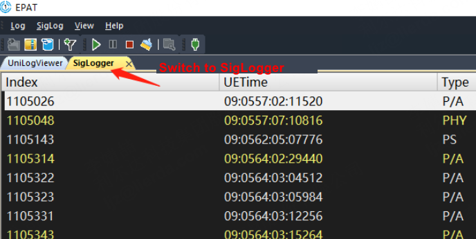

2. Select the export option from the menu

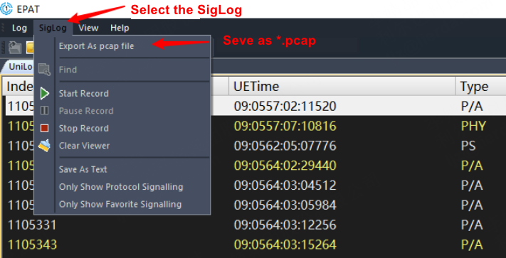

3. Set the save path and filename

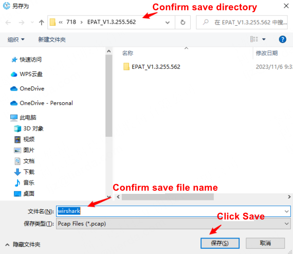

4. Open the `.pcap` file with Wireshark for packet analysis

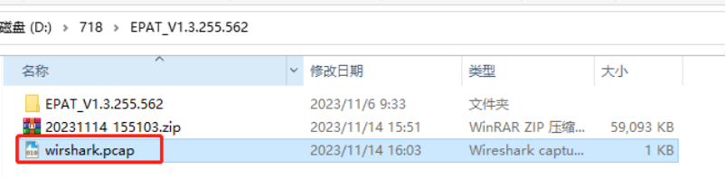

5. Perform network packet analysis using Wireshark. Here is a simple example of TCP data send/receive flow.

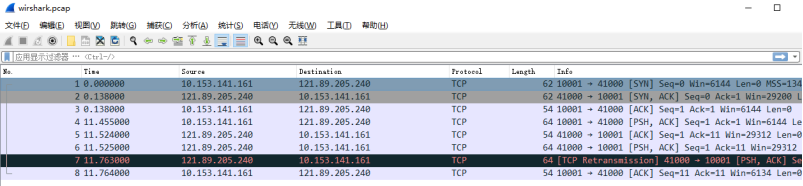

## 6 Important Notes

1. **Use the latest version of EPAT.exe**. Contact support to confirm the version;
2. **The database file must match the firmware**. Version mismatch will cause log parsing failure;
3. If EPAT crashes or cannot open, terminate all processes, re-extract, and restart;

## 7 FAQ

### 7.1 Cannot find mfc140u.dll

[Please refer to DingTalk document for "Cannot find mfc140u.dll.mp4"](https://alidocs.dingtalk.com/i/nodes/1DKw2zgV2P7D273GsPYNbN6v8B5r9YAn?doc_type=wiki_doc&iframeQuery=anchorId%3DX02mcd6f1zzlsae5hzxv5&rnd=0.3503756492205281)

Copy the following 3 files to the EPAT root directory:

- [Please refer to DingTalk document for "mfc140u.dll"](https://alidocs.dingtalk.com/i/nodes/1DKw2zgV2P7D273GsPYNbN6v8B5r9YAn?doc_type=wiki_doc&iframeQuery=anchorId%3DX02mcd6i2jcf8lz5l23mml&rnd=0.3503756492205281)
- [Please refer to DingTalk document for "vcruntime140.dll"](https://alidocs.dingtalk.com/i/nodes/1DKw2zgV2P7D273GsPYNbN6v8B5r9YAn?doc_type=wiki_doc&iframeQuery=anchorId%3DX02mcd6i3v1iweopq9eqp&rnd=0.3503756492205281)
- [Please refer to DingTalk document for "msvcp140.dll"](https://alidocs.dingtalk.com/i/nodes/1DKw2zgV2P7D273GsPYNbN6v8B5r9YAn?doc_type=wiki_doc&iframeQuery=anchorId%3DX02mcd6i4zw2vzn56bup8l&rnd=0.3503756492205281)
