# Dump Capture and Analysis Guide

{link_to_translation}`zh_CN:[中文]`

## Document Revision History

| **Version** | **Date** | **Author** | **Changes** |
| ---- | ---- | ---- | ---- |
| Rev1.0 | 2026-04-25 | ljz | Initial Release |

## 1 Introduction

This document describes the Dump capture methods and preliminary analysis process when a system exception occurs on Lierda 71X series modules using the "base package + application separation" architecture (OPENSDK mode). It also explains common system exception symptoms and causes, guiding developers to perform preliminary analysis of system exception issues.

During application development, issues such as excessive task count, unreasonable task stack size configuration, wild pointer access, concurrent operations on global variables by multiple tasks, and memory leaks causing insufficient system resources can all trigger system exceptions. Properly managing memory and pointer usage, and optimizing task stack space during development can effectively reduce system exception occurrences.

## 2 Materials Required for Dump Analysis

- EPAT Tool: [Please refer to DingTalk document for "EPAT log tool"](https://alidocs.dingtalk.com/i/nodes/1zknDm0WRaMv5M2wHx6Pg9Ox8BQEx5rG?doc_type=wiki_doc&iframeQuery=anchorId%3DX02m4wj9ccqvjdfvfvil1r). No installation required, extract and use directly.
- TRACE32: [Please refer to DingTalk document for "TRACE32"](https://alidocs.dingtalk.com/i/nodes/1zknDm0WRaMv5M2wHx6Pg9Ox8BQEx5rG?doc_type=wiki_doc&iframeQuery=anchorId%3DX02m4zehx6e4ptiakau1w7). No installation required, extract and use directly. Lauterbach's powerful analysis tool.
  
  - Call stack, task list, memory dump, global variables, core registers. For more details, see: [Please refer to DingTalk document for "ide_user.pdf"](https://alidocs.dingtalk.com/i/nodes/1zknDm0WRaMv5M2wHx6Pg9Ox8BQEx5rG?doc_type=wiki_doc&iframeQuery=anchorId%3DX02m50dvxfeqo00tmooy5)
- Dump-related files generated during compilation
  
  - comdb.txt: The log database file matching the firmware that can reproduce the system exception, used for log parsing.
  - elf file: Generated during firmware compilation, filename is `ap_lierda_app.elf`.
  - map file (optional): Generated alongside firmware compilation, filename is `ap_lierda_app.map`, used for auxiliary analysis.

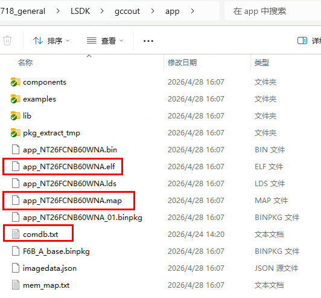

**Notes**

- For compatibility, it is recommended to extract EPAT and TRACE32 tools to a **pure English path** without Chinese characters or special characters, otherwise dump data parsing may fail.
- The binpkg, elf, and map files are in one-to-one correspondence. If firmware is recompiled, use the newly generated elf and map files.

## 3 System Exception Dump Capture

### 3.1 Dump Capture Configuration

In the current SDK, the default value `faultAction` for module behavior after a system exception can be modified. After modifying the default value, recompile and flash the firmware before reproducing the exception. The configuration file is located at `LSDK->config->default.ini`. When troubleshooting system exceptions, set faultAction to 0. For production code, this value should be set to 4 to ensure the system can reset and run normally after an exception.

**Notes**

- **0** - Dump full exception information to flash and EPAT tool, then enter an infinite loop (while(1)). The system saves error information but does not restart, instead stopping and waiting for debugging.
- **1** - Print necessary exception information, then reset the system. This outputs key error information and restarts the device to attempt recovery.
- **2** - Dump full exception information to flash, then reset the system. This saves complete error logs for later analysis, then restarts the device.
- **3** - Dump full exception information to flash and EPAT tool, then reset the system. This provides the most complete error information recording while also restarting the device.
- **4** - Reset the system directly. No error information is saved, the device restarts immediately.

### 3.2 Capturing Dump

1. First, ensure the comdb.txt file is correctly imported in the EPAT tool.

2. After configuration is complete, reproduce the issue and use the EPAT tool to capture the system exception scene. When a system exception is triggered, EPAT automatically pops up the RamDump window, and the dump file is automatically saved to the specified directory. The following interface indicates that the system exception has been successfully reproduced:

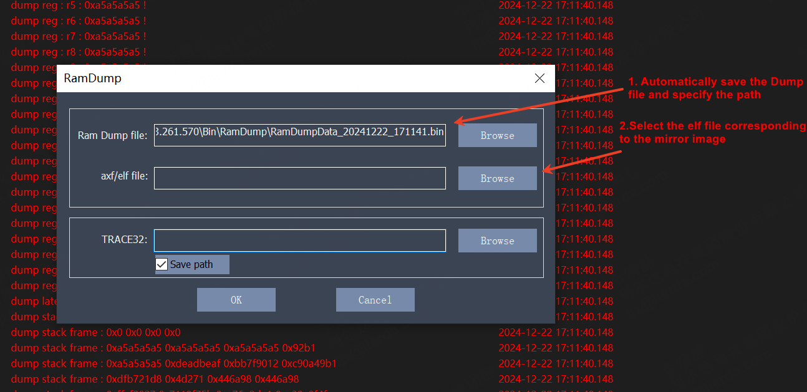

3. If you need to analyze the dump immediately, see Chapter 4. If you need to save the dump for later analysis, see Section 3.3.

### 3.3 Saving Files Required for Dump Analysis

1. Click Save in the EPAT toolbar to save the log.

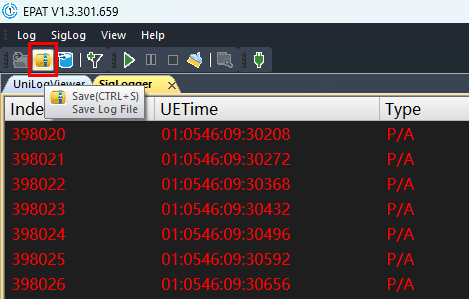

2. Save the comdb file: `LSDK\gccout\[project_name]\comdb.txt`.

3. The dump file is saved by default in the following tool directory: `EPAT_V1.3.301.659\Bin\RamDump`. Save the latest bin file, example shown below:

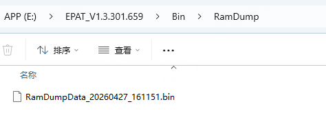

4. Save the elf file from the base package corresponding to the exception firmware: `LSDK\components\basePkg\[base_package_module_model]\ap_lierda_app.elf`.

5. Save the elf and map files from the exception firmware: `LSDK\gccout\[project_name]\[project_name]_[module_model].elf` and `LSDK\gccout\[project_name]\[project_name]_[module_model].map`

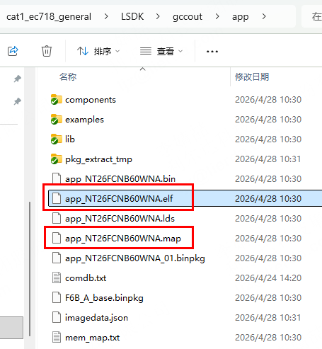

## 4 Analyzing System Exception Dump

### 4.1 Importing Files into TRACE32

1. If you are reopening a system exception log without the RamDump interface, reopen the parsing interface via the menu: `Log->RamDump`.

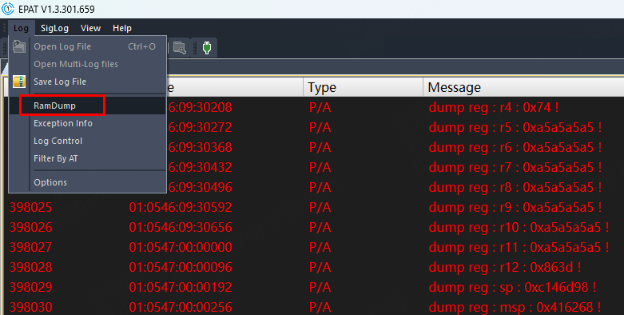

2. Select three files respectively:

- **Ram Dump file:** Select the corresponding bin file in `EPAT_V1.3.301.659\Bin\RamDump`
- **axf/elf file:** Select the base package's `ap_lierda_app.elf` file (located in `LSDK\components\basePkg\[base_package_module_model]\`)
- **TRACE32:** The trace32 executable `t32marm64.exe` (located in `TRACE32_R_2023_02_000159199\bin\windows64\`)

3. Check "Save path" so the trace32 path will be automatically loaded next time.

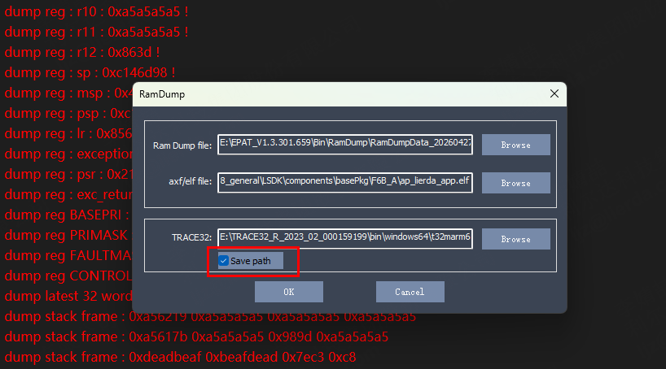

4. Click OK to automatically open trace32 and parse the dump.

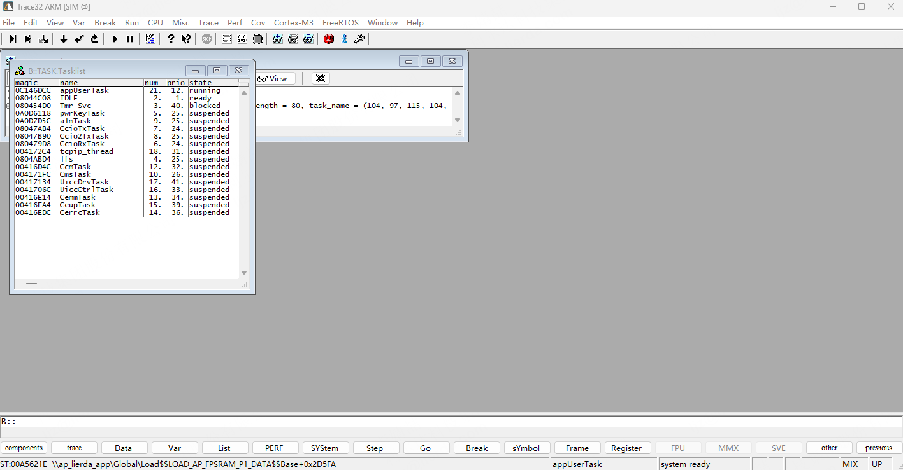

5. View the task stack information of the system exception call. If the system exception occurred during an interrupt or HardFault handling, the task stack may have been corrupted, and the call stack information may be incomplete.

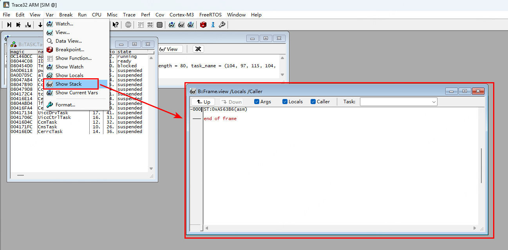

6. Import the APP's elf file: Drag the elf file compiled from the APP into the TRACE32 command box.

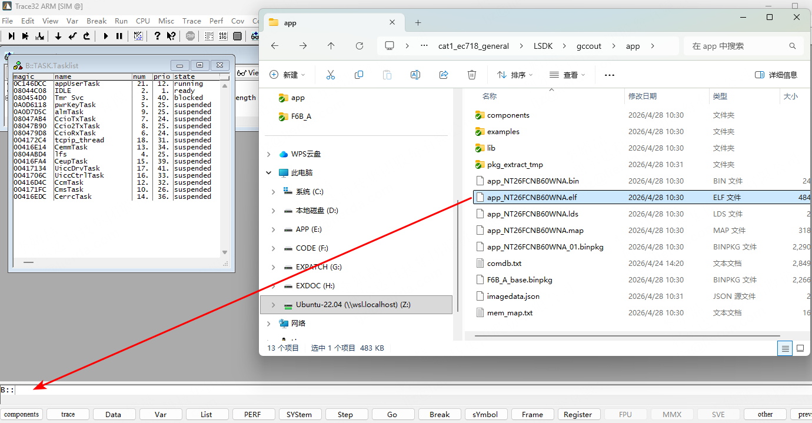

7. Append `/nocode /noclear` at the end.

8. Press Enter to confirm the elf file was imported successfully.

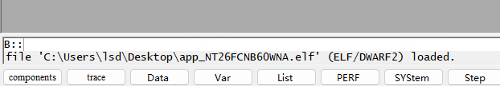

### 4.2 Parsing Dump

#### 4.2.1 Standard Dump Analysis

1. First check the UniLog to confirm approximately where the code was running before the system exception. Search upward from **Current fault action : 0** for your custom log entries.

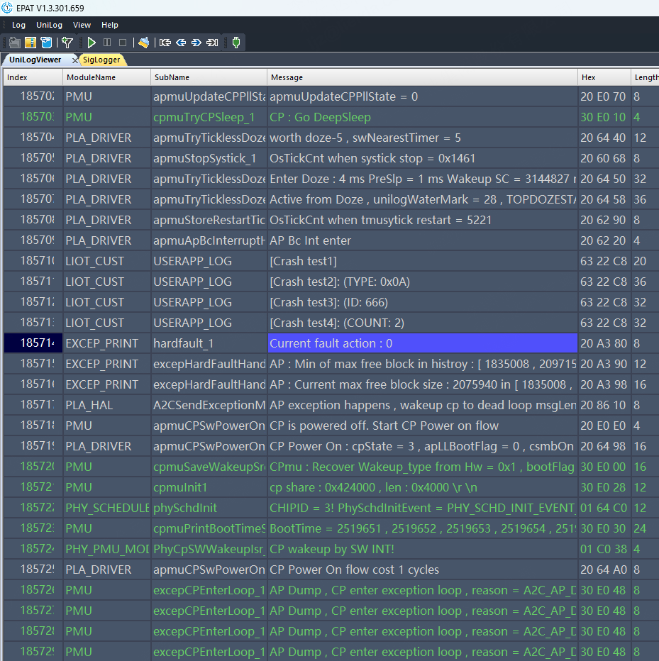

2. Confirm task execution status.
   
   From the task list, we can see that the system exception occurred in the **appUserTask** task with **priority 12**.

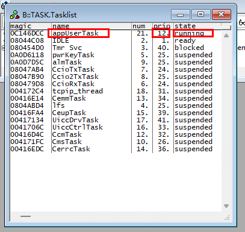

3. Identify the function where the system exception occurred from the task stack.

4. The system exception log shows the PC pointer address when the exception was triggered.

5. Open the map file at: `LSDK\gccout\[project_name]\[project_name]_[module_model].map`. This also shows which function the system exception occurred in.

#### 4.2.2 Dump Analysis When Task Stack Cannot Identify the Exception Function

1. We may encounter a situation where only the PC content is visible in the current task stack, but the task stack execution location cannot be determined.

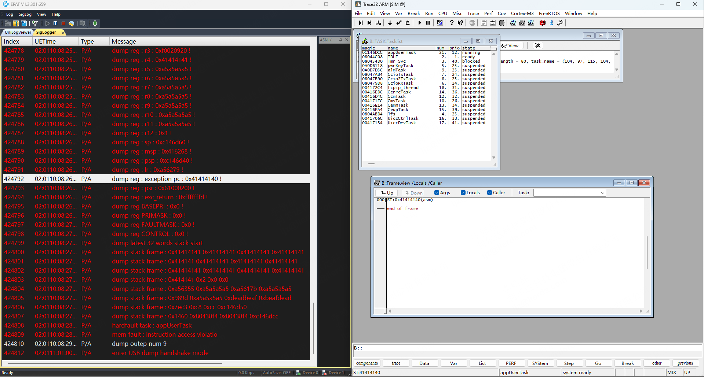

2. We can perform manual backtrace in the TRACE32 tool: enter `d.dump R(SP)` in the command line and press Enter. SP is the stack pointer.

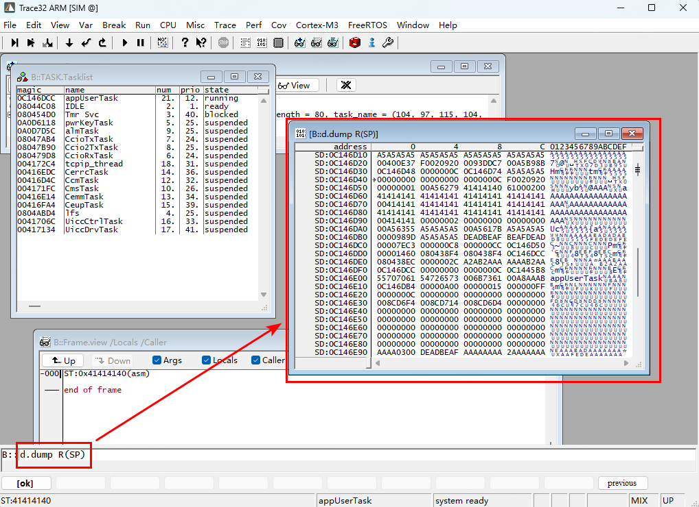

3. In the popup window, the location pointed to by the pointer is the stack pointer information.

After the system exception occurs, the CPU fetches instructions from the illegal address `0x41414140`, triggering a hardware-level HardFault exception. At this point, the ARM hardware forces an "emergency backup mechanism": the CPU automatically pushes the current 8 core registers (R0, R1, R2, R3, R12, LR, PC, xPSR) onto the stack to preserve the exception scene.

- **0C146D5C**: 61000200 (Status register xPSR)
- **0C146D58**: 41414140 (This is the PC value that triggered the exception!)
- **0C146D54**: 00A56279 (LR Link Register)
- **0C146D50**: 00000001 (R12)
- **0C146D4C**: F0020920 (R3)
- **0C146D48**: 0000000C (R2)
- **0C146D44**: 00000000 (R1)
- **0C146D40**: 00000000 (R0)

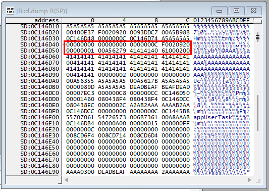

We can also view the register information in the tool via `View->Registers`.

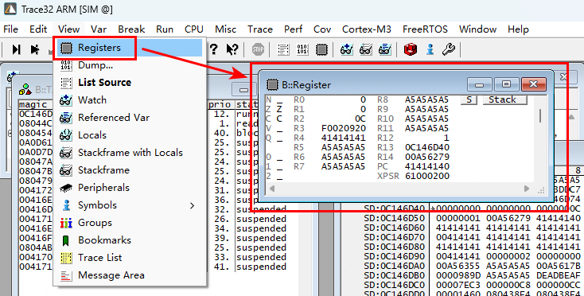

4. We can locate the issue by examining the **LR register (Link Register, return address)**.
   
   Principle: The LR register stores "which line of code should be returned to after the current function finishes execution". Since the system exception occurred inside a function, this address usually points to **the parent function that called the corrupted function**.
   
   We have confirmed that the value in the LR register is `00A56278`. Enter the command `Data.List 0x00A56278` in Trace32.

This also shows that the system exception occurred in `log_device_info`.

5. Based on the above analysis, we can conclude: while executing `log_device_info`, a buffer overflow overwrote the PC return address on the stack (address `0x0C146D58` was tampered to `0x41414140`), causing the program to jump to an illegal address and trigger a HardFault.

## 5 Common Dumps and Causes

### 5.1 Task Stack Overflow

When a system exception occurs, the log can show corresponding prompts. However, it is also possible that each exception occurs in a different task with no pattern. In this case, check the interfaces commonly called across multiple tasks for potential stack overflow.

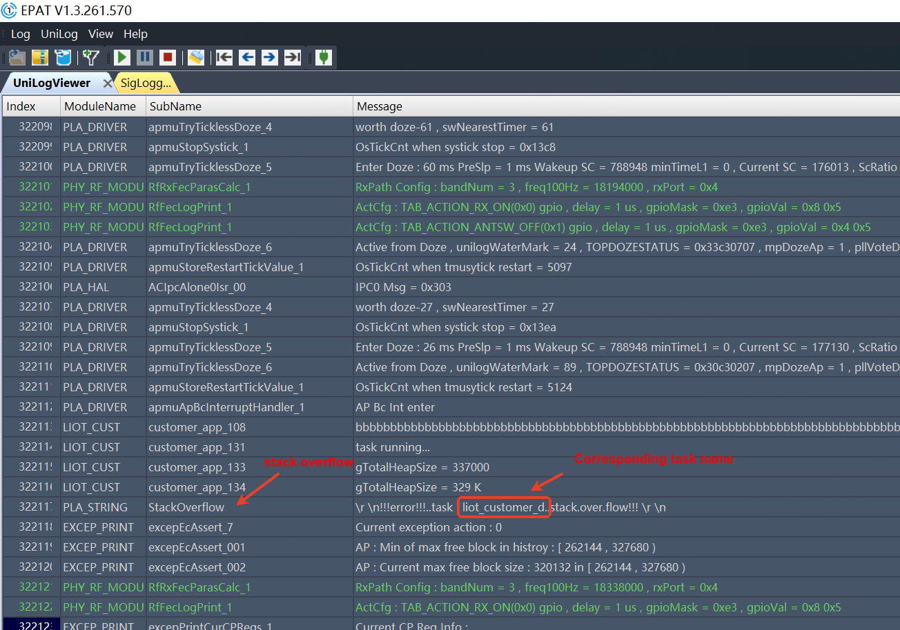

System exception example code:

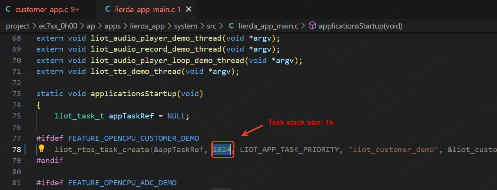

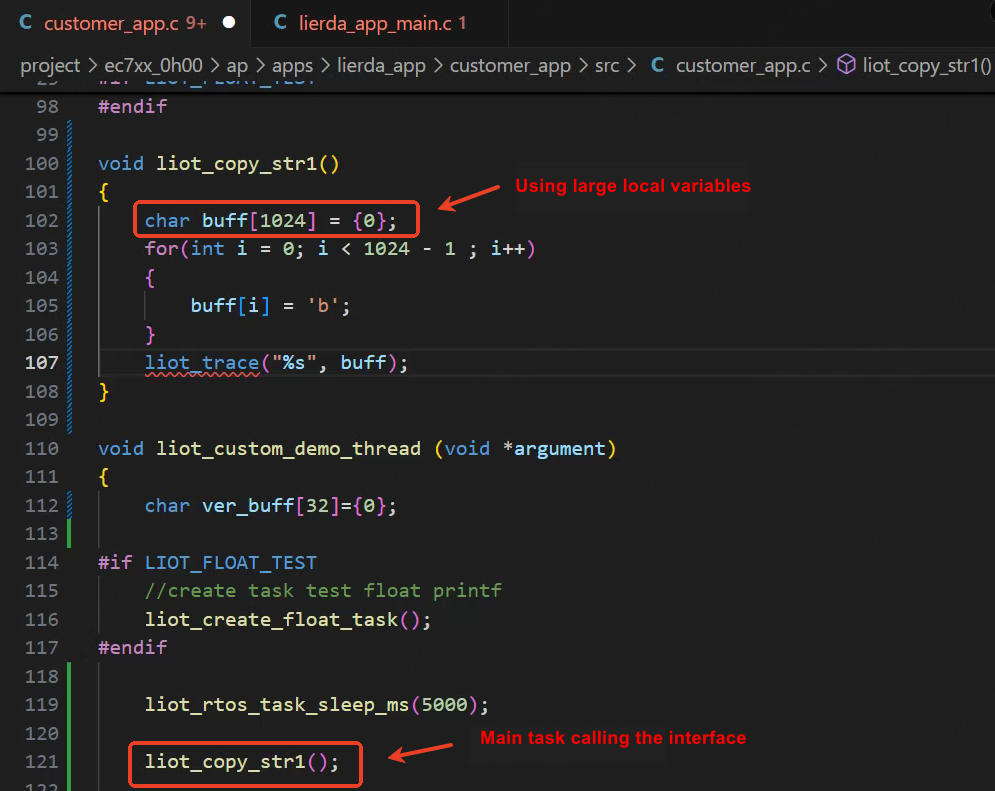

**Notes**

**How to Avoid Task Stack Overflow**

- Set task stack size appropriately: Configure task stack space based on the call depth of interfaces within the task and the size of local variables in each function. Typically set to 2K/4K/8K, or larger for special cases.
- Reduce large local variables: Change large local variables (over 512 bytes) in functions to dynamically allocated memory using malloc.
- Reduce recursive calls: Recursive calls consume large amounts of stack space.
- Optimize function calls: Reduce unnecessary function calls, especially nested calls.

### 5.2 Watchdog Timeout

The system watchdog timeout is 20 seconds. If application logic runs in a high-frequency loop for over 20 seconds without feeding the watchdog in time, a watchdog exception will occur and the system will reset.

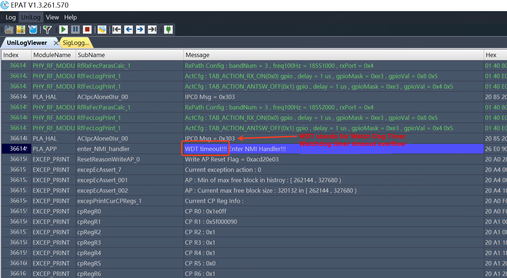

**Notes**

**How to Avoid Watchdog Timeout**

- For high-frequency loops, TTS playback, image decoding, and other loop operations, manually feed the watchdog with `WDT_kick();` and `slpManAonWdtFeed();`.
- Configure task priorities appropriately; do not set application priority too high.

### 5.3 Out-of-Memory System Exception

Memory leaks are a common issue. Focus on checking memory release in exception branches. Before mass production, perform long-term stability testing to ensure no exceptions occur.

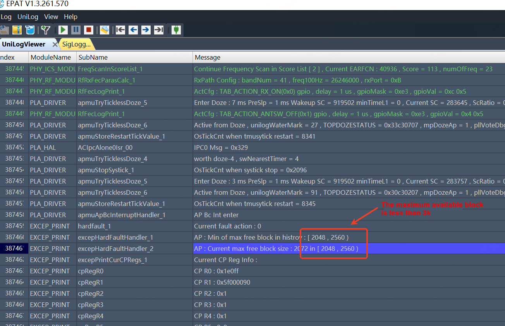

### 5.4 Double Free Memory

The assertion occurs in the `tlsf_free` function, line 2012.

Through code inspection, the assertion log indicates that the block has already been marked as freed.

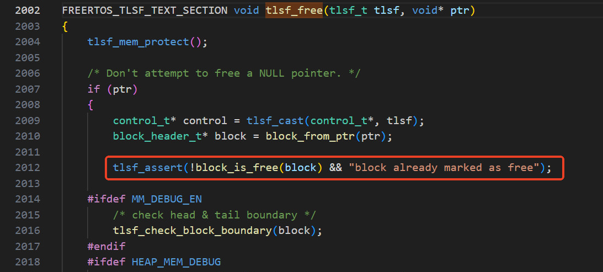

## 6 Important Notes

The above describes the basic steps for analyzing system exception issues and parsing dump files. Obvious system exceptions can be preliminarily analyzed. If preliminary analysis cannot identify the root cause, try debugging individual module tasks to pinpoint the exception. If multiple attempts fail to resolve the system exception, package the files described in Section 3.3 and send them to your FAE for internal R&D analysis support.
