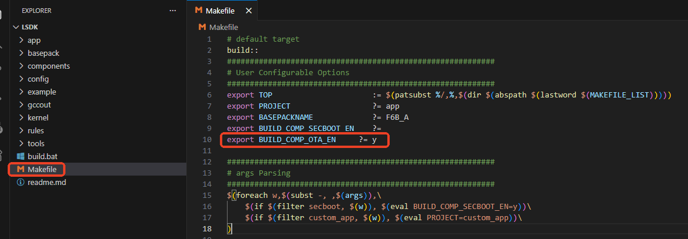
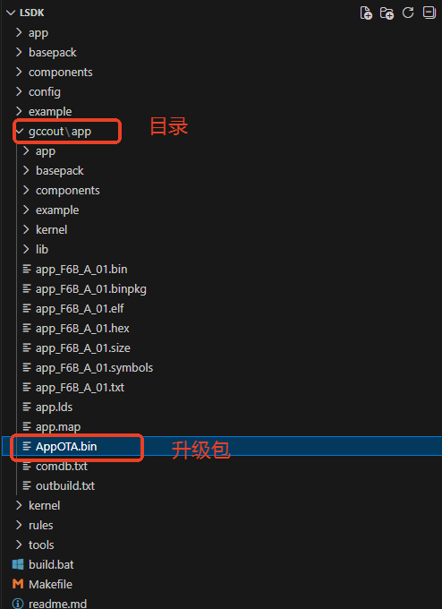
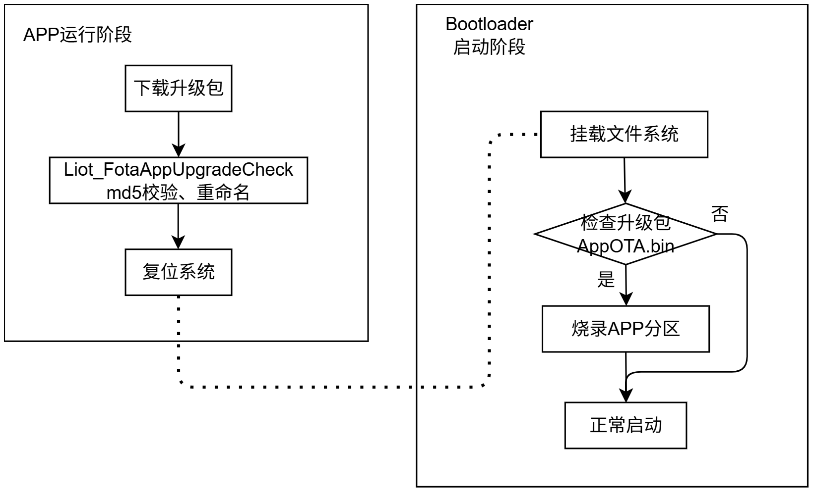
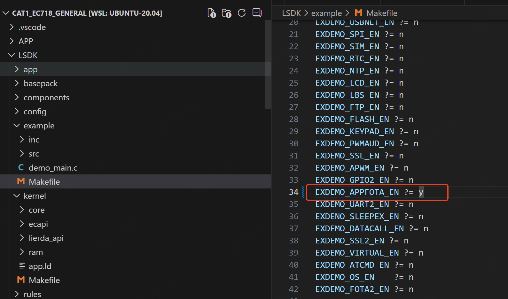
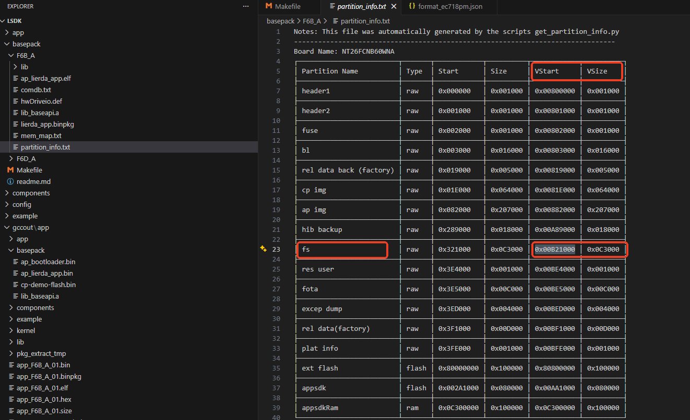
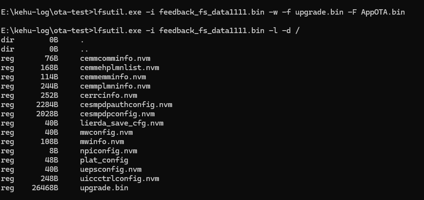
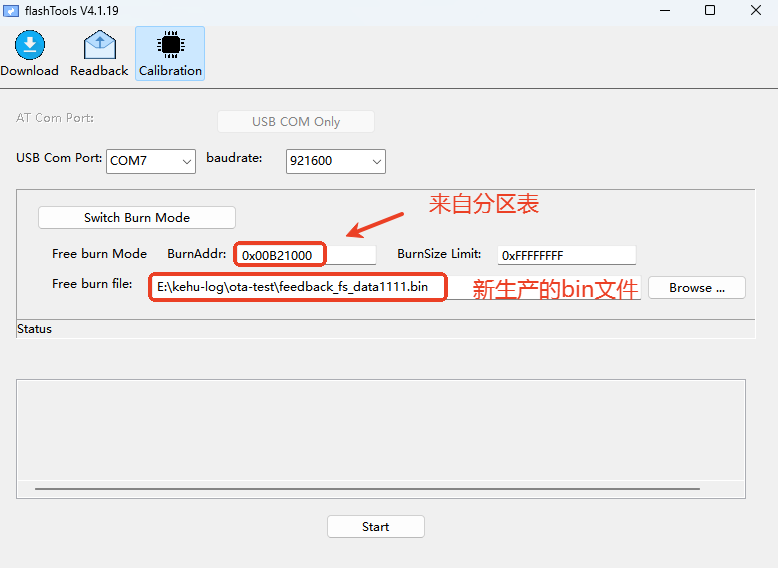
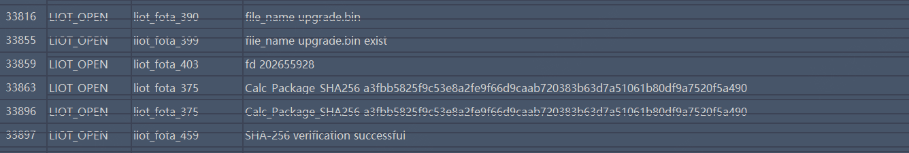
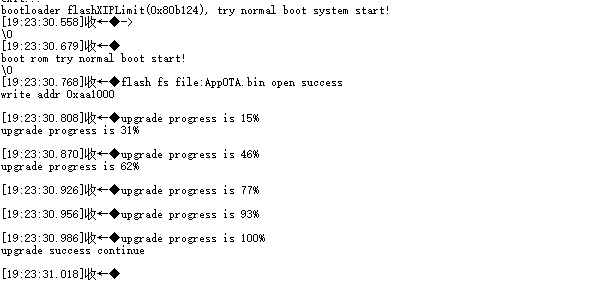
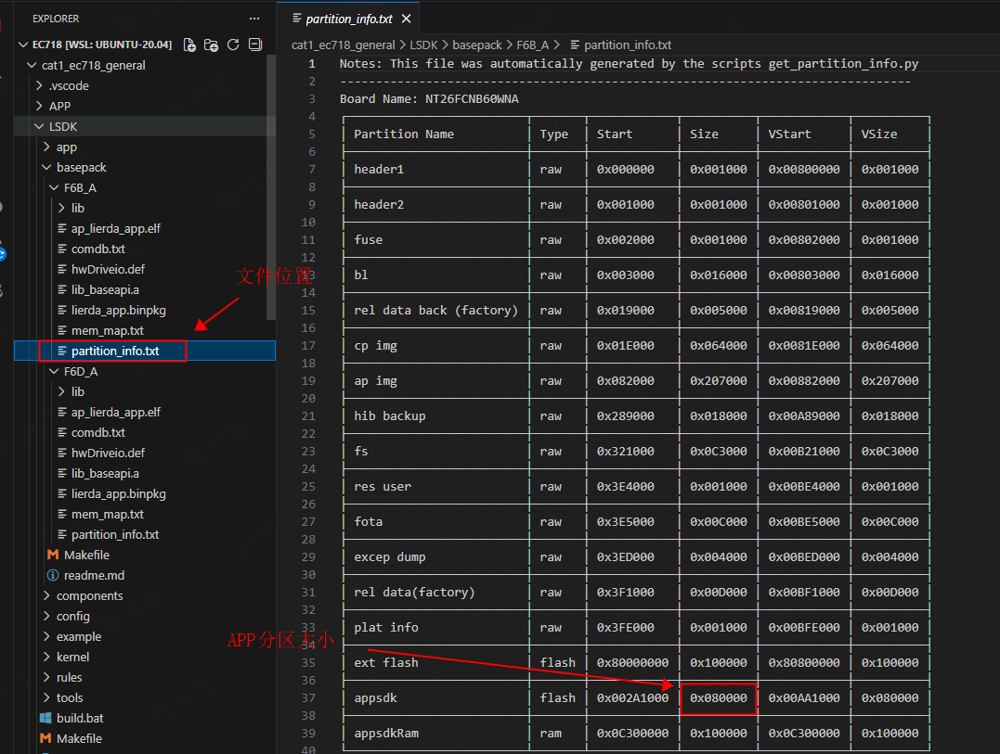

# APP全量升级开发指导\_Rev1.0

{link_to_translation}`en:[English]`

## 文件修订历史

| **文档版本** | **变更日期** | **修订人** | **审核人** | **变更内容** |
| --- | --- | --- | --- | --- |
| Rev1.0 | 26-02-28 | zlc | ymx | 初始文档 |

## 1 简介

本章节主要内容主要介绍客户在使用底包分离方案SDK时，全量升级用户APP分区的方法，指导客户快速输出APP镜像的升级包，并完成APP分区镜像的升级。

当前通过编译方式自动脚本生成APP全量升级包，里面包含了固定格式的数据头，主要是APP分区的FLASH起始地址、APP完整数据，APP的MD5校验值。

默认SDK不会进行APP 全量升级包的输出，需要修改Makefile中BUILD\_COMP\_OTA\_EN=y 打开此宏后，编译会自动输出APP的升级包AppOTA.bin，修改方式如下图所示。



如下图所示：AppOTA.bin就是APP镜像的OTA升级包。



APP全量升级原理说明

升级的执行流程在bootloader阶段，这样在升级过程中异常掉电，系统启动后还会继续进行APP的升级，保证升级掉电系统不变砖。



完整升级流程

**说明**

| APP阶段：主要是下载升级包到文件系统，调用Liot\_FotaAppUpgradeCheck()接口进行升级包的完整性校验。然后复位模组。<br>Bootloader阶段：挂载文件系统，如果文件系统中存在AppOTA.bin升级文件，则开始进行读取升级文件中的镜像内容，擦除并更新APP分区。更新结束后会进行继续启动系统。<br>升级包需要放在文件系统中，底包会预留足够空间，用户无需关注。 |
| --- |

## 2 API 函数概览

| **函数** | **说明** |
| --- | --- |
| Liot\_FotaAppUpgradeCheck | 全量升级APP分区升级包检测接口 |

## 3 API函数详解

### 3.1 liot\_fota\_errcode\_e

FOTA 错误码由相关的组件 ID 与标准错误码共同组成，其中组件 ID 为高 16 位，标准错误码为低 16位。

1.  声明
    

```c
typedef enum{
    LIOT_FOTA_UPGRADE_SUCCESS             = 0,                              /*!< Indicates that the FOTA upgrade was successful.*/
    LIOT_FOTA_UPGRADE_FAIL                = 504 | LIOT_FOTA_ERRCODE_BASE,   /*!< General FOTA upgrade failure.*/
    LIOT_FOTA_UPGRADE_CHECK_FAIL          = 505 | LIOT_FOTA_ERRCODE_BASE,   /*!< FOTA upgrade check failed.*/
    LIOT_FOTA_UPGRADE_MD5_FAIL            = 506 | LIOT_FOTA_ERRCODE_BASE,   /*!< MD5 checksum verification of the FOTA package failed.*/
    LIOT_FOTA_UPGRADE_MATCH_FAIL          = 507 | LIOT_FOTA_ERRCODE_BASE,   /*!< FOTA package does not match the device requirements.*/
    LIOT_FOTA_UPGRADE_NO_FILE_FAIL        = 508 | LIOT_FOTA_ERRCODE_BASE,   /*!< FOTA file not found or missing.*/
    LIOT_FOTA_UPGRADE_OPENFILE_FAIL       = 509 | LIOT_FOTA_ERRCODE_BASE,   /*!< Failed to open the FOTA upgrade file.*/
    LIOT_FOTA_UPGRADE_FILESIZE_FAIL       = 510 | LIOT_FOTA_ERRCODE_BASE,   /*!< Invalid or unsupported FOTA file size.*/
    LIOT_FOTA_UPGRADE_LFS_MOUNT_FAIL      = 511 | LIOT_FOTA_ERRCODE_BASE,   /*!< Failed to mount LittleFS (LFS) for FOTA.*/
    LIOT_FOTA_UPGRADE_PARAM_FAIL          = 512 | LIOT_FOTA_ERRCODE_BASE,   /*!< Invalid input parameters for FOTA upgrade.*/
    LIOT_FOTA_UPGRADE_PROJECT_MATCH_FAIL  = 552 | LIOT_FOTA_ERRCODE_BASE,   /*!< Project name in FOTA package does not match the device.*/
    LIOT_FOTA_UPGRADE_BASELINE_MATCH_FAIL = 553 | LIOT_FOTA_ERRCODE_BASE,   /*!< Baseline version in FOTA package does not match the device.*/
    LIOT_FOTA_UPGRADE_POINT_NULL_ERR      = 570 | LIOT_FOTA_ERRCODE_BASE,   /*!< Null pointer error during FOTA upgrade.*/
    LIOT_FOTA_UPGRADE_FLAG_SET_ERR        = 571 | LIOT_FOTA_ERRCODE_BASE,   /*!< Failed to set the upgrade flag during FOTA.*/
} liot_fota_errcode_e;
```

2.  参数
    

| **参数** | **说明** |
| --- | --- |
| LIOT\_FOTA\_UPGRADE\_SUCCESS | 执行成功 |
| LIOT\_FOTA\_UPGRADE\_FAIL | 执行失败 |
| LIOT\_FOTA\_UPGRADE\_CHECK\_FAIL | FOTA 升级包检查失败 |
| LIOT\_FOTA\_UPGRADE\_MD5\_FAIL | FOTA 升级包MD5校验失败 |
| LIOT\_FOTA\_UPGRADE\_MATCH\_FAIL | FOTA 升级匹配文件失败 |
| LIOT\_FOTA\_UPGRADE\_NO\_FILE\_FAIL | 无升级包文件 |
| LIOT\_FOTA\_UPGRADE\_OPENFILE\_FAIL | 打开文件失败 |
| LIOT\_FOTA\_UPGRADE\_FILESIZE\_FAIL | 升级包文件长度超过限制 |
| LIOT\_FOTA\_UPGRADE\_LFS\_MOUNT\_FAIL | 文件系统加载失败 |
| LIOT\_FOTA\_UPGRADE\_PARAM\_FAIL | 参数错误 |
| LIOT\_FOTA\_UPGRADE\_PROJECT\_MATCH\_FAIL | 工程不匹配 |
| LIOT\_FOTA\_UPGRADE\_BASELINE\_MATCH\_FAIL | 基线不匹配 |
| LIOT\_FOTA\_UPGRADE\_POINT\_NULL\_ERR | 指针为空 |
| LIOT\_FOTA\_UPGRADE\_FLAG\_SET\_ERR | 标志位设置错误 |

### 3.2 Liot\_FotaAppUpgradeCheck

该函数用于设置检查APP全量升级包是否合法，并再检测完成后自动重命名AppOTA.bin。自动重命名的原因是，升级流程发生在bootloader阶段，会自动挂载文件系统，然后索引AppOTA.bin文件进行升级。

当前仅支持文件系统内保存升级包，外挂flash方式升级暂不支持。在生成升级包的时候，我们内部已经记录了固定包头与APP镜像的MD5值。该函数主要的功能就是检查固定包头，并校验MD5值。升级的完成流程是在bootloader中执行的，如果升级过程中遇到异常下电，上电后还是会继续升级。

**备注**

| *   该接口调用不需要网络断开<br>    <br>*   因文件只需要2K空间，该接口调用不会引起看门狗超时等问题<br>    <br>*   只是内存申请失败后的一个错误码，用户可根据返回值进行异常处理 |
| --- |

1.  声明
    

```c
liot_fota_errcode_e Liot_FotaAppUpgradeCheck(const char *file_name, BOOL is_reboot);
```

2.  参数
    

*   file\_name：\[In\] APP 的升级包名称。
    
*   is\_reboot：\[In\] 是否立即重启进行升级 true：立即复位模组进行APP镜像升级，false：不立即复位，等到下次复位后进行APP分区升级。
    

3.  返回值
    

*   liot\_fota\_errcode\_e：执行结果码，可能返回如下错误码。
    

LIOT\_FOTA\_UPGRADE\_PARAM\_FAIL  参数错误

LIOT\_FOTA\_UPGRADE\_NO\_FILE\_FAIL  文件不存在

LIOT\_FOTA\_UPGRADE\_OPENFILE\_FAIL 打开文件或者读取文件失败

LIOT\_FOTA\_UPGRADE\_CHECK\_FAIL 升级包包头检查失败

LIOT\_FOTA\_UPGRADE\_FAIL 底层申请内存失败。

LIOT\_FOTA\_UPGRADE\_MD5\_FAIL 升级包MD5校验失败。

LIOT\_FOTA\_UPGRADE\_SUCCESS  升级包校验成功。

## 4 代码示例

示例代码参考 LSDK/example/src/demo\_app\_fota.c。

demo中循环进行固定文件名(upgrade.bin)的升级包的检测，

本地测试可以导出模组中的文件系统，并将编译生成的AppOTA.bin文件以upgrade.bin的名称方式添加到文件系统中，重新烧录文件系统到设备中，然后复位设备，系统会自动进行该文件的检查并校验升级包MD5值，升级过程日志可以通过debug口进行查看。

**备注**

| demo 源码的具体位置在开发开发指南中已说明，此处不在重复<br>lfsutil.exe 请查看下方工具连接<br>demo中循环进行upgrade.bin不会高频操作 Flash 文件系统，只是检查文件 |
| --- |

1.测试请开启该demo



2.导出时的文件系统地址查看方式：



3.导出文件系后将AppOTA.bin写入文件系统。

工具链接：[请至钉钉文档查看附件《文件系统读写工具》](https://alidocs.dingtalk.com/i/nodes/G53mjyd80p7vr7OLuv4lg7Qo86zbX04v?iframeQuery=anchorId%3DX02mm91i4o8sjqtr6w3ui)



4.将新的文件系统bin烧录到系统中。



5.复位设备进行包检查。



6.debug口日志，提示升级成功。



## 5 常见问题

1、再测试过程中文件系统的地址根据底包决定，请根据实际用到的底包进行选择。

2、APP镜像有大小上限，如果代码较多，APP空间不够，则需要联系FAE反馈内部进行底包分区的重新划分。下图可以查看当前底包对应APP分区上限大小。



3、再制作包的时候就保证了APP镜像大小的上限，超出会提前预警

4.  暂时不支持回滚机制