# Dump抓取与分析指南

{link_to_translation}`en:[English]`

## 修订记录

| **版本** | **日期** | **作者** | **修订内容** |
| ---- | ---- | ---- | ---- |
| Rev1.0 | 2026-04-25 | ljz | 创建文档 |

## 1 引言

本文主要介绍在Lierda 71X系列模组采用"底包+应用分离"架构（OPENSDK模式）下，系统异常时的Dump抓取方法及初步分析流程。并对常见系统异常的现象与原因，指导客户对系统异常问题进行初步分析。

在实际应用代码编码过程中，应用任务数量过多、任务栈空间配置不合理、野指针访问、多任务并发操作全局变量、内存泄漏导致系统资源不足等问题，均会引发系统异常。在编码时应合理管理内存与指针的使用，优化任务栈空间，可以有效的降低系统发生异常问题。

## 2 分析dump需要准备的资料

- EPAT工具：[请至钉钉文档查看附件《EPAT log工具》](https://alidocs.dingtalk.com/i/nodes/1zknDm0WRaMv5M2wHx6Pg9Ox8BQEx5rG?doc_type=wiki_doc&iframeQuery=anchorId%3DX02m4wj9ccqvjdfvfvil1r)，无需安装，解压后直接使用。
- TRACE32：[请至钉钉文档查看附件《TRACE32》](https://alidocs.dingtalk.com/i/nodes/1zknDm0WRaMv5M2wHx6Pg9Ox8BQEx5rG?doc_type=wiki_doc&iframeQuery=anchorId%3DX02m4zehx6e4ptiakau1w7)，无需安装，解压后即可使用，Lauterbach 强大的分析工具
  
  - 调用栈、任务列表、内存转储、全局变量、核心寄存器，更多详情介绍见：[请至钉钉文档查看附件《ide_user.pdf》](https://alidocs.dingtalk.com/i/nodes/1zknDm0WRaMv5M2wHx6Pg9Ox8BQEx5rG?doc_type=wiki_doc&iframeQuery=anchorId%3DX02m50dvxfeqo00tmooy5)
- 编译生成的解析dump相关文件
  
  - comdb.txt文件：与可以复现系统异常问题匹配的log数据库文件，用于解析log。
  - elf文件：编译固件时生成的文件，文件名为 `ap_lierda_app.elf`。
  - map文件（可选）：编译固件同时生成的文件，文件名为 `ap_lierda_app.map`，用于辅助分析，非必选。

**备注**

- 为确保兼容性，建议将EPAT与TRACE32工具解压至**纯英文路径**下，避免包含中文或特殊字符，否则会导致无法解析dump数据。
- binpkg与elf、map文件是一一对应的，如果重新编译固件，elf、map文件使用重新生成的文件。

## 3 系统异常Dump抓取

### 3.1 Dump抓取配置

当前SDK中，支持修改系统异常后模组行为的默认值faultAction，修改默认值后，编译固件重新烧录后再复现异常。配置文档在 `LSDK->config->default.ini` 中。定位系统异常问题时，将faultAction改为 0，正式量产代码该值需要设置 4，保证系统异常后还可以复位正常运行。

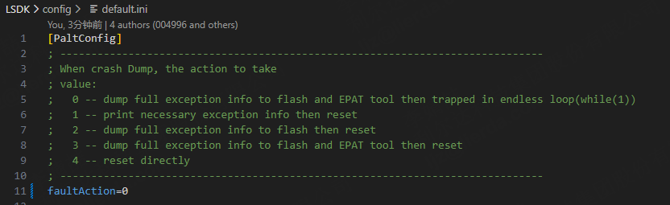

**备注**

- **0** - 将完整的异常信息转储到闪存（flash）和EPAT工具中，然后进入一个无限循环（while(1)）。这意味着系统会保存错误信息，但不会重启，而是会停止运行，等待调试。
- **1** - 打印必要的异常信息，然后重置系统。这种方式会输出一些关键的错误信息，然后重启设备，以便它能够尝试恢复或重新运行。
- **2** - 将完整的异常信息转储到闪存中，然后重置系统。这种方式会保存完整的错误日志，以便后续分析，然后重启设备。
- **3** - 将完整的异常信息转储到闪存和EPAT工具中，然后重置系统。这种方式提供了最完整的错误信息记录，同时也会重启设备。
- **4** - 直接重置系统。这种方式不会保存任何错误信息，直接重启设备。

### 3.2 抓取dump

1. 首先务必保证EPAT工具中的comdb.txt文件导入正确

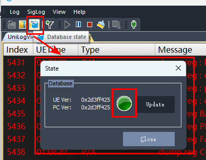

2. 配置设置完之后，即可复现并使用EPAT工具抓取系统异常现场。系统异常触发后，EPAT自动弹出RamDump窗口，dump文件自动保存至指定目录，出现如下界面说明系统异常情况已复现完毕，界面如下：

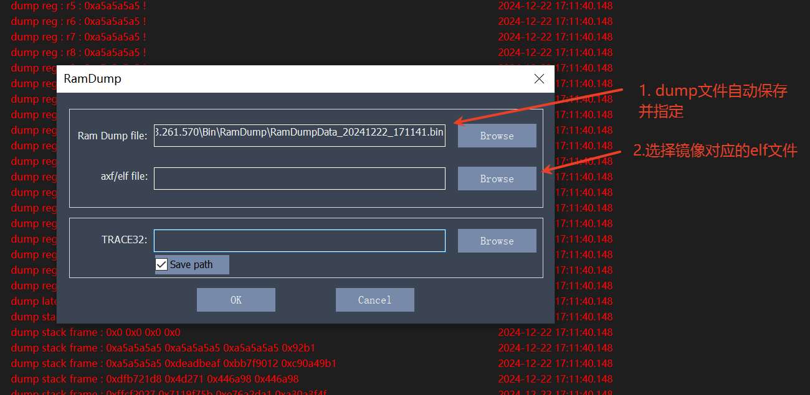

3. 如果需要立即分析dump，请看第4章，如果需要保存dump稍后分析，请看3.3章

### 3.3 保存dump分析所需文件

1. 点击EPAT工具栏中的Save，保存log。

2. 保存comdb文件：`LSDK\gccout\[工程名称]\comdb.txt`。

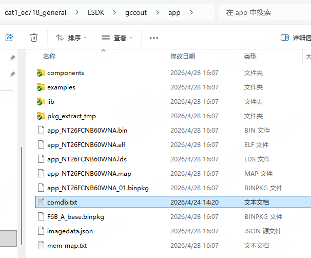

3. dump文件默认保存在工具如下目录中：`EPAT_V1.3.301.659\Bin\RamDump`，请保存最新的bin文件，示例如下：

4. 保存系统异常固件对应底包中的elf文件：`LSDK\components\basePkg\[底包模组型号]\ap_lierda_app.elf`。

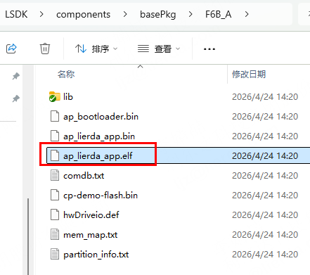

5. 保存系统异常固件中的elf和map文件：`LSDK\gccout\[工程名称]\[工程名称]_[模组型号].elf` 和 `LSDK\gccout\[工程名称]\[工程名称]_[模组型号].map`

## 4 分析系统异常dump

### 4.1 TRACE32文件导入

1. 如果是重新打开的系统异常log，没有RamDump界面，则通过菜单栏中的 `Log->RamDump`，重新打开解析界面。

2. 分别选择三个文件：

- **Ram Dump file：** 选择 `EPAT_V1.3.301.659\Bin\RamDump` 中对应的bin文件
- **axf/elf file：** 选择底包的 `ap_lierda_app.elf` 文件（位于 `LSDK\components\basePkg\[底包模组型号]\` 中）
- **TRACE32：** trace32可执行文件 `t32marm64.exe`（位于 `TRACE32_R_2023_02_000159199\bin\windows64\` 中）

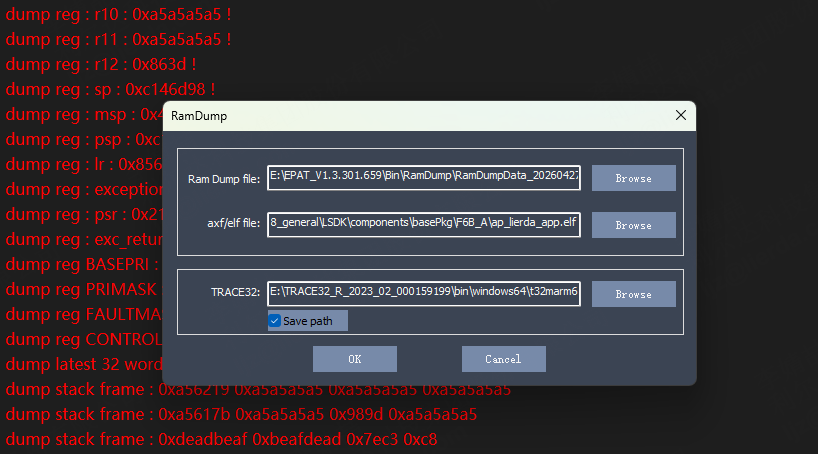

3. 勾选Save patch，后续会自动加载trace32路径。

4. 点击 OK 后会自动打开trace32解析dump。

5. 查看系统异常调用的任务栈信息。若系统异常发生在中断或HardFault处理期间，任务栈可能已被破坏，此时调用栈信息可能不完整。

6. 再导入APP中的elf文件：将APP中编译出来的elf拖到TRACE32的指令框中

7. 在后面加上 `/nocode /noclear`

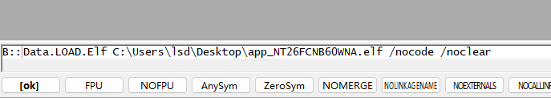

8. 回车后显示elf文件导入成功

### 4.2 解析dump

#### 4.2.1 普通dump解析

1. 可以先查看UniLog，确认系统异常前代码大致跑到哪里了，从 **Current fault action : 0** 往上面搜索一下自己增加的log。

2. 确认任务运行情况
   
   由任务列表可知，系统异常发生于**优先级为12**的**appUserTask**任务。

3. 在任务栈中确认系统异常发生的函数

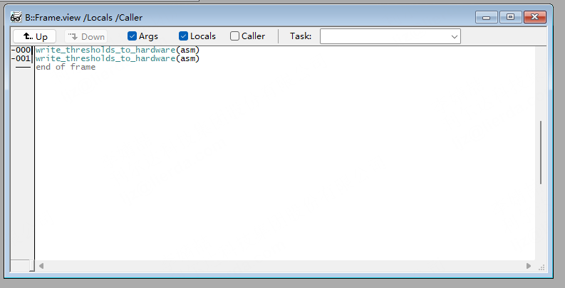

4. 系统异常日志可以看到系统异常发出时PC指针地址

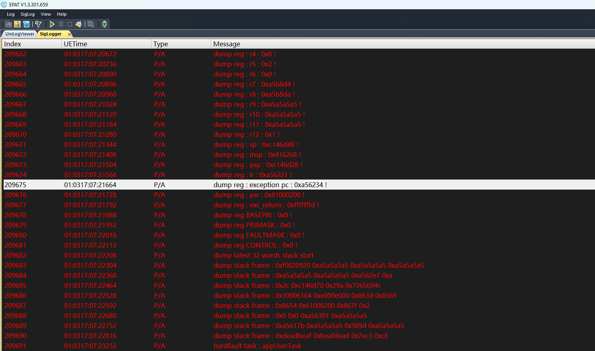

5. 打开map文件，路径是：`LSDK\gccout\[工程名称]\[工程名称]_[模组型号].map`，也可以看出是在该函数中发生了系统异常。

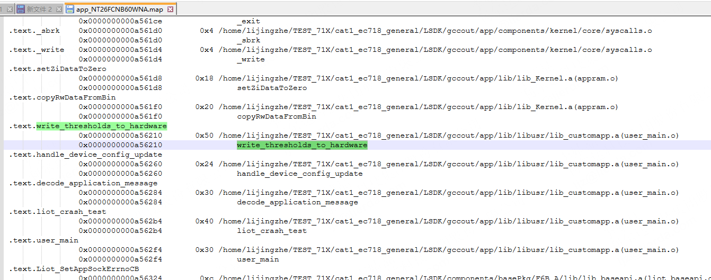

#### 4.2.2 任务栈无法确定系统异常函数的dump解析

1. 我们也会遇到一种情况：当前任务栈中，只能看到PC内容，但是无法查看任务栈执行的位置

2. 我们可以在TRACE32工具中进行手动回溯：命令行中输入：`d.dump R(SP)`，然后回车，SP是栈指针

3. 弹出的窗口中指针指向的地方，就是栈指针的信息

系统异常发生后，CPU 从非法地址 `0x41414140` 取指，触发硬件级别的 HardFault 异常。此时ARM 硬件会强制触发一个"紧急备份机制"：CPU 会自动将当前的 8 个核心寄存器（R0, R1, R2, R3, R12, LR, PC, xPSR）压入栈中，以保存系统异常现场！

- **0C146D5C**：61000200 (状态寄存器 xPSR)
- **0C146D58**：41414140 (该地址为触发异常的 PC 值！)
- **0C146D54**：00A56279 (LR 连接寄存器)
- **0C146D50**：00000001 (R12)
- **0C146D4C**：F0020920 (R3)
- **0C146D48**：0000000C (R2)
- **0C146D44**：00000000 (R1)
- **0C146D40**：00000000 (R0)

我们也可以在工具中查看到相关寄存器信息 `View->Registers`

4. 可以通过查看**LR寄存器（Link Register，返回地址）**来定位问题
   
   原理：LR 寄存器存放的是"当前函数执行完后，应该回到哪一行代码"。既然系统异常发生在函数内部，这个地址通常指向**调用这个受损函数的上一级函数**。
   
   前面已经确认LR寄存器中的值是 `00A56278`，那在Trace32中输入命令 `Data.List 0x00A56278`

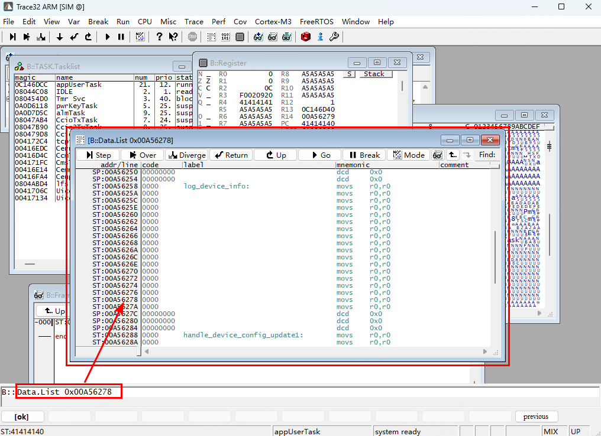

同样也可以看出当前代码是在 `log_device_info` 中发生的系统异常

5. 有了如上的分析可以总结出：系统在执行 `log_device_info` 时，由于缓冲区溢出覆盖了栈上的 PC 返回地址（地址 `0x0C146D58` 被篡改为 `0x41414140`），导致程序跳转非法地址触发 HardFault。

## 5 常见Dump及原因说明

### 5.1 任务栈溢出

系统异常发生时，日志异常打印可以看到对应的日志提示。但是也有可能每一次系统异常都发生在不同的任务而毫无规律，这个时候我们就要注意检查多个任务中共同调用的接口，释放存在任务栈溢出。

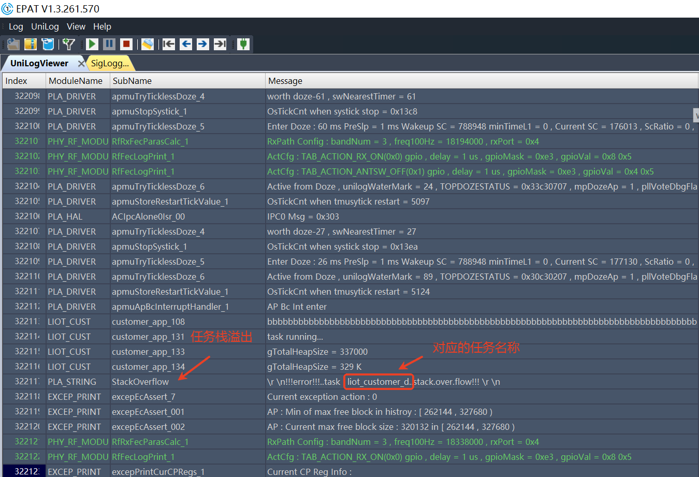

系统异常示例代码：

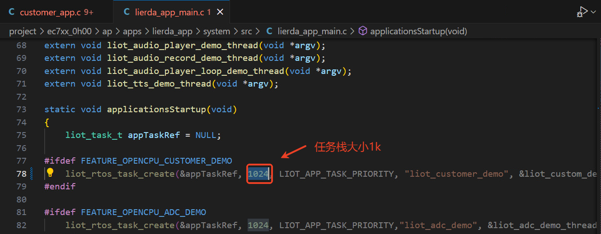

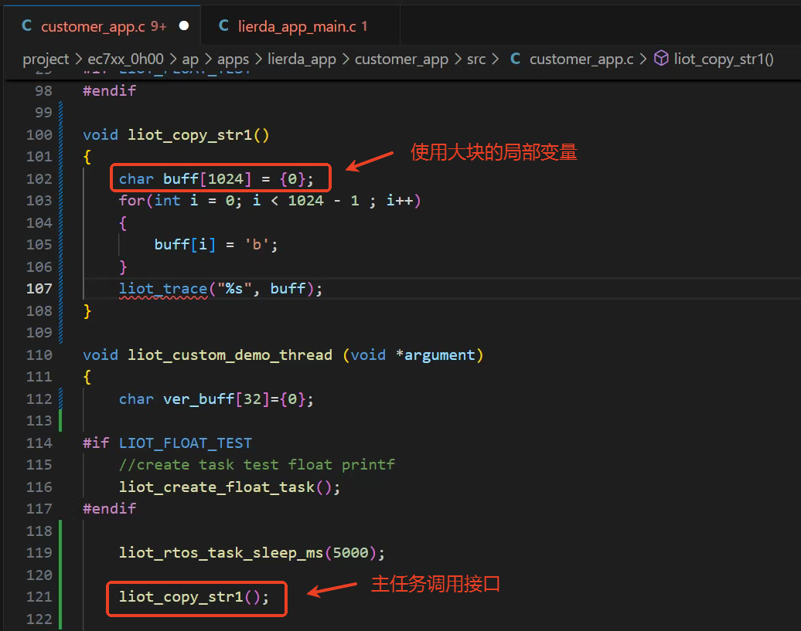

**备注**

**如何避免任务栈溢出**

- 合理设置任务栈大小：根据任务内接口调用的深度与每个函数局部变量的大小合理设置任务栈空间，一般设置2k/4k/8k等，特殊情况也可以设置更大。
- 减少大块局部变量：将接口中较大的局部变量（超过512字节）修改为malloc申请内容。
- 减少递归调用：因为递归调用会消耗大量栈空间。
- 优化函数调用：减少不必要的函数调用，尤其是嵌套调用。

### 5.2 看门狗超时

系统看门狗超时时间为20s，应用业务如果在20s高频循环，导致软件未及时喂狗，会引起看门狗异常，系统复位。

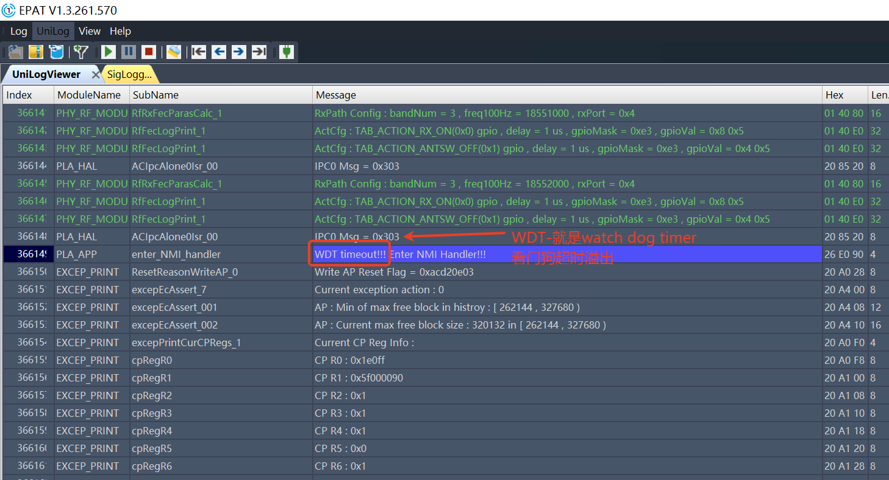

**备注**

**如何避免看门狗超时**

- 高频循环，tts播放、图片解码等循环操作手动进行喂狗 `WDT_kick();` 与 `slpManAonWdtFeed();`
- 合理配置任务优先级，不将应用优先级设置过高。

### 5.3 内存不足系统异常

内存泄漏是经常遇到的问题，重点检查异常分支时内存的释放，量产前需进行长时间稳定性挂测，保证无异常。

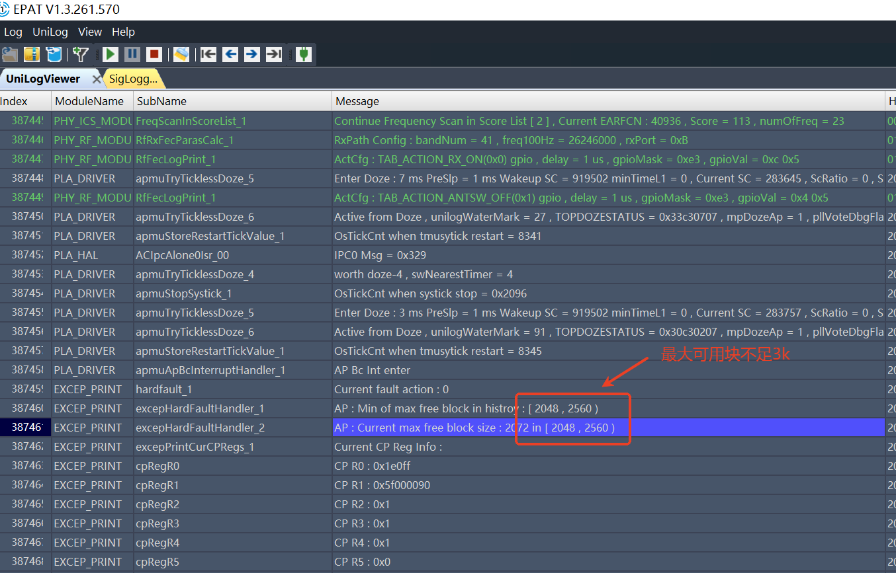

### 5.4 重复释放内存

断言发生在 `tlsf_free` 函数，第2012行。

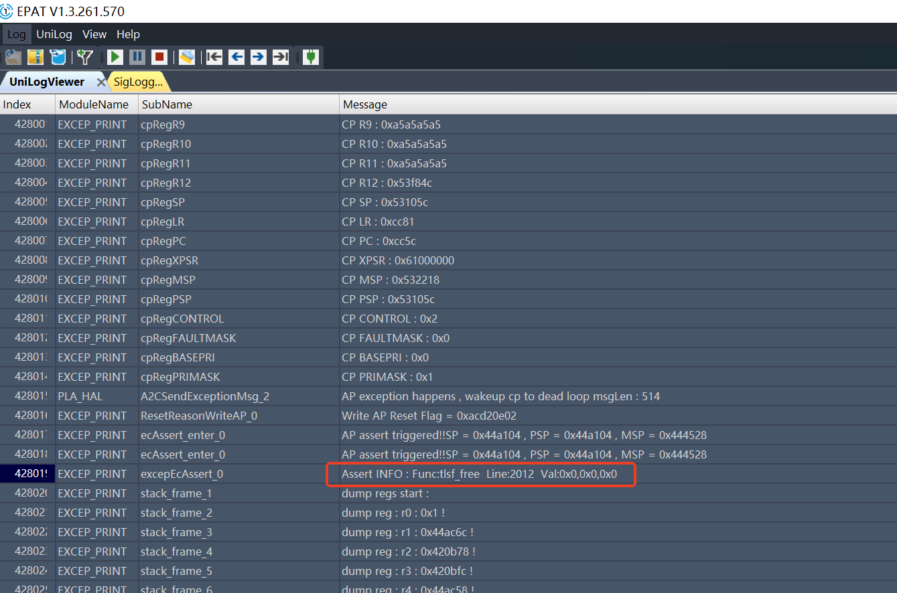

通过代码定位，可以看到断言日志提示该block已标记为释放。

## 6 相关注意事项

以上说明了系统异常问题简单分析步骤，dump文件的解析步骤，比较明显的系统异常问题可以进行初步分析，如果初步分析无法定位到系统异常原因，则尝试对单模块任务进行调试，明确异常发生问题点，多次尝试都无法解决系统异常问题，可以将第3.3章中保存dump分析所需文件打包发送FAE，反馈内部研发分析支持。

