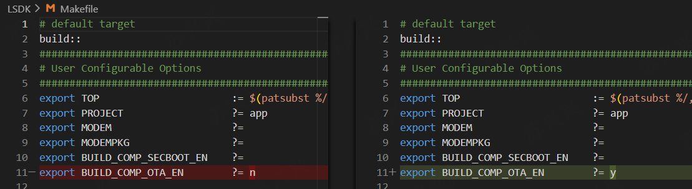
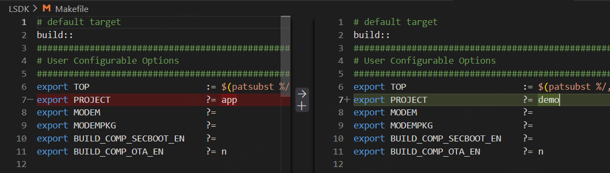
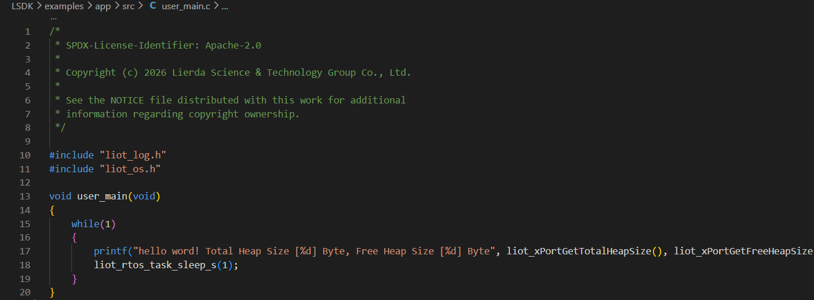
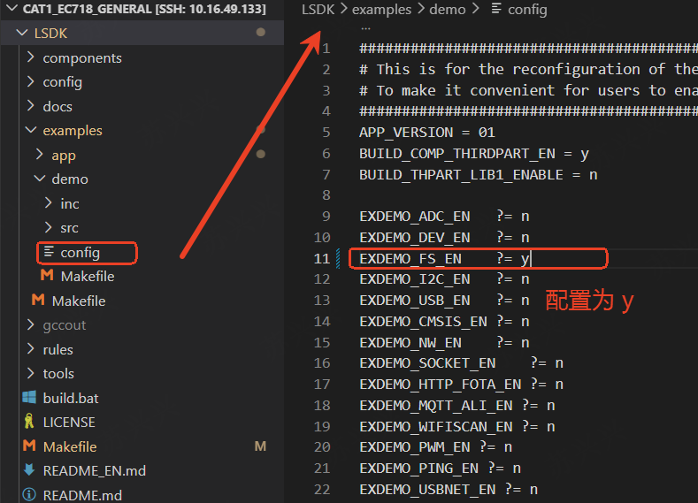
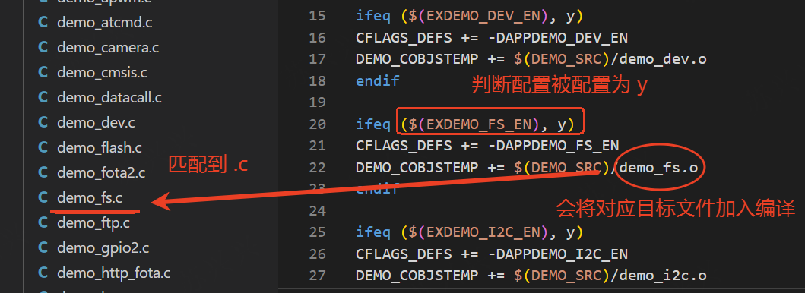
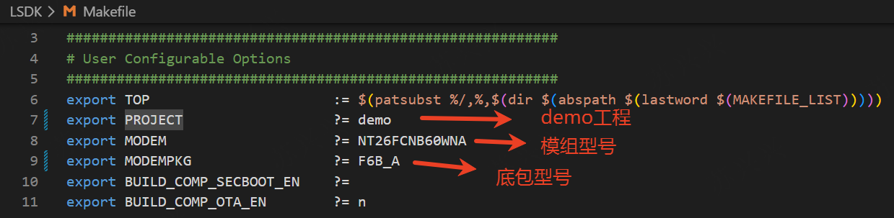
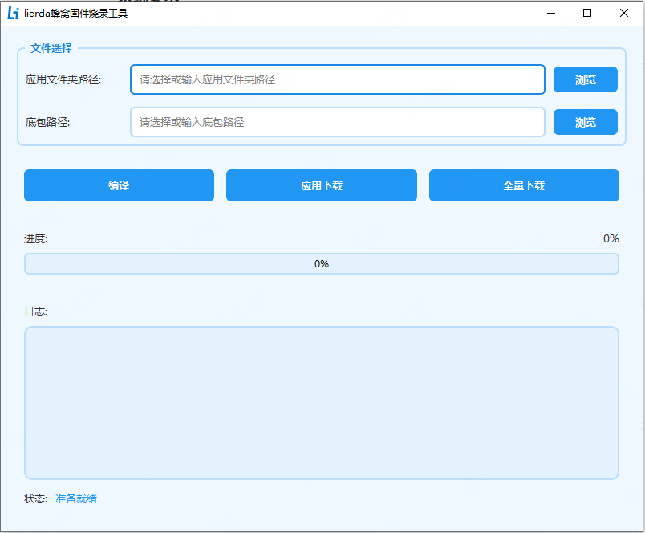

# 新手开发指南_Rev1.0

{link_to_translation}`en:[English]`

## 文件修订历史

| 版本 | 日期 | 作者 | 审核 | 修订内容 |
| ---- | ---- | ---- | ---- | ---- |
| Rev1.0 | 2026-01-29 | sxx | zlc | 创建文档 |

## 1 简介

本文旨在指导开发者快速熟悉底包分离方式 SDK 开发流程，引导用户熟悉 SDK 各功能模块并开始在 SDK 上进行自己的开发工作。

SDK 在设计方面可以划分为三层：底包层、系统层和用户层。

1. 底包层：底包层对于用户不可见，是由 Lierda 维护的，针对特定型号将库文件打包成目录后放在 `components/basePkg/` 目录下，开发者在编译时根据自己手里的硬件型号选择对应型号的底包即可，具体选择方式参考下文 4.1 节。
2. 系统层：系统层运行底包分离的核心代码，是底包分离系统加载的入口，包含 kernel、配置、驱动、开源第三方库、TTS、OTA 升级等。
3. 用户层：用户层是开发者自己的开发代码的区域，主要集中在 `examples` 目录下。Lierda 为开发者预设了两个工程：app 和 demo。app 工程是一个空工程，没有实现具体功能，一般用户可以基于 app 工程上开发自己的代码。demo 工程是 Lierda 为客户提供的 API 接口示例的 demo，给用户参考调用。客户也可以参考 app 在 `examples/` 目录下创建自己的工程，代码入口为 `void user_main(void)`，会在系统层启动后自动调用。

<div align="center">


</div>

## 2 目录结构一览

```
├── components （组件库，核心代码都放在这里）
│   ├── basePkg （底包目录）
│   │     └── F6B_A、F7B_A、F6D_A、K2B_A、...
│   ├── driver（开放的底层驱动）
│   │     └── lcd、camera、...
│   ├── kernel
│   │      └── app.ld、core、ecapi、include、lierda_api
│   ├── ota （fota 相关代码）
│   ├── precfg（预设相关配置代码实现）
│   ├── secboot（安全启动校验相关代码）
│   ├── thirdparty（开源第三方的源码）
│   │     └── CJSON、freertos、websockets、lwip、mbedtls 等
│   ├── tts（tts 相关代码）
├── config
│      └── default.ini（预设相关配置）
│      └── iodriver.ini（驱动的 io 引脚配置预设）
├── docs（相关文档）
├── examples
│      └── app（默认工程）
│      └── demo（默认示例 demo 工程）
├── LICENSE、build.bat、Makefile、README.md
├── rules（Makefile 编译规则）
├── tools（脚本及工具）
```

## 3 功能介绍

### 3.1 底包 basePkg

底包层由 Lierda 维护、针对不同型号的模组和不同支持功能的组合给出多个底包版本，客户根据自己的需求选择底包，底包一般放在 `components/basePkg/` 目录下。

底包型号自定更改根目录 Makefile 文件，`MODEMPKG` 设置为自己的底包型号。

<div align="center">


</div>

#### 3.1.1 版本型号对应表

目前支持的版本和型号如下：

| 版本 | 说明 | 适配模组型号 |
| ---- | ---- | ---- |
| F6B_A | EC718PM、B 系列 | NT26FCNB10WNA、NT26FCNB30WNA、NT26FCNB60WNA、NT26FCNB70WNA |
| F6D_A | EC718PM、D 系列 | NT26F6D0、NT26F7D0 |
| F7B_A | EC718PM、B 系列、Volte | NT26FCNB70WNA |
| K2B_A | EC716E、B 系列 | NT26KCNB20NNA、NT26KCNB2MNNA、NT26K2B1 |

#### 3.1.2 底包文件介绍

- lib: API 动态库，编译后内存占用在用户空间，是底包提供给上层的 API 具体实现。
- ap_lierda_app.elf：用于抓到死机 dump 后，解析 dump 使用。
- ap_bootloader.bin：bootloader 可执行 bin 文件。
- ap_lierda_app.bin：底包 ap 侧可执行 bin 文件。
- cp-demo-flash.bin：底包 cp 侧可执行 bin 文件。
- comdb.txt：日志库，用于配合 EPAT 工具抓取日志使用。
- hwDriveio.def：底包中驱动 IO 的默认引脚配置表，参考用不参与编译。
- mem_map.txt：底包宏定义一览表，用于生成合包。
- partition_info.txt：底包 FLASH 分区分布表。

### 3.2 预设配置 Config

预设配置 config，可以直接预设一个参数值，掉电保存，不用再额外调用 API 设置，也可以直接预设驱动外设的 IO 引脚。

`default.ini` 和 `iodriver.ini` 最终通过工具转换为宏控，最终在 `components/precfg/` 中生成表格，系统加载时传给底包并生效。

**备注：** 仅在全擦烧录后第一次开机生效，之后的值只跟随 API 修改而变换且掉电保存。

#### 3.2.1 default.ini

`Config/default.ini` 提供了配置一些默认值的方法，具体如下：

| 值 | 功能 | 说明 |
| ---- | ---- | ---- |
| faultAction | 死机时执行操作 | 0-死循环, 1-打印后重启, 2-dump后重启, 3-dump+EPAT后重启, 4-直接重启 |
| logControl | unilog 开关 | 0-禁用, 1-仅sw log, 2-全部log |
| logPortSel | unilog 输出口 | 0-USB, 1-UART, 2-MIX |
| usbCtrl | USB 控制 | 0-启用USB+RNDIS, 1-启用USB不枚举RNDIS, 2-禁用USB |
| usbNet | USB 网络 | 0-RNDIS, 1-ECM, 2-默认RNDIS/Win切ECM, 3-默认ECM/Win切RNDIS |
| usbSlpMask | USB 控制休眠 | 0-禁用, 1-启用 |
| netcid | 上网承载 cid | 0-15 |
| AutoDial | USB 网卡自动上网 | 0-关, 1-开 |
| uart1At | UART1 AT 开关 | 0-关, 1-开 |
| appLogPort | 底包层日志输出口 | 0-USBAT, 1-UART2, 3-系统接口 |
| uartbootloader | UART 默认波特率 | 支持 600~3000000 |
| apn | APN | APN 字符串，最大 99 字节 |

#### 3.2.2 iodriver.ini

`Config/iodriver.ini` 提供了配置驱动 IO 引脚的方法，支持 UART、I2C、SPI、CSPI、I2S 等外设的引脚配置。

### 3.3 全量 OTA 升级

全量 OTA 作为 SDK 一个重要的功能，全量 OTA 组件用于生成 FOTA 功能相关文件，在使用 OTA 功能时开启，该功能默认关闭。

**注意：** F7B_A、K2B_A 系列的底包不支持该功能。

更改根目录 Makefile 文件，`BUILD_COMP_OTA_EN` 设置为 Y 后开启 OTA 功能。

<div align="center">



</div>

### 3.4 SECBOOT 安全验证启动

在一些安全等级要求较高的场景下，需要保证模组固件不会被随意烧录，只能烧录自己经过密钥校准并验证过的固件。

SDK 中的 SECBOOT 功能只用于加密校验底包分离模式下 APP 部分在二次烧录后的固件。底包部分的加密由 Lierda 提供带加密验证的底包，需要时请联系对接销售定制特定的底包。

更改根目录 Makefile 文件，`BUILD_COMP_SECBOOT_EN` 设置为 Y 后开启 SECBOOT 功能。

<div align="center">


</div>
## 4 示例代码

用户代码在 `examples` 中添加自己的工程。SDK 提供了两个基本工程 app 和 demo。

app 工程是一个空工程，客户可以基于此工程进行开发。demo 工程是 API 示例工程，Lierda 为开发者提供了丰富的示例代码场景，客户可以参考该工程中的示例 demo 编写。

更改根目录 Makefile 文件，`PROJECT` 设置为对应的工程目录名称，会在编译时自动链接到对应的 `examples/$(PROJECT)/Makefile`，由该 Makefile 文件管理 PROJECT 中的代码。

<div align="center">



</div>

每一个 PROJECT 工程中的入口函数是固定的：`void user_main(void)`，用户实现 `user_main` 函数，并基于此接口开发自己的代码。

### 4.1 app

app 工程在 `user_main.c` 中实现了一个打印当前内存的功能。

<div align="center">



</div>

### 4.2 demo

`example/demo` 是 Lierda 提供给客户的示例代码。同样由接口 `demo_main.c` 中 `user_main` 加载启动。

#### 4.2.1 编译 demo 工程

编译 demo 工程，更改根目录 Makefile 文件，`PROJECT` 设置为 demo。

#### 4.2.2 打开要运行的 demo

将自己想要测试的 DEMO 配置成 y 后，正常进行编译即可。

<div align="center">



</div>

#### 4.2.3 如何寻找 config 中对应的示例 demo

目前所有的 demo 都在 `LSDK/examples/demo/src` 目录下。

config 配置文件中的变量遵循 Makefile 规则，以 `EXDEMO_FS_EN` 为例，在 config 文件中设置为 y。

在 `LSDK/examples/demo/Makefile` 文件中，根据 `EXDEMO_FS_EN` 变量编译对应的 `demo_fs.c` 文件。

<div align="center">



</div>

## 5 用户添加代码

### 5.1 添加自己的源码

客户的代码都集中在 `LSDK/app` 目录下，在 `LSDK/app/src` 中添加自己的代码，在 `user_main.c` 中调用自己的接口。

<div align="center">


</div>

### 5.2 用户添加自己的工程

`examples/` 目录是 SDK 默认存放工程的目录。在 `examples/` 目录下参考 app 工程创建自己的工程。推荐：复制 app 到同级目录下并更名为自己的工程名称。

更改根目录 Makefile 文件，`PROJECT` 设置为"自己的工程名"。

注意事项：

1. 工程目录的入口函数必须为：`void user_main(void)`。
2. 工程目录的根目录下必须有 Makefile 文件，用于工程目录内部的编译规则。

<div align="center">


</div>

## 6 编译

### 6.1 确认自己的型号和工程

1. 根据手中具体的模组型号在 3.1 章节中找到自己的底包名称，如：NT26FCNB60WNA -> F6B_A
2. 在根目录 Makefile 中修改 PROJECT、MODEM、MODEMPKG

```makefile
export PROJECT    ?= demo
export MODEM      ?= NT26FCNB60WNA
export MODEMPKG   ?= F6B_A
```

<div align="center">



</div>

### 6.2 命令行编译

#### 6.2.1 使用命令行编译（Windows）

进入 LSDK 根路径使用 `build.bat` 脚本进行编译：

```shell
cd LSDK
./build.bat                # 增量编译
./build.bat all            # 全清编译
./build.bat all PROJECT=demo MODEM=NT26FCNB60WNA MODEMPKG=F6B_A  # 带参数编译
```

<div align="center">


</div>

#### 6.2.2 Linux 编译

进入 LSDK 根路径使用 Make 进行编译：

```shell
cd LSDK
make                       # 增量编译
make all                   # 全清编译
make all PROJECT=demo MODEM=NT26FCNB60WNA MODEMPKG=F6B_A  # 带参数编译
```

<div align="center">


</div>

#### 6.2.3 更多带参数的编译

SDK 的参数规则是基于 Makefile 的编译传参规则实现的，即：Makefile 文件中的变量都可以传参实现，如：

1. 基于 demo 工程直接指定 `EXDEMO_FS_EN` 编译 FS 示例代码：`make all PROJECT=demo EXDEMO_FS_EN=y`
2. 打开 OTA 升级的编译：`make all PROJECT=demo BUILD_COMP_OTA_EN=y`

**传参为什么不生效？** 在 Makefile 中所有变量都可以在 Make 命令执行时传参的。传参后按照 Makefile 规则继续执行。如果传参时变量给了初始值，但是在 Makefile 后续运行中，变量被修改则会按照后续修改的值运行，则传参失效。

### 6.3 Lierda Tools 工具编译

Lierda Tools 工具目前仅支持 Windows 下使用，Linux 下请使用命令行编译。详细使用方法参考《Lierda 蜂窝固件烧录工具使用指导_Rev1.0》。

<div align="center">



</div>

## 7 烧录

编译完成后会在根目录下生成 `gccout/` 目录。`gccout/` 目录下是所有编译生成产物，根据 PROJECT 工程名称存放，以 demo 工程、硬件型号 NT26FCNB60WNA 为例：

<div align="center">


</div>

生成物介绍：

- `demo_NT26FCNB60WNA_01.binpkg`：底包+应用层的和包
- `demo_NT26FCNB60WNA.bin`：仅有包含应用层的包
- `F6B_A_base.binpkg`：仅包含底包不包含应用的和包
- `comdb.txt`：用于配合 EPAT 工具抓取日志的日志库

烧录工具使用 FlashTools，工具使用文档可以参考《Lierda NT26F&NT26K-CN 固件升级应用指导_Rev1.0》。

### 7.1 烧录底包+应用层的和包

<div align="center">


</div>

### 7.2 烧录纯底包

<div align="center">


</div>

