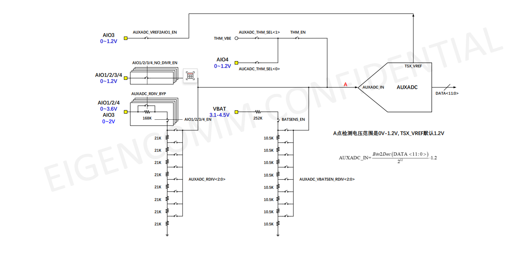
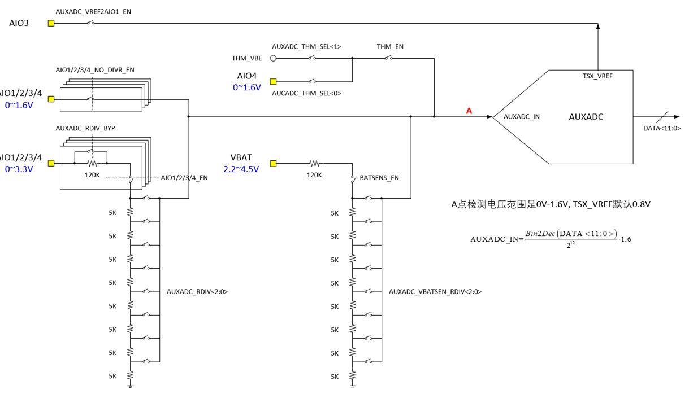

# ADC 开发指导_Rev1.0

{link_to_translation}`en:[English]`

## 修订记录

| **版本** | **日期** | **作者** | **修订内容** |
| ---- | ---- | ---- | ---- |
| Rev1.0 | 2023-09-11 | WTY | 创建文档 |
| Rev1.1 | 2024-03-25 | SXX | 更改文档名称 |
| Rev1.2 | 2024-08-28 | ZLC | 新增参考电压说明 |
| Rev1.3 | 2024-10-23 | YMX | 调整文档格式，增加电压、温度范围说明 |
| Rev1.4 | 2025-02-12 | ZLC | 增加EC716 liot_adc_resdiv_e 说明 |
| Rev1.4 | 2025-04-18 | ZLC | 增加对EC718系列内部与外部分压使用的说明 |
| Rev1.5 | 2025-04-18 | 张浩 | 增加系列常见问题 |
| Rev1.6 | 2025-08-22 | ZLC | 修改内外部电压参考说明 |
| Rev1.7 | 2026-04-23 | LJZ | 优化文档。修改引言部分，增加电压范围及误差。 |

## 1 引言

本文档介绍 NT26 系列 ADC 接口 API 情况，API 接口位于 `components/kernel/lierda_api/liot_adc/liot_adc.h` 文件声明。

### 1.1 模组ADC资源总览

- **NT26-KCN（EC716）**：4 路 ADC
  - 2 路外部 AIO 电压检测
  - 1 路内部温度传感器
  - 1 路 VBAT 电池电压检测

如下是平台716系列内部分压阻值：

<div align="center">



</div>

| 模组通道 | 说明 | 外部可输入电压范围 | 误差 |
| ---- | ---- | ---- | ---- |
| ADC0~1 | 信号不经过分压，直接进AUXADC输入口，适用于外部分压 | 0V ~ 1.2V | 常温下±2mV以内 |
| ADC0~1 | 经过内部分压，最终AUXADC输入电压仍在0-1.2V | 0V ~ 3.6V | 常温下±20mV以内 |
| VBAT 通道 | VBAT电压经过分压电路到达AUXADC输入口 | 3.1V ~ 4.5V | 常温下±20mV以内 |
| 温度传感器 | 芯片内部温度检测 | -40°C ~ 85°C | 千分之一左右 |

- **NT26-FCN（EC718）**：6 路 ADC
  - 4 路外部 AIO 电压检测
  - 1 路内部温度传感器
  - 1 路 VBAT 电池电压检测

如下是平台718系列内部分压阻值：

<div align="center">



</div>

| 模组通道 | 说明 | 外部可输入电压范围 | 误差 |
| ---- | ---- | ---- | ---- |
| ADC0~3 | 信号不经过分压，直接进AUXADC输入口，适用于外部分压 | **0V ~ 1.6V** | 常温下±2mV以内 |
| ADC0~3 | 经过内部分压，最终AUXADC输入电压仍在0-1.6V | **0V ~ 3.3V** | 常温下±20mV以内 |
| VBAT 通道 | VBAT电压经过分压电路到达AUXADC输入口，建议选择分压比4/16 | **2.2V ~ 4.8V** | 常温下±20mV以内 |
| 温度传感器 | 芯片内部温度检测 | **-40°C ~ 85°C** | 千分之一左右 |

**超压警告**：超出电压范围会导致采样失真、精度失效，**严重会烧毁 ADC 与模拟电路，无法修复**。

## 2 API 函数概览

| **函数** | **说明** |
| ---- | ---- |
| `liot_adc_get_volt()` | 读取 ADC 通道中的模拟电压值 |
| `liot_adc_get_volt_raw()` | 读取 ADC 通道中的模拟电压值源数据 |

## 3 类型说明

### 3.1 liot_adc_errcode_e

ADC API 执行结果错误码。

声明：

```c
typedef enum
{
    LIOT_ADC_SUCCESS             = 0,
    LIOT_ADC_INVALID_PARAM_ERR   = 10 | (LIOT_COMPONENT_BSP_ADC << 16),
    LIOT_ADC_GET_VALUE_ERROR     = 50 | (LIOT_COMPONENT_BSP_ADC << 16),
    LIOT_ADC_MEM_ADDR_NULL_ERROR = 60 | (LIOT_COMPONENT_BSP_ADC << 16),
    LIOT_ADC_TASK_ERROR,
} liot_adc_errcode_e;
```

参数：

- `LIOT_ADC_SUCCESS`：读取成功。
- `LIOT_ADC_INVALID_PARAM_ERR`：无效参数。
- `LIOT_ADC_GET_VALUE_ERROR`：读取失败。
- `LIOT_ADC_MEM_ADDR_NULL_ERROR`：指针地址为空。
- `LIOT_ADC_TASK_ERROR`：ADC任务错误。

### 3.2 liot_adc_chan_id_e

ADC转换通道选择。

声明：

```c
typedef enum
{
    LIOT_ADC0_CHANNEL,
    LIOT_ADC1_CHANNEL,
    LIOT_ADC2_CHANNEL,
    LIOT_ADC3_CHANNEL,
    LIOT_ADC_THERMAL_CHANNEL,
    LIOT_ADC_VBAT_CHANNEL,
    LIOT_ADC_CHANNEL_MAX,
} liot_adc_chan_id_e;
```

参数：

- `LIOT_ADC0_CHANNEL`：ADC0通道
- `LIOT_ADC1_CHANNEL`：ADC1通道
- `LIOT_ADC2_CHANNEL`：ADC2通道
- `LIOT_ADC3_CHANNEL`：ADC3通道
- `LIOT_ADC_THERMAL_CHANNEL`：内部温度传感器通道
- `LIOT_ADC_VBAT_CHANNEL`：电源电压通道
- `LIOT_ADC_CHANNEL_MAX`：ADC通道数量（该参数不可用）

### 3.3 liot_adc_resdiv_e

ADC 分压选择。

**注意事项：**

- 温度传感器没有分压。
- VBAT检测内部分压 6/32，暂不支持修改。
- ADC 0~3 的718系列与716系列分压不同，详情见下方枚举值。
- `LIOT_ADC_AIO_RESDIV_BYPASS` 为外部分压方式，其余为内部分压方式。
- EC718 非 PM 系列，内部分压时 `LIOT_ADC_AIO_RESDIV_RATIO_1OVER32` ~ `LIOT_ADC_AIO_RESDIV_RATIO_8OVER32` 可以使用，`LIOT_ADC_AIO_RESDIV_RATIO_12OVER32` ~ `LIOT_ADC_AIO_RESDIV_RATIO_28OVER32` 不可以使用，会导致芯片内部超压。

声明：

```c
// EC718
typedef enum
{
    LIOT_ADC_AIO_RESDIV_RATIO_1        = 0U,  /**< ADC AIO RESDIV select as VIN */
    LIOT_ADC_AIO_RESDIV_RATIO_28OVER32 = 1U,  /**< ADC AIO RESDIV select as 28/32 VIN */
    LIOT_ADC_AIO_RESDIV_RATIO_24OVER32 = 2U,  /**< ADC AIO RESDIV select as 24/32 VIN */
    LIOT_ADC_AIO_RESDIV_RATIO_20OVER32 = 3U,  /**< ADC AIO RESDIV select as 20/32 VIN */
    LIOT_ADC_AIO_RESDIV_RATIO_16OVER32 = 4U,  /**< ADC AIO RESDIV select as 16/32 VIN */
    LIOT_ADC_AIO_RESDIV_RATIO_12OVER32 = 5U,  /**< ADC AIO RESDIV select as 12/32 VIN */
    LIOT_ADC_AIO_RESDIV_RATIO_8OVER32  = 6U,  /**< ADC AIO RESDIV select as 8/32 VIN */
    LIOT_ADC_AIO_RESDIV_RATIO_7OVER32  = 7U,  /**< ADC AIO RESDIV select as 7/32 VIN */
    LIOT_ADC_AIO_RESDIV_RATIO_6OVER32  = 8U,  /**< ADC AIO RESDIV select as 6/32 VIN */
    LIOT_ADC_AIO_RESDIV_RATIO_5OVER32  = 9U,  /**< ADC AIO RESDIV select as 5/32 VIN */
    LIOT_ADC_AIO_RESDIV_RATIO_4OVER32  = 10U, /**< ADC AIO RESDIV select as 4/32 VIN */
    LIOT_ADC_AIO_RESDIV_RATIO_3OVER32  = 11U, /**< ADC AIO RESDIV select as 3/32 VIN */
    LIOT_ADC_AIO_RESDIV_RATIO_2OVER32  = 12U, /**< ADC AIO RESDIV select as 2/32 VIN */
    LIOT_ADC_AIO_RESDIV_RATIO_1OVER32  = 13U, /**< ADC AIO RESDIV select as 1/32 VIN */
    LIOT_ADC_AIO_RESDIV_BYPASS         = 14U, /**< BYPASS the whole ADC AIO RESDIV network(direct input) */
} liot_adc_resdiv_e;

// EC716
typedef enum
{
    LIOT_ADC_AIO_RESDIV_RATIO_1          = 0U,  /**< ADC AIO RESDIV select as VIN */
    LIOT_ADC_AIO_RESDIV_RATIO_14OVER16   = 1U,  /**< ADC AIO RESDIV select as 14/16 VIN */
    LIOT_ADC_AIO_RESDIV_RATIO_12OVER16   = 2U,  /**< ADC AIO RESDIV select as 12/16 VIN */
    LIOT_ADC_AIO_RESDIV_RATIO_10OVER16   = 3U,  /**< ADC AIO RESDIV select as 10/16 VIN */
    LIOT_ADC_AIO_RESDIV_RATIO_8OVER16    = 4U,  /**< ADC AIO RESDIV select as 8/16 VIN */
    LIOT_ADC_AIO_RESDIV_RATIO_7OVER16    = 5U,  /**< ADC AIO RESDIV select as 7/16 VIN */
    LIOT_ADC_AIO_RESDIV_RATIO_6OVER16    = 6U,  /**< ADC AIO RESDIV select as 6/16 VIN */
    LIOT_ADC_AIO_RESDIV_RATIO_5OVER16    = 7U,  /**< ADC AIO RESDIV select as 5/16 VIN */
    LIOT_ADC_AIO_RESDIV_RATIO_4OVER16    = 8U,  /**< ADC AIO RESDIV select as 4/16 VIN */
    LIOT_ADC_AIO_RESDIV_RATIO_3OVER16    = 9U,  /**< ADC AIO RESDIV select as 3/16 VIN */
    LIOT_ADC_AIO_RESDIV_RATIO_2OVER16    = 10U, /**< ADC AIO RESDIV select as 2/16 VIN */
    LIOT_ADC_AIO_RESDIV_RATIO_1OVER16    = 11U, /**< ADC AIO RESDIV select as 1/16 VIN */
    LIOT_ADC_AIO_RESDIV_BYPASS           = 12U, /**< BYPASS the whole ADC AIO RESDIV network(direct input) */
} liot_adc_resdiv_e;
```

参数：

- `LIOT_ADC_AIO_RESDIV_RATIO_1`：AIO 分压选择输入电压
- `LIOT_ADC_AIO_RESDIV_RATIO_28OVER32`：AIO 分压选择28/32输入电压
- `LIOT_ADC_AIO_RESDIV_RATIO_24OVER32`：AIO 分压选择24/32输入电压
- `LIOT_ADC_AIO_RESDIV_RATIO_20OVER32`：AIO 分压选择20/32输入电压
- `LIOT_ADC_AIO_RESDIV_RATIO_16OVER32`：AIO 分压选择16/32输入电压
- `LIOT_ADC_AIO_RESDIV_RATIO_12OVER32`：AIO 分压选择12/32输入电压
- `LIOT_ADC_AIO_RESDIV_RATIO_8OVER32`：AIO 分压选择8/32输入电压
- `LIOT_ADC_AIO_RESDIV_RATIO_7OVER32`：AIO 分压选择7/32输入电压
- `LIOT_ADC_AIO_RESDIV_RATIO_6OVER32`：AIO 分压选择6/32输入电压
- `LIOT_ADC_AIO_RESDIV_RATIO_5OVER32`：AIO 分压选择5/32输入电压
- `LIOT_ADC_AIO_RESDIV_RATIO_4OVER32`：AIO 分压选择4/32输入电压
- `LIOT_ADC_AIO_RESDIV_RATIO_3OVER32`：AIO 分压选择3/32输入电压
- `LIOT_ADC_AIO_RESDIV_RATIO_2OVER32`：AIO 分压选择2/32输入电压
- `LIOT_ADC_AIO_RESDIV_RATIO_1OVER32`：AIO 分压选择1/32输入电压
- `LIOT_ADC_AIO_RESDIV_BYPASS`：AIO 分压跳过内部分压网络

## 4 API 函数详解

### 4.1 liot_adc_get_volt

该函数用于读取 ADC 通道中未经过内部分压的电压值模拟电压值。

声明：

```c
liot_adc_errcode_e liot_adc_get_volt(liot_adc_chan_id_e liot_adc_channel_id, int *adc_value);
```

参数：

- `liot_adc_channel_id`：[in] 指定 ADC 通道。该 ADC 通道与实际 ADC 物理通道的对应关系详见 3.2 节说明；
- `adc_value`：[out] 量取的电压值。单位：mV。

温度检测返回值为真实值，如检测值33，实际温度33℃，温度检测范围：-40~85℃；

电压检测返回值/1000，如检测值3811，实际电压3.811V，检测范围：模组工作电压范围都可检测。

返回值：

`liot_adc_errcode_e`：执行结果码，请参考 3.1 节说明。

**注意：** 温度检测功能SDK版本需 ≥ V4.01

### 4.2 liot_adc_get_volt_raw

该函数用于读取 ADC 通道中经过内部分压后的模拟电压值源数据。

声明：

```c
liot_adc_errcode_e liot_adc_get_volt_raw(liot_adc_chan_id_e liot_adc_channel_id, liot_adc_resdiv_e liot_adc_div, int *adc_value);
```

参数：

- `liot_adc_channel_id`：[in] 指定 ADC 通道。该 ADC 通道与实际 ADC 物理通道的对应关系详见 3.2 节说明；
- `liot_adc_div`：[in] ADC 内部分压选择。详见 3.3 节说明；
- `adc_value`：[out] 量取经过内部分压后的电压值。单位：mV。

返回值：

`liot_adc_errcode_e`：执行结果码，请参考 3.1 节说明。

## 5 代码示例

示例代码参考 `examples/demo/src/demo_adc.c` 文件。

运行结果：

<div align="center">


</div>

## 6 常见问题

### 6.1 ADC 精度是多少？

详见模组ADC资源总览章节。

### 6.2 ADC 管脚浮空也能采样吗？

ADC 管脚浮空：

1. 如果不选择内部分压，则 ADC 内部是高阻态，输入电压不定，在无外部输入 ADC 信号的情况下有可能会检测到 100mv+ 的电压。
2. 选择内部分压，则 ADC 分压通路是低阻路径，ADC 浮空的情况下采样到的电压接近 0mv。

