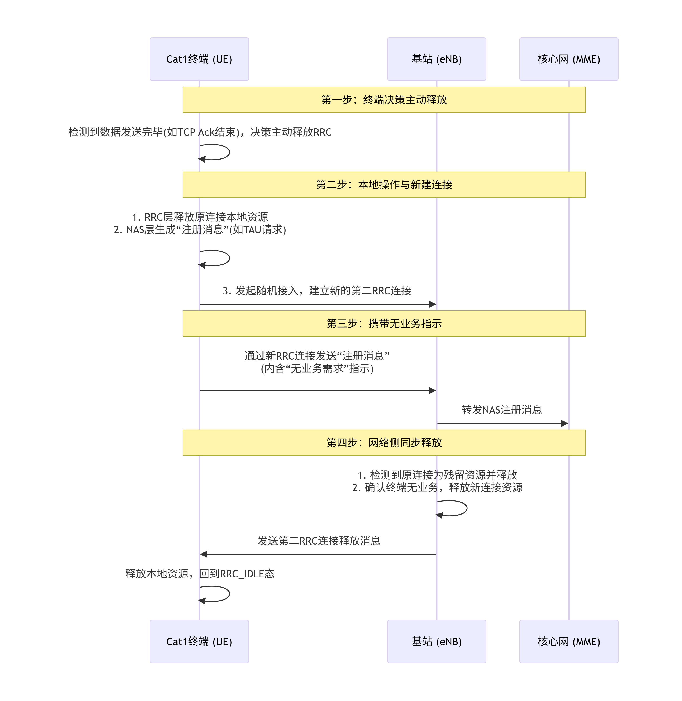
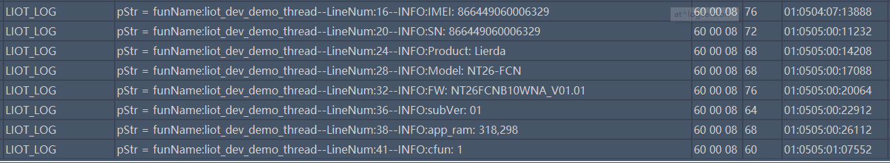

# 设备管理 开发指导\_Rev2.0

{link_to_translation}`en:[English]`

## 文件修订历史

| **版本** | **日期** | **作者** | **审核** | **修订内容** |
| --- | --- | --- | --- | --- |
| Rev1.0 | 23-09-19 | LJZ | zlc | 创建文档 |
| Rev1.1 | 24-03-25 | sxx |  | 更改文档名称 |
| Rev1.2 | 24-10-25 | LJZ |  | 修改文档格式 |
| Rev1.3 | 25-05-14 | LJZ |  | 优化文档格式 |
| Rev1.4 | 25-12-27 | ZLC |  | 新增API接口说明 |
| Rev1.5 | 26-02-25 | ZLC |  | 新增API接口说明 |
| Rev2.0 | 26-03-03 | YMX |  | 修改文档格式 |

## 1 简介

本文档介绍 LTE-EC71X 设备管理 接口 API 情况， API 接口位于 components/kernel/lierda_api/liot_dev/liot_dev.h 文件声明。

### 1.1 部分原理说明

#### 1.1.1 RRC快速释放原理

1.  LTE标准的RRC连接释放机制
    

在传统LTE网络中，RRC连接的释放完全由网络侧（基站）控制。基站会为每个UE（用户终端）维护一个**不活动定时器**（Inactivity Timer）。

*   **工作原理**：当UE和基站之间停止数据传输时，该定时器启动。如果在定时器超时（例如10秒或20秒）前没有新的数据传输，基站就会主动向UE发送 `RRCConnectionRelease` 消息，命令UE释放连接，回到RRC\_IDLE状态以节省功耗。
    
*   **存在问题**：这种机制依赖于网络侧的配置。在一些网络中，如果基站未配置该定时器或定时器设置过长，UE就会长时间滞留在连接态，造成不必要的电量消耗。
    

1.  RRC快速释放的核心原理：终端主动触发
    
    为了克服上述问题，实现“快速释放”，提出并应用了一种**终端主动触发**的优化方案。其核心思想是：**让终端根据自己的业务模型，在确认数据发送完毕后，立即主动发起流程，促使网络释放RRC连接。**
    
    其工作原理可以通过以下几个步骤来说明：
    
    
    
2.  RRC快速释放的应用意义
    
    **显著降低功耗**：Cat1主要面向物联网（IoT）市场，如智能穿戴、工业传感器等，对功耗极为敏感。通过将RRC连接的保持时长从网络侧控制的10秒级缩短到终端业务结束后的毫秒或秒级，能大幅延长设备的电池续航时间。
    
3.  操作的弊端
    

*   **由于底层实现的原因，启用此功能可能会导致短时间内无法接收下行数据。**
    
*   **对于对实时性和可靠性要求较高的应用，请谨慎使用。**
    

#### 1.1.2 频段与频点锁定（Lock Freq）

1.  锁频 （Lock Freq）：锁定频率资源 **原理说明：**        当你对模组下发锁频指令时，实际上是在限制模块的物理层搜索范围。在 LTE 协议中，终端在开机或脱网后会进行全频段扫描，寻找信号最强的小区。
    

*   **默认行为**：模块扫描所有支持的频段，找到信号最好的小区驻留。
    
*   **锁频后**：模块会跳过常规的扫频逻辑，只调谐到指定的 EARFCN 上去接收信号。如果这个频点上存在小区且信号达标，它就驻留；如果不存在，它就报脱网，而不会去尝试其他频点。
    

测试用途举例：

*   **屏蔽室/生产测试**：在生产环境中，屏蔽箱里只有一个固定的基站信号。锁频可以确保模块只去连接这个指定的测试基站，避免搜到屏蔽箱外的杂散信号导致误连。
    
*   **干扰排查**：如果你怀疑某段频率有干扰，可以锁到那个频点，观察模块的接收指标（如 RSSI，即接收信号强度指示器）。
    
*   **频段切换验证**：测试模块从 Band 8 切换到 Band 3 的功能时，可以通过锁频强制让模块在特定频点上工作。
    

1.  锁小区 （Lock Cell）：锁定物理小区标识 **原理说明：**     锁小区比锁频更精细一层。它是在模块完成频率同步后，在小区选择/重选算法中加入了一个“身份过滤器”。
    

*   **工作流程**：模块依然可能扫描多个频点（如果指令允许），但在解码了各个小区的系统消息、知道了它们的 PCI 之后，模块会比较这些 PCI。只有当 PCI 与锁定的值匹配时，模块才会尝试驻留；对于 PCI 不匹配的小区，即使信号强度高出 20dB，模块也会直接忽略。
    

测试用途举例：

*   **切换（Handover）准备**：在测试 A 小区到 B 小区的切换时，可以先锁在 A 小区进行信令交互，待切换触发条件满足后，观察模块是否能成功切换到 B 小区（此时需先解锁或改变锁定目标）。
    
*   **避开故障小区**：如果在路测中发现某个特定 PCI 的小区信号虽强但数据传不通，可以临时锁定其他 PCI 的小区来保持业务连续性。
    

## 2 API 函数概览

### 2.1 设备信息查询

| **函数** | **说明** |
| --- | --- |
| [liot\_dev\_get\_imei()](https://alidocs.dingtalk.com/i/nodes/9bN7RYPWdMo06oejuvjrvkRxVZd1wyK0?utm_scene=team_space&iframeQuery=anchorId%3Duu_m05cnx9qiryk7fg1lij) | 获取设备的 IMEI号 |
| liot\_dev\_get\_firmware\_version[()](https://lierda.feishu.cn/wiki/Wv8UwMKdei1A7ek9mXcczClonGd#part-Wuk6drEs6oiOWtx5CBScB7i8nce) | 获取设备的固件版本 |
| [liot\_dev\_get\_model()](https://alidocs.dingtalk.com/i/nodes/9bN7RYPWdMo06oejuvjrvkRxVZd1wyK0?utm_scene=team_space&iframeQuery=anchorId%3Duu_m05cnx9r117ekcdbqjv) | 获取设备型号 |
| [liot\_dev\_get\_sn()](https://alidocs.dingtalk.com/i/nodes/9bN7RYPWdMo06oejuvjrvkRxVZd1wyK0?utm_scene=team_space&iframeQuery=anchorId%3Duu_m05cnx9q1y1ku8gbkd8) | 获取设备序列号 |
| [liot\_dev\_get\_product\_id()](https://alidocs.dingtalk.com/i/nodes/9bN7RYPWdMo06oejuvjrvkRxVZd1wyK0?utm_scene=team_space&iframeQuery=anchorId%3Duu_m05cnx9qa6cp3ombqpp) | 获取设备制造商 ID |
| [liot\_dev\_get\_firmware\_subversion()](https://alidocs.dingtalk.com/i/nodes/9bN7RYPWdMo06oejuvjrvkRxVZd1wyK0?utm_scene=team_space&iframeQuery=anchorId%3Duu_m05cnx9qhcz81tdbsh3) | 用于获取设备的子固件版本 |
| [Liot\_DevGetHardWareInfo()](https://alidocs.dingtalk.com/i/nodes/7QG4Yx2JpLGB6GnKS1RZ4kwgJ9dEq3XD?utm_scene=team_space&iframeQuery=anchorId%3Duu_mm1nqyw9bmlscimb62w) | 获取硬件型号 |

### 2.2  系统功能控制

| **函数** | **说明** |
| --- | --- |
| [liot\_dev\_set\_modem\_fun()](https://alidocs.dingtalk.com/i/nodes/9bN7RYPWdMo06oejuvjrvkRxVZd1wyK0?utm_scene=team_space&iframeQuery=anchorId%3Duu_m05cnx9rjqx2ehfmut1) | 设置设备 modem 功能 |
| [liot\_dev\_get\_modem\_fun()](https://alidocs.dingtalk.com/i/nodes/9bN7RYPWdMo06oejuvjrvkRxVZd1wyK0?utm_scene=team_space&iframeQuery=anchorId%3Duu_m05cnx9rdn09d9a8ce0) | 获取设备 modem 功能 |
| [Liot\_DevSetBandMode()](https://alidocs.dingtalk.com/i/nodes/7QG4Yx2JpLGB6GnKS1RZ4kwgJ9dEq3XD?utm_scene=team_space&iframeQuery=anchorId%3Duu_mjo0huyx78nkgaiiwx) | 设置可用频段 |
| [Liot\_DevGetBandMode()](https://alidocs.dingtalk.com/i/nodes/7QG4Yx2JpLGB6GnKS1RZ4kwgJ9dEq3XD?utm_scene=team_space&iframeQuery=anchorId%3Duu_mjo0pumalhz8cfhi38l) | 查询可用频段与支持频段列表 |
| [Liot\_DevFreqConfig()](https://alidocs.dingtalk.com/i/nodes/7QG4Yx2JpLGB6GnKS1RZ4kwgJ9dEq3XD?utm_scene=team_space&iframeQuery=anchorId%3Duu_mjo1ajzkgr41ezs8sdk) | 锁定频点、小区与清除优先频点 |
| [Liot\_RRCRelease()](https://alidocs.dingtalk.com/i/nodes/7QG4Yx2JpLGB6GnKS1RZ4kwgJ9dEq3XD?utm_scene=team_space&iframeQuery=anchorId%3Duu_mk6al4keg2fz0xsco4a) | 使能快速释放 |
| [Liot\_DevSetDnsServersAddr()](https://alidocs.dingtalk.com/i/nodes/7QG4Yx2JpLGB6GnKS1RZ4kwgJ9dEq3XD?utm_scene=team_space&iframeQuery=anchorId%3Duu_mk6jbla2rm7v7752nf8) | 设置主备DNS服务器地址 |
| [Liot\_DevGetDnsServersAddr()](https://alidocs.dingtalk.com/i/nodes/7QG4Yx2JpLGB6GnKS1RZ4kwgJ9dEq3XD?utm_scene=team_space&iframeQuery=anchorId%3Duu_mk6jmqkz994c19r3e5b) | 查询主备DNS服务器地址 |

### 2.3 系统安全/诊断

| **函数** | **说明** |
| --- | --- |
| [liot\_dev\_set\_modem\_fun()](https://alidocs.dingtalk.com/i/nodes/9bN7RYPWdMo06oejuvjrvkRxVZd1wyK0?utm_scene=team_space&iframeQuery=anchorId%3Duu_m05cnx9rjqx2ehfmut1) | 设置设备 modem 功能 |
| [liot\_dev\_get\_modem\_fun()](https://alidocs.dingtalk.com/i/nodes/9bN7RYPWdMo06oejuvjrvkRxVZd1wyK0?utm_scene=team_space&iframeQuery=anchorId%3Duu_m05cnx9rdn09d9a8ce0) | 获取设备 modem 功能 |
| [liot\_dev\_memory\_size\_query()](https://alidocs.dingtalk.com/i/nodes/9bN7RYPWdMo06oejuvjrvkRxVZd1wyK0?utm_scene=team_space&iframeQuery=anchorId%3Duu_m05cnx9rmy39pzfd6ms) | 查询 heap 空间状态信息 |
| [liot\_dev\_cfg\_wdt()](https://alidocs.dingtalk.com/i/nodes/9bN7RYPWdMo06oejuvjrvkRxVZd1wyK0?utm_scene=team_space&iframeQuery=anchorId%3Duu_m05cnx9rafmbiveg3at) | 配置看门狗（定时器）开关 |
| [liot\_dev\_feed\_wdt()](https://alidocs.dingtalk.com/i/nodes/9bN7RYPWdMo06oejuvjrvkRxVZd1wyK0?utm_scene=team_space&iframeQuery=anchorId%3Duu_m05cnx9scjjznhvh0za) | 喂系统看门狗（将定时器清零） |

## 3 类型说明

### 3.1 liot\_errcode\_dev\_e

DEV API 执行结果错误码。

1.  声明
    

```c
typedef enum
{
    LIOT_DEV_SUCCESS = LIOT_SUCCESS,                                       ///< Operation successful
    LIOT_DEV_EXECUTE_ERR = 1 | LIOT_DEV_ERRCODE_BASE,                      ///< Execution error
    LIOT_DEV_MEM_ADDR_NULL_ERR,                                            ///< Memory address null error
    LIOT_DEV_INVALID_PARAM_ERR,                                            ///< Invalid parameter error
    LIOT_DEV_BUSY_ERR,                                                     ///< Device busy error
    LIOT_DEV_SEMAPHORE_CREATE_ERR,                                         ///< Semaphore creation error
    LIOT_DEV_SEMAPHORE_TIMEOUT_ERR,                                        ///< Semaphore timeout error
    LIOT_DEV_HANDLE_INVALID_ERR,                                           ///< Invalid handle error
    LIOT_DEV_CFW_CFUN_GET_ERR = 15 | LIOT_DEV_ERRCODE_BASE,                ///< CFW CFUN get error
    LIOT_DEV_CFW_CFUN_SET_CURR_COMM_FLAG_ERR = 18 | LIOT_DEV_ERRCODE_BASE, ///< CFW CFUN set current comm flag error
    LIOT_DEV_CFW_CFUN_SET_COMM_ERR,                                        ///< CFW CFUN set comm error
    LIOT_DEV_CFW_CFUN_SET_COMM_RSP_ERR,                                    ///< CFW CFUN set comm response error
    LIOT_DEV_CFW_CFUN_RESET_BUSY = 25 | LIOT_DEV_ERRCODE_BASE,             ///< CFW CFUN reset busy
    LIOT_DEV_CFW_CFUN_RESET_CFW_CTRL_ERR,                                  ///< CFW CFUN reset CFW control error
    LIOT_DEV_CFW_CFUN_RESET_CFW_CTRL_RSP_ERR,                              ///< CFW CFUN reset CFW control response error
    LIOT_DEV_IMEI_GET_ERR = 33 | LIOT_DEV_ERRCODE_BASE,                    ///< IMEI get error
    LIOT_DEV_SN_GET_ERR = 36 | LIOT_DEV_ERRCODE_BASE,                      ///< Serial number get error
    LIOT_DEV_UID_READ_ERR = 39 | LIOT_DEV_ERRCODE_BASE,                    ///< UID read error
    LIOT_DEV_TEMP_GET_ERR = 50 | LIOT_DEV_ERRCODE_BASE,                    ///< Temperature get error
    LIOT_DEV_WDT_CFG_ERR = 53 | LIOT_DEV_ERRCODE_BASE,                     ///< Watchdog timer configuration error
    LIOT_DEV_HEAP_QUERY_ERR = 56 | LIOT_DEV_ERRCODE_BASE,                  ///< Heap query error
    LIOT_DEV_AUTHCODE_READ_ERR = 90 | LIOT_DEV_ERRCODE_BASE,               ///< Auth code read error
    LIOT_DEV_AUTHCODE_ADDR_NULL_ERR,                                       ///< Auth code address null error
    LIOT_DEV_READ_WIFI_MAC_ERR = 100 | LIOT_DEV_ERRCODE_BASE,              ///< Read WiFi MAC address NV error
} liot_errcode_dev_e;
```

2.  参数
    

*   LIOT\_DEV\_SUCCESS：函数执行成功。
    

*   LIOT\_DEV\_EXECUTE\_ERR：函数执行失败 。
    

*   LIOT\_DEV\_MEM\_ADDR\_NULL\_ERR：指针 NULL 错误。
    

*   LIOT\_DEV\_INVALID\_PARAM\_ERR：参数错误。
    

*   LIOT\_DEV\_BUSY\_ERR：设备繁忙，操作失败 。
    

*   LIOT\_DEV\_SEMAPHORE\_CREATE\_ERR：信号量创建失败。
    

*   LIOT\_DEV\_SEMAPHORE\_TIMEOUT\_ERR：信号量超时。
    

*   LIOT\_DEV\_HANDLE\_INVALID\_ERR：无效的句柄。
    

*   LIOT\_DEV\_CFW\_CFUN\_GET\_ERR：当前功能模式获取失败。
    

*   LIOT\_DEV\_CFW\_CFUN\_SET\_CURR\_COMM\_FLAG\_ERR：当前不支持功能模式设置 。
    

*   LIOT\_DEV\_CFW\_CFUN\_SET\_COMM\_ERR：功能模式设置失败。
    

*   LIOT\_DEV\_CFW\_CFUN\_SET\_COMM\_RSP\_ERR：功能模式设置响应异常 。
    

*   LIOT\_DEV\_CFW\_CFUN\_RESET\_BUSY：关机忙碌，前一次关机流程进行中 。
    

*   LIOT\_DEV\_CFW\_CFUN\_RESET\_CFW\_CTRL\_ERR：关闭协议栈失败 。
    

*   LIOT\_DEV\_CFW\_CFUN\_RESET\_CFW\_CTRL\_RSP\_ERR：关闭协议栈响应异常。
    

*   LIOT\_DEV\_IMEI\_GET\_ERR：IMEI 获取失败。
    

*   LIOT\_DEV\_SN\_GET\_ERR：设备序列号获取失败 。
    

*   LIOT\_DEV\_UID\_READ\_ERR：唯一识别码获取失败 。
    

*   LIOT\_DEV\_TEMP\_GET\_ERR：芯片温度获取失败。
    

*   LIOT\_DEV\_WDT\_CFG\_ERR：看门狗（定时器）开关配置失败。
    

*   LIOT\_DEV\_HEAP\_QUERY\_ERR：Heap 状态查询失败。
    

*   LIOT\_DEV\_AUTHCODE\_READ\_ERR：摄像头解码库授权码读取失败 。
    

*   LIOT\_DEV\_AUTHCODE\_ADDR\_NULL\_ERR：获取摄像头解码库授权码的地址为空。
    

*   LIOT\_DEV\_READ\_WIFI\_MAC\_ERR：读取 Wi-Fi MAC 地址失败。
    

**说明**

| LIOT\_DEV\_CFW开头的错误码表示底层通信协议栈执行相关操作失败 |
| --- |

### 3.2 liot\_dev\_cfun\_e

功能模式枚举类型定义如下

1.  声明
    

```c
typedef enum{    
  LIOT_DEV_CFUN_MIN  = 0,    
  LIOT_DEV_CFUN_FULL = 1,    
  LIOT_DEV_CFUN_AIR  = 4,
}liot_dev_cfun_e;
```

2.  参数
    

*   LIOT\_DEV\_CFUN\_MIN：最小功能模式 RF 射频功能关闭，SIM卡功能不可用。
    

*   LIOT\_DEV\_CFUN\_FULL：全功能模式  。
    

*   LIOT\_DEV\_CFUN\_AIR：禁用 ME 发送和接收射频信号功能，飞行模式，SIM卡可读但无网络。
    

### 3.3 liot\_memory\_heap\_state\_s

空间状态信息结构体定义如下

1.  声明
    

```c
typedef struct{    
UINT32 total_size;     ///< memory heap total size   
UINT32 avail_size;     ///< available size. The actual allocatable size may be less than this
}liot_memory_heap_state_s;
```

2.  参数
    

| **类型** | **参数** | **描述** |
| --- | --- | --- |
| UINT32 | total\_size | Heap 空间总大小 |
| UINT32 | avail\_size | 系统可申请的最大内存块大小 |

### 3.4 Liot\_DevGetBandMode\_e

查询band列表的方式

1.  声明
    

```c
typedef enum
{
    LIOT_DEV_GET_CAN_USED_BAND_LIST = 0,    ///< Query to get the list of currently used bands
    LIOT_DEV_GET_SUPPORT_BAND_LIST = 1,     ///< Query to get the list of supported bands
    LIOT_DEV_GET_BAND_MAX_NUM               ///< Placeholder for maximum number of band query types
} Liot_DevGetBandMode_e;
```

2.  参数
    

*   LIOT\_DEV\_GET\_CAN\_USED\_BAND\_LIST：查询可用频段列表。
    

*   LIOT\_DEV\_GET\_SUPPORT\_BAND\_LIST：查询支持频段列表。
    

*   LIOT\_DEV\_GET\_BAND\_MAX\_NUM：用于最大频段查询类型数量的占位符。
    

### 3.5 Liot\_DevFreqOpt\_e

频点操作模式

1.  声明
    

```c
typedef enum
{
    LIOT_DEV_SET_UNLOCK = 0,                 ///< Unlock cell
    LIOT_DEV_SET_PRIORITY_FREQ = 1,          ///< Set priority frequency
    LIOT_DEV_SET_LOCK_FREQ_OR_CELLID = 2,    ///< Lock frequency or cell
    LIOT_DEV_SET_CLEAN_PRIORITY_FREQ = 3,    ///< Clear priority frequency
    LIOT_DEV_GET_FREQ = 4,                   ///< Get frequency information
    LIOT_DEV_SET_MAX_FREQ_MODE               ///< Maximum frequency mode (placeholder)
} Liot_DevFreqOpt_e;
```

2.  参数
    

*   LIOT\_DEV\_SET\_UNLOCK：解锁小区。
    

*   LIOT\_DEV\_SET\_PRIORITY\_FREQ：设置优先频点。
    

*   LIOT\_DEV\_SET\_LOCK\_FREQ\_OR\_CELLID：锁定频点或小区。
    
*   LIOT\_DEV\_SET\_CLEAN\_PRIORITY\_FREQ:清除优先频点。
    
*   LIOT\_DEV\_GET\_FREQ:获取锁频率信息。
    
*   LIOT\_DEV\_SET\_MAX\_FREQ\_MODE:最大频率模式（占位符）。
    

### 3.6 Liot\_DevFreqConfig\_t

频点配置结构体

1.  声明
    

```c
#define  SUPPORT_MAX_FREQ_NUM   8       ///< Maximum number of supported frequencies

typedef struct 
{
    Liot_DevFreqOpt_e mode;       ///< Operation mode, refer to
    UINT16 phyCellId;             ///< Physical Cell ID, range: 0 - 503

    UINT8 arfcnNum;               ///< Number of frequencies:
                                  ///< - Must not be 0 when the mode is 
                                  ///< - Maximum value is

    UINT32 lockedArfcn;           ///< Locked EARFCN (E-UTRA Absolute Radio Frequency Channel Number)
    UINT32 arfcnList[SUPPORT_MAX_FREQ_NUM]; ///< Frequency list, supports up to 
} Liot_DevFreqConfig_t; 
```

2.  参数
    

| **类型** | **参数** | **描述** |
| --- | --- | --- |
| Liot\_DevFreqOpt\_e | mode | 操作模式 |
| UINT16 | phyCellId | 物理小区 ID，范围：0 – 503 |
| UINT8 | arfcnNum | 当 mode 为 LIOT\_DEV\_SET\_LOCK\_FREQ\_OR\_CELLID 或 LIOT\_DEV\_SET\_PRIORITY\_FREQ 时不可为 0 |
| UINT32 | lockedArfcn | 被锁定的 EARFCN（E-UTRA 绝对无线频道号） |
| UINT32 | arfcnList | 频点列表，最多支持 SUPPORT\_MAX\_FREQ\_NUM 个 |

### 3.7 Liot\_DevRRCRelease\_t

RRC快速释放配置结构体

1.  声明
    

```c
typedef struct
{
    bool mode;            //< 启用或禁用 RRC 快速释放：
                          //< - true：启用
                          //< - false：禁用
    uint16_t idle_time;   //< 执行快速释放前等待的空闲时间（单位：秒）
    uint16_t retry_time;  //< 重试时间（当前未使用）
} Liot_DevRRCRelease_t;
```

2.  参数
    

| **类型** | **参数** | **描述** |
| --- | --- | --- |
| bool | mode | 启用或禁用 RRC 快速释放 |
| uint16\_t | idle\_time | 执行快速释放前等待的空闲时间，取值范围1~50（单位：秒） |
| uint16\_t | retry\_time | 重试时间（当前未使用） |

### 3.8 Liot\_DevDnsServer\_t

DNS 服务器地址结构体

1.  声明
    

```c
#define LIOT_WARE_DEFAULT_DNS_NUM            2
#define LIOT_WARE_ADDR_LEN                   64

/**
 * @brief DNS Server Address Structure
 * 
 * Used to store the device's DNS server addresses, including both IPv4 and IPv6 addresses.
 * example: ipv4Dns[0] = "192.168.1.1"
 *          ipv6Dns[0] = "2001:0db8:85a3:0000:0000:8a2e:0370:7334"
 *
 *          strcpy((char*)dns.ipv4Dns[0], "8.8.8.8");
 */
typedef struct 
{
    UINT8 ipv4Dns[LIOT_WARE_DEFAULT_DNS_NUM][LIOT_WARE_ADDR_LEN + 1]; ///< IPv4 DNS address list
    UINT8 ipv6Dns[LIOT_WARE_DEFAULT_DNS_NUM][LIOT_WARE_ADDR_LEN + 1]; ///< IPv6 DNS address list
} Liot_DevDnsServer_t;
```

2.  参数
    

| **类型** | **参数** | **描述** |
| --- | --- | --- |
| UINT8 | ipv4Dns | IPv4 DNS 地址列表 |
| UINT8 | ipv6Dns | IPv6 DNS 地址列表 |

## 4 API 函数详解

### 4.1 liot\_dev\_get\_imei

该函数用于获取imei号。

1.  声明
    

```c
liot_errcode_dev_e liot_dev_get_imei(char *p_imei,size_t imei_len,uint8_t nSim);
```

2.  参数
    

*   p\_imei：\[Out\] 指向读IMEI的数据地址。
    

*   imei\_len：\[In\] 读取IMEI的数据缓冲区大小，缓存区不小于16个字节。
    

*   nSim：\[In\] SIM卡索引，取值：0-1， EC71X 系列模组通常只支持单卡，建议通常将 nSim 设为 0。
    

3.  返回值
    

*   liot\_errcode\_dev\_e：执行结果码，请参考 3.1 章节。
    

### 4.2 liot\_dev\_get\_firmware\_version

该函数用于获取设备的固件版本。

1.  声明
    

```c
liot_errcode_dev_e liot_dev_get_firmware_version(char *p_version,size_t version_len);
```

2.  参数
    

*   p\_version：\[Out\] 指向读客户版本的数据地址。
    

*   version\_len：\[In\] 读取客户版本的数据缓冲区大小，建议不小于64字节 。
    

3.  返回值
    

*   liot\_errcode\_dev\_e：执行结果码，请参考 3.1 章节。
    

### 4.3 liot\_dev\_get\_sn

该函数用于获取设备SN。

1.  声明
    

```c
liot_errcode_dev_e liot_dev_get_sn(char *p_sn,size_t sn_len,uint8_t nSim);
```

2.  参数
    

*   p\_sn：\[Out\] 指向读SN数据的地址。
    

*   sn\_len：\[In\] 读取SN的数据缓冲区大小 ，缓存区不小于32字节。
    

*   nSim：\[In\] SIM卡索引，取值：0-1。
    

3.  返回值
    

*   liot\_errcode\_dev\_e：执行结果码，请参考 3.1 章节。
    

### 4.4 liot\_dev\_get\_product\_id

该函数用于获取设备制造商 ID。

1.  声明
    

```c
liot_errcode_dev_e liot_dev_get_product_id(char* p_product_id, size_t product_id_len);
```

2.  参数
    

*   p\_product\_id：\[Out\] 指向读ID的数据地址。
    

*   product\_id\_len：\[In\] 读取ID的数据缓冲区大小，缓存区至少16字节。
    

3.  返回值
    

*   liot\_errcode\_dev\_e：执行结果码，请参考 3.1 章节。
    

### 4.5 liot\_dev\_get\_firmware\_subversion

该函数用于获取设备的子固件版本。

1.  声明
    

```c
liot_errcode_dev_e liot_dev_get_firmware_subversion(char *p_subversion,size_t subversion_len);
```

2.  参数
    

*   p\_subversion：\[Out\] 指向读子版本的数据地址。
    

*   subversion\_len：\[In\] 读取子版本的数据缓冲区大小。
    

3.  返回值
    

*   liot\_errcode\_dev\_e：执行结果码，请参考 3.1 章节。
    

### 4.6 liot\_dev\_get\_model

该函数用于获取设备型号。

1.  声明
    

```c
liot_errcode_dev_e liot_dev_get_model(char* p_model, size_t model_len);
```

2.  参数
    

*   p\_model：\[Out\] 指向读设备型号的数据地址，缓存区至少16字节。
    

*   model\_len：\[In\] 读取设备型号的数据缓冲区大小。
    

3.  返回值
    

*   liot\_errcode\_dev\_e：执行结果码，请参考 3.1 章节。
    

### 4.7 liot\_dev\_set\_modem\_fun

该函数用于设置设备 modem 功能。

1.  声明
    

```c
liot_errcode_dev_e liot_dev_set_modem_fun(uint8_t at_dst_fun, uint8_t rst, uint8_t nSim);
```

2.  参数
    

*   at\_dst\_fun：\[In\] 需要设置的 modem 功能，取值：[liot\_dev\_cfun\_e](https://alidocs.dingtalk.com/i/nodes/9bN7RYPWdMo06oejuvjrvkRxVZd1wyK0?utm_scene=team_space&iframeQuery=anchorId%3Duu_m05cnx9pcgdbfiofenh)。
    

*   rst：\[In\] 设置 modem 功能前是否重启 modem，取值：0-1，rst=0时不复位系统，rst=1时调用接口会复位系统。
    

*   nSim：\[In\] SIM卡索引，取值：0-1。
    

3.  返回值
    

*   liot\_errcode\_dev\_e：执行结果码，请参考 3.1 章节。
    

### 4.8 liot\_dev\_get\_modem\_fun

该函数用于获取设备当前 modem 功能。

1.  声明
    

```c
liot_errcode_dev_e liot_dev_get_modem_fun(uint8_t *p_function, uint8_t nSim);
```

2.  参数
    

*   p\_function：\[Out\] 设备当前 modem 功能，取值：[liot\_dev\_cfun\_e](https://alidocs.dingtalk.com/i/nodes/9bN7RYPWdMo06oejuvjrvkRxVZd1wyK0?utm_scene=team_space&iframeQuery=anchorId%3Duu_m05cnx9pcgdbfiofenh)。
    

*   nSim：\[In\] SIM卡索引，取值：0-1。
    

3.  返回值
    

*   liot\_errcode\_dev\_e：执行结果码，请参考 3.1 章节。
    

### 4.9 liot\_dev\_memory\_size\_query

该函数用于查询 heap 空间状态信息。

由FreeRTOS 在会产生内存碎片，并最终导致无法申请到大块内存，所以在时间进行内存申请时，避免频繁申请大小不同的大块内存。

1.  声明
    

```c
liot_errcode_dev_e liot_dev_memory_size_query(liot_memory_heap_state_s *liot_heap_state);
```

2.  参数
    

*   liot\_heap\_state：\[Out\] Heap 空间状态信息，见[liot\_memory\_heap\_state\_s](https://lierda.feishu.cn/wiki/Wv8UwMKdei1A7ek9mXcczClonGd#part-Oi8LdqTzcoHdM3xvj8LckgSnnJh) 。
    

3.  返回值
    

*   liot\_errcode\_dev\_e：执行结果码，请参考 3.1 章节。
    

### 4.10 liot\_dev\_cfg\_wdt

该函数用于配置看门狗（定时器）开关。

**系统默认会自动喂狗，除非进行底层调试，否则不建议关闭 WDT。量产代码严禁关闭WDT。**

1.  声明
    

```c
liot_errcode_dev_e liot_dev_cfg_wdt(uint8_t opt);
```

2.  参数
    

*   opt：\[In\] 看门狗开关，取值：0-1。
    

3.  返回值
    

*   liot\_errcode\_dev\_e：执行结果码，请参考 3.1 章节。
    

### 4.11 liot\_dev\_feed\_wdt

该函数用于喂系统看门狗（将定时器清零）。

系统会默认进行喂狗，当前关闭系统看门狗后，可以调用该接口进行喂狗，喂狗操作应该在一个 **独立且高优先级** 的任务中执行，其周期必须**小于**看门狗的超时时间。

1.  声明
    

```c
liot_errcode_dev_e liot_dev_feed_wdt(void);
```

2.  返回值
    

*   liot\_errcode\_dev\_e：执行结果码，请参考 3.1 章节。
    

### 4.12 Liot\_DevSetBandMode

该函数用于设置系统可用的频点列表。只建议在调试时使用。

**量产固件需注意，慎重操作！ 若设置的可用频段不包含当前环境基站频段，模组将无法注网。设置后必须重启射频（CFUN 0/1）方可生效。**

1.  声明
    

```c
liot_errcode_dev_e Liot_DevSetBandMode(uint8_t bandNum, uint8_t *orderBand);
```

2.  参数
    

*   bandNum：\[In\] 需要设置的频点 orderBand 数量。
    
*   orderBand: \[In\] 设置的频点列表。如果设置的频点不在支持频点列表中，可能导致设置失败。设置后需要重新开启射频后生效。
    

1.  返回值
    

*   liot\_errcode\_dev\_e：执行结果码，请参考 3.1 章节。
    

### 4.13 Liot\_DevGetBandMode

该函数用于查询系统支持的频段列表与可用的频点列表。

1.  声明
    

```c
liot_errcode_dev_e Liot_DevGetBandMode(Liot_DevGetBandMode_e mode, uint8_t *bandNum, uint8_t *orderBand);
```

2.  参数
    

*   mode：\[In\] 查询方式，区分支持的频点与可用的频点，请参考 3.4 章节。当 mode 为锁小区时，需 phyCellId 参数；当为锁频点时，需 lockedArfcn 参数。
    
*   bandNum: \[Out\] 保存查询结果orderBand的数组大小，最小必须为32字节。
    
*   orderBand：\[Out\] 保存查询结果orderBand的数组。
    

1.  返回值
    

*   liot\_errcode\_dev\_e：执行结果码，请参考 3.1 章节。
    

### 4.14 Liot\_DevFreqConfig

该函数用于锁定频点、小区，清除锁定频点小区及清除优先频点。

1.  声明
    

```c
liot_errcode_dev_e Liot_DevFreqConfig(Liot_DevFreqConfig_t *info);
```

2.  参数
    

*   info：\[In\] 查询方式，区分支持的频点与可用的频点，请参考 3.6 章节。
    

1.  返回值
    

*   liot\_errcode\_dev\_e：执行结果码，请参考 3.1 章节。
    

### 4.15 Liot\_RRCRelease

该函数用于配置 RRC（无线资源控制）快速释放特性，使设备在发送完心跳包或者是数据业务后，可以快速进入到低功耗状态。

*   **由于底层实现的原因，启用此功能可能会导致短时间内无法接收下行数据。**
    
*   **对于对实时性和可靠性要求较高的应用，请谨慎使用。**
    

1.  声明
    

```c
liot_errcode_dev_e Liot_RRCRelease(Liot_DevRRCRelease_t *cfg);
```

2.  参数
    

*   cfg：\[In\] 配置方式，使能或者关闭快速释放，请参考 3.7 章节。
    

1.  返回值
    

*   liot\_errcode\_dev\_e：执行结果码，请参考 3.1 章节。
    

### 4.16 Liot\_DevSetDnsServersAddr

设置主备 DNS 服务器地址。

1.  声明
    

```c
liot_errcode_dev_e Liot_DevSetDnsServersAddr(Liot_DevDnsServer_t *dns_servers);
```

2.  参数
    

*   dns\_servers：\[In\] 配置结构体，请参考 3.8。
    

1.  返回值
    

*   liot\_errcode\_dev\_e：执行结果码，请参考 3.1章节。
    

### 4.17 Liot\_DevGetDnsServersAddr

查询主备 DNS 服务器地址。

1.  声明
    

```c
liot_errcode_dev_e Liot_DevGetDnsServersAddr(Liot_DevDnsServer_t *dns_servers);
```

2.  参数
    

*   dns\_servers：\[out\] 配置结构体，请参考 3.8 章节。
    

1.  返回值
    

*   liot\_errcode\_dev\_e：执行结果码，请参考 3.1 章节。
    

### 4.18 Liot\_DevGetHardWareInfo

查询设备硬件版本信息。

1.  声明
    

```c
liot_errcode_dev_e Liot_DevGetHardWareInfo(const char*hdversion, uint16_t len);
```

2.  参数
    

*   hdversion：\[out\] 获取硬件版本buf地址。
    
*   len：\[in\] 获取硬件版本buf大小，至少32字节。
    

1.  返回值
    

*   liot\_errcode\_dev\_e：执行结果码，请参考 3.1 章节。
    

## 5 代码示例

1.  示例代码参考  examples/demo/src/demo_dev.c 文件。如下运行结果说明获取所有信息正常：
    
    
    
2.  CFUN 设置与查询示例
    

```c
    uint8_t cfun = 0;
    liot_dev_get_modem_fun(&cfun, 0);
    liot_trace("cfun: %d", cfun);
    liot_dev_set_modem_fun(LIOT_DEV_CFUN_FULL, 0, 0);
```

## 6 其他问题

1.  WDT系统看门狗超时时间为20s。
    
2.  切换 CFUN 模式后，网络连接会断开吗？当前设置liot\_dev\_set\_modem\_fun中at\_dst\_fun=0或者4时，网络连接会断开。如果需要重新联网，需要设置at\_dst\_fun=1。
    
3.  IMEI的全称是International Mobile Equipment Identity，由全球移动通信协会（GSMA）统一分配和管理。每个设备具备唯一性且不可篡改。
    
4.  SN的全称是Serial Number，是厂商为了内部管理而给每个产品赋予的“唯一工号”。它不像IMEI那样有国际标准，是用于产品进行内部管理。