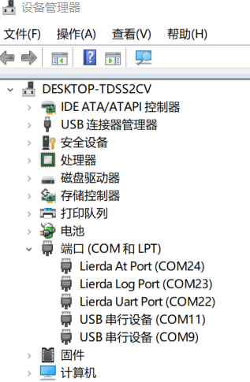
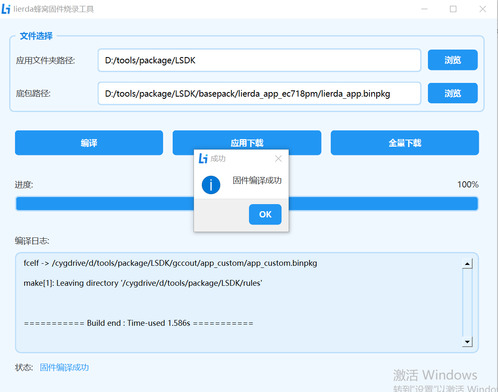
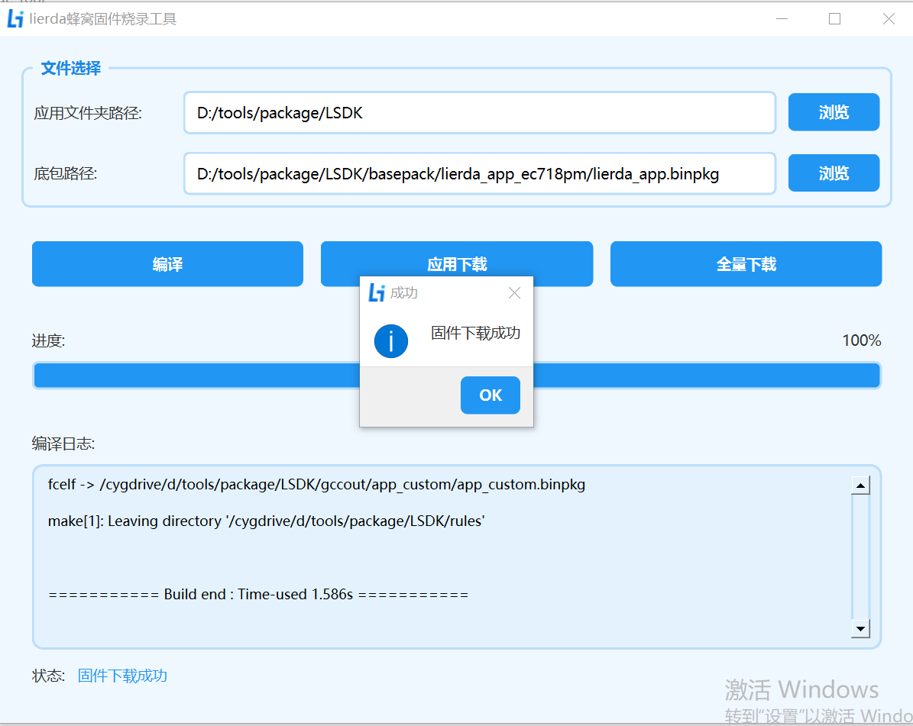
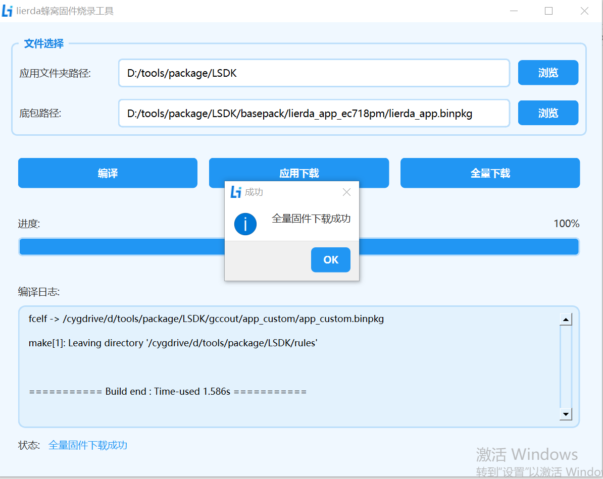

# Lierda 蜂窝固件烧录工具使用指导_Rev1.0

{link_to_translation}`en:[English]`

## 文件修订历史

| **文档版本** | **变更日期** | **修订人** | **审核人** | **变更内容** |
| ---- | ---- | ---- | ---- | ---- |
| V1.0 | 25-12-10 | CFT | YMX | 初始版本 |

## 1 工具简介

**Lierda 蜂窝固件烧录工具**是一款专为 Lierda 蜂窝通信模组设计的固件编译与烧录工具，支持固件编译、应用下载、全量烧录等功能。工具采用 **PySide6（Qt for Python）** 构建图形界面，结合 **C++ 核心模块** 提供高性能操作，适用于 Windows 系统下的固件编译与烧录场景。

**主要功能特性**

- **多模式烧录**：支持应用下载、全量下载。
- **自动化设备检测**：单设备场景下能够自动识别串口；多设备场景需断开其余设备进行烧录，无需手动选择烧录口。
- **实时进度监控**：显示操作进度与状态信息。
- **详细日志记录**：支持问题定位与调试分析。
- **绿色免安装**：无需依赖 Python 环境，开箱即用。

## 2 系统要求与安装

**系统要求**

- **操作系统**：Windows10、11操作系统
- **硬件需求**：USB 2.0 接口，支持串口通信的设备
- **其他依赖**：无需额外安装 Python 或运行库

**安装与部署**

1. **获取工具**：从 Lierda 官方渠道下载最新版本压缩包。
2. **解压文件**：将压缩包解压至任意目录（建议路径不含中文或空格）。
3. **启动工具**：双击解压后的可执行程序即可启动。

## 3 工具界面说明

工具界面分为四大功能区域：

### 3.1 文件选择区域

| **组件** | **功能说明** |
| ---- | ---- |
| **应用文件夹路径** | 选择SDK根目录文件夹（包含 `build.bat` 脚本）。 |
| **底包路径** | 选择SDK包basepack路径下的底包文件（通常为 `.binpkg` 格式）。 |

### 3.2 操作按钮区域

| **按钮** | **功能说明** | **操作原理** |
| ---- | ---- | ---- |
| **编译** | 将代码编译为可烧录的固件文件。 | 拷贝工具链到SDK包的tools路径下并解压；执行SDK根路径下的 `build.bat` 脚本完成编译动作 |
| **应用下载** | 仅烧录应用固件到设备，局部 Flash 擦写（不影响底包配置）。 | 通过内置 flasher\_tool 工具里的 `app_download.bat` 脚本配置参数并调用 `FlashToolCLI.exe` 命令进行下载 |
| **全量下载** | 烧录应用和底包固件到设备，全 Flash 格式化重写。 | 通过内置 flasher\_tool 工具里的 `full_download.bat` 脚本配置参数并调用 `FlashToolCLI.exe` 命令进行下载 |

### 3.3 进度显示区域

- **进度条**：显示当前操作进度百分比。
- **状态栏**：提示当前操作阶段（如"固件编译中..."）。

### 3.4 日志信息区域

- 实时输出操作日志，包含编译、烧录操作的日志输出。

## 4 操作步骤详解

**第一步：准备工作**

1. **设备连接**：
   - 使用 USB 线连接目标模组与电脑。
   - 确保模组对应的驱动已安装，设备管理器端口识别如下表示驱动安装成功。

2. **SDK包准备**：
   - 确认 SDK 包完整，包含应用代码文件夹、`build.bat` 编译脚本、底包文件（`.binpkg` 格式），且文件未被杀毒软件隔离或修改。

**第二步：编译文件选择**

1. **应用文件夹**：
   
   - 点击"浏览"按钮，选择SDK根目录（包含 `build.bat` 脚本）。
2. **底包文件**：
   
   - 点击"浏览"按钮，选择SDK包里对应的底包文件（如 `lierda_app.binpkg`）。

**第三步：执行操作**

### 4.1 固件编译

编译前，请确保已按照《新手开发指南》安装好Python环境。

1. **点击"编译"按钮，工具将执行以下操作：**
   
   - 调用 `build.bat` 编译固件。
   - 编译成功后 `SDK/gccout/app` 路径下生成 `.binpkg` 后缀的目标文件。
2. **结果提示**：
   
   - 编译成功：日志显示"固件编译成功"。
   - 编译失败：检查代码结构或依赖环境，参考日志及工具状态提示定位错误。

### 4.2 应用下载

1. 确保设备已进入下载模式或点击下载后立即切到下载模式。
   
   切下载模式：设备上电后拉高 BOOT 引脚并复位模组。Lierda QDLoader Port端口即为下载口。

2. 点击"应用下载"按钮，工具将：
   - 自动根据PID、VID检测串口设备。
   - 调用 `FlashToolCLI` 工具烧录应用固件。
   - 下载完成后自动重启设备。

### 4.3 全量下载

1. 确保设备已进入下载模式或点击下载后立即切到下载模式。
2. 点击"全量下载"按钮，工具将：
   
   - 自动根据PID、VID检测串口设备。
   - 调用 `FlashToolCLI` 工具烧录应用固件。
   - 下载完成后自动重启设备。

## 5 注意事项与常见问题

**注意事项**

1. **文件路径**：确保路径不含中文、空格或特殊字符。
2. **设备状态**：设备安装驱动后能正常识别，下载前或下载按钮点击之后将设备手动切到下载模式，否则可能导致烧录失败。
3. **烧录过程**：严禁在烧录过程中断电或拔出 USB 线，否则可能导致模组固件损坏无法启动。

