{link_to_translation}`en:[English]`

# Lierda 蜂窝固件烧录工具使用指导\_Rev1.1

# 文件修订历史

| **文档版本** | **变更日期** | **修订人** | **审核人** | **变更内容** |
| ---- | ---- | ---- | ---- | ---- |
| V1.0 | 25-12-10 | CFT | YMX | 初始版本 |
| V1.1 | 26-03-31 | CFT |  | 项目管理、日志、文件系统读写功能增加 |

# 1. 工具简介

**Lierda 蜂窝固件烧录工具**是一款功能强大、操作便捷的专业工具，专为 Lierda 蜂窝通信模组设计，支持固件编译、应用下载、全量烧录等核心功能，同时集成了项目管理、文件系统读写、模组信息展示、运行日志监控等特性。工具采用 **PySide6（Qt for Python）** 构建直观友好的图形界面，结合 **C++ 核心模块**提供高性能操作，适用于 Windows 系统下的固件开发、调试与烧录场景，为开发者提供一站式的固件管理解决方案。

**主要功能特性**

- **模组信息展示**：支持模组的基本信息、系统状态、网络和信号信息展示。
- **多模式烧录**：支持应用下载、全量下载。
- **项目管理**：支持多个应用APP包管理，支持直接在项目管理页面选中应用APP包进行编译烧录。
- **文件系统读写**：支持对设备文件系统的读写操作。
- **实时进度监控**：显示操作进度与状态信息。
- **日志记录**：支持编译、烧录日志与模组运行日志，便于问题定位与调试分析。
- **日志管理**：支持日志保存开关、保存路径、大小限制等配置。
- **自动化设备检测**：单设备场景下能够自动识别串口；多设备场景需断开其余设备进行烧录，无需手动选择烧录口。
- **绿色免安装**：无需依赖 Python 环境，开箱即用。

# 2. 系统要求与安装

**系统要求**

- **操作系统**： Windows10、11操作系统
- **硬件需求**：USB 2.0 接口，支持串口通信的设备
- **其他依赖**：无需额外安装 Python 或运行库

**安装与部署**

1. **获取工具**：从 Lierda 官方渠道下载最新版本压缩包。
2. **解压文件**：将压缩包解压至任意目录（建议路径不含中文或空格）。
3. **启动工具**：双击解压后的可执行程序即可启动。

# 3. 工具界面说明

本工具整体围绕模组调试、固件烧录、项目管理核心业务搭建，层级清晰、功能模块化；涵盖USB/串口连接配置、设备状态监控、日志实时查看、固件编译下载、多应用项目全生命周期管理等全套能力，操作流程连贯，可一站式完成模组日常调试、版本迭代与产品维护工作。

## 3.1 主界面

本工具主界面分为**4 大核心功能区域**，依次为：「串口 / USB配置 /日志操作区」、「模组状态信息区」、「功能操作区」、「日志展示区」。工具各功能区域既独立分工又联动协同，实现模组的USB/串口连接、状态信息监控运行、日志查看、固件烧录及项目管理全流程操作，满足了模组的调试与项目维护需求。

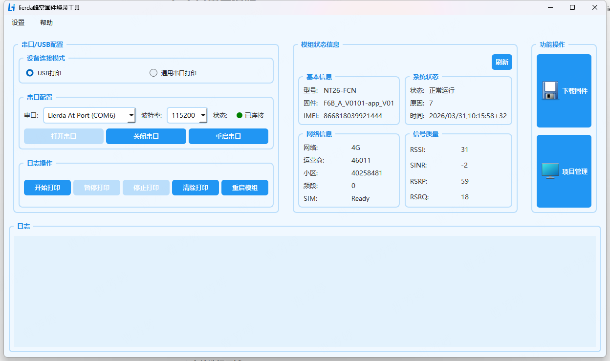

### 3.1.1 菜单栏

主要功能为日志及项目管理的配置。

- 日志配置：
  - 启用日志保存：是否保存日志到日志文件，默认启用
  - 日志保存路径：设置日志文件的保存位置，默认在logs路径下。
  - 日志文件大小限制：设置单个日志文件的最大大小，默认10MB。
  - 日志高级选项：当前只支持AP日志，默认满时自动删除旧文件，若去勾选则日志文件全部保存。
  - 点击"确定"保存配置。

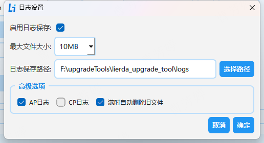

- 项目管理配置：

项目管理路径配置，默认为工具的project\_manage路径。

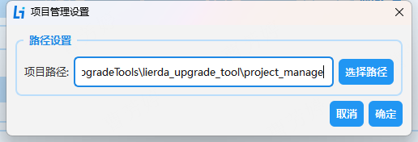

### 3.1.2 串口 / USB 配置区

本区域用于完成模组的通信连接配置，是日志展示、模组信息展示、重启操作的基础。

| **子模块** | **功能说明** |
| ---- | ---- |
| **设备连接模式** | 提供两种连接方式，**切换连接模式需先关闭串口再切换**： • **USB 打印**：SDK默认日志输出模式 • **通用串口打印**：需要修改串口配置（配置LSDK/config/default.ini中的appLogPort=1）并重新生成SDK，同时将模组的A\_RXD、A\_TXD分别与底版的CHA\_TX、CHA\_RX连接 |
| **串口配置** | 核心通信参数设置： • **串口**：下拉选择电脑识别到的模组端口（USB模式选择`Lierda At Port`、串口模式选择UART ch A） • **波特率**：下拉选择通信波特率（默认波特率为115200，**USB连接模式无需配置**） • **状态**：实时显示连接状态（绿色圆点 +「已连接」表示串口连接成功） • **操作按钮**： \- 打开串口：建立电脑与模组的通信连接 \- 关闭串口：断开当前通信连接 \- 重启串口：重置通信链路 |
| **日志操作** | 模组日志打印与模组控制功能： • **开始打印**：启动界面模组运行日志的实时输出 • **暂停打印**：界面停止日志输出，底层依然保存运行日志 • **停止打印**：界面停止日志输出，底层也停止保存运行日志 • **清除打印**：清空日志展示区的所有历史日志 • **重启模组**：远程控制模组硬件重启，无需手动断电（通过指令AT+ECRST实现） |

### 3.1.3 模组状态信息区

本区域实时展示模组的硬件、网络、运行状态，用于故障排查与状态监控，右上角「刷新」按钮可手动更新所有状态数据。

| **子模块** | **功能说明** |
| ---- | ---- |
| **基本信息** | 模组核心身份信息**（通过****AT+LGETSTATUS?****指令获取）**： • **型号**：模组硬件型号 • **固件**：当前运行的固件版本 • **IMEI**：模组唯一设备识别码 |
| **系统状态** | 模组运行状态**（通过AT+LGETSTATUS?指令获取）**： • **状态**：当前运行状态（当前统一显示「正常运行」） • **原因**：状态码 • **时间**：状态刷新时间 |
| **网络信息** | 4G 网络连接详情**（通过AT+LGETSTATUS?指令获取）**： • **网络**：当前网络类型 • **运营商**：运营商代码 • **小区**：当前接入的基站小区 ID • **频段**：当前使用的 4G 频段 • **SIM**：SIM 卡状态（`Ready`表示 SIM 卡识别正常、可正常注册网络） |
| **信号质量** | 4G 信号强度关键指标**（通过AT+LGETSTATUS?指令获取）**： • **RSSI**：接收信号强度指示 • **SINR**：信干噪比 • **RSRP**：参考信号接收功率 • **RSRQ**：参考信号接收质量 |

### 3.1.4 功能操作区

本区域为下载固件、项目管理功能入口，包含两个核心操作按钮：

| **按钮** | **功能说明** |
| ---- | ---- |
| **下载固件** | 固件烧录核心功能：点击后进入下载固件界面，完成固件的编译、下载工作，支持编译、下载的日志及进度展示。 |
| **项目管理** | 项目级配置管理功能：用于管理不同APP应用包，包含项目的创建、导入、导出等功能，同时支持多APP应用包之间切换的快速编译、烧录及文件系统烧录 |

### 3.1.5 日志展示区

本区域为日志实时输出窗口，展示模组运行日志，用于故障定位与操作追溯。

## 3.2 固件下载

固件下载界面包含以下区域：

- 文件选择区域：用于选择应用文件夹和底包路径。
- 操作按钮区域：包含编译、应用下载、全量下载等按钮。
- 进度显示区域：显示操作进度和状态信息。
- 日志信息区域：显示操作日志和模组运行日志。

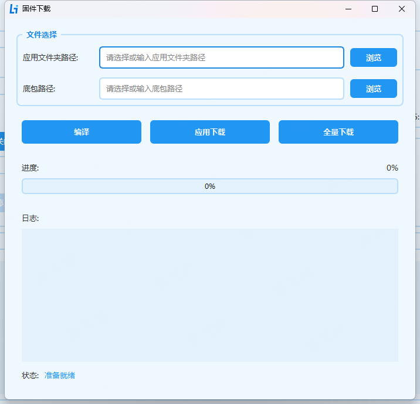

### 3.2.1 文件选择区域

| **组件** | **功能说明** |
| ---- | ---- |
| **应用文件夹路径** | 选择SDK应用包文件夹（例如：SDK/examples/app）。 |
| **底包路径** | 选择SDK包底包文件夹（例如：SDK/components/basePkg/F6B\_A）。 |

### 3.2.2 操作按钮区域

| **按钮** | **功能说明** | **操作原理** |
| ---- | ---- | ---- |
| **编译** | 将代码编译为可烧录的固件文件。 | 拷贝工具链到SDK包的tools路径下并解压；执行SDK根路径下的build.bat脚本完成编译动作 |
| **应用下载** | 仅烧录应用固件到设备，局部 Flash 擦写（不影响底包配置）。 | 通过内置flasher\_tool工具里的app\_down load.bat脚本配置参数并调用FlashToolCLI.exe命令进行下载 |
| **全量下载** | 烧录应用和底包固件到设备，全 Flash 格式化重写。 | 通过内置flasher\_tool工具里的full\_download.bat脚本配置参数并调用FlashToolCLI.exe命令进行下载 |

### 3.2.3 进度显示区域

- **进度条**：显示当前操作进度百分比。
- **状态栏**：提示当前操作阶段（如"固件编译中..."）。

### 3.2.4 日志信息区域

- 实时输出操作日志，包含编译、烧录操作的日志输出。

## 3.3 项目管理界面

本页面为**应用包管理与固件的编译、烧录、文件系统操作界面**，支持项目创建、资源管理、固件生成、烧录下载等全流程操作，可实现多应用包管理、编译及烧录，适配不同产品 / 场景的应用维护需求。

- 支持多应用包管理，可针对不同产品、不同场景创建独立应用包，避免配置混淆
- 实现项目的快速克隆、导入导出，大幅提升应用包管理效率
- 整合资源管理、固件生成、烧录执行全流程，无需切换界面即可完成项目维护

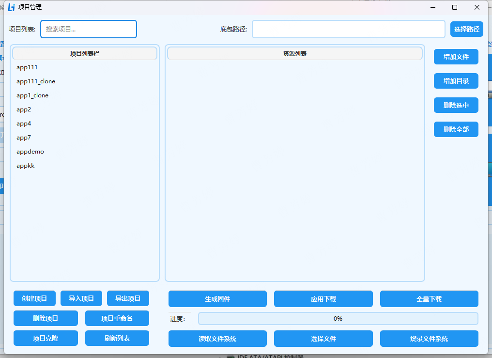

### 3.3.1 项目列表区

本区域用于应用包的检索、展示与基础管理，是项目操作的入口。

| **子项 / 按钮** | **功能说明** |
| ---- | ---- |
| **搜索项目输入框** | 支持按项目名称关键词快速检索目标项目，提升多应用包场景下的查找效率 |
| **项目列表栏** | 展示当前已创建的所有项目，选中项目后可在右侧资源列表查看其对应配置资源 |
| **创建项目** | 新建空白项目，用于新的项目 |
| **导入项目** | 导入外部已有的项目，快速复用历史项目代码 |
| **导出项目** | 将当前选中项目导出，用于项目备份 |
| **删除项目** | 删除选中的项目，释放项目列表空间 |
| **项目重命名** | 修改选中项目的名称，适配项目分类、版本迭代的命名需求 |
| **项目克隆** | 复制选中项目的完整代码，生成新的克隆项目，用于基于现有项目快速创建相似项目 |
| **刷新列表** | 刷新项目列表，同步最新的项目创建 / 修改状态 |

### 3.3.2 资源配置区

本区域用于项目的资源文件管理与烧录配置，是项目的核心配置载体。

| **子项 / 按钮** | **功能说明** |
| ---- | ---- |
| **底包路径输入框** | 配置项目对应的底包文件路径 |
| **选择路径按钮** | 点击后打开文件浏览器，快速选择底包所在路径 |
| **资源列表栏** | 展示当前选中项目的所有资源文件 / 目录，用于管理项目的文件、配置文件等 |
| **增加文件** | 向当前项目的资源列表中添加单个文件 |
| **增加目录** | 向当前项目的资源列表中添加整个目录，批量导入资源 |
| **删除选中** | 删除资源列表中选中的文件 / 目录 |
| **删除全部** | 清空当前项目的所有资源列表内容 |

### 3.3.3 固件生成与烧录操作区

本区域为项目的核心业务操作入口，用于固件生成与模组烧录执行。

| **按钮** | **功能说明** |
| ---- | ---- |
| **生成固件** | 基于当前项目的配置与资源，打包生成可烧录的完整固件包 |
| **应用下载** | 仅烧录应用固件到设备，局部 Flash 擦写（不影响底包配置）。 |
| **全量下载** | 烧录应用和底包固件到设备，全 Flash 格式化重写。 |
| **进度条** | 实时展示烧录 / 生成固件的操作进度，直观反馈操作状态。 |
| **读取文件系统** | 读取模组当前的文件系统内容。（通过内置flasher\_tool工具里的fs\_read.bat脚本配置参数并调用FlashToolCLI.exe命令进行读取） |
| **选择文件** | 选择待烧录的目标文件，用于针对性文件烧录 |
| **烧录文件系统** | 将选中的文件烧录到模组，完成模组文件系统更新。（通过内置flasher\_tool工具里的fs\_fileadd\_and\_fs\_flashqrite.bat脚本配置参数并调用FlashToolCLI.exe命令进行烧录） |

# 4. 操作步骤详解

**第一步：准备工作**

1. **设备连接**：
   - 使用 USB 线连接目标模组与电脑，模组开机。
   - 确保模组对应的驱动已安装，设备管理器端口识别如下表示驱动安装成功。

2. **SDK包准备：**

- 确认 SDK 包完整，包含应用代码文件夹、build.bat 编译脚本、底包文件（.binpkg 格式），且文件未被杀毒软件隔离或修改。

## 4.1 日志打印及模组信息展示

SDK默认通过USB口输出日志，选择Lierda At Port口并打开串口，待设备连接状态为已连接，工具自动通过AT+LGETSTATUS?指令获取模组信息并更新至界面；重启模组直接操作按钮即可；日志默认存工具的logs路径下，界面选择开始打印后，界面展示模组运行日志如下：

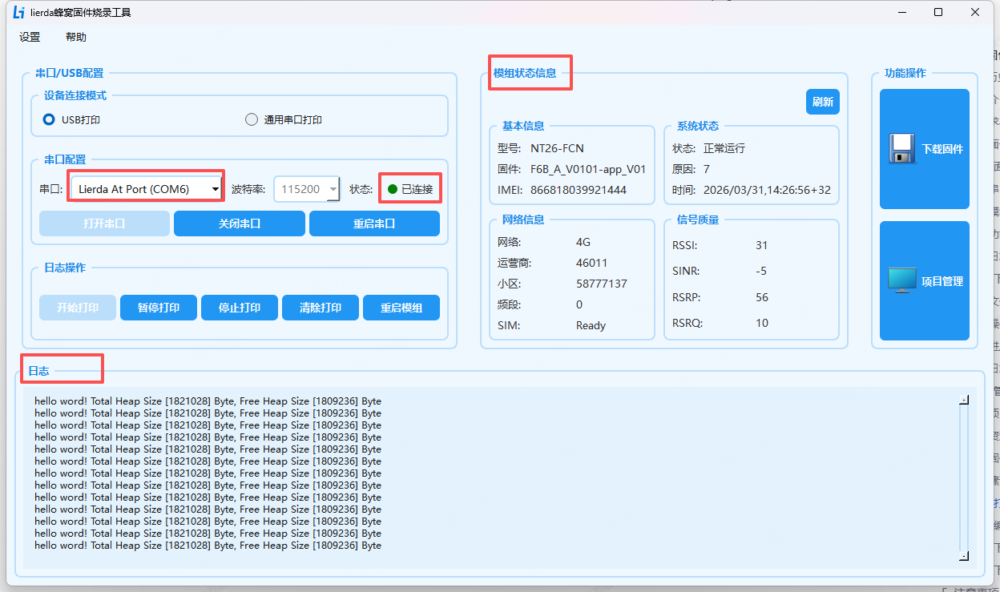

## 4.2 固件编译及烧录

**编译前，请确保已按照《新手开发指南》安装好Python环境**。

**第一步：编译文件选择**

1. **应用文件夹**：
   - 点击"浏览"按钮，选择/SDK/examples路径下目标应用包。

2. **底包文件**：
   - 点击"浏览"按钮，选择SDK/components/basePkg路径下目标底包）。

**第二步：执行操作**

1. **点击"编译"按钮，工具将执行以下操作：**
   - 调用 `build.bat all PROJECT=app MODEMPKG=F6B_A`命令编译固件,PROJECT为所选应用包名称，MODEMPKG为底包名称。
   - 编译成功后`SDK/gccout/{app应用包}`路径下生成的{app应用包}开头的.binpkg后缀的目标文件。

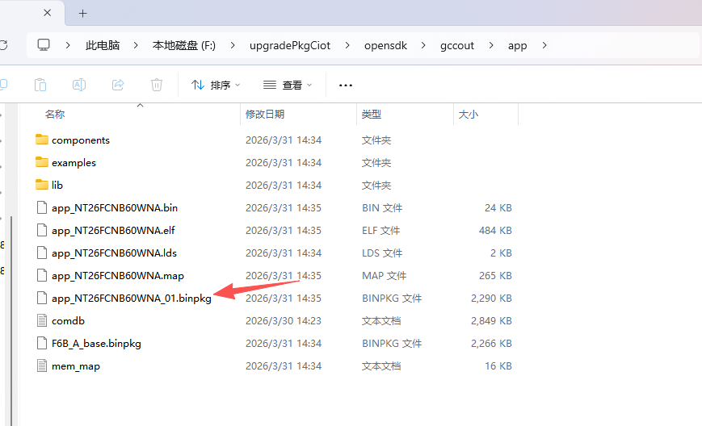

2. **结果提示**：
   - 编译成功：日志显示"固件编译成功"。
   - 编译失败：检查代码结构或依赖环境，参考日志及工具状态提示定位错误。

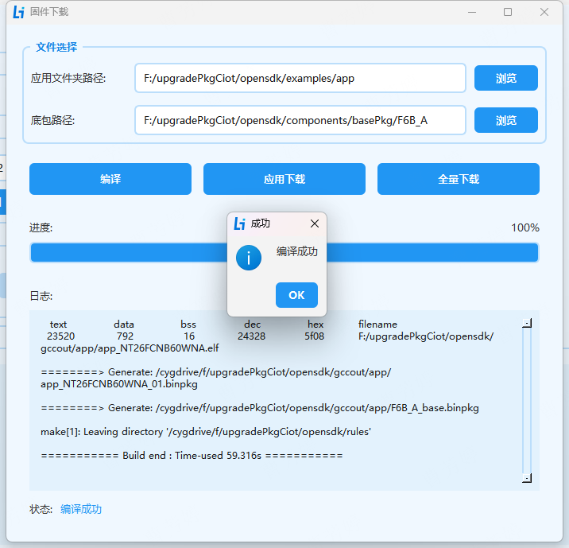

**第三步：执行应用下载**

1. 确保设备已进入下载模式或点击下载后立即切到下载模式。
   切下载模式：设备上电后拉高 BOOT 引脚并复位模组。Lierda QDLoader Port端口即为下载口。

2. 点击"应用下载"按钮，工具将：
   - 自动根据PID、VID检测下载口。
   - 调用 `FlashToolCLI` 工具烧录应用固件。
   - 下载完成后自动重启设备。

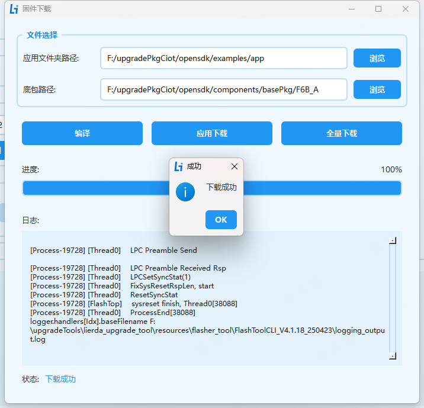

**第四步：执行全量下载**

1. 确保设备已进入下载模式或点击下载后立即切到下载模式。

2. 点击"全量下载"按钮，工具将：
   - 自动根据PID、VID检测下载口。
   - 调用 `FlashToolCLI` 工具烧录应用固件。
   - 下载完成后自动重启设备。

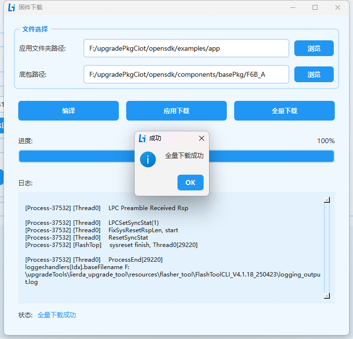

## 4.3 项目管理

项目管理默认路径为工具根路径下的project\_manage,可以在菜单栏项目管理配置页修改默认路径。

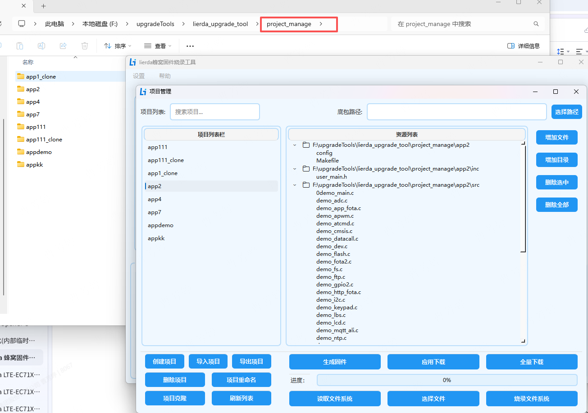

### 4.3.1 项目管理

创建项目：
- 点击"创建项目"按钮。
- 输入项目名称，通过右侧按钮为项目增加文件、目录。

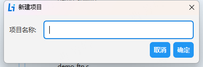

导入项目：
- 填写项目名称。
- 选择项目文件夹路径完成导入。

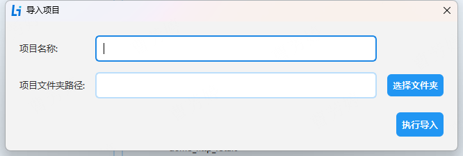

导出项目：
- 选择项目文件夹导出路径完成导出。

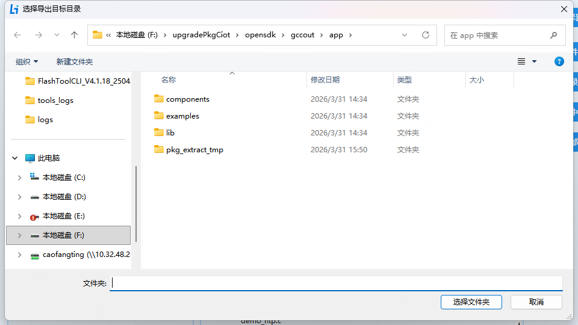

删除项目：
- 选中要删除的项目。
- 点击"删除项目"按钮完成删除操作。

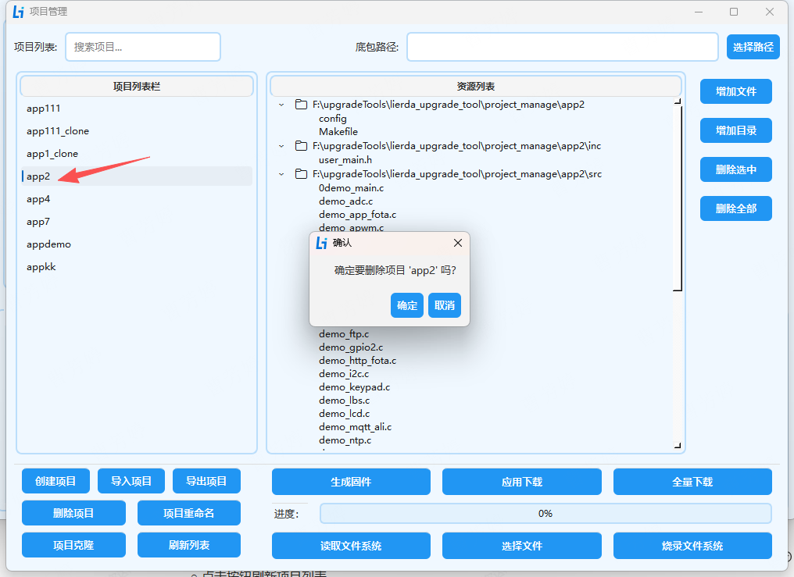

项目重命名：
- 选中要重命名的项目。
- 填写新的项目名称即可完成项目重命名。

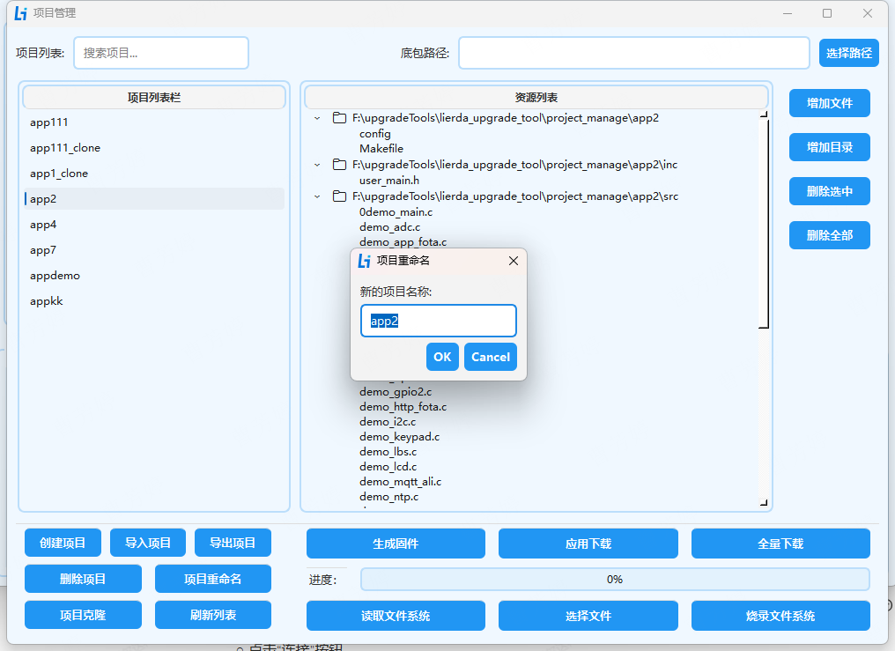

项目克隆：
- 选中要克隆的项目。
- 填写克隆的新项目名称完成项目克隆。

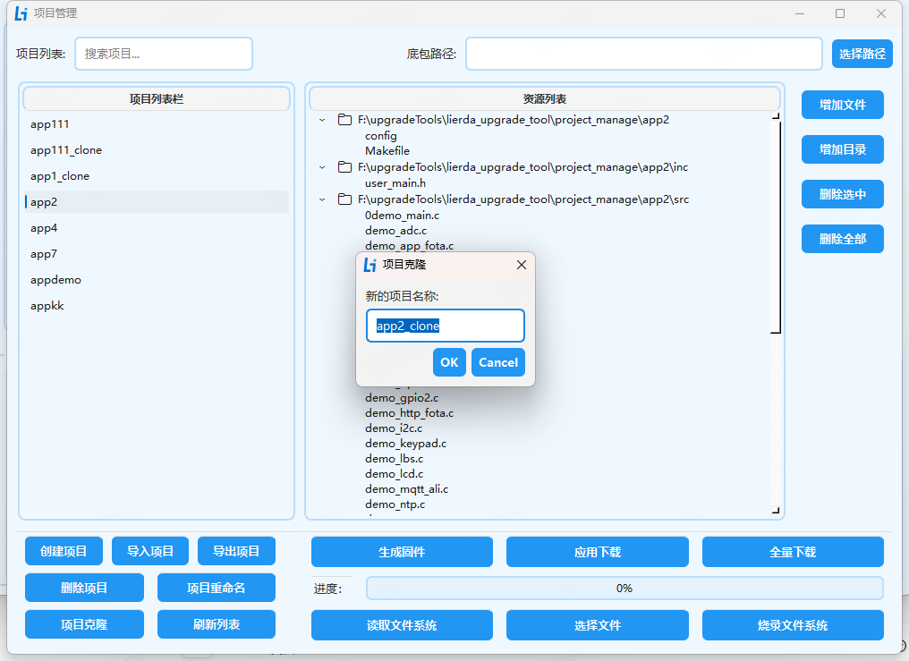

刷新列表：
- 点击按钮刷新项目列表。

### 4.3.2 项目管理界面固件编译烧录

此页面的编译、固件烧录，需从左侧选中应用包并在右上角选中底包，进行编译、烧录。**必须先编译才能执行应用下载、全量下载**，因为只有在编译阶段才会拷贝对应的应用包到SDK app包路径中。此页面中的编译烧录操作日志是不显示的，仅有进度及操作结果弹框提示。具体的操作与固件下载页面一致，在此不再重复说明。

### 4.3.3 文件系统读写

读写文件系统需要从左侧选中应用包并在右上角选中底包，工具通过应用包名称确认产物所在路径，通过底包路径找到partion\_info.txt文件以确认读文件系统的起始地址及长度值。

读写文件系统与烧录流程同样需要切到下载口。切下载口方式见上文，不再赘述。

- 读文件系统
  确保设备进入烧录模式

- 烧写文件系统
  选择需要烧录的文件后点击烧录文件系统按钮，同样确保设备进入烧录模式

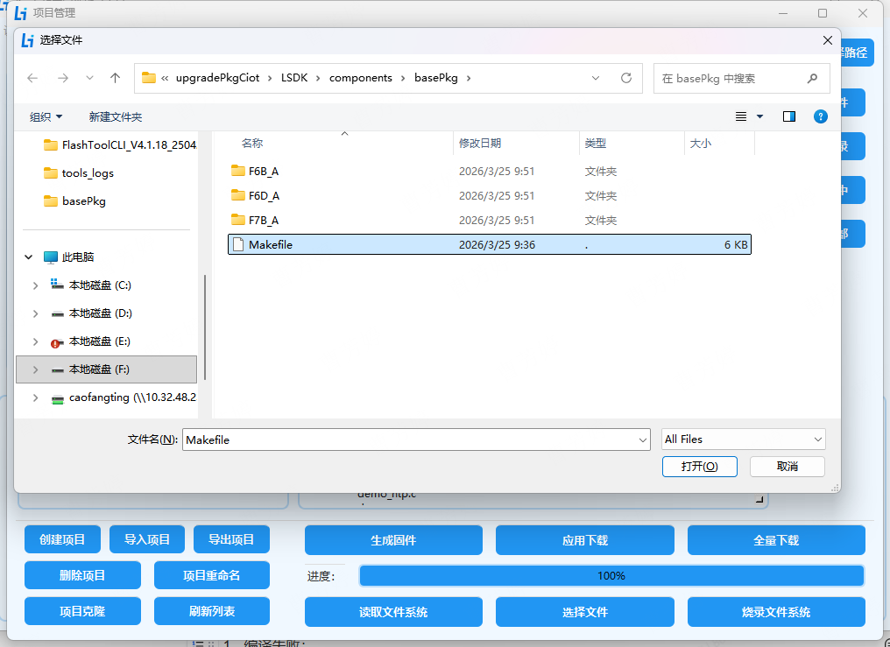

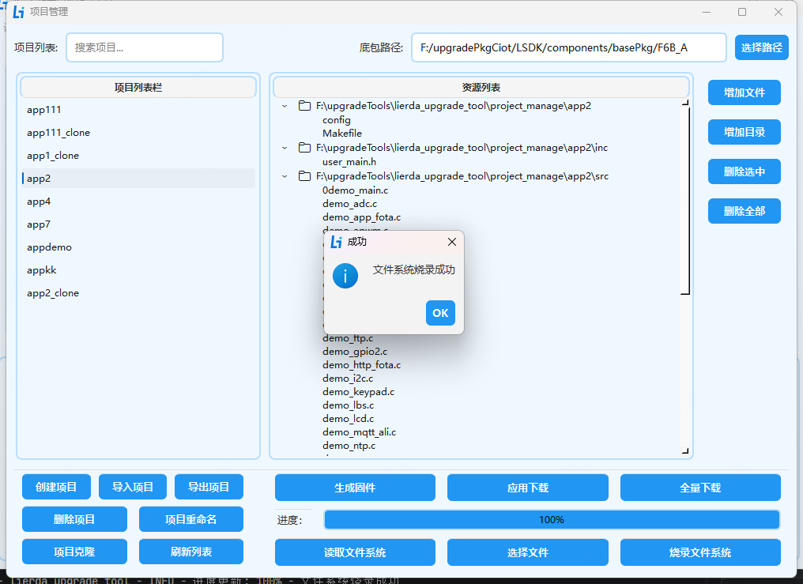

# 5. 注意事项与常见问题

**注意事项**

1. **文件路径**：确保路径不含中文、空格或特殊字符。
2. **设备状态**：设备安装驱动后能正常识别，下载前或下载按钮点击之后将设备手动切到下载模式，否则可能导致烧录失败。
3. **烧录过程**：严禁在烧录过程中断电或拔出 USB 线，否则可能导致模组固件损坏无法启动。
4. **文件系统操作**：文件系统读写操作时确保设备处于烧录模式。
5. **日志配置**：日志文件路径确保有写入权限，避免因权限问题导致日志无法保存。
